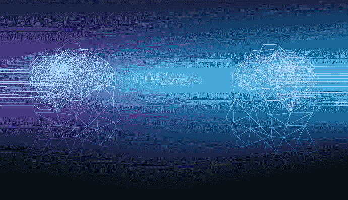
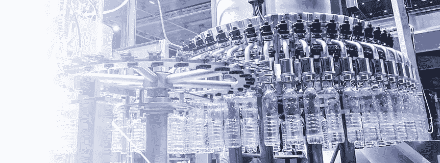

# 2019 年的人工智能

> 原文：<https://towardsdatascience.com/artificial-intelligence-in-2019-bb5cf3d39e4e?source=collection_archive---------11----------------------->

## *或者机器学习如何进化成人工智能*

这些是我对深度神经网络和机器学习在更大的人工智能领域的发展方向的看法，以及我们如何才能获得越来越多的复杂机器来帮助我们的日常生活。

请注意，这些不是预测的预测，而是对这些领域的轨迹、趋势和我们实现有用的人工智能的技术需求的详细分析。

我们还将研究唾手可得的成果，例如我们今天可以开发和推广的应用程序！

# 目标

该领域的目标是制造出具有超越人类能力的机器。自动驾驶汽车、智能家居、人工助手、安全摄像头是首要目标。家庭烹饪和清洁机器人是第二个目标，此外还有无人驾驶飞机和机器人。另一个是移动设备上的助手或永远在线的助手。另一个是全职伴侣助手，可以听到和看到我们在生活中经历的事情。一个最终目标是一个完全自主的合成实体，在日常任务中可以达到或超过人类水平的表现。

# 软件

软件在这里被定义为用优化算法训练来解决特定任务的神经网络架构。

今天，神经网络是事实上的学习工具，用于解决涉及[学习的任务，监督从大型数据集对](https://medium.com/@culurciello/analysis-of-deep-neural-networks-dcf398e71aae)进行分类。

但这不是人工智能，它需要在现实世界中行动，经常在没有监督的情况下学习，从以前从未见过的经验中学习，经常在完全不同的情况下结合以前的知识来解决当前的挑战。

> 我们如何从目前的神经网络转向人工智能？

**1-神经网络架构**-几年前，当该领域蓬勃发展时，我们经常说它具有从数据中自动学习算法参数的优势，因此优于手工制作的功能。但是我们很方便地忘记提到一个小细节…作为解决特定任务的训练基础的神经网络架构不是从数据中学习的！事实上，它仍然是手工设计的。根据经验手工制作，这是目前该领域的主要限制之一。[神经网络架构](https://medium.com/@culurciello/analysis-of-deep-neural-networks-dcf398e71aae)是学习算法的基础核心。即使我们的学习算法能够掌握一项新任务，如果神经网络不正确，它们也将无法掌握。但是在这个地区有很多活动，我们在这里回顾了一下[。从数据中学习神经网络架构的问题是，目前在大型数据集上试验多种架构需要太长时间。人们必须从头开始尝试训练多种架构，看看哪一种工作得最好。这正是我们今天使用的耗时的试错程序！我们应该克服这个局限，在这个非常重要的问题上多动脑筋。](/learning-neural-network-architectures-6109cb133caf)

**2-当前神经网络的局限性**-我们之前已经讨论过目前神经网络的局限性。不能预测，不能对内容进行推理，并且具有时间不稳定性——我们需要一种*新型的神经网络*，你可以在这里阅读[。](https://medium.com/@culurciello/at-the-limits-of-learning-46122b99dfc5)

Encoder-Decoder neural network

连接到上一节的主题，神经网络正在演变为编码器-解码器，其中编码器是一个将数据压缩为短代码(表示)的网络，解码器则扩展该表示以生成另一个更大的表示(将这些想象为生成的图像、心理模拟、图像上作为边界框和分段遮罩的高光)。我们已经广泛讨论了如何使用这样的网络来定位和检测图像和视频中的关键点[这里](/segmenting-localizing-and-counting-object-instances-in-an-image-878805fef7fc)；另请参见此[分析](https://medium.com/@culurciello/analysis-of-deep-neural-networks-for-pixel-processing-i-3a71324fdc43)。这也是预测神经网络的主要成分(更多内容见下文)。

无监督学习(Unsupervised learning)——我们不能总是在我们的神经网络旁边，在它们生命的每一站和每一次经历中指导它们。我们不能每次都纠正他们，并对他们的表现提供反馈。我们有自己的生活要过！但这正是我们今天对监督神经网络所做的:我们在每一个实例中提供帮助，使它们正确地执行。相反，人类只从少数几个例子中学习，并且可以不断地自我修正和学习更复杂的数据。我们已经广泛讨论了无监督学习[这里](https://medium.com/intuitionmachine/navigating-the-unsupervised-learning-landscape-951bd5842df9)。

**4-预测神经网络—** 当前神经网络的一个主要限制是它们不具备人脑最重要的特征之一:预测能力。关于人脑如何工作的一个主要理论是通过不断进行预测:[预测编码](https://en.wikipedia.org/wiki/Predictive_coding)。你想想，我们每天都在经历。当你举起一个你认为很轻但结果很重的物体时。它让你感到惊讶，因为当你走近去捡它的时候，你已经预测到它会如何影响你和你的身体，或者你的整体环境。

预测不仅能让我们了解这个世界，还能让我们知道什么时候不了解，什么时候应该了解。事实上，我们保存了我们不知道的事情的信息，并给我们带来惊喜，所以下次它们不会了！认知能力显然与我们大脑中的注意力机制有关:我们放弃 99.9%感官输入的先天能力，只专注于对我们生存非常重要的数据——哪里有威胁，我们跑到哪里去躲避它。或者，在现代社会，当我们匆忙出门时，我的手机在哪里？

建立预测神经网络是与现实世界互动的核心，也是在复杂环境中行动的核心。因此，这是任何强化学习工作的核心网络。见下文。

我们广泛讨论了预测神经网络的主题，并且是研究和创建预测神经网络的先驱团体之一。有关预测神经网络的更多详细信息，请参见此处的，此处的，此处的。

**5-持续学习**-这很重要，因为神经网络在其生命周期中需要不断学习新的数据点。当前的神经网络不能够学习新数据，除非在每个实例中从头开始重新训练。神经网络需要能够自我评估新训练的需求以及它们确实知道一些东西的事实。这在现实生活和强化学习任务中也是需要的，我们希望教会机器在不忘记旧任务的情况下完成新任务。持续学习也与*转移学习、*或者我们如何通过观看视频让这些算法自己学习，就像我们想学习如何烹饪新东西一样？这是一种需要我们上面列出的所有要素的能力，对于强化学习也很重要。

更多详情，请参见我们的[近期结果摘要](https://medium.com/@culurciello/continual-learning-da7995c24bca)。

**6-强化学习—** 这是深度神经网络研究的圣杯:教会机器如何在一个环境中学习行动，真实的世界！这需要自我学习、持续学习、预测能力，以及更多我们不知道的东西。在强化学习领域有很多工作，我们已经在这里和最近在这里讨论过这个[。](/learning-and-performing-in-the-real-world-7e53eb46d9c3)

强化学习通常被称为“蛋糕上的樱桃”，这意味着它只是在塑料合成大脑上的次要训练。但是我们怎样才能得到一个“通用的”大脑，从而轻松解决所有问题呢？这是个先有鸡还是先有蛋的问题！今天，为了一个接一个地解决强化学习问题，我们使用标准的神经网络:

*   一种深度神经网络，它接受大量数据输入，如视频或音频，并将其压缩成表示形式
*   学习任务的序列学习神经网络，如 RNN

这两个组件都是每个人都在使用的，因为它们是[可用构建模块](https://medium.com/@culurciello/neural-networks-building-blocks-a5c47bcd7c8d)的一部分。尽管如此，结果并不令人印象深刻:是的，我们可以从头开始学习玩视频游戏，并掌握完全可观察的游戏，如国际象棋和围棋——今年甚至通宵训练！—但我不需要告诉你，与解决复杂世界中的问题和像我们一样运作的机器相比，这根本不算什么。

我们认为预测神经网络对于强化学习是不可或缺的。好奇心，这是今天在这个领域的说法！敬请关注更多内容！

**8-不再有递归神经网络**——[递归神经网络(RNN)不再流行](/the-fall-of-rnn-lstm-2d1594c74ce0)。RNN 在训练并行化方面特别糟糕，即使在特殊的定制机器上也很慢，因为它们的内存带宽使用率非常高——因此它们是内存带宽受限的，而不是计算受限的，更多细节请参见这里的。[基于注意力的](/memory-attention-sequences-37456d271992)尤其是卷积神经网络在训练和部署时更高效、更快速，并且在训练和部署时更少受到可扩展性的影响。

[我们已经看到](/the-fall-of-rnn-lstm-2d1594c74ce0)卷积和基于注意力的神经网络将慢慢取代基于 RNN 的语音识别，并在强化学习架构和人工智能中找到它们的方式。

# 五金器具

深度学习的硬件是进步的核心。现在让我们忘记深度学习在 2008-2012 年以及最近几年的快速扩张主要是由于硬件:

*   每部手机中的廉价图像传感器都可以收集大量的数据集——是的，社交媒体对此有所帮助，但只是在一定程度上
*   允许 GPU 加速深度神经网络的训练

而[在](/hardware-for-deep-learning-8d9b03df41a)之前我们已经广泛的谈过硬件。但是我们需要给你一个最近的更新！在过去的两年里，机器学习硬件领域出现了蓬勃发展，特别是针对深度神经网络的领域。我们在这方面拥有丰富的经验，已经设计了 5 代深度神经网络加速器(参见最近的 [FWDNXT](http://fwdnxt.com/) )。

有几家公司在这个领域工作:英伟达(显然)、英特尔、Nervana、Movidius、比特大陆、Cambricon、Cerebras、DeePhi、谷歌、Graphcore、Groq、华为、ARM、Wave Computing 等。所有这些公司都在开发定制的高性能微芯片，这些芯片将能够训练和运行深度神经网络。

关键是在计算最近有用的神经网络运算时，提供最低的功耗和最高的测量性能，而不是像许多人声称的那样，每秒进行原始的理论运算。

但该领域很少有人了解硬件如何真正改变机器学习、神经网络和人工智能。很少有人了解微芯片的重要性以及如何开发它们。几个想法:

*   架构:许多人认为计算机架构只是一系列乘法器和加法器。但不是所有的架构都是一样的。有些比其他的更好，可以最小化内存带宽，并保持所有单元一直被占用。
*   编译器:许多人认为硬件不重要，神经网络编译器才是关键。但是，当你设计自己的硬件时，编译器只是在优化的机器代码中解释神经网络计算图。开源编译器(其中很多是去年才出来的！)只能帮到这么多，鉴于最困难的一步确实取决于秘密架构。虽然开源编译器可以作为前端，但在硬件架构和神经网络图的交叉点上仍然有很多秘密。
*   微芯片:一旦算法变得重要，优化性能功耗比的最佳方式就是定制微芯片或 ASIC 或 SoC。它们可以提供比 FPGAs 更快的时钟和更小的电路面积。FPGAs 现在包括深度神经网络加速器，预计将在 2019-2020 年推出，但微芯片将永远是更好的表现者。
*   进步:有几项进步将允许硅深度神经网络加速器轻松地获得 10-20 倍的性能，即使不使用微芯片缩放。在使用更少的比特数、系统级封装、高级存储器等方面寻找进步。

关于神经形态神经网络硬件，请看[这里](/neuromorphic-and-spiking-or-not-894a836dc3b3)。关于模仿真实神经网络的评论是[这里](https://medium.com/@culurciello/biological-and-artificial-intelligence-23a5c65160e6)。

# 应用程序

我们在上面的目标部分简单地讨论了应用程序，但是我们真的需要在这里深入细节。AI 和神经网络将如何进入我们的日常生活？

以下是我们的列表:

*   **对图像和视频进行分类**——已经在许多云服务中使用。接下来的步骤是在智能摄像机源中做同样的事情——今天也是由许多提供商提供。神经网络硬件将允许移除云，并在本地处理越来越多的数据:隐私和节省互联网带宽的赢家。
*   基于语音的助手正在成为我们生活的一部分，因为它们在我们的“智能”家庭中播放音乐和控制基本设备。但是对话是如此基本的人类活动，我们常常认为它是理所当然的。你可以与之交谈的小设备是一场正在发生的*革命*。基于语音的助手越来越好地为我们服务。但是它们仍然和电网相连。我们真正想要的助手会和我们一起走。我们的手机呢？硬件再次胜出，因为它将使这成为可能。Alexa 和 Cortana 和 Siri 将永远在线，永远与你同在。你的手机将很快成为你的智能家居。这是智能手机的又一次胜利。但是我们也希望它在我们的车里，当我们在镇上走动时。我们需要本地语音处理，越来越少的云。更多的隐私和更少的带宽成本。同样，硬件将在 1-2 年内为我们提供所有这些。
*   **真正的人工助手** —语音很棒，但我们真正想要的是也能看到我们所看到的东西的东西。当我们四处走动时，分析我们的环境。参见示例[此处](https://medium.com/@culurciello/shopper-artificial-intelligence-to-help-you-shop-d252bd995f78)和最终[此处](http://hyper-reality.co/)。这才是我们能爱上的真正的 AI 助手。神经网络硬件将再次满足你的愿望，因为分析视频馈送在计算上非常昂贵，并且目前处于当前硅硬件的理论极限。换句话说，这比语音助手要难做得多。但这并不是不可能的，许多像 AiPoly 这样的聪明的初创公司已经拥有了所有的软件，但缺乏在手机上运行它的强大硬件。还要注意的是，用一个类似眼镜的可佩戴设备**代替手机屏幕**将真正让我们的助手成为我们的一部分！
*   烹饪机器人——下一个最大的电器将是烹饪和清洁机器人。在这方面，我们可能很快就有了硬件，但我们显然缺乏软件。我们需要迁移学习、持续学习和强化学习。一切都运转良好。因为你看:每个食谱都不一样，每个烹饪原料看起来都不一样。我们不能硬编码所有这些选项。我们真的需要一个能够很好地学习和归纳的合成实体来做这件事。我们离它很远，但没有那么远。按照目前的发展速度，只需要几年的时间。我一定会像过去几年一样努力~

> 这篇博文将会发展，就像我们的算法和我们的机器一样。请尽快再次检查。

# 关于作者

我在硬件和软件方面都有将近 20 年的神经网络经验(一个罕见的组合)。在这里看关于我:[媒介](https://medium.com/@culurciello/)、[网页](https://e-lab.github.io/html/contact-eugenio-culurciello.html)、[学者](https://scholar.google.com/citations?user=SeGmqkIAAAAJ)、 [LinkedIn](https://www.linkedin.com/in/eugenioculurciello/) 等等…