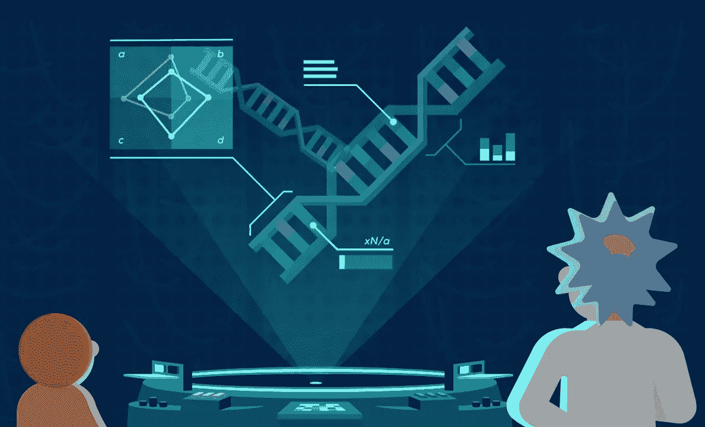
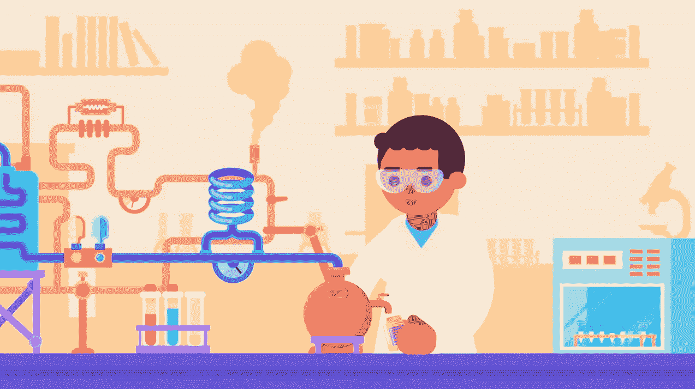
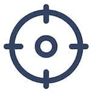
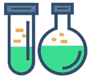
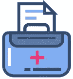

# 医学中的人工智能

> 原文：<https://towardsdatascience.com/artificial-intelligence-in-medicine-1fd2748a9f87?source=collection_archive---------9----------------------->

## 用于诊断、药物开发、个性化治疗和基因编辑的人工智能

机器学习在制药和生物技术效率方面取得了巨大进步。这篇文章总结了今天人工智能在医学中的**4 大应用:**

# 1.诊断疾病

正确诊断疾病需要多年的医学训练。即便如此，诊断通常也是一个费力费时的过程。在许多领域，**对专家的需求远远超过了现有的供给**。这给医生带来压力，并经常延误挽救生命的病人诊断。

机器学习——特别是深度学习算法——最近在自动诊断疾病方面取得了巨大进展，使得诊断**更便宜、更容易获得**。

## 机器如何学习诊断

机器学习算法可以学习以类似于医生看待模式的方式来看待模式。一个关键的区别是**算法需要大量的具体例子**——成千上万——以便学习。而且这些例子需要整齐地数字化——机器无法读懂教科书的字里行间。

因此，在医生检查的诊断信息已经数字化的领域，机器学习尤其有用。

比如:

*   基于 **CT 扫描检测肺癌或中风**
*   根据**心电图**和**心脏核磁共振图像**评估心脏猝死或其他心脏疾病的风险
*   对**皮肤图像中的皮肤病变进行分类**
*   在**眼睛图像中发现糖尿病视网膜病变的指标**

Examples of AI diagnosing diseases

由于在这些案例中有大量可用的好数据，算法变得和专家一样擅长诊断。不同的是:**算法可以在几分之一秒内得出结论**，而且可以在全世界廉价复制。很快，每个人、每个地方都可以以较低的价格获得与放射诊断学顶级专家 T21 同等质量的服务。

## 更先进的人工智能诊断即将推出

机器学习在诊断中的应用才刚刚开始——更雄心勃勃的系统涉及多种数据源 (CT、MRI、基因组学和蛋白质组学、患者数据，甚至手写文件)的**组合，以评估疾病或其进展。**

## 人工智能不会很快取代医生

人工智能不太可能完全取代医生。相反，人工智能系统将用于为专家突出显示潜在的恶性病变或危险的心脏模式**——允许医生专注于这些信号的**解释**。**

# 2.更快地开发药物

众所周知，开发药物是一个昂贵的过程。药物开发中的许多分析过程可以通过机器学习变得更加有效。这有可能削减**多年的工作和数亿美元的投资。**

人工智能已经成功应用于所有的 **4 药物开发的主要阶段**:

## 阶段 1:确定干预目标

药物开发的第一步是了解疾病的生物学起源(途径)及其耐药机制。然后你必须确定治疗疾病的好目标(通常是蛋白质)。高通量技术的广泛应用，如短发夹 RNA (shRNA)筛选和深度测序，大大增加了发现可行靶途径的可用数据量。然而，使用传统技术，集成大量不同的数据源，然后找到相关的模式，仍然是一个挑战。

机器学习算法可以更容易地分析所有可用的数据，甚至可以学习**自动识别良好的目标蛋白质**。

## 阶段 2:发现候选药物

接下来，你需要找到一种化合物，它可以以期望的方式与识别的目标分子相互作用。这包括筛选大量——通常是数千甚至数百万——潜在化合物对靶标的影响(亲和力)，更不用说它们的非靶标副作用(毒性)。这些化合物可以是天然的、合成的或生物工程的。

然而，目前的软件往往不准确，并产生许多错误的建议(假阳性)，因此需要很长时间才能将范围缩小到最佳候选药物(称为线索)。

机器学习算法在这里也可以有所帮助:它们可以学习根据结构指纹和分子描述符来预测分子的适用性。然后，他们从数百万个潜在分子中筛选出最佳方案——副作用最小的方案。这最终节省了药物设计的大量时间。

## 第三阶段:加速临床试验

临床试验很难找到合适的候选人。如果你选择了错误的候选人，将会延长审判时间——耗费大量的时间和资源。

机器学习可以通过**自动识别合适的候选人**以及确保试验参与者群体的正确分布来加快临床试验的设计。算法可以帮助识别区分好的候选人和坏的候选人的模式。它们还可以作为一个早期预警系统，用于没有产生结论性结果的临床试验——允许研究人员更早地干预，并有可能挽救药物的开发。

## 阶段 4:寻找用于诊断疾病的生物标志物

一旦你确定了你的诊断，你就可以对病人进行治疗。有些方法非常昂贵，需要复杂的实验室设备和专业知识，比如全基因组测序。

生物标记是在体液(通常是人的血液)中发现的分子，**提供了关于患者是否患有疾病的绝对确定性**。他们使 T2 的疾病诊断过程变得安全而廉价。

你还可以用它们来确定疾病的发展——使医生更容易选择正确的治疗方法，并监测药物是否有效。

但是为特定疾病发现合适的生物标志物是困难的。这是另一个昂贵、耗时的过程，包括筛选成千上万的潜在分子候选物。

人工智能可以自动化很大一部分人工工作，并加快这一进程。这些算法将分子分为好的和坏的候选分子——这有助于临床医生专注于分析最佳前景。

**可用于鉴定的生物标志物:**

*   尽早发现疾病— *诊断生物标志物*
*   患者患病的风险— *风险生物标志物*
*   疾病的可能进展— *预后生物标志物*
*   患者是否会对药物产生反应— *预测性生物标志物*

# 3.个性化处理

不同的患者对药物和治疗方案的反应不同。因此，个性化治疗在延长患者寿命方面有着巨大的潜力。但是很难确定哪些因素会影响治疗的选择。

机器学习可以自动化这一复杂的统计工作，并帮助**发现哪些特征表明患者将对特定治疗产生特定反应**。因此，该算法可以预测患者对特定治疗的可能反应。

该系统通过交叉引用相似的患者并比较他们的治疗和结果来学习这一点。由此产生的结果预测使医生更容易设计正确的治疗方案。

# 4.改进基因编辑

聚集的规则间隔短回文重复序列(CRISPR)，特别是用于基因编辑的 CRISPR-Cas9 系统，是我们经济高效地编辑 DNA 的能力的一大飞跃——准确地说，就像外科医生一样。

这种技术依赖于短指导 RNA(sgRNA)来靶向和编辑 DNA 上的特定位置。但是指导 RNA 可以适合多个 DNA 位置——这可能导致**意想不到的副作用**(脱靶效应)。仔细选择具有最小危险副作用的指导 RNA 是 CRISPR 系统应用中的一个主要瓶颈。

机器学习模型已被证明在预测给定 sgRNA 的导向-目标相互作用和脱靶效应的程度时产生最佳结果。这可以显著加快人类 DNA 每个区域的指导 RNA 的发展。

# 摘要

人工智能已经在帮助我们更有效地诊断疾病，开发药物，个性化治疗，甚至编辑基因。

但这只是**的开始**。我们越是数字化和统一我们的医疗数据，我们就越能使用人工智能来帮助我们找到有价值的模式——我们可以使用这些模式在复杂的分析过程中做出准确、经济高效的决策。

**作者** 我是柏林机器学习咨询公司 Data Revenue 的首席执行官。[联系](https://www.datarevenue.com/en/contact-us)如果你想了解更多人工智能在医学或我们工作中的应用。

*最初发表于*[*www.datarevenue.com*](https://www.datarevenue.com/en/usecases/artificial-intelligence-in-medicine)*。*