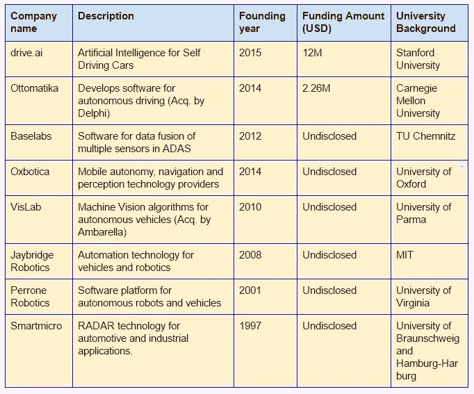

# 自动驾驶汽车中的人工智能—第 1 部分

> 原文：<https://towardsdatascience.com/artificial-intelligence-in-self-driving-cars-part-1-90dd2ea55751?source=collection_archive---------3----------------------->

不久前看似虚构的自动驾驶汽车已经成为汽车和科技行业的热门话题。像谷歌、百度、特斯拉这样的新玩家正在跳入这个领域，竞争加剧了，截至目前，几乎所有的汽车制造商都宣布了他们对自动驾驶的开发努力。

现在已经很清楚，视觉传感元件，如相机、激光雷达(就像谷歌自动驾驶汽车上的威力登激光雷达)、雷达、声纳、夜视系统、近程传感器等。是自动驾驶技术最重要的使能元素。这些传感器安装在车身上，形成周围环境的实时三维图像。然后将这些图像与现有的 3D 地图进行比较，智能算法能够采取适当的行动来驾驶汽车，而无需任何人工干预。汽车的精确定位，传感器融合以评估来自不同传感器的数据是自动驾驶技术的其他重要组成部分。

正确分析这些不同的输入，并在很短的时间内采取“正确”的行动是关键。但是,“正确”的行动很难确定，因为现实世界的驾驶场景很复杂，有许多可能性。将所有不同的可能性编码到软件中是一项不可能的任务。这就是像深度学习和神经网络这样的人工智能分支变得如此重要的原因。它包括软件，自我从不同的情境中学习，并不断改进其性能。将这种软件暴露在真实生活驾驶条件的大量数据中，可能是提高自动驾驶汽车采取“正确”行动的准确性的关键。这就是人工智能最近成为自动驾驶技术焦点领域的原因。

许多汽车公司和自动驾驶公司已经宣布了不同的举措来增强他们的人工智能能力，以便他们不会落后于谷歌这样的新时代公司，谷歌已经在该领域处于领先地位。下面的新闻故事将证实这一点。

1.  福特、丰田和大众与英伟达、三星、高通和松下一起成立了 DeepDrive 联盟，专注于人工智能研究。他们每人给加州大学伯克利分校 30 万美元，资助人工智能研究。([链接](http://www.bloomberg.com/news/articles/2016-03-16/automakers-go-back-to-school-to-learn-to-build-self-driving-cars)
2.  丰田在硅谷成立了一个新的组织——丰田研究所，专注于人工智能和自动驾驶技术。它宣布了与麻省理工学院和斯坦福大学在人工智能研究方面的实验室合作伙伴关系，以及 1B·R&D 在该领域为期五年的努力。它还计划聘请 200 名研究科学家来推进人工智能的研究。([链接](http://www.nytimes.com/2015/11/06/technology/toyota-silicon-valley-artificial-intelligence-research-center.html?_r=0)
3.  丰田雇佣了 Jaybridge Robotics 的所有员工，Jay bridge Robotics 是一家麻省理工学院的初创公司，专注于丰田研究所的自动驾驶汽车技术。([链接](http://www.wsj.com/articles/toyota-grabs-tech-talent-by-hiring-entire-jaybridge-staff-1457553870)
4.  丰田还收购了总部位于东京的广受好评的机器学习初创公司 Preferred Networks 的股份，以加速其在人工智能领域的努力。([链接](http://www.wsj.com/articles/toyota-to-buy-1-billion-stake-in-artificial-intelligence-firm-1450338231))

丰田虽然加入自动驾驶的行列较晚，但自 2015 年底以来已经做出了重大宣布，明确了其自动驾驶的雄心。它还专注于人工智能，而不是与其他公司合作开发此类技术。尽管许多其他汽车公司正在研究自动驾驶汽车，但它们已经考虑与宝马和百度等新时代科技公司合作，或者福特和谷歌之间的谈判。汽车公司似乎也与 Mobileye 和 Nvidia 等合作伙伴合作，或与学术界进行各种合作，以发展人工智能能力。然而，丰田似乎专注于拥有这样的技术，并在人工智能研究上投入了大量资源，而不是与其他公司合作。

也有一些初创公司试图解决自动驾驶技术的各种障碍。大多数这样的创业公司都是从主要大学的研究中分离出来的。这里有几个这样的例子

( Data from [Tracxn](http://tracxn.com/) )

([第二部分](https://medium.com/@amolarunkhedkar/artificial-intelligence-in-self-driving-cars-part-2-c1db7cc87381#.kmzkodhp9)重点关注实现无人驾驶汽车的不同方法以及人工智能在每种方法中的使用。)