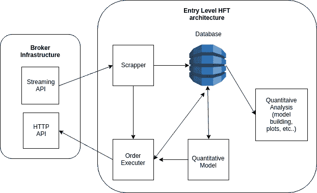
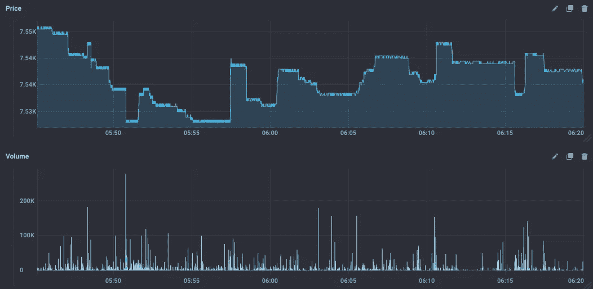
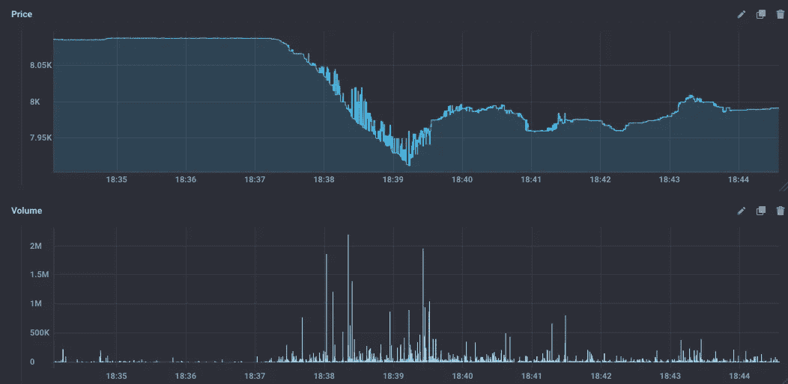
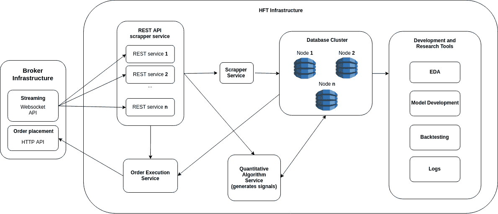

# 组装入门级高频交易(HFT)系统

> 原文：<https://towardsdatascience.com/assembling-an-entry-level-high-frequency-trading-hft-system-e7538545b2a9?source=collection_archive---------4----------------------->

在过去的几个月里，我花了很多时间来构建和组装自己的加密货币入门级 HFT 系统。由于我已经研究机器学习应用于金融很长一段时间了，并试图找出在现实世界中如何工作，我决定真正进入兔子洞。我这样做是为了提供信息，因为互联网上没有太多的资源。我希望告诉你一些你在尝试类似的事情时可能会遇到的陷阱。我将努力使它变得有趣(和富有哲理)，同时深入研究。希望你喜欢。

# 介绍

让我们从这个问题开始:

> 高频交易系统的基本原理是什么？

要建立一个 HFT 系统，你必须假设“市场无效率”是正确的。因为每个人都在同时关注市场，所以会有一群人发现这些低效之处(例如使用统计数据)并试图弥补它们。这意味着你等待的时间越长，你在效率低下被纠正之前发现的可能性就越低。不同的时间窗口有不同类型的低效率，也就是说，你看到的时间范围越小，低效率就越容易预测，你将面临更多的竞争(假设你无法发现没有人看到的低效率，因为我从未实现过这一点，所以我不能谈论它)。

> 为什么要为加密货币建立一个 HFT 系统？

在我看来，标准资产市场相当糟糕。为什么？如果你试图作为一个单独的个体获得市场数据的原始实时访问，你会发现这很难(没有人会免费给你，如果他们这样做，我可以向你保证，你将与比你有更好访问权限的人竞争)。大多数加密货币货币交易所“借用”了标准资产市场已经建立的基础设施，其 FIX API 的结构与标准资产市场上的完全相同。此外，由于加密货币交易所竞争激烈，你会发现你为交易这些工具支付的佣金比普通市场更具竞争力。例如，你可以找到为市场带来流动性的经纪人(这对于常规资产行业的个人来说是不可想象的)。

为什么你需要直接进入市场？这个问题用一个机器学习*座右铭来回答:*

> 垃圾进，垃圾出

此外，如果您想要执行任何类型的定量分析，您必须控制系统上的一切，也就是说，您希望您所做的分析在您将要使用的同一数据聚合平台上完成。当你建立一个机器学习模型时，你假设他们的预测在一组边界条件内是有效的，你违反这些条件越多，你的预测就越无效。因此，你最好的选择是让经纪人尽可能快地将每笔交易(或订单簿变更)传输给你。

# 系统的简化概述

出于我稍后将解释的原因，HFT 系统必须对错误有巨大的容忍度。当我发现这一点时，我采用了微服务架构，因为对我来说，这是确保多组件系统容错和可伸缩的最佳方式。我可以向你保证，当你进行实时交易时，你的系统会出现不可预见的故障(其中一些会与第三方有关，例如对经纪人的[分布式拒绝服务](https://en.wikipedia.org/wiki/Denial-of-service_attack) (DDOS)攻击。是的，会出现这种情况)。当你使用微服务架构时，当一个服务失败时，你有调度程序试图立即重启服务，这是一个非常优雅的解决方案，当试图单独构建这样的系统时。

Simplified diagram of an entry level HFT architecture

组件的简要说明:

*   **数据库:**高密度时间序列数据库，需要能够在一天内处理成千上万的数据插入。(提示:选择一个 IOT 数据库奇迹)。还需要可扩展，以便它能够以不可变和分布式的方式执行非常高速的重新采样。
*   **Scrapper:** 将新传输的数据插入到数据库中
*   **定量模型:**当α存在时发出信号的定量模型
*   **订单执行器:**拾取量化模型的信号，与市场进行交互。有时候市场是不流动的，或者你的策略必须满足某种类型的滑点要求。因此，为了使您的系统不变，最好有一个微系统，它试图以最好的方式执行您的头寸，这允许您节省佣金，例如，您现在可以执行限价单，而不是使用市价单，这将需要一些时间来消耗，并可能需要根据市场流动性进行调整。
*   **定量分析:**你必须开发的制作模型的一套工具。由于这些数据来自基础设施，因此您有更好的方法来确保系统的边界条件。例如，你不能保证在高度波动的市场条件下拥有完全的市场准入，因此，通过建设你的基础设施，你有办法准确地衡量发生了什么，什么时候发生，并记录下来。

为什么要采用这样的微服务架构？嗯，有时你的废品回收器会由于经纪人中断而失败(在高度不稳定的情况下，有恶意代理开始 DDOS，使其他人更难进入市场)。我推断这是一个 DDOS 攻击，但为了更正确，让我们称之为代理不可用。这是市场有效时的样子(注意，这些图不是重新采样的，实际上，这个时间窗口内的每笔交易都被绘制出来):

Efficient Market with nice spreads

经纪人不在时，市场效率非常低(请注意，在下一张图中，y 轴的刻度要大一个数量级):

Inefficient Market

你可以在最后一张图中看到，在一个小的时间窗口中，价差出现了巨大的缺口。这是由于代理不可用而导致的。由于算法无法发出常规的限价订单，为市场带来稳定性和流动性，因此出现了一些高市价订单(不管市场状况如何，这些订单都被接受，但不保证你会得到什么价格)，通过消耗现有的限价订单来扩大价差。

# 更详细的架构概述

我将尝试对这个系统做一个更详细的概述，并解释一些设计选择。我建议使用 Docker 来开发服务。Docker 提供了非常好的管理工具，如果您想使用像 Kubernetes 这样的集群，它可以让您更容易地进行部署。

Detailed architectural design of an entry level HFT system

*   **REST API scraper 服务:**这个服务有一个缓冲区，缓冲经纪人的 Websocket API 通过流提供的最近的市场交易、报价和订单。它拥有多个工作器的原因是为了减轻代理基础设施的中断(如果代理服务器开始堵塞，这种情况经常发生，拥有多个冗余工作器会增加所有消息通过的机会)。例如，代理服务器可能会开始丢弃一些连接，以保持其工作负载运行，如果您有更多的工作线程，则在已经丢弃的工作线程重新启动时，您有更高的可能性保持至少一个连接。您还有机会让多个服务在多个 IP 上运行，这将为您带来更多冗余。
*   **scraper 服务:**scraper 服务收集发布在 REST API 上的信息，并将其插入数据库。它能够在多个 REST 服务之间跳转，如果检测到错误的行为，就触发重启。
*   **订单执行服务:**从数据库的表格中获取信号以执行动作，并通过执行市价订单或限价订单(取决于模型的规格)来启动其执行。它还能够在多个 REST 服务中跳转。
*   **量化算法服务:**有模型实现，使用数据库上收集的数据生成交易信号。
*   **数据库集群:**从市场接收原始数据需要高带宽的数据传输。对这些数据进行重新采样可能是相当密集的，因为您希望将相同的数据库用于开发和生产，所以您需要有高吞吐量。
*   **开发和研究工具:**通过在相同的系统上开发您的模型，您可以确保在满足必要的边界条件时有更好的质量。毕竟，现在它是你的数据，你确切地知道你花了多长时间来接收和处理它。

> 为什么 REST API 和 scrapper 服务是分开的？

这一决定是为了提高系统的速度并确保 24/7 系统的可靠性，例如，当您决定要开仓或平仓时，您不希望不断地查询数据库，通过查询将信息直接存储在 RAM 上的 REST API(降低硬盘开销)，您能够实现更高的池化频率(这也在很大程度上取决于您离交易所和所选编程语言的距离)。如果 REST 服务由于某种未知原因失败，您可以重启，不会丢失任何正在进行的数据流，同时有足够的时间安全地重启它。触发交易信号和试图执行交易是有区别的。你确实想尽快完成交易。

# 结论

我可以持续几个小时(特别是谈论我在试图对时间序列实现 ML 时的糟糕经历，让我们把它留给另一篇博文)，但今天就足够了。我在实现这样一个架构的时候遇到了很多瓶颈，同时试图为我的模型所做的预测获得最佳的边界条件。这是一次在实现 24/7 可靠性的同时尽可能获得最佳数据的旅程。如果你想给我建议，讨论想法，给我上关于非平稳过程的课(这是我绝对需要的)，或者只是聊天，你可以联系我

> abriosipublic@gmail.com