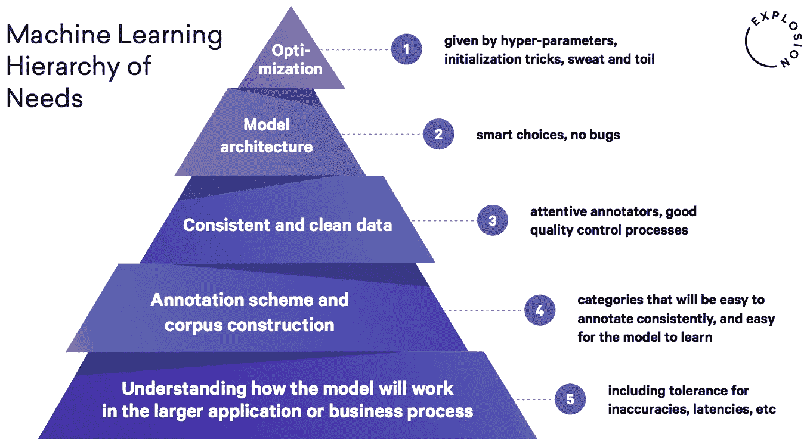
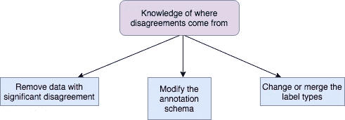

# 评估 Python 中注释者的分歧以构建用于机器学习的健壮数据集

> 原文：<https://towardsdatascience.com/assessing-annotator-disagreements-in-python-to-build-a-robust-dataset-for-machine-learning-16c74b49f043?source=collection_archive---------14----------------------->


Tea vs. Coffee: the perfect example of decisions and disagreements!

正如 Matthew Honnibal 在他的 2018 PyData Berlin talk [1]中指出的那样，开发一个可靠的注释模式并拥有专注的注释者是成功的机器学习模型的基石之一，也是工作流不可或缺的一部分。下面的金字塔——摘自他的幻灯片——显示这些是模型开发之前的基本阶段。



我最近完成了数据分析硕士学位，然后与一家机器学习慈善机构密切合作，直到现在，我才意识到正规教育的状况令人担忧的是，对底部三个组成部分的关注明显不足，而对顶部两个组成部分的关注过度。尽管这很麻烦，但原因很明显:学生们对粗糙的机器学习前阶段不感兴趣。但事实仍然是，如果不了解如何处理可能不太令人兴奋的东西，就根本不可能构建一个健壮、强大和可靠的机器学习产品。

我注意到注释不一致评估方法的解释并不局限于网上的一篇文章，用 Python 来做这件事的方法也不局限于单个库。因此，在本文中，我们将讨论注释者协议领域的一些重要主题:

1.  **用于评估协议质量的著名统计分数的定义。(数学也可以在维基百科的相关页面上找到。)**
2.  **这些统计分数的 Python 实现使用了我写的新库，名为 disagree。**
3.  **如何使用同一个库评估哪些标签值得进一步关注，引入双向同意的概念。**

什么是注释模式？

在我们开始任何形式的计算学习之前，我们需要一个数据集。在监督学习中，为了让计算机学习，我们数据的每个实例都必须有一些标签。为了获得标签，我们可能需要一组人坐下来手工标记每个数据实例——这些人就是**注释者**。为了允许人们这样做，我们必须开发并编写一个**注释模式**，建议他们如何正确标记数据实例。

当多个注释者标记同一个数据实例时(情况总是如此)，可能会对标记应该是什么产生分歧。注释者之间的分歧是不好的，因为这意味着我们不能有效地分配带有标签的实例。如果我们开始用存在重大分歧的标签分配数据实例，那么我们的机器学习模型就处于严重危险之中。这是因为数据无法依赖，我们开发的任何模型也无法依赖。

因此，一旦所有数据都被标记，就必须调查这些不一致的情况，这样我们就可以了解和理解不一致的来源。



1.  *删除有重大分歧的数据*:这给我们留下的只有那些有把握标记的可靠数据。
2.  *修改注释模式以备将来使用*:可能是写得不清楚，我们可以改进未来的协议。
3.  *改变或合并标签类型*:也许我们在有用的标签类型上根本就错了。有时我们需要修改标签来适应注释器的功能。

为了介绍一些定量评估注释者间分歧的最有用(和不太有用)的方法，我将首先向您展示如何设置 Python‘disagree’库。然后，我将研究各种统计数据，结合数学理论和 Python 实现。

**“不同意”库**

它旨在做几件事:

1.  **为定量评估注释者的分歧提供统计能力。**

**2。提供不同注释者之间的可视化。**

**3。提供可视化效果，以查看哪些标签的分歧最大。**

在分别观察了这三点之后，如果有必要，可以考虑上面提到的三种解决方案。首先，您需要导入库。以下是所有可用的模块，我将在此进行演示:

```
from disagree.agreements import BiDisagreements
from disagree import Metrics, Krippendorff
```

不同意有两个基本的细微差别。首先，您需要以特定的方式将注释存储在 pandas 数据帧中。行由数据实例进行索引，列是该数据实例的每个注释者的标签。列标题是注释者的字符串名称。标签的类型可以是字符串、整数、浮点或缺失值(即 nan 或 None)。以下是一个数据集示例:

```
example_annotations = {"a": [None, None, None, None, None, "dog", "ant", "cat", "dog", "cat", "cat", "cow", "cow", None, "cow"],
                       "b": ["cat", None, "dog", "cat", "cow", "cow", "ant", "cow", None, None, None, None, None, None, None],
                       "c": [None, None, "dog", "cat", "cow", "ant", "ant", None, "dog", "cat", "cat", "cow", "cow", None, "ant"]}df = pd.DataFrame(example_annotations)
```

因此，在我们的例子中，我们有 3 个标注者，名为“a”、“b”和“c”，他们共同标记了 15 个数据实例。(数据的第一个实例没有被“a”和“c”标注，被“b”标注为 0。)

现在，我们准备探索用于评估注释者协议的可能的度量标准。从从**指标**模块设置**指标**实例开始:

```
mets = metrics.Metrics(df)
```

**联合概率**

联合概率是评估注释者协议的最简单、最天真的方法。它可以用来查看一个注释者与另一个注释者的一致程度。

本质上，它将注释者 1 和 2 同意的次数相加，然后除以他们都标记的数据点的总数。

对于我们的示例数据集，我们可以在我们选择的两个注释器之间进行计算:

```
joint_prob = mets.joint_probability("a", "b")print("Joint probability between annotator a and b: {:.3f}".format(joint_prob))**Out:** Joint probability between annotator a and b: 0.333
```

**科恩的卡帕**

这是一种比联合概率更先进的统计方法，因为它考虑了偶然同意**的概率**。它还比较了两个注释器。

使用 Python 库:

```
cohens = mets.cohens_kappa("a", "b")print("Cohens kappa between annotator a and b: {:.3f}".format(cohens))**Out:** Cohens kappa between annotator a and b: 0.330
```

**关联**

关联也是显而易见的选择！如果注释者 1 和注释者 2 有很高的相关性，那么他们很可能在标签上达成一致。相反，低相关性意味着他们不太可能同意。

```
spearman = mets.correlation("a", "b", measure="spearman")
pearson = mets.correlation("a", "b", measure="pearson")
kendall = mets.correlation("a", "b", measure="kendall")print("Spearman's correlation between a and b: {:.3f}".format(spearman[0]))
print("Pearson's correlation between a and b: {:.3f}".format(pearson[0]))
print("Kendall's correlation between a and b: {:.3f}".format(kendall[0]))**Out:** Spearman's correlation between a and b: 0.866
**Out:** Pearson's correlation between a and b: 0.945
**Out:** Kendall's correlation between a and b: 0.816
```

请注意，对于相关性测量，会返回一个相关性和 p 值的元组，因此在打印结果时会进行零索引。(这使用了 scipy 库。)

此时，您可能会这样想:“但是如果我们有两个以上的注释者呢？这些方法不是挺没用的吗？”答案既可以是“是”，也可以是“不是”。是的，它们对于评估全局注释者在使数据集更加健壮方面的分歧是没有用的。但是，在许多情况下，您可能希望这样做:

*   假设您有 10 个注释者，其中 2 个一起坐在一个房间里，而另外 8 个分开坐。(可能是办公场地的原因。)根据注释，您可能想看看坐在一起的两个人之间是否有更大的一致性，因为他们可能一直在讨论标签。
*   也许您希望看到具有相同教育背景的注释者之间的一致，相对于来自另一种教育背景的群体。

现在，我将介绍一些更高级的——也可以说是最流行的——方法，用于评估任意数量的注释者之间的注释者协议统计数据。这些在现代机器学习文献中更常见。

**弗莱斯卡帕**

弗莱斯的卡帕是科恩的卡帕的延伸。它通过考虑注释者协议的**一致性**来扩展它，与 Cohen 的 kappa 所关注的绝对协议相反。这是一种统计上可靠的方法，通常在文献中用于证明数据质量。

在 Python 中:

```
fleiss = mets.fleiss_kappa()
```

**克里彭多夫的阿尔法值**

最后，也是计算量最大的，是 Krippendorff 的 alpha。这和 Fleiss 的 kappa 一起，被认为是最有用的统计数据之一(如果不是最有用的话)。这里有一个 Krippendorff 自己的出版物的链接，概述了数学并给出了一些手工计算的例子:

[https://repository.upenn.edu/cgi/viewcontent.cgi?article = 1043&context = ASC _ papers #:~:text = Krippendorff 的%20alpha%20(%CE%B1)%20is%20a，将% 20computable % 20values % 20to 赋值给%20them。](https://repository.upenn.edu/cgi/viewcontent.cgi?article=1043&context=asc_papers#:~:text=Krippendorff's%20alpha%20(%CE%B1)%20is%20a,assign%20computable%20values%20to%20them.)

在 disagree 库中，这与任何其他统计一样简单:

```
kripp = Krippendorff(df)
alpha = kripp.alpha(data_type="nominal")print("Krippendorff's alpha: {:.3f}".format(alpha))**Out:** Krippendorff's alpha: 0.647
```

我将 Krippendorff 的 alpha 保留在单独的类中的原因是因为在初始化中有一些计算量非常大的过程。如果有大量的注释(比如说 50，000 到 100，000 个),当人们对使用 Krippendorff alpha 数据结构不感兴趣时，必须对其进行初始化是令人沮丧的。

这就是——在一个易于使用的紧凑 Python 库中计算一组有用的注释不一致统计数据。

**双方同意**

另一个值得考虑的有用的东西是我喜欢称之为**的双向协议。**这是两个不同的标注器对一个数据实例进行不同标注的次数。之所以有用，是因为它们允许您检查所使用的标签系统或者提供给注释者的注释模式中可能存在的缺陷。

例如，在数据集的给定实例中，标签[0，0，1]或[1，1，1，2]或[1，3，1，3]将被视为单个 bidisagreement。(第 8 行和第 15 行是上述数据帧中的双向协议示例。)这可以扩展到三不同意、四不同意、五不同意等等。

使用**不同意**库，我们可以用上面导入的**双向同意**模块来检查这些情况。

首先，设置实例:

```
bidis = BiDisagreements(df)
```

下面是一个有用的属性:

```
bidis.agreements_summary()Number of instances with:
=========================
No disagreement: 9
Bidisagreement: 2
Tridisagreement: 1
More disagreements: 0
Out[14]: (9, 2, 1, 0)
```

输出显示，从我们的示例注释来看，有 9 个数据实例没有不一致之处；存在 bidisagreement 的 2 个数据实例；和 1 个数据实例，其中有一个 tridisagreement。(注意，这将元组作为输出返回。)这些加起来是 12 而不是 15 的原因是因为在我们的示例数据集中，有 3 个实例，其中最多有 1 个标注器标记了实例。这些不包括在计算中，因为由 1 个注释器标记的任何数据实例都应该被认为是无效的。

我们还可以看到哪些标签导致了双向重复:

```
mat = bidis.agreements_matrix(normalise=False)
print(mat)[[0\. 0\. 1\. 0.]
 [0\. 0\. 0\. 0.]
 [1\. 0\. 0\. 1.] 
 [0\. 0\. 1\. 0.]]
```

当然，对于没有从 0 到某个数字进行索引的标签，我们需要能够看到矩阵中的哪个索引对应于哪个标签，这可以通过 bidis.labels_to_index()在字典形式中看到。

从这个矩阵中，我们可以看到一个 bidisagreement 源于标签 0 vs 标签 2，另一个源于标签 2 vs 标签 3。使用这个矩阵，你可以创建一个你选择的可视化——比如使用 matplotlib 的混乱矩阵形式的东西:[https://www.kaggle.com/grfiv4/plot-a-confusion-matrix.](https://www.kaggle.com/grfiv4/plot-a-confusion-matrix.)

当您有非常大的数据集时，这最后一个功能特别有用。最近，我对 6，000 个数据实例中的 25，000 个注释使用了这种方法，能够非常快速地识别出几乎 650 个 bidisagreements 来自两个标签。这使我能够处理这两个标签，以及如何在机器学习模型中使用它们，以及何时修改注释模式以供注释者将来使用。

**未来考虑**

使用 bidisagreements，您会注意到库只能显示频率。这有一个相当重要的底线。想象以下两组标签用于两个数据实例:

1.  [0, 0, 0, 0, 1]
2.  [2, 1, 1, 2, 2]

显然，第一个比第二个有更好的一致性，然而不一致认为他们是平等的。致力于一种 bidisagreement 方法将是有趣的，该方法在统计上将第二个加权为比第一个更重要的 bidisagreement，然后相应地归一化 bidisagreement 矩阵。

**关于“不同意”的最终注释**

这个库是最近的，也是我第一次实现它。(出于这个原因，我请你原谅混乱的版本和提交历史。)完整的 GitHub 回购可以在这里找到:【https://github.com/o-P-o/disagree[。](https://github.com/o-P-o/disagree)

回购包括所有的代码，以及 Jupyter 笔记本与上述例子类似。自述文件中也有完整的文档。

请随时提出问题，并对其他功能提出建议。我将立即处理这些问题。

[1][https://www.youtube.com/watch?v=jpWqz85F_4Y&t = 442s](https://www.youtube.com/watch?v=jpWqz85F_4Y&t=442s)