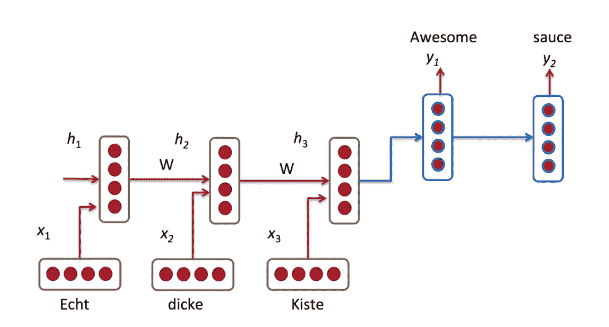
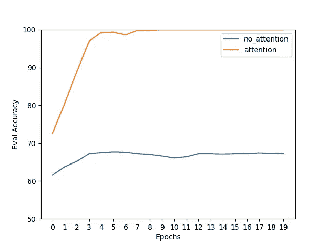

# 注意 Seq2Seq 与 PyTorch:学习反转序列

> 原文：<https://towardsdatascience.com/attention-seq2seq-with-pytorch-learning-to-invert-a-sequence-34faf4133e53?source=collection_archive---------1----------------------->

*TL；DR:在这篇文章中，你将学习如何实现序列到序列的模型，注意和不注意一个简单的例子:反转一个随机生成的序列。*

你可能已经看到了数千篇解释序列间模型和注意力机制的文章，但是很少有用代码片段来说明的。
下面是一个非详尽的文章列表，讨论序列对序列算法和注意力机制:

*   [Tensorflow 官方回购](https://github.com/tensorflow/tensorflow/blob/r1.11/tensorflow/contrib/eager/python/examples/nmt_with_attention/nmt_with_attention.ipynb)
*   [py torch seq 2 seq 教程](https://pytorch.org/tutorials/intermediate/seq2seq_translation_tutorial.html)
*   [Guillaume Genthial 的博客文章](https://guillaumegenthial.github.io/sequence-to-sequence.html)
*   [Chris Olah 对增强 RNNs 的解释](https://distill.pub/2016/augmented-rnns/)
*   [Dimitri bahda nau 的参考文件](https://arxiv.org/abs/1409.0473)
*   [一个关于关注的好帖子](https://medium.com/syncedreview/a-brief-overview-of-attention-mechanism-13c578ba9129)
*   [一篇显示 Luong vs Bahdanau 的论文引起关注](https://arxiv.org/abs/1508.04025)

## 注意力和序列对序列模型

这些模型用于将输入序列映射到输出序列。序列是一种数据结构，其中有一个时间维度，或者至少有一种“顺序”感。想想把法语句子(=序列)翻译成英语句子，或者做语音到文本(音频->文本)，或者文本到语音，等等。
“注意力”是序列对序列模型的变体，允许在上述领域进行重大改进。

*Source:* [*http://cs224d.stanford.edu/lectures/CS224d-Lecture8.pdf*](http://cs224d.stanford.edu/lectures/CS224d-Lecture8.pdf)

这是一个非常简单的序列对序列模型的例子。目标是通过将红色单词输入编码器(红色箭头)，并依次输出英语单词(蓝色箭头)，将德语翻译成英语。请注意 h3 的重要性，因为所有未来(蓝色)预测都依赖于它…

作为一名机器学习工程师，几年前我开始与 Tensorflow 合作。在 PyTorch 与 Tensorflow 的争论中，我不支持任何一方，但我认为 Tensorflow 有很多优势，其中包括丰富的 API 和贡献者的素质。我发现的主要缺点是很难调试，随着时间的推移，我对定制我的网络的困难感到有点沮丧(例如定义定制损耗..).我认为深度学习不仅仅是从网络上复制和粘贴代码，而是能够实现自己的网络并理解每个陷阱。

因此，我决定向 PyTorch 迈出一步。

PyTorch 并不完美，但它的优势在于更具 pythonic 性，并且与 Tensorflow 相反，它的动态计算图使调试和运行单元测试更容易(您确实在代码中使用测试，对吗？).最重要的是，PyTorch 提供了一个很好的 API(虽然不如 Tensorflow 提供的那么好),并允许您定义自定义模块。强迫你重写模块可以让你明白你在做什么。例如，我过去在设计 seq2seq 模型时一直使用 Tensorflow AttentionWrapper，但是在 PyTorch 中实现一个定制的注意力模块使我能够完全理解它的微妙之处。
说够了，让我们深入代码。

**如果你想不看就开始玩，代码在这里:**[**https://github.com/b-etienne/Seq2seq-PyTorch**](https://github.com/b-etienne/Seq2seq-PyTorch)

# 我们想要解决的问题

我们的目标是在一个简单的任务上比较两个模型的效率，这个任务包括学习如何颠倒一个给定的序列。这两个模型是具有编码器和解码器的序列到序列模型，一个具有注意机制，一个没有。

## 为什么？

这个问题是你能想到的最简单的序列间任务之一。然而，如果你决定开发你自己的架构，而它在这个简单的任务上失败了，它可能不会在任何地方导致更复杂的任务…所以让我们的模型在这个任务上工作是确保我们的代码工作的好方法。

# 生成数据

我们从四个字母“a”、“b”、“c”、“d”的集合或“词汇”中挑选出可变长度的随机序列。目标是还原的输入，比如:“ABCD”->“dcba”。

# 编码器

编码器是 seq2seq 模型的“监听”部分。它由递归层组成(RNN、GRU、LSTM，选择您最喜欢的)，在此之前您可以添加卷积层或密集层。这里最重要的部分是在编码器中输入数据之前使用*pack _ padd _ sequence*和*pad _ pack _ sequence*助手。
由于我们使用的是批次数据，因此批次中的每个项目(序列)都有不同的长度。我们用 0 填充批次中的所有序列，直到最长序列的长度(这是可变长度批次中的经典过程，您可以在网上找到关于这个主题的大量帖子)。*pack _ padd _ sequence*和*pad _ pack _ sequence*帮助我们在向编码器提供数据时处理这些无信息的填充。

# 解码器

解码器是负责输出预测的模块，这些预测将用于计算损失。简而言之，注意力解码器将解码器的输出作为输入，并决定关注哪个部分来输出预测。不加注意，只使用编码器的最后一个隐藏状态。
在我们的例子中，解码器对目标序列进行顺序操作，并且在每个时间步都将:
-一个输入(目标序列中的下一个字符或者之前发出的字符)
-一个隐藏状态
-取决于你是否在使用注意力的其他参数作为输入。

由于我们将使用不同的编码器，让我们定义一个基本的解码器模块:

## RNN 解码器

序列到序列模型的最简单形式由 RNN 编码器和 RNN 解码器组成。以下是我们的 RNN 解码器的外观:

## 注意力解码器

现在是我们使用注意力的部分。同样，如果您想了解背后的理论，请参考本文开头的链接。我仍然不清楚在计算注意力权重之前或之后是否应该调用递归单元。我尝试了两种方法，它们都导致了收敛。如果您知道答案，我将非常感谢您在下面的评论中对这一点的任何帮助。
以下是我们的参与者代码(我参考代码中的“倾听、参与和拼写”部分):

## 注意力评分功能

注意力解码器的核心是注意力模块。这个模块允许我们计算不同的注意力得分。两种主要的变体是龙和巴达瑙。据说 Luong 是“乘法”的，而 Bahdanau 是“加法”的。详情见上述文件。

因此，我们定义了一个定制的注意力模块，其中包含计算张量之间相似性的选项(有时称为*键*和*查询*)。使用相似性得分的 softmax 函数将得分归一化以定义概率。该模块使用自定义的 *mask_3d* 函数，用于在权重计算中屏蔽填充。我就交给你去实现了:)

## 将其全部放入 Seq2Seq 模块中

一旦定义了编码器和解码器，我们就可以创建一个 Seq2Seq 模型，用 PyTorch 模块封装它们。我不会详述解码过程，但只是为了你的知识，我们可以在解码过程中选择教师强制和预定采样策略。如果你以前从未听说过，一定要上网查一下。我会把这个模块作为家庭作业留给你，但如果你需要任何帮助，可以联系我。

# 结果

我们在训练时使用交叉熵损失。在评估过程中，我们以预测序列和目标序列之间的 Levenshtein 距离来计算准确度。没有注意力的 seq2seq 模型达到平台期，而有注意力的 seq2seq 更容易学习任务:

让我们在注意力模型的推断过程中可视化注意力权重，以查看该模型是否确实学习了。正如我们所见，对角线从左上角到右下角。这表明网络学会首先关注最后一个字符，最后关注第一个字符:

***哦，对了，如果你对序列到序列模型感兴趣，我写了一篇关于神经图灵机的文章*** [***这里***](https://medium.com/@benjamin_47408/neural-turing-machines-an-artificial-working-memory-cd913420508b)***:)***