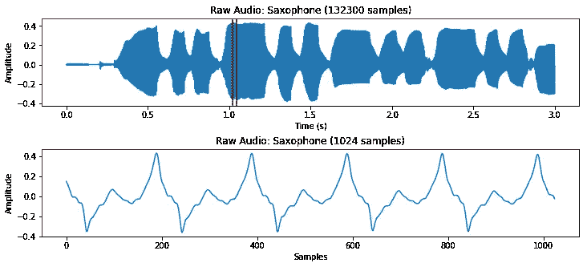
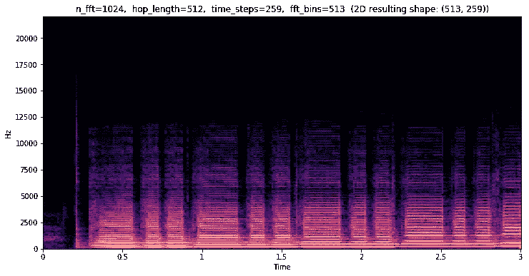
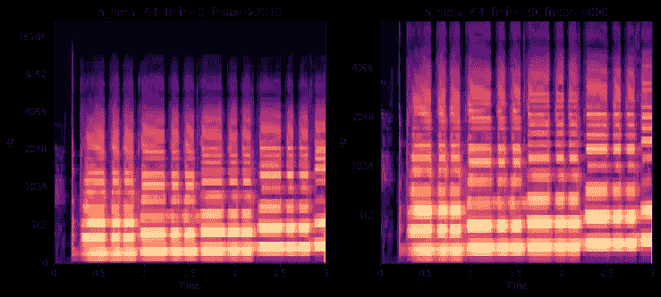

# 使用 FastAI 和即时频率变换的音频分类

> 原文：<https://towardsdatascience.com/audio-classification-using-fastai-and-on-the-fly-frequency-transforms-4dbe1b540f89?source=collection_archive---------1----------------------->

## 使用 PyTorch 和 fastai v1 在训练时间从原始音频生成频谱图的实验。

## 介绍

虽然深度学习模型能够帮助解决许多不同类型的问题，但图像分类是课程和框架最普遍的例子，通常充当“你好，世界”的介绍。FastAI 是一个建立在 T2 py torch T3 基础上的高级库，它使得开始分类图像变得非常容易，并通过一个例子展示了如何在 T4 只用四行代码 T5 训练一个精确的模型。随着库的新 v1 发布，一个名为 [data_block](https://docs.fast.ai/data_block.html) 的 API 允许用户以灵活的方式简化数据加载过程。在夏天参加了 [Freesound 通用音频标记 Kaggle 竞赛](https://www.kaggle.com/c/freesound-audio-tagging)之后，我决定重新调整我的一些代码，以便利用 fastai 在音频分类方面的优势。本文将简要介绍如何在 Python 中处理音频文件，给出一些关于创建声谱图图像的背景知识，然后展示如何利用预先训练的图像模型 ***，而不需要*** 事先生成图像。

用于生成这篇文章内容的所有代码将在[这个资源库](https://github.com/sevenfx/fastai_audio)中提供，包括示例笔记本。

## 音频文件到图像

起初，将音频文件归类为图像似乎有点奇怪。图像毕竟是二维的(RGBA 声道可能有第三维)，而音频文件只有一个时间维(声道可能有第二维，例如立体声对单声道)。在这篇文章中，我们将只看单声道的音频文件。每个音频文件还有一个相关的*采样率*，即每秒钟音频的样本数。如果一个 3 秒钟的音频片段的采样率为 44，100 Hz，这意味着它由 3*44，100 = 132，300 个连续数字组成，代表气压的变化。在 Python 中操作音频的最好的库之一叫做 [librosa](https://librosa.github.io/) 。

```
clip, sample_rate = librosa.load(filename, sr=None)
clip = clip[:132300] # first three seconds of file
```



虽然这种表示方式确实能让我们了解某个片段在任一时间点有多响亮或安静，但它提供的关于存在哪些频率的信息非常少。这个问题的一个非常常见的解决方案是，取信号的小重叠块，并让它们通过[快速傅立叶变换](https://en.wikipedia.org/wiki/Fast_Fourier_transform) (FFT)，将它们从时域转换到频域。对每个部分进行 FFT 运算后，我们可以将结果转换为极坐标，从而得到不同频率的幅度和相位。虽然相位信息在某些情况下可能有用，但我们主要使用幅度，并将其转换为分贝单位，因为我们的耳朵在对数尺度上感受声音。

```
n_fft = 1024  # frame length 
start = 45000 # start at a part of the sound thats not silence
x = clip[start:start+n_fft]
X = fft(x, n_fft)
X_magnitude, X_phase = librosa.magphase(X)
X_magnitude_db = librosa.amplitude_to_db(X_magnitude)
```


取大小为 1024 的 FFT 将产生具有 1024 个频率仓的频谱。然而，频谱的后一半是多余的，所以实际上我们只使用前(N/2)+1 个频段，在这种情况下是 513。

为了生成关于整个文件的信息，我们可以对 1024 个样本窗口进行 FFT，并将其滑动 512 个样本(跳跃长度),使得窗口彼此重叠。对于这个三秒钟的文件，我们将得到 259 个频谱，然后我们可以看到一个二维图像。这被称为短时傅立叶变换(STFT)，它让我们看到不同的频率如何随时间变化。

```
stft = librosa.stft(clip, n_fft=n_fft, hop_length=hop_length)
stft_magnitude, stft_phase = librosa.magphase(stft)
stft_magnitude_db = librosa.amplitude_to_db(stft_magnitude)
```



在本例中，我们可以看到，几乎所有有趣的频率数据都低于 12，500 Hz。除了有许多被浪费的箱子之外，这不能准确地显示人类如何感知频率。除了响度，我们还能听到对数标度的频率。我们听到的频率“距离”从 50 赫兹到 100 赫兹，就像我们听到的频率从 400 赫兹到 800 赫兹一样。

这就是为什么许多人使用*梅尔频谱图*的一些原因，它将频率仓转换成[梅尔标度](https://en.wikipedia.org/wiki/Mel_scale)。Librosa 允许我们轻松地将一个常规的声谱图转换成 melspectrogram，并让我们定义想要多少个“仓”。我们还可以指定我们希望频段被划分成的最小和最大频率。

```
mel_spec = librosa.feature.melspectrogram(clip, n_fft=n_fft, hop_length=hop_length, n_mels=n_mels, sr=sample_rate, power=1.0, fmin=fmin, fmax=fmax)
mel_spec_db = librosa.amplitude_to_db(mel_spec, ref=np.max)
```



在这些 Mel 频谱图中，我使用了 64 个频段(n _ mels)。唯一的区别是，在右边，我指定我只关心 20Hz 和 8000Hz 之间的频率。这大大减少了每个变换的大小，从原来的每个时间步长 513 个面元。

## 用 fastai 对音频频谱图进行分类

虽然可以对原始音频波形数据进行分类，但使用图像分类器对 melspectrograms 进行分类非常流行，而且效果很好。为了做到这一点，我们必须使用与上面类似的代码将整个数据集转换为图像文件。使用我的 [GCP 实例](https://cloud.google.com/)上的所有 CPU，这花费了我大约 10 分钟的处理时间。我使用以下参数来生成 melspectrogram 图像:

```
n_fft = 1024
hop_length = 256
n_mels = 40
f_min = 20
f_max = 8000
sample_rate = 16000
```

在这篇文章的其余部分，我使用了谷歌 [Magenta](https://magenta.tensorflow.org/) 团队的 [NSynth 数据集](https://magenta.tensorflow.org/datasets/nsynth)。这是一个有趣的数据集，由 305，979 个音符组成，每个音符长 4 秒。我把数据集精简到只有声音产生的音符，使事情更容易管理。目标是在 10 个可能的乐器系列中，对每个音符生成的乐器系列进行分类。

使用 fastai 的新的`data_block` API，用所有的声谱图图像数据及其标签构建一个`DataBunch`对象变得非常容易——在这个例子中，我使用正则表达式在文件名上抓取了所有的标签。

```
NSYNTH_IMAGES = 'data/nsynth_acoustic_images'
instrument_family_pattern = r'(\w+)_\w+_\d+-\d+-\d+.png$'
data = (ImageItemList.from_folder(NSYNTH_IMAGES)
          .split_by_folder()
          .label_from_re(instrument_family_pattern)
          .databunch())
```

一旦我加载了数据，我就实例化了一个名为 [resnet18](https://github.com/pytorch/vision/blob/master/torchvision/models/resnet.py) 的预训练[卷积神经网络](https://en.wikipedia.org/wiki/Convolutional_neural_network) (CNN)，并在光谱图上对其进行了微调。

```
learn = create_cnn(data, models.resnet18, metrics=accuracy)
learn.fit_one_cycle(3)
```


仅用了 2 分 14 秒，我就得到一个在验证集(与训练集完全分离的一组工具)上准确率达到 84%的模型。虽然这个模型肯定是过度拟合的，但这是在没有任何类型的数据扩充或正则化的情况下，一个非常好的开始！

通过利用 fastai 的`ClassificationInterpretation`类，我们可以看看错误来自哪里。

```
interp = ClassificationInterpretation.from_learner(learn)
interp.plot_confusion_matrix(figsize=(10, 10), dpi=60)
```


看起来木槌和吉他越来越混淆，而簧片和铜管乐器最容易混淆。利用这些信息，我们可以更仔细地观察这些仪器的光谱图，并尝试确定是否有更好的参数来区分它们。

## 在训练中生成光谱图，为什么？

如果将音频从图像中分类如此有效，你可能会问为什么在训练期间生成频谱图是有益的(与以前相反)。这有几个很好的理由:

1.  **生成图像的时间** 在前面的例子中，我花了 10 多分钟生成所有的声谱图图像。每次我想尝试一组不同的参数，或者可能生成一个普通的 STFT 而不是 melspectrogram，我都必须重新生成所有这些图像。这使得快速测试大量不同的配置变得困难。
2.  **磁盘空间** 同样，每当我生成一组新的图像时，它们会占用大量的硬盘空间，这取决于转换的大小和数据集本身。在这种情况下，我生成的图像占用了超过 1GB 的存储空间。
3.  **数据扩充** 提高图像分类器性能的最有效策略之一是使用*数据扩充*。然而，常规的图像变换(旋转、翻转、裁剪等)对光谱图没有多大意义。最好是在时域中转换音频文件，然后在将它们发送到分类器之前将它们转换成频谱图。
4.  **GPU vs CPU** 过去，我总是在 CPU 上使用 [librosa](https://librosa.github.io/librosa/) 进行频率转换，但在 GPU 上使用 [PyTorch 的](https://pytorch.org/docs/master/torch.html#torch.stft) `[stft](https://pytorch.org/docs/master/torch.html#torch.stft)`方法会更好，因为它应该快得多，并且能够一次处理一批图像(而不是一次处理一个图像)。

## 如何在训练中生成光谱图？

在过去的几天里，我一直在尝试为音频文件创建一个新的 fastai 模块。在阅读了[伟大的新 fastai 文档](https://docs.fast.ai/)之后，我能够编写一些基本类来加载原始音频文件，并使用 PyTorch 在 GPU 上批量生成频谱图。我还编写了一个定制的`create_cnn`函数，该函数将接受预先训练的图像分类器，并修改它们以在单个通道(光谱图)上工作，而不是最初训练的 3 个通道。令我惊讶的是，代码的运行速度几乎和图像分类一样快，没有额外的生成实际图像的步骤。现在，设置我的数据如下所示:

```
tfms = get_frequency_batch_transforms(n_fft=n_fft, 
                                      n_hop=n_hop, 
                                      n_mels=n_mels,
                                      sample_rate=sample_rate)
data = (AudioItemList
            .from_folder(NSYNTH_AUDIO)
            .split_by_folder()
            .label_from_re(instrument_family_pattern)
            .databunch(bs=batch_size, tfms=tfms))
```

fastai 库也支持一种预览批处理的好方法:

```
data.show_batch(3)
```


预训练模型的微调与之前完全相同，只是这次第一个卷积层被修改为接受单一输入通道([感谢 fastai 论坛上的 David Gutman](https://forums.fast.ai/t/black-and-white-images-on-vgg16/2479/2))。

```
learn = create_cnn(data, models.resnet18, metrics=accuracy)
learn.fit_one_cycle(3)
```


这一次训练只需要多花 30 秒，并且在验证集上有 80%的情况下，在 3 个时期之后只有稍微较低的准确度！以前在 CPU 上生成图像时，一次生成一个图像需要 10 多分钟。这为更快速地调整声谱图参数以及从增强音频文件计算声谱图的实验开辟了可能性。

## 未来的工作

既然可以动态生成不同的频谱表示，我对尝试为原始音频文件增加数据非常感兴趣。从音高变换到时间拉伸(librosa 中可用的方法)，再到简单地随机抽取音频片段，有很多可以尝试的。

我还感兴趣的是，这里使用的预训练模型实际上是在音频文件而不是图像文件上训练的，结果会好多少。

感谢你花时间阅读我的第一篇博文！如果您有任何更正或意见，请告诉我。同样，你可以在 https://github.com/jhartquist/fastai_audio 的[查看所有的代码和完整的笔记。](https://github.com/sevenfx/fastai_audio)

## 资源

*   [FastAI docs](https://docs.fast.ai/)
*   [py torch 1.0 版文档](https://pytorch.org/docs/master/)
*   torchaudio :这篇文章的灵感来源
*   傅立叶变换的精彩介绍:[https://jackschaedler . github . io/circles-sines-signals/DFT _ introduction . html](https://jackschaedler.github.io/circles-sines-signals/dft_introduction.html)
*   [用于机器学习的语音处理:滤波器组、梅尔频率倒谱系数(MFCCs)以及它们之间的内容](http://haythamfayek.com/2016/04/21/speech-processing-for-machine-learning.html)
*   强烈推荐 Python 中的音频信号处理课程:[音乐应用的音频信号处理](https://www.coursera.org/learn/audio-signal-processing)