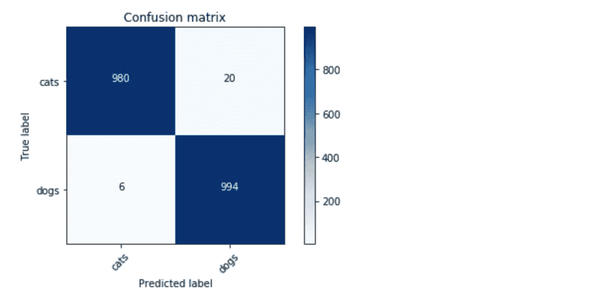
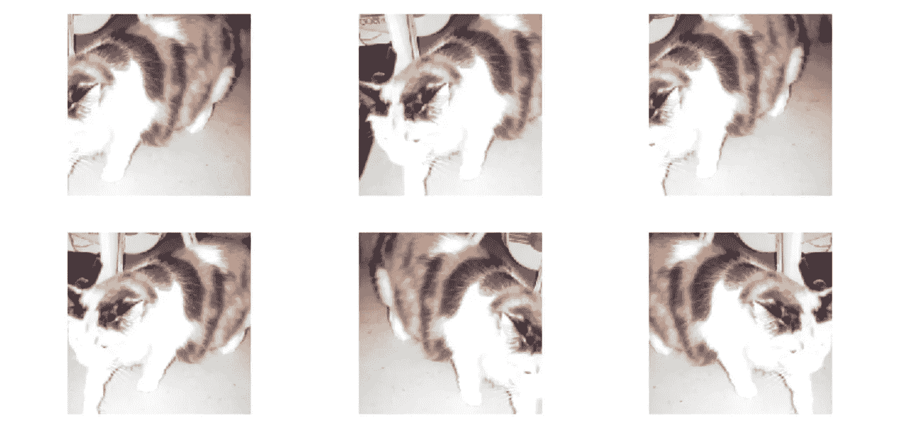
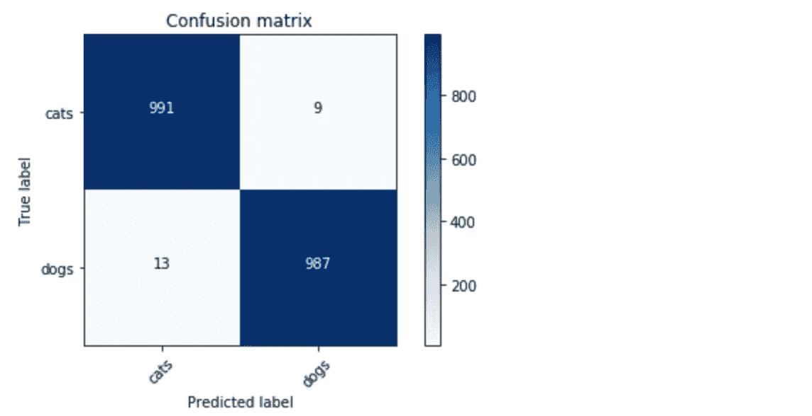
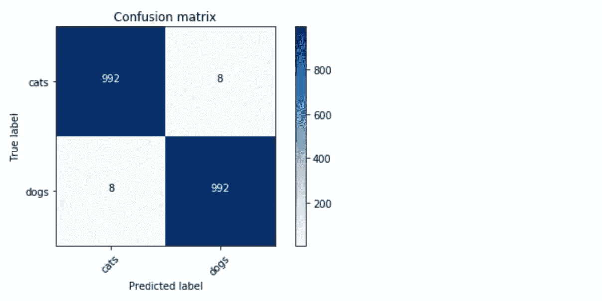

# 用于图像分类的增强

> 原文：<https://towardsdatascience.com/augmentation-for-image-classification-24ffcbc38833?source=collection_archive---------2----------------------->

*分类图像时面临的问题？不要烦恼！增援来了。！*

在处理图像数据时遇到的一个问题是图像的不一致性(有些图像太大或太小，有些是矩形而不是正方形，等等)。另一个经常面临的问题是训练集中图像的数量，这经常导致过度拟合。为了处理这些问题，我概述了一种使用增强变换的技术——对训练集中的图像进行变换，以提高模型识别图像不同版本的能力。这增加了模型拥有的信息的广度。它现在变得更适合于从不同对比度、大小、不同角度等图像中识别目标对象。

为了展示增强是如何工作的，我们查看了[狗对猫数据集](http://files.fast.ai/data/dogscats.zip)，并利用了深度学习库 [fast.ai](https://github.com/fastai/fastai.git) ，该库由杰瑞米·霍华德和雷切尔·托马斯创建，基于 PyTorch 构建。本帖灵感来源于 fast.ai 深度学习 part 1 v2。

## **一、基准模型**

为了将图像分类为狗或猫，我们使用 resnet34 来训练模型(在 Apil Tamang 撰写的这个令人敬畏的[博客](https://medium.com/@apiltamang/yet-another-resnet-tutorial-or-not-f6dd9515fcd7)中有更多关于 resnet 架构的内容！).我们首先使用学习率 0.03 和 1 个历元来训练没有数据扩充的模型。

The baseline model

由此我们可以看到`0.98584.`的验证准确性

这里有一个混乱矩阵:

因此，我们看到 26 张图片——2000 张图片中的 20 只猫和 6 只狗被错误分类。

## **二。应用增强变换**

为了减少这种分类错误，我们现在增加训练数据，看看是否有改进。我们既可以从自顶向下的转换中选择，也可以从侧面转换中选择。下面快速浏览一下这些类型所涉及的内容:

1.  基本变换—角度(旋转)和光照的变化
2.  侧面变换—角度和光照的变化+围绕垂直轴翻转
3.  自上而下的变换—角度和光照的变化+围绕水平轴翻转并旋转 90、180、270 度。

这里我们使用侧面变换，因为我们有从侧面拍摄的狗和猫的图片(与从上面拍摄的相反)，它们可能需要水平翻转，而不是垂直翻转。下面是猫图像上的 6 种随机侧面变换:

Side-on transformations

由于图像的性质，自上而下的变换在这里并不合适——猫或狗的颠倒图像很少见！

在训练该网络时，学习速率保持不变，以便观察仅由于增强而导致的准确度差异。当我们使用增强来训练网络时，对于每个时期，生成每个图像的新变换。因此，该模型在每个时期看到相同数量的图像(与原始训练数据中的数量一样多)，尽管每次都是这些图像的新版本。因此，模型看到的图像范围随着每个时期而增加。

ResNets 之类的网络是预先训练的，也就是说，除了完全连接的层之外，该架构为每一层都预先计算了一组权重。在之前训练模型时，我们使用了 ResNet34 预先计算的权重。但是这一次，由于我们使用了新的训练图像集，我们设置了`Precompute = False`来确保模型从头开始计算新模型的激活。如果不这样做，我们将仍然使用对应于原始训练数据的预计算激活，不会给我们带来太多的准确性改进。

Training the network with the transformed images

现在我们得到了一个验证精度`0.98779`,这是对以前模型的一个改进。

从上面的混淆矩阵中，我们看到这次我们错分了 22 张图片；与以前相比错误的减少。因此，我们提高了模型的预测能力。

## **三。测试时间增加**

虽然增强技术有助于给我们一个更好的模型，但预测准确性可以通过所谓的测试时间增强(TTA)来进一步提高。为了理解为什么需要这样做，让我们先来看看一些分类错误的图片:

我们在这里看到，由于对比度差，图像是矩形而不是正方形，或者因为狗/猫在图像中的比例很小，一些图像被错误分类。例如，看一看狗的矩形图像。当模型尝试预测此图像时，它只看到图像的中心(默认情况下裁剪为中心)。因此，它无法预测图像是狗还是猫。

为了减少这样的错误，我们使用 TTA，其中我们预测原始测试图像以及同一图像的 4 个随机变换的类别。然后，我们取预测的平均值来确定图像属于哪一类。

> 这背后的直觉是，即使测试图像不太容易做出预测，变换也会改变它，使得模型有更高的机会捕捉狗/猫的形状并相应地进行预测。

使用 TTA，我们现在只需要 16 张错误分类的图片就可以得到一个`99.199`的验证精度。

## **结论**

虽然基线 ResNet34 模型很好地拟合了数据，给出了非常好的结果，但是应用增强变换和 TTA 减少了错误分类错误，提高了模型的准确性。我们在这里讨论的只是基本的增强技术，如翻转和旋转，但是 GANs 也可以用来生成不同风格的图像，正如本文中所建议的。这可能会更有效。

除了对图像进行增强之外，看看如何将增强应用于结构化数据以提高性能也是很有趣的，就像它在非结构化数据中所做的那样！让我知道你对此的想法！！

## 参考

1.  [GitHub 回购换代码](https://github.com/neerjad/DeepLearning/blob/master/ImageAugmentation-Copy1.ipynb)
2.  [程序员实用深度学习，第一部分，作者杰瑞米·霍华德](http://course.fast.ai/)
3.  [王凯峰 Luis Perez 利用深度学习在图像分类中增加数据的有效性](https://arxiv.org/pdf/1712.04621.pdf)

**关于我:**我毕业于 USF 大学数据科学专业，本科学习计算机科学，在构建预测和推荐算法以及为金融和零售客户提供商业见解方面有 2 年的经验。我对将我的机器学习和深度学习知识应用于现实世界问题的机会感到兴奋。请点击这里查看我的其他博客[！
**领英:**](https://medium.com/@neerja.doshi)[**https://www.linkedin.com/in/neerja-doshi/**](https://www.linkedin.com/in/neerja-doshi/)