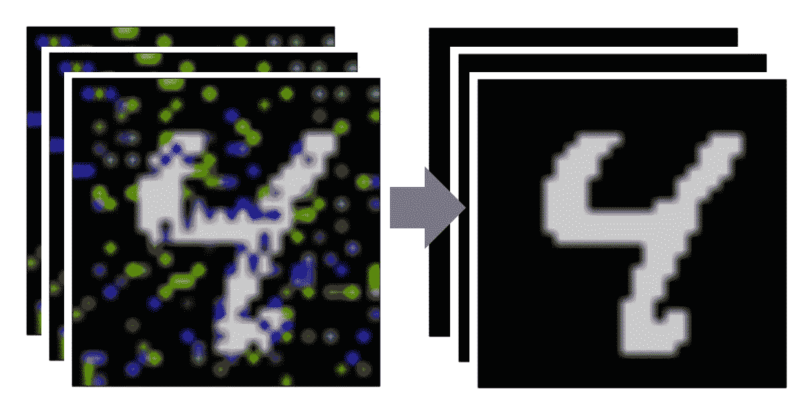
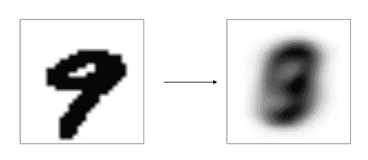
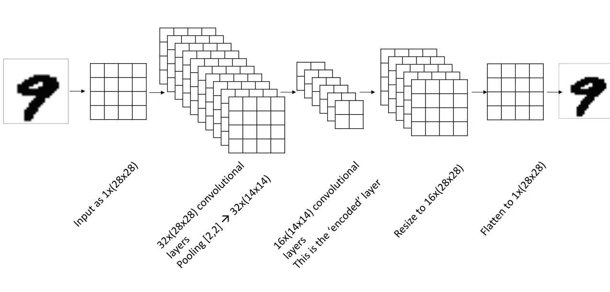
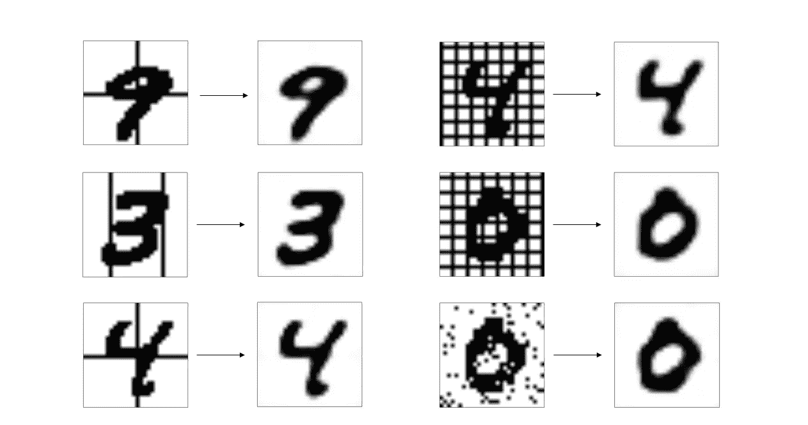

# auto encoder Zoo–使用 TensorFlow 进行图像校正

> 原文：<https://towardsdatascience.com/autoencoder-zoo-669d6490895f?source=collection_archive---------7----------------------->

Noise removal using a convolutional autoencoder

在一般情况下，自动编码器是一个函数，其中 *f(x) = x* 。虽然这似乎是多余的，但它有它的用途。有趣的是， *x* 中的信息被压缩，然后 *x* 从这个压缩状态被重构。

自动编码器的目的是学习最有效的压缩。压缩状态通常学习 *x* 的特性，所以不会显式存储 *x* 。由于这种压缩是有损的，所以不适合文件压缩。(自动编码器的非常特殊的性质进一步推动了这一点，它是在特定的数据集上进行训练的。)

我将使用 MNIST 数据集，部分是因为它在机器学习中无处不在，部分是因为我有一个预处理过的副本。

# 图表 1 —深度神经网络

该网络有 3 个深层或隐藏层，这些层在它们的维度上是镜像的。压缩或编码状态是中间层。

这种架构对于手头的任务来说过于简单，并且无法捕获足够的有效特性，如下面的输出所示。

# 图表 2 —卷积神经网络

更有效的图像处理架构是卷积神经网络。这些网络的工作原理已经在其他帖子中详细解释过了，但是我将在这里尝试做一个简单的解释。

**卷积层** —这一层接受整个图像的子部分(在这种情况下是 5x5 像素区域)，遍历图像的每个可能的子部分，对每个子部分使用相同的权重和偏差。一层中卷积滤波器的数量是所使用的权重和偏置“集”的数量。因此，虽然输入可能是 1x28x28 图像，但输出将是(层数)x28x28。

**池层** —“最大池”方法旨在减少输入的维度。例如，我使用 2x2 池大小，这意味着输出 2x2 子部分中的最大值，从而将该子部分的大小减少到 1x1。使用的跨距为 2，这意味着每个子部分与前一个子部分相距 2 个像素，因此没有子部分重叠。这种池化配置将输入的大小/维度减半。

使用以下架构:

卷积架构作为自动编码器要有效得多，输入图像的精确重建就证明了这一点。

Training process shown with a verification image

正如所承诺的，这个系统比简单地重新创建一个输入拥有更多的用途。它可以用来重建嘈杂或模糊的图像，使用部分图像来重建否则丢失的信息。下面的图像是测试图像，因此没有用于训练网络。

Verification images after 20,000 training iterations

左手边表示图像中网络旨在移除的静态对象，因此需要移除的“错误”在每个图像中的相同位置。右手边是随机对象——网格的位置不固定，噪声是随机产生的。自动编码器能够学习如何移除不期望的元素并重建期望的信息。

这将在一系列应用中有用，例如高 ISO 照片中的噪声去除、图像重建和超分辨率应用。