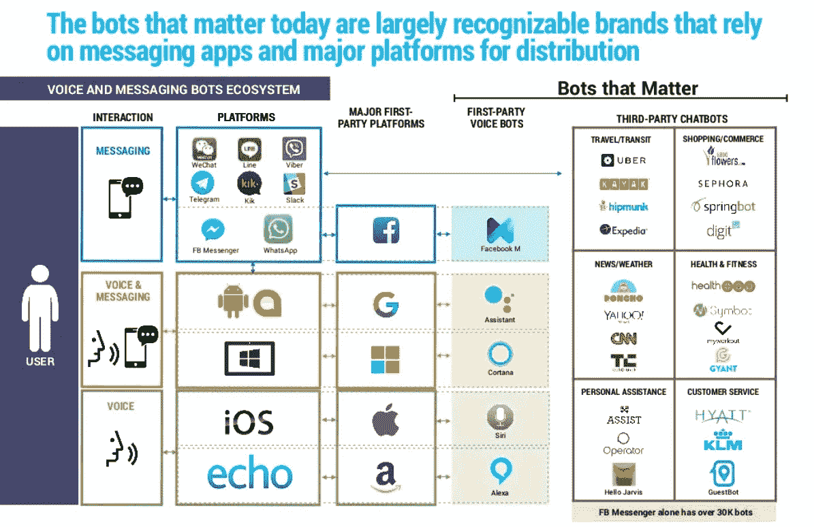
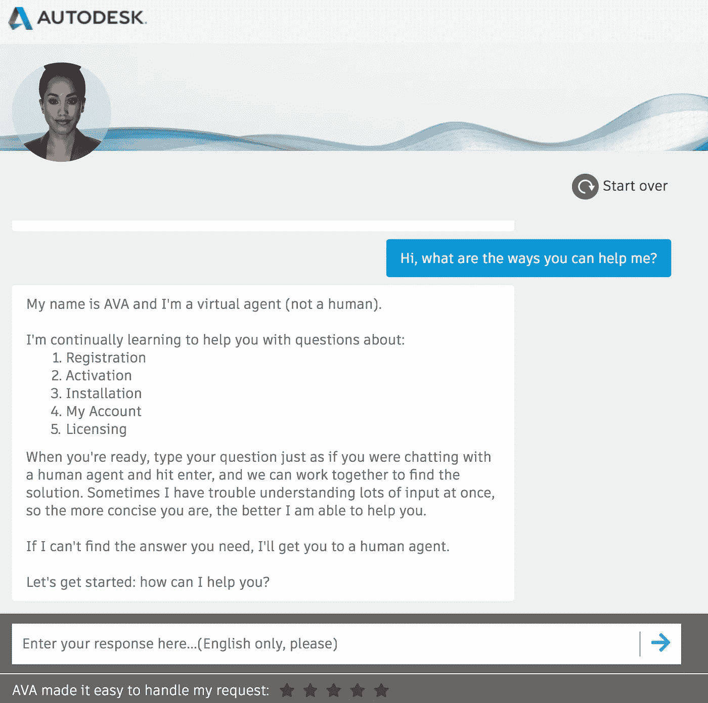
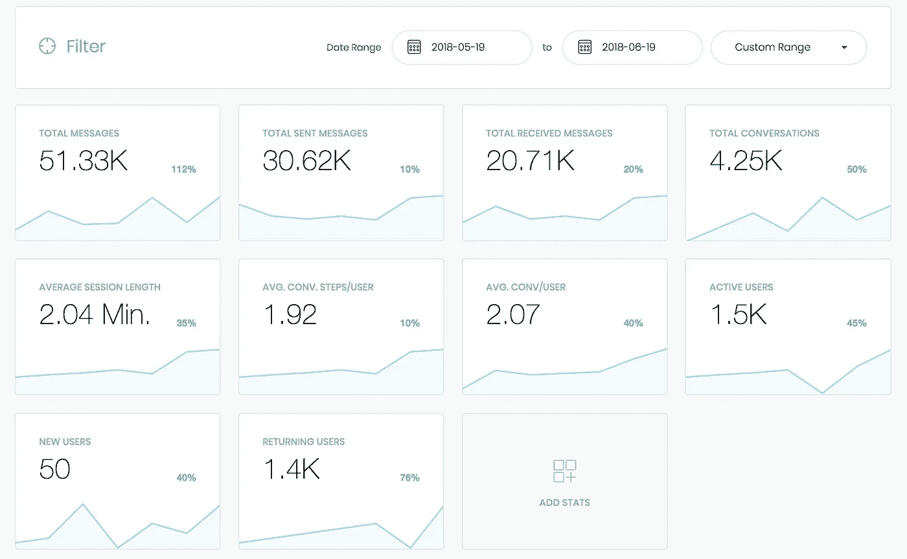

# 自动化枯燥的任务:对话助手的视野

> 原文：<https://towardsdatascience.com/automate-the-boring-task-the-horizon-of-conversational-assistants-b13a9d859c02?source=collection_archive---------8----------------------->

随着我不断构建对话助手，我每天都会面临一些问题。它是什么？我们为什么要关心它？有哪些不同的设计选择？你为什么选择一个平台而不是另一个？我们如何衡量我们的进步？我们还能做些什么来改进等等。这篇博文试图通过总结对话助手的发展来回答这些问题。

# 什么是会话助手？

根据维基百科，对话助手或聊天机器人

> 是一种计算机程序或人工智能，它通过听觉或文本方法进行对话。这种程序通常被设计成令人信服地模拟人类作为对话伙伴的行为

正如上面的定义中提到的，聊天机器人不一定需要采用人工智能技术。事实上，今天的大多数机器人都是简单的 if-then-else 程序，不一定采用人工智能技术。

# 为什么商家会在意？

据 Gartner 称，到 2020 年，55%的公司将部署聊天机器人[1]。2016 年，聊天机器人的全球市场规模达到 8800 万美元。预计到 2023 年，CAGR 市场将以 36%的速度增长，超过 10 亿美元[2]。除了数字之外，对话助手还能提供独特的价值，帮助企业在竞争中保持领先。

1.  通过减少摩擦改善用户体验。例如，美国银行聊天机器人可以显示你的账户余额、银行帐号等。通过简单的语音或文本命令。你不需要在他们的网站上点击 10 个不同的链接。
2.  通过全天候客户服务增加与客户的互动。举个例子——[酒店的常春藤](http://www.gomoment.com/)可以全天候回答任何与客房服务相关的问题。酒店不需要让员工在夜间凌晨值班！
3.  更高的客户满意度——拥有成熟虚拟助理解决方案的企业客户看到的遏制率高达 90% [4]。包容意味着客户能够在第一次接触时解决问题的频率。提高容器数量意味着更高的客户满意度。
4.  通过基于对话的情感分析，更好地洞察客户行为
5.  成本降低

# 那些聊天机器人在哪里？

聊天机器人生活在不同的平台。他们可以是 Facebook Messenger、WhatsApp、Telegram 或 Kik 等消息平台的一部分；可以在 Slack 等企业协作平台；可以是 iPhone 或亚马逊 Echo 等硬件设备的一部分；可以在 web 应用程序中——例如我们在大多数网站中看到的客户服务聊天气泡；或者干脆作为手机 app 比如 [Replika](https://replika.ai/) 。

虽然对话机器人可能会让我们想起 Siri 或 Alexa 他们不一定需要语音支持。聊天机器人可以只发送文本消息，也可以是文本和语音的结合，或者只发送语音。

Chatbot Ecosystem [credit](http://www.slideshare.net/ActivateInc/think-again-tech-media-outlook-2017-67604099/48)

# 产品前景

在一个博客中有太多的产品要介绍。我将把重点放在开发平台、测试和分析工具上，它们最终会导致构建一个大规模的企业产品

**开发者平台:**

在基于规则的框架中，Botkit 是开发人员最为熟知的。使用僵尸工具，开发人员需要创建交互逻辑——如何解释传入的聊天消息，以及典型的响应集是什么。所以本质上，僵尸工具本身并不提供任何机器学习能力。你必须不断地为简单的应用程序创建规则。这些类型框架适用于快速原型开发，但不适用于大型可伸缩系统。截至 2017 年 5 月，僵尸工具[增加了将僵尸工具工作室与微软自然语言处理引擎 Microsoft LUIS 集成的功能](https://blog.howdy.ai/helping-your-bot-grow-a-brain-4d08d14bec19)。

接下来是基于云的开发者平台。DialogFlow，微软 LUIS，亚马逊 Lex 等。是基于云的对话式人工智能 NLP 服务。他们很快上手，不需要太担心 NLP 或机器学习的细节。

NanoRep(被 LogMeIn 收购)是另一个基于云的聊天机器人开发平台，它是专门为客户服务用例设计的。该平台有助于预测客户在网站上搜索商品或与客户支持人员聊天时试图做的事情，并减少到达网站所需的步骤[3]。

尽管这些基于云的 NLP 服务从一开始就很棒，并且更容易构建可扩展的解决方案，但是它们有两个主要的局限性。首先，你必须把你的数据保存在他们的云中。对于担心数据隐私和数据所有权的企业来说，这是一个特殊的问题。第二，开发人员受到这些平台支持的功能的限制，这对于需要在竞争中脱颖而出的企业来说是一个挑战。如果这两个是你关心的，你最好使用像 [Rasa](https://rasa.com/) 或 [MindMeld](https://devcenter.mindmeld.com/) 这样的平台。

[Rasa](https://rasa.com/) 是一个开源的企业级对话式 AI 平台。它以模块化的方式将自然语言理解(NLU)引擎( [Rasa NLU](https://nlu.rasa.com/) )与对话管理引擎( [Rasa 核心](https://core.rasa.com/))分开。开发人员可以根据他们的特定需求混合搭配这些模块。例如——开发人员可能希望将 Rasa NLU 与僵尸工具一起使用(在这种情况下，僵尸工具将只处理对话管理)。你也可以用 Rasa 交互式训练你的对话模型。这个特性有助于根据人机对话重新训练对话引擎。

[MindMeld](https://devcenter.mindmeld.com/) (被思科收购)是另一个企业级对话式 AI 平台。与 Rasa 不同，他们不允许开发者模块化访问他们的 NLU 和对话管理引擎。此外，据我所知，没有像 Rasa 这样的交互式培训功能。

**企业产品**

在我看来，客户服务是企业对话助手可以提供巨大价值的最令人兴奋的用例——增加销售额、经常性收入、客户满意度等。企业也开始掌握它了。例如，ServiceNow [客户服务机器人](https://techcrunch.com/2018/05/09/servicenow-chatbot-builder-helps-automate-common-service-requests/)可以帮助客户了解案例的状态，并自动处理其他客户服务请求。UPS [聊天机器人](https://jasoren.com/chatbots-in-logistics-and-supply-chain-how-do-companies-like-ups-benefit-from-chatbots/)帮助客户面对物流运作。 [Carla](https://www.cwtcarla.com/CarlaWeb/) 帮助你计划商务旅行， [Cinch](http://www.cinchtravel.com/how-it-works) 帮助那些不在拥有自己旅行管理系统的大公司工作的商务旅行者管理他们的旅行。[AVA](https://ava.autodesk.com/)—Autodesk 虚拟助理可以帮助 Autodesk 客户完成注册、激活、安装、许可和帐户相关任务。好事达正在部署聊天机器人来帮助小企业客户完成保险流程。

Autodesk Virtual Assistant

有趣的是，有些聊天机器人开发平台是专门为客户服务用例设计的。例如 [Reply.ai](http://reply.ai/) 帮助企业建立客户服务聊天机器人，并提供对客户情绪、偏好、好恶等的洞察。NanoRep(已被 LogMeIn 收购)的聊天机器人平台也是专门为企业客户服务而设计的，当客户询问机器人不知道的事情时，它会通知人类客户支持代理。

**聊天机器人分析平台:**

Dashbot 和 [Botanalytics](https://botanalytics.co/) 是聊天机器人分析平台的几个例子。这些平台通过识别瓶颈、识别关键指标、细分对话和提供智能建议来帮助改善人与机器人的沟通。例如，下面的[机器人分析](https://botanalytics.co/)仪表盘显示了人类顾客和聊天机器人之间对话的一些统计数据。这些统计数据将让我们更好地了解已部署聊天机器人的效率。例如— *平均会话长度*可能表示企业解决客户问题的速度。

Botanalytics Dashboard showing analytics of the conversation between a human and a bot

[Dashbot](https://www.dashbot.io/) 使品牌和开发者能够通过可操作的数据和工具增加参与度、获取度和盈利。除了参与度和留存率等传统分析之外，Dashbot 还提供机器人和语音特定的指标，包括情绪分析、意图分析和完整的聊天会话记录。它使用户能够使用真人接管、广播消息和受众构建器等工具对数据采取行动。使用 Dashbot，聊天机器人开发人员可以找到并修复未处理的意图。

Finding and Fixing Unhandled Intent with [Dashbot](https://www.dashbot.io/2018/06/07/build-a-smarter-bot-fix-not-handled-messages/)

**聊天机器人测试方法和工具:**

测试您的聊天机器人应用程序需要不同于您的典型软件应用程序的思维方式。测试过程中的一个关键阶段是测试对话流。机器人是否遵循了您希望它遵循的相同对话流程？如果人类不像我们预期的那样交谈呢。测试过程还需要考虑速度、准确性、用户体验等。与机器人对话。在聊天机器人的情况下，错误处理尤其有趣。如果机器人被要求做一些它没有被训练过的事情，它如何回答？

[博特宁](http://bottesting.co/)、[戴蒙](http://dimon.co/)等。是一些聊天机器人测试平台，可以自动生成类似用户的对话。这些对话可用于测试聊天机器人的对话流程、速度、准确性和用户体验。 [Botium](http://www.botium.at/) ，一个开源聊天机器人测试平台，通过启动、交互和停止你的聊天机器人应用程序来自动化测试过程。另一个开源工具是 [Chatbottest](http://chatbottest.com/) 。这个工具有一组问题，可以用来测试应用程序的对话流和 UX。他们还开发了一个机器人来测试你的机器人——Alma。目前，Alma 是一个 chrome 扩展，可用于在 Facebook Messenger 和 Telegram 中测试您的聊天机器人。

**机器人商店:**

与 App Store 概念类似，Slack 等平台也有自己的机器人商店，展示在其平台上构建的机器人。Cisco Webex Teams 是另一个协作平台，开发人员已经为企业客户构建了机器人。[聊天瓶](https://chatbottle.co/)、[聊天机器人列表](https://botlist.co/)和[因此](https://thereisabotforthat.com/)列出了世界上的聊天机器人应用。

一篇关于产品前景的综合文章总是一个移动的目标。我确信我已经错过了许多令人兴奋的产品。由于我关注的是企业产品，这篇文章有意忽略了消费者聊天机器人。请随时在评论区分享任何其他产品的信息。

# 参考:

1.  [https://chatbotslife . com/the-chatbot-landscape-changes-for-2018-1 de 0 FB 7 f 88 a 1](https://chatbotslife.com/the-chatbot-landscape-changes-for-2018-1de0fb7f88a1)
2.  [https://blog . key reply . com/the-chatbot-landscape-2017-edition-ff 2 e 3d 2 a 0 BDB](https://blog.keyreply.com/the-chatbot-landscape-2017-edition-ff2e3d2a0bdb)
3.  [https://TechCrunch . com/2017/08/01/logmein-acquisites-chatbot-and-ai-startup-nano rep-for-up-to-50m/](https://techcrunch.com/2017/08/01/logmein-acquires-chatbot-and-ai-startup-nanorep-for-up-to-50m/)
4.  [http://connect . creative virtual . com/virtual-agent-improve-customer-service](http://connect.creativevirtual.com/virtual-agents-improve-customer-service)
5.  [https://www.abetterlemonadestand.com/ecommerce-chatbots/](https://www.abetterlemonadestand.com/ecommerce-chatbots/)
6.  [https://www . 30 seconds tofly . com/ai-software/ultimate-travel-bot-list/](https://www.30secondstofly.com/ai-software/ultimate-travel-bot-list/)

**注:**

我是旧金山思科超创新生活实验室(CHILL)的软件工程师。我从事聊天机器人、自然语言处理方面的工作，最近获得了深度学习奖学金，成为杰瑞米·霍华德 fast.ai 课程的一部分。

特别感谢 Ilker Koksal，[机器人分析](https://www.botanalytics.co/)的联合创始人兼首席执行官。贾斯蒂娜·阮(Justina Nguyen)，Dashbot 的开发者传道者。

这一系列帖子的名字是受到了本书的启发。更早的帖子可以在[这里](/automate-the-boring-task-chatbots-in-enterprise-software-dc83cc8f09d8)找到。