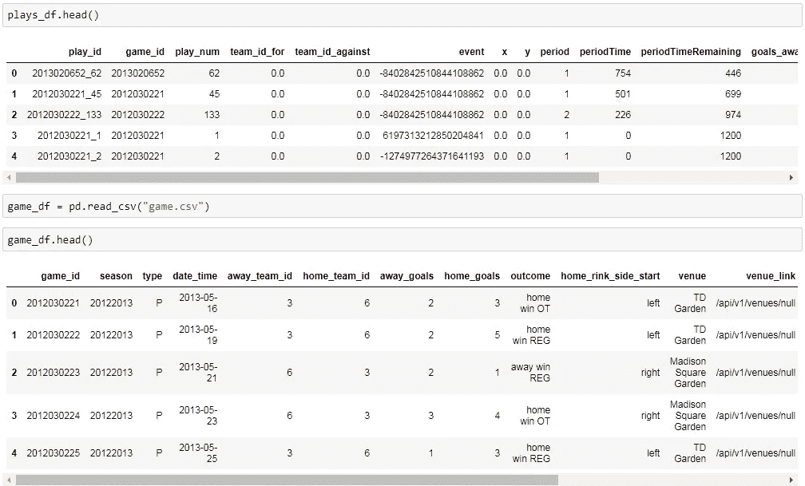

# 用于预测建模的自动化特征工程

> 原文：<https://towardsdatascience.com/automated-feature-engineering-for-predictive-modeling-d8c9fa4e478b?source=collection_archive---------16----------------------->


Source:Wikimedia Commons

使用 Python 和 FeatureTools 库预测哪些 NHL 比赛是季后赛。

我见过的数据科学家在构建数据产品时投入的主要时间之一是手动执行特征工程。虽然像 [auto-sklearn](https://automl.github.io/auto-sklearn/stable/) 和 [Auto-Keras](https://autokeras.com/) 这样的工具已经能够在构建预测模型时自动完成大部分模型拟合过程，但确定将哪些特征用作拟合过程的输入通常是一个手动过程。我最近开始使用 FeatureTools 库，它使数据科学家也能够自动化特征工程。

[](https://github.com/Featuretools/featuretools) [## 功能工具/功能工具

### 用于自动化特征工程的开源 python 框架——feature tools/feature tools

github.com](https://github.com/Featuretools/featuretools) 

FeatureTools 可用于浅层(经典)机器学习问题，其中数据以结构化格式提供。该库提供了用于执行深度要素合成的功能，这近似于数据科学家在执行要素工程时将探索的变换。使用此工具的结果是，您可以将数据从窄而深的表示转换为浅而宽的表示。

我发现，当每个项目有许多记录需要预测时，这种技术最有效。例如，如果您预测客户是否会流失，输入可以是每个客户的会话事件的集合。如果每个用户只有一条记录，那么深度特征合成不会非常有效。为了展示这种方法是如何工作的，我将使用 Kaggle 上的 [NHL 数据集](https://www.kaggle.com/martinellis/nhl-game-data)。这个数据集包括一个游戏记录表，以及一个更详细地描述每个游戏的游戏记录表。我正在建立的预测模型的目标是根据比赛中的打法来确定哪些比赛是季后赛。在没有应用领域知识的情况下，我能够建立一个逻辑回归分类器，以高准确度( *94%* )预测比赛是季后赛。完整的 Python 笔记本可以在 github [这里](https://github.com/bgweber/StartupDataScience/blob/master/EDA/NHL_Games.ipynb)获得。

这篇文章的剩余部分介绍了笔记本，展示了如何将提供的 Kaggle 表转换成我们可以用于 FeatureTools 库的输入。第一步是加载必要的库。我们将使用 pandas 加载表，使用 framequery 操作数据框，使用 hashlib 将字符串转换为整数，使用特征工具执行深度特征合成，使用 sklearn 进行模型拟合。

```
import pandas as pd
import framequery as fq
import hashlib
import featuretools as ft
from featuretools import Feature 
from sklearn.linear_model import LogisticRegression
from sklearn.metrics import roc_auc_score
```

接下来，我们将数据加载到 pandas 数据框中，并删除不会用于构建预测的字符串字段。结果是两个数据帧: *game_df* 指定一场比赛是常规比赛还是季后赛，而 *plays_df* 有关于每场比赛的细节。

```
**# game data** game_df = pd.read_csv("game.csv")**# play data** plays_df = pd.read_csv("game_plays.csv")**# drop some of the string type fields** plays_df = plays_df.drop(['secondaryType', 'periodType', 
                 'dateTime', 'rink_side'], axis=1).fillna(0)**# convert the remaining strings to integer types via hashing** plays_df['event'] = plays_df['event'].apply(hash)
plays_df['description'] = plays_df['description'].apply(hash)
```

游戏数据是一种窄而深的格式，这意味着每个游戏都由许多不同的游戏组成，只有几个特征。我们的目标是将这些数据转换成一种浅而宽的格式，其中每个游戏都由具有数百种不同属性的单行来描述。这是输入数据集。



The data frames used as input: plays and games.

下一步是将 pandas 数据框转换为实体集表示，FeatureTools 将实体集表示用作执行深度要素合成的输入。实体集用于描述不同表之间的关系。在这种情况下，plays 事件是基本实体，而 games 是父实体。在描述这种关系之前，我们首先对*事件*和*描述*字段使用 1-hot 编码。这些开始是字符串字段，但是在执行编码之前被转换为哈希值。这是第一步，如下面的代码片段所示。第二步是使用带有 1-hot 编码的转换表作为实体集创建的输入数据帧，在实体集创建中，我们将游戏定义为游戏的集合。

Creating an entity set with encodings for the event and description fields.

这一步的输出是一个实体集，我们可以使用它来执行深度特征合成。得到的对象 *es* 具有以下属性。

```
Entityset: plays
  Entities:
    plays [Rows: 500638, Columns: 37]
    games [Rows: 1529, Columns: 1]
  Relationships:
    plays.game_id -> games.game_id
```

一旦我们将数据帧编码为一个实体集，我们就可以使用 FeatureTools 中的 *dfs* 函数执行深度特征合成，如下所示。结果是*特征*数据集，它有数百个特征，每个游戏有一行。我们还使用 framequery 为每场比赛分配一个标签，其中季后赛的标签为 1，常规赛的标签为 0。

```
**# generate features for the data set** features,_ =ft.dfs(entityset=es,target_entity="games",max_depth=2)
features.reset_index(inplace=True)**# assign labels to the generated features** features = fq.execute("""
SELECT f.*, case when g.type = 'P' then 1 else 0 end as label
FROM features f 
JOIN game_df g
  on f.game_id = g.game_id
""")
```

这会产生一个浅而宽的数据框，如下所示。我们已经将*事件*字段从字符串转换为 1-hot 编码字段，现在应用了许多不同的聚合操作。数据现在以一种格式可用，其中单个记录描述每场比赛，我们可以训练一个模型来预测一场比赛是否是季后赛。


The generated features produced from deep feature synthesis.

最后一步是训练和测试模型。为了简单起见，我使用了 sklearn 的逻辑回归模型来拟合数据并评估结果。在下面的代码片段中，精度是在不使用维持集的情况下进行评估的。当我在笔记本中添加维持步骤时，模型的准确性为 94.0%，ROC AUC 为 0.984。

```
**# create inputs for sklearn** y = features['label']
X = features.drop(['label', 'game_id'], axis=1).fillna(0)**# train a classifier** lr = LogisticRegression()
model = lr.fit(X, y)
model.score(X, y)
```

这些结果看起来真的令人印象深刻，因为没有关于曲棍球的领域知识被用来训练模型。我没有手动提出特征并试图对曲棍球知识进行编码，而是使用深度特征合成来创建大量特征，作为模型拟合步骤的输入。自动化特征工程是数据科学向前迈出的一大步，使构建预测模型更加自动化。鲨鱼队加油。

本·韦伯是 Zynga 的首席数据科学家。我们正在[招聘](https://www.zynga.com/careers/positions/categories)！