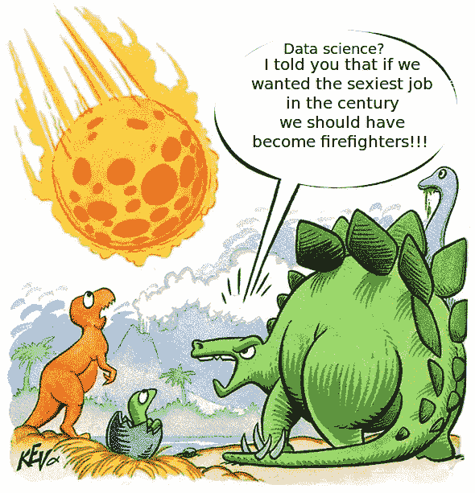
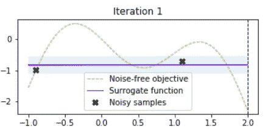

# 自动化机器学习:深度的不同概念

> 原文：<https://towardsdatascience.com/automated-machine-learning-a-different-notion-of-deep-e0f7e5c06fb2?source=collection_archive---------14----------------------->

## 机器与人的关系是否达到了一个全新的水平？

Photo by [Robin Joshua](https://unsplash.com/photos/6aiKaIYupQY?utm_source=unsplash&utm_medium=referral&utm_content=creditCopyText) on [Unsplash](https://unsplash.com/search/photos/spiral?utm_source=unsplash&utm_medium=referral&utm_content=creditCopyText)

> 计算机编程是自动化，机器学习是自动化自动化。那么，自动化机器学习就是自动化自动化的*自动化。*
> 
> *——塞巴斯蒂安·拉什卡*

自动机器学习已经在人工智能的雷达下好几年了。尽管像亚马逊和谷歌这样的大公司已经推出了他们的 AutoML 工具，但 ICML 的 AutoML 研讨会已经引起了人们的极大兴趣，研究朝着理解机器学习问题的本质迈出了重要的一步，AutoML 仍然是一个小众术语，为数据科学社区的先锋派保留。

可能被深度学习的狂热所掩盖，显然还没有成熟到让我们眼花缭乱的应用程序，AutoML 还没有被理解或明确定义。人机关系的下一步？对人工智能更深层次的理解？

重要的发现通常是事后承认的，因为社会需要经历、理解和评价它们。尤其是当涉及到人工智能时，很容易只见树木不见森林，因为事情正在变得更深——但是向哪个方向更深呢？

## 什么是 AutoML？

*1。在训练机器学习模型中插入更多的自动化。*

等等，机器学习模型不是已经自动训练好了吗？部分是的，这就是为什么我们称之为机器学习，因为算法根据我们给它们的数据自己“学习”。然而，最繁琐、最耗时的任务，那些传统上在发布惊人结果时被低估的任务，与模型的实际训练无关。

> 机器学习 75%是准备做机器学习……15%是你之后做的。
> 
> —里奇·卡鲁阿纳，ICML 2015

参与机器学习实验的任何人都认识到，好的结果很容易得到，但满意的结果需要时间、聪明的设计、该领域的经验，而且往往需要一点运气才能实现。卡鲁阿纳提到的实验的 90%是预处理、特征提取、超参数调整、算法选择、模型评估和 ML 流水线的其他可能步骤。

AutoML 主要关注的步骤是超参数调整，这通常是指为学习算法的超参数选择最佳值，这是它自己无法选择的。例如，神经网络自己学习最佳权重，但是对于 ML 实践者来说，定义层的数量、神经元的数量和学习速率是一项任务，并且是最乏味的任务。因为调优是一项定义明确的任务，所以它一直是 AutoML 工具的主要目标。

*2。从 ML 实验的应用中收集元知识。*

那么，一个人能从 ML 实验中得到什么呢？希望是个好模特。对数据的一些见解，可能。一个更有经验的数据科学家，可以说是唯一的长期收获。但是这种新获得的经验的实质是什么呢？数据科学家已经理解了 ML 问题的性质，已经下意识地认识到一些模式，并且当他在将来面对类似的问题时，他将能够重用他的知识并提供更快、更直接的解决方案。

这是*元学习*领域背后的本质:当解决一个不属于模型的 ML 问题时，创建*元知识*，但它足够一般化以用于其他情况。

从数据集中提取元特征是 AutoML 工具中经常使用的一种技术，用于初始化学习算法的超参数:如果您知道一些值在特定问题中工作得很好，为什么不在解决类似问题时从它们开始呢？正是在制定和量化数据集之间的相似性方面，元学习和人类经验的挑战仍然超过人工智能。

*3。跨学习任务传递知识。*

如果元学习与创造元知识有关，那么迁移学习就是寻找使用元知识的正确方法。你可能已经听说过成功使用迁移学习的应用:[一个玩不同雅达利游戏的深度神经网络](https://deepmind.com/research/publications/playing-atari-deep-reinforcement-learning/)和[一个为《我的世界》](https://arxiv.org/abs/1604.07255)学习技能的代理，是少数几个例子。

迁移学习可以从简单的(简单地跨问题传递数据或训练模型)到更微妙的(重用良好的超参数化)到高度复杂的(机器学习算法不仅学习特定问题的好解决方案，还学习可以重用的技能)。

现在很明显，AutoML 的研究正专注于更高层次的机器学习:既然我们已经练习机器学习几十年了，我们是否已经达到了允许我们清楚地制定它并教给别人的理解水平？谁比机器更适合做学生呢？

> 那些知道的人会去做。理解的人，教导。
> 
> ——亚里士多德

## 什么不是 AutoML？

*1。更多的 GPU/CPU*。

强大的计算能力意味着巨大的责任。说最近深度学习的突破只能归功于一些研究小组拥有的巨大计算能力是不公平的。这涉及到大量的直觉、经验和创造力，但准确地说，如果没有这种计算能力，深度学习是不可行的。

通过给一个简单的技术，如网格搜索，提供大量的资源来实现一个优秀的超参数化，*不是 AutoML* 。在[1202 CPU 和](https://www.nature.com/articles/nature16961)176 GPU*上训练得到好的模型不是 AutoML* 。AutoML 是关于通过利用过去的经验做出明智的决策，以使机器学习更少暴力，更智能。从面向应用的深度学习到面向抽象的自动化需要研究社区在方法和工具上的转变，但这可能是唯一的？)超越我们在大多数应用程序中仍然存在的性能障碍的方法，如强化学习。

*2。一个神奇的盒子，给出了一个很好的预测模型。*

诚然，[AutoML](https://blog.datarobot.com/automated-machine-learning-short-history)的短暂历史揭示了我们最初的希望是这样实现的:一个黑盒，它接收请求并返回可能的最佳模型。不需要数据科学家，不需要理解问题的性质，不需要透明的实验界面。纯自动化。

虽然我们不能确定这种方法失败是因为它总体上是错误的，还是因为我们的技术没有准备好支持它，但它确实感觉与我们迄今为止的人类经验形成了对比:自动化只有在深入理解一个问题之后才会出现。我们真的不知道[强人工智能](https://www.ocf.berkeley.edu/~arihuang/academic/research/strongai3.html)会是什么样子，但是黑匣子听起来像是一个不真实的(安静的赛博朋克)场景。

*3。将导致数据科学家灭绝的陨石。*

直到我们到达一个点，整个人类变得过时，生活在矩阵中，我们仍然需要数据科学家。无论我们的机器学习工具和一般技术变得多么先进，我们都需要一个人在回路中。事实上，一项技术变得越复杂，你就越需要更有经验、想象力和分析能力的科学家来掌握它。

AutoML 工具目前作为数据科学家的助手销售，可以承担和改进 ML 管道的一些步骤，但仍然需要人来协调和检查实验。只要你保持不断提高的技能、好奇心和对世界的独特视角，你就不是可有可无的——作为一名数据科学家、一名员工和一个普通人。

Data scientists in 10 years from now? Opinions differ. Original image credit: [https://kevbrockschmidt.wordpress.com/tag/archive/](https://kevbrockschmidt.wordpress.com/tag/archive/)

**快速了解 AutoML**

AutoML 是一个年轻的研究领域，所以通过研究相关的工具和思想，很容易很好地理解它。自然，这些想法都是老的，在不同的领域已经成熟。观察研究团体如何通过定义问题和融合这些想法来响应对 AutoML 的需求是令人兴奋的！(好吧，对于像我这样的计算机科学家来说，主观上是令人兴奋的。)

**现金问题**

AutoML 问题的第一个定义可能是由 AutoWEKA 团队提供的，他们试图将组合算法选择和超参数优化问题自动化。[这个问题有一个优雅的数学公式](https://papers.nips.cc/paper/5872-efficient-and-robust-automated-machine-learning)，但是，简单地说，这个问题就是:

哪种 ML 算法(SVM？神经网络？)以及它的什么参数化(内核？层数？)在为数据集设计 ML 解决方案时，我应该使用什么？

**没有免费的午餐定理**

在选择最大似然算法时，所有数据科学家都有自己的偏好。神经网络引起了人们极大的兴趣，但是有各种各样的算法。因为决定通常是应用、品味和习惯的产物，所以很自然地会想:

有没有一种 ML 算法永远是最佳选择？

简短的答案是否定的。由《没有免费的午餐定理》的作者[提供的长答案](https://ieeexplore.ieee.org/document/585893)更具技术性，但主要归结为这样一个事实:如果我们在所有可能的数据集(生成数据的概率分布)上平均所有最大似然算法的性能，性能是相同的。因此，AutoML 无法将算法选择任务自动化到只有一种算法将用于所有应用的程度。

**贝叶斯优化**

那么，如何找到最佳算法及其参数化呢？嗯，这只不过是一个优化问题，我们目前一直在用众所周知的“试试看”的方法来解决这个问题。

由于这种方法对于大型搜索空间(比如深度神经网络)来说效率低下，数据科学家需要(指数级)更多的 GPU 或更好的优化方法。

贝叶斯优化是一种吸引了大量兴趣的技术(参见 auto-sklearn)，因为它是优化黑盒函数的有效方法:如果我们假设神经网络中的层数与其实现的性能之间存在关系，那么我们可以通过将它建模为概率分布来尝试近似这种关系。

贝叶斯优化从假设一个模型(通常是统一的模型)开始。然后，is 通过挑选若干层并实验性地评估性能来对搜索空间进行采样。在此之后，可以通过对样本拟合概率分布来更新模型，并且算法将基于当前模型挑选最有可能使性能最大化的值作为下一个样本。通过迭代这个过程，我们可以得到一个精确的模型和一个好的参数值。

Bayesian optimization: the yellowish line is the true model and the purple is the approximation, along with its confidence intervals, which we improve by sampling the search space. Original image credit and an in-depth explanation of Bayesian optimization: [http://krasserm.github.io/2018/03/21/bayesian-optimization/](http://krasserm.github.io/2018/03/21/bayesian-optimization/)

## 现有工具

AutoML 工具似乎遵循两个不同的指令:它们要么是以研究为导向的框架，专注于自动化 ML 管道的特定步骤，要么是成熟的市场产品。

Auto-sklearn 专注于现金问题。它采用贝叶斯优化和元学习来智能地搜索组合算法-超参数空间。Auto-sklearn 在 [ChaLearn AutoML](http://automl.chalearn.org/) 和 KDnuggets 比赛中被证明非常有效，可能是因为它在模型形成问题中融入了集成学习。

HPO 图书馆，是一个超参数优化库，可以证明非常有用的研究目的，因为它提供了一个统一的接口，其他三个 AutoML 软件包:SMAC，留兰香和 TPE。不幸的是，它的开发已经停止。

r 也拥抱了自动化的精神。Caret 更像是一个接口，而不是一个自治的包，它通过提供一个简单的 ML 实验接口来解决众所周知的 R 包的多样性。Caret 主要自动化 ML 管道的形成，但是步骤仍然是常规的。

然后，是营销产品，数据科学家可以使用，但不能扩展。数据科学家或公司可以选择使用谷歌的 Cloud AutoML、微软的 Azure 或亚马逊的网络服务。这些工具提供了优雅的界面、强大的后端处理能力以及设计良好实验的有用提示。然而，市场还远未声称 AutoML 已经完善，因为这些工具不能被盲目信任来解决端到端的 ML 问题。

## 为什么你应该关心

AutoML 对于数据科学家来说是一个全新的工具。和所有的工具一样，它可以被珍视，被误用或者生锈。作为一名数据科学家，您可以选择使用 AutoML now 作为助手，将您从预处理数据或调整模型的繁琐任务中解放出来，从而提高您的工作效率。或者，你可以投入时间成为一名 AutoML 专家，并将其作为未来就业市场的战略武器，或者作为一个行业的挡箭牌，该行业将琐碎的事情自动化，但仍在努力解决智能的非平凡性——人工或非人工。

最后，作为不断发展与技术关系的人类社会的一部分，我们应该记住，问题不总是我们应该自动化什么，而是有时可能是:我们不应该自动化什么？

> 我们生活在一个奇怪的时代。我们可以去任何我们想去的地方旅行，甚至去其他星球。为了什么？日复一日地坐着，士气和希望都在下降。
> ― **菲利普·K·蒂克，高高城堡里的人**