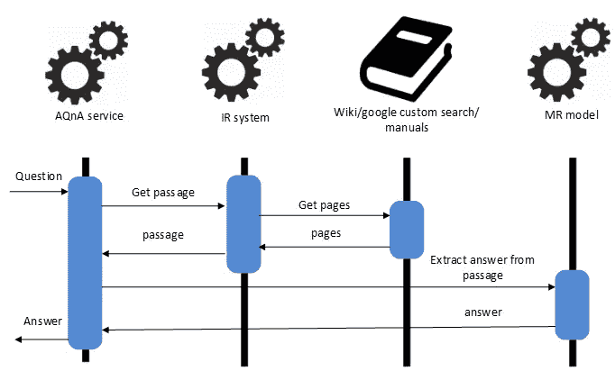
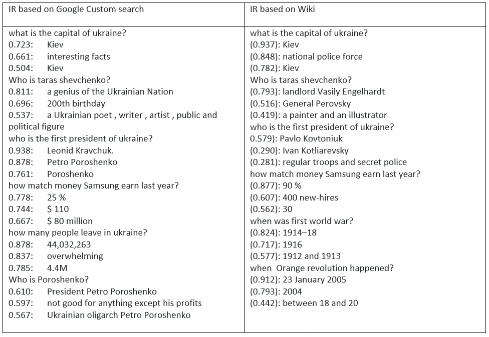
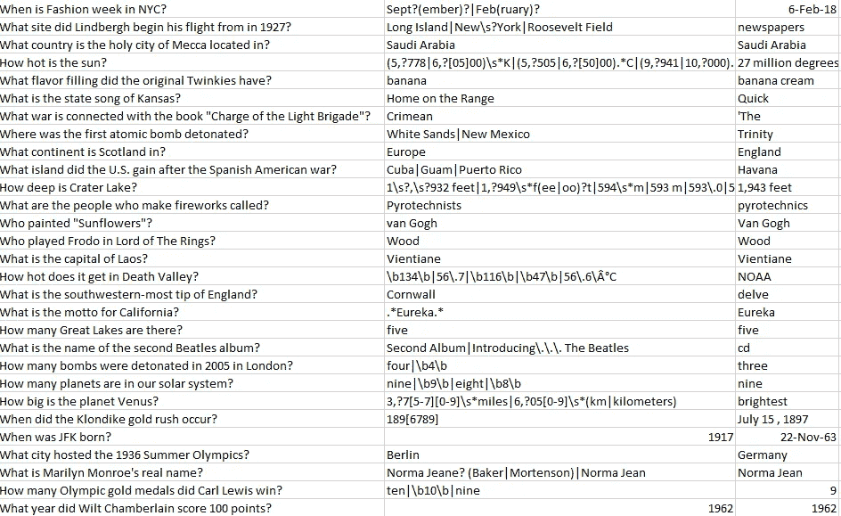

# 自动问答

> 原文：<https://towardsdatascience.com/automatic-question-answering-ac7593432842?source=collection_archive---------4----------------------->

从结构化和非结构化数据中查询信息变得非常重要。有大量的文本数据、FAQ、报纸、文章、文档、用户案例、客户服务请求等。很难记住所有的信息。谁赢得了上届欧洲杯足球赛？比特币是什么？一个著名歌手的生日是什么时候？为了找到一些信息，我们需要搜索一个文档，在找到答案之前花几分钟阅读。适马软件公司的数据科学家、本文作者纳扎尔·格里舒克认为，自动 QnA 系统可以节省我们生活中最宝贵的资源——时间。

首先，让我们讨论一下有哪些类型的问题，以及用户可以期待这些问题的什么答案。

所有的问题都可以分为几种类型:

*   一般问题，有是/否答案
*   疑问句，开头是:谁，什么，哪里，什么时候，为什么，如何，多少
*   选择题，问题中有一些选项
*   仿真问题，在文本中可以找到完整的答案。这类问题的答案由一个或几个相继出现的单词组成

在本文中，我们将重点关注仿真陈述问题回答方法，它可以处理广泛的问题，并涵盖其中最困难的一种类型。

本文将要讨论的方法是基于一种专门为仿真问答设计的算法。至于其他问题类型(一般问题、特殊疑问句、选择问题)，该算法可以在一些调整之后应用。此外，一些想法可以被重用来创建您自己的方法。

# 主要仿真问答方法

通常，问答系统由几个逻辑块组成:

*   数据源，
*   **信息检索系统**，
*   **机器阅读理解模型(MR 模型)**
*   一个或多个附加模块，例如用于文本预处理、答案后处理、检查和稳定的模块。

让我们看看这些模块是如何相互作用的:

如图所示，当问题被转移到系统时，要做的第一步是搜索可以包含问题答案的文本。这种文本的来源可以包括各种网页、存储在本地盘上的文档、维基百科等。

下一步是从找到的所有信息中选择最相关的文本。为此，可以使用以下方法:TF-IDF 相似度、Jaccard 索引、单词嵌入、深度学习文本相似度算法。所有这些方法都有优点和缺点，预处理和获得相似性指数需要不同的时间/内存。没有适用于所有情况的灵丹妙药或最佳方法。哪种方法最适合具体的任务取决于几个因素，如领域、数据集、数据量。这个问题很复杂，有很多方面，每个月都会有一些关于信息检索/文本相似性任务的文章发表。

# 信息检索系统

根据维基百科，“开放领域问答系统旨在针对用户的问题返回答案。返回的答案是短文本的形式，而不是相关文档的列表。”

如果你选择回答开放领域的问题，信息的来源可以是:你自己的文档，常见的抓取，维基百科，一些本体像 DBpedia 或谷歌知识图，你也可以尝试谷歌自定义搜索引擎。

如果你决定使用维基百科，有两种方法。第一个是在下载的维基百科页面中搜索。第二个是从问题中提取实体(例如，人名、位置、日期),然后提取具有这些实体的所有维基页面。但是，有一种可能性是，带有实体的 Wiki 页面没有涵盖您的问题，您将无法在文本中找到答案。

在我们的项目中，选择了 Google 定制搜索引擎，因为它不仅从 Wiki 返回最相关的信息，还从其他索引页面返回。可以通过添加特殊参数、位置、主题、网站类型等来调整搜索。此外，Google 自定义搜索引擎会返回一个带有简短摘要的 URL 列表，可用作接下来步骤的答案段落。

这是一个使用不同方法自动找到相同问题答案的例子。

在前面的步骤中，我们得到了一个相关文档的列表。下一步是将文档拆分成段落，并找到最相关的段落。

使用了以下算法:

*   基于单词嵌入的 TF-IDF/JAC card/余弦距离的段落排序
*   深度学习(DL)方法，如具有平均集中和注意力的双 LSTM 模型(https://arxiv.org/pdf/1511.04108.pdf)

根据数据，0.63-0.85 的 F1 分数可以存档。作为这一步的结果，我们将得到一个按照相似性指数排序的段落列表。让我们选择与下一步最相关的 5-10 个。

# 机器阅读

最后一步是最有趣的。我们有一个问题和一篇文章。这个想法是从文章中提取答案。这里有很多方法可以应用。例如，您可以为问题和段落建立一个抽象表示，获得一个问题类型(这样您就会知道答案类型)，并获得一个答案。但是在实践中，这种方法是相当复杂的，即使对于具有受限问题类型和实体的封闭领域问题。

大多数现代方法都基于深度学习。为了使用这些方法，我们需要数据集。有一个数据集列表，比如 SQuAD，CNN\Dayli Mail，MSMarco，TriviaQA，WikiReading，用来训练神经网络(NN)。

我们已经在[小队数据集 v1](https://arxiv.org/abs/1606.05250) 和 [v2](https://arxiv.org/abs/1806.03822) 上训练了我们的模型。V1 包含 100，000 多个问答配对，内容来自 500 多个与不同主题相关的文档。在 v2 中，增加了 50K 个没有答案的问题。在这个数据集上训练和测试的模型可以通过[排行榜](https://rajpurkar.github.io/SQuAD-explorer/)进行比较。数据集的结构如下所示:

还有另一种类型的数据集，问题的答案不在上下文中。Marco 女士就是这种数据集类型的一个例子。有 1M+ Bing 用户查询，160к+回答。

这里有一个问题回答的好的神经网络结构的列表，可以帮助创建一个问题回答系统。

1.  https://arxiv.org/abs/1607.04423
2.  r-NET[https://www . Microsoft . com/en-us/research/WP-content/uploads/2017/05/r-NET . pdf](https://www.microsoft.com/en-us/research/wp-content/uploads/2017/05/r-net.pdf)
3.  https://arxiv.org/abs/1609.05284
4.  https://arxiv.org/abs/1711.07341
5.  超级问答[https://github.com/tjurczyk/HyperQA/blob/master/LICENSE](https://github.com/tjurczyk/HyperQA/blob/master/LICENSE)
6.  比达夫[https://allenai.github.io/bi-att-flow/](https://allenai.github.io/bi-att-flow/)
7.  RDF[https://www . semantic scholar . org/paper/Natural-language-question-answering-over-RDF % 3A-a-Zou-Huang/cb4d 277 a 51 da 6894 Fe 5143013978567 ef 5 f 805 c8](https://www.semanticscholar.org/paper/Natural-language-question-answering-over-RDF%3A-a-Zou-Huang/cb4d277a51da6894fe5143013978567ef5f805c8)
8.  https://arxiv.org/pdf/1705.02798.pdf[强化记忆阅读](https://arxiv.org/pdf/1705.02798.pdf)

对于我们的任务，R-网模型被使用。之所以选择这种模型，是因为它在最先进的 leader boards 上获得了很好的分数，并且具有描述良好的架构。R-Net 模型是基于双向递归网络的，在双向递归网络中，问题和段落被分开处理。之后，一个基于门控注意力的递归网络将一个问题和一篇文章进行匹配，以获得这篇文章的问题感知表示。然后，自我匹配的注意力为整篇文章聚合证据。输出层预测答案在文章中的开始和结束位置。

图片来自[www . Microsoft . com/en-us/research/WP-content/uploads/2017/05/r-net . pdf](https://www.microsoft.com/en-us/research/wp-content/uploads/2017/05/r-net.pdf)。

# 随机问题的答案

# 我们在仿真陈述问题数据集上的测试:62%(EM)精确匹配

# 总结:

结合基于 Wiki 和 Google 定制搜索信息检索系统，我们最终得到了相当好的机器阅读模型。可以通过组合不同的信息源、对组合和评分结果进行后处理、训练新的架构和建立集成模型、增加用于训练 MR 模型的数据集和一些具体的案例来提高系统质量。

这种方法可以作为问答/用户支持系统的一部分应用于真实的商业案例。如果你正在建立一个问答系统，并使用自然语言处理引擎，像拉莎 NLU，对话流，路易斯，这个自然语言处理引擎可以回答预定义的问题。但是，如果没有预先定义的意图，您可以调用这个自动 QnA 系统在文档中搜索并返回答案。可以通过获得用户的反馈来组织持续学习。就目前而言，这个模型的质量不能胜过人，但根据一个数据集，它确实接近它(70–80%)。这些模型的质量每个月都在提高。这意味着在不久的将来，这种模型可能会像人类一样准确地回答问题，但速度要快得多。

我希望这篇文章能帮助你创建你的问题回答系统，而不用花时间去尝试非最优的方法或工具。

**适马软件 AI 专长**

适马软件公司聚集了人工智能专家，支持他们研究机器学习、计算机视觉、自然语言处理、机器人和人工智能的其他方面。我们的专家以这种方式获得的经验应用于现实世界的项目和产品，从[聊天机器人](https://sigma.software/case-studies/intelligent-chatbot)到自动化[采购规划解决方案](https://sigma.software/case-studies/procurement-planning-solution)。了解更多适马软件[人工智能专业知识](https://sigma.software/landing/artificial-intelligence/)。