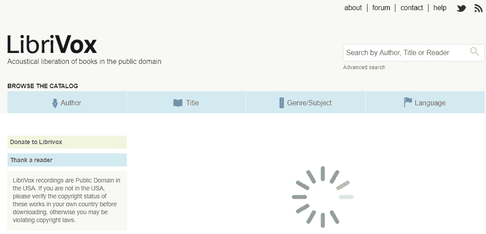
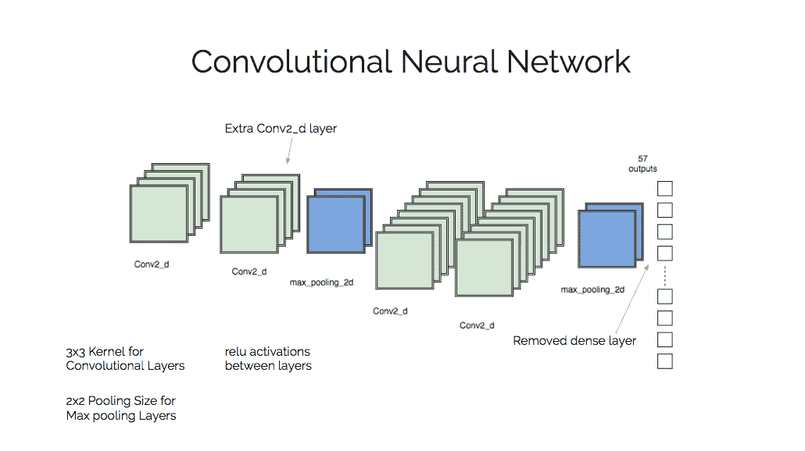
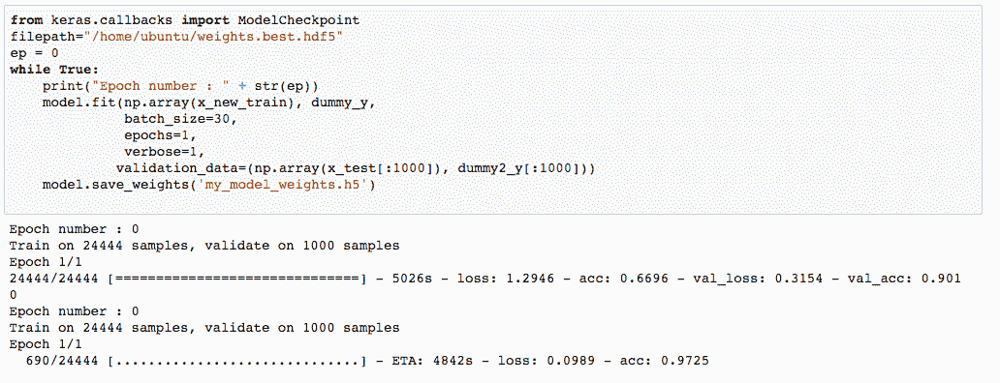

# 基于迁移学习的自动说话人识别

> 原文：<https://towardsdatascience.com/automatic-speaker-recognition-using-transfer-learning-6fab63e34e74?source=collection_archive---------2----------------------->

由 Christopher Gill、Hamza Ghani、Yousef Abdelrazzaq、Minkoo Park 设计的项目

> 当面临创建一个动态的**声音识别器**的挑战时，我们团队自然会选择一个**图像分类器**

即使今天语音交互设备(想想 Siri 和 Alexa)的技术突破频繁，也很少有公司尝试过支持多用户配置文件。Google Home 在这一领域最为雄心勃勃，允许多达六个用户配置文件。这项技术最近的蓬勃发展使得这个项目的潜力让我们的团队非常兴奋。我们还想从事一个在深度学习研究中仍然是热门话题的项目，创建有趣的工具，了解更多关于神经网络架构的知识，并在可能的情况下做出原创贡献。

我们试图创建一个系统，能够快速添加用户资料，并准确地识别他们的声音，只有很少的训练数据，最多几个句子！这种从一个样本到仅有几个样本的学习被称为 [*一次学习*](https://en.wikipedia.org/wiki/One-shot_learning) 。本文将详细概述我们项目的各个阶段。

# 一.项目概述

**目标:**用最少的训练对说话者进行分类，这样只需要几个单词或句子就可以达到很高的准确率。

**数据:**训练数据是从开放域有声读物的来源 Librivox 上刮下来的。测试数据要么是从 YouTube 上刮下来的，要么是现场收集的。

**方法:**总之，我们将所有的音频数据转换为声谱图形式。然后，我们在许多说话人身上训练了一个来自 Cifar-10 的 CNN 作为特征提取器，输入到 SVM 中进行最终分类。这种方法被称为**转移学习。这种方法使我们能够获得 SVM 的小样本高性能和 CNN 的特征学习。**

**我们提出的系统有很多潜在的应用。它们的范围从家庭助理需求(想想 Alexa 和 Google Home)到生物安全、营销工具，甚至是间谍活动(识别高调目标)。它也可以用作语音数据收集中[说话人日记化](https://en.wikipedia.org/wiki/Speaker_diarisation)的工具。给定先前对所包含的语音的一些小的暴露，具有多个扬声器的音频文件可以被准确地分离。这为更多潜在的“干净数据”打开了大门，这些数据可用于创建更复杂的特定于语音的模型。**

****业绩:**结果基本上是积极的。通过 20-35 秒的训练音频，我们的模型能够在我们的测试中以 63-95%的准确率区分三个扬声器。然而，在 5 个以上的发言者或统一的性别测试组中，表现会严重下降。**

****Github 链接:**【https://github.com/hamzag95/voice-classification】T4**

# ****二。数据收集****

## ****背景****

**说话人和语音识别领域的最大挑战之一是缺乏开源数据。大多数语音数据要么是专有的、难以访问的、未被充分标记的、每个说话者的数量不足的，要么是嘈杂的。在许多相关研究论文中，数据不足被引用作为不追求更进一步、更复杂的模型和应用的理由。**

**我们看到这是一个为这一领域的研究做出新贡献的机会。几个小时的谷歌搜索后，我们的团队得出结论，我们项目的最佳潜在音频来源是 [LibriVox](https://librivox.org/search?primary_key=0&search_category=author&search_page=1&search_form=get_results) ，一个开放领域有声读物的广泛来源，以及 [YouTube](https://www.youtube.com/) 。这些来源是根据最符合我们的标准(如下所示)而选择的。**

## **音频源标准**

*   **一个模型有足够多的独特说话者来学习语音中的普遍差异**
*   **男性和女性发言人，最好使用多种语言**
*   **每个扬声器至少有 1 小时的音频可用**
*   **音频可以自动标记元数据**
*   **音频噪音极小(几乎没有背景噪音/音乐，质量不错，几乎没有外来声音)**
*   **用于合法使用和数据集使用的开放域或知识共享许可**

## *****从 Librivox 中抓取音频*****

**我们使用 BeautifulSoup 和 Selenium 编写了脚本来解析网站 LibriVox 并下载我们想要的有声书。BeautifulSoup 本身是不够的，因为部分网站需要时间(1-2 秒)来加载。因此，我们使用 selenium 来等待，直到网页上的某些元素出现并变得可废弃。**

****

**我们的第一次尝试使用了一个脚本，该脚本从 LibriVox 的默认主页开始移动，并下载页面中特定文件大小范围内的所有音频。我们后来意识到这是有缺陷的，因为许多有声读物实际上是多个叙述者的合作，很难自动分离。因此，我们必须找到一种方法来获得带有独特扬声器的有声读物。不幸的是，LibriVox API 没有包含一个根据项目类型(单独或协作)或讲述人姓名进行过滤的字段。**

**相反，我们使用高级搜索，只包括“独唱”叙述者书籍。很快我们意识到假设每本书都有一个独特的演讲者是有问题的，因为 LibriVox 有许多重复的叙述者。为了解决这个问题，我们必须阅读每本书的元数据，以维护一个勉强的叙述者列表，以确保我们的数据被正确标记。最终，我们拥有 6000 多个独特的扬声器和 24000 多个小时的音频链接。然而，由于时间限制，我们对 162 个不同的说话人进行了采样，以进行声谱图转换。下载链接的完整列表可以在我们的项目 GitHub [这里](https://github.com/hamzag95/voice-classification/blob/master/data_collection/download_links.txt)找到。**

## *****从 Youtube 上抓取音频*****

**从 Youtube 上，我们搜集了 7 个 Youtube 明星的视频链接和他们的教程/信息视频。我们发现教程往往最符合我们的标准，因为它们大多包含干净的语言。Selenium 需要自动化这个过程，因为抓取 YouTube 需要滚动。这个过程可以在下面的视频中实时看到。**

**Scraping videos on Youtube using Selenium**

**我们没有收集更多的个人资料，因为根据视频中包括的嘉宾、音乐等来手动过滤和验证视频的效率很低。尽管就语言清洁度而言，教程频道通常符合要求，但它们在性别上严重偏向男性。视频也会有不同质量的音频和背景噪音。我们决定不使用我们收集的数据来训练神经网络，但认为它们对测试是有用的。YouTube 仍然是一个音频来源，具有很大的数据收集潜力，但在日期验证和清理方面要求非常高。**

# **三。数据处理**

## **背景**

**最终，所有收集的音频都必须转换为 503x800(x3)的声谱图图像，这些图像可以捕捉 5 秒钟的音频。由于下载格式不同，转换从 Librivox 和 YouTube 收集的数据的步骤略有不同。**

**对于我们的各种处理需求，我们非常幸运地拥有诸如 [ffmpeg](https://www.ffmpeg.org/) 、 [sox](https://github.com/chirlu/sox) 和 [mp3splt](http://mp3splt.sourceforge.net/mp3splt_page/home.php) 等工具，它们加快了处理速度，同时最大限度地降低了音频质量损失。**

****YoutTube 音频处理****

**一旦收集了 YouTube 视频链接，我们很幸运地找到了 [YouTube-DL](https://github.com/rg3/youtube-dl) 库，它允许我们轻松地下载我们想要的 WAV 格式的视频。当试图将这些数据转换成频谱图时，我们发现每个文件都产生了两个频谱图，因为它是立体声音频。这是我们遇到的与 LibriVox 音频处理的主要区别。**

****

**因此，该过程可以总结为以下几点:**

1.  **手动检查抓取的 YouTube 链接以验证可用性**
2.  **以 WAV 格式下载所有经过验证的链接，并自动标记/分类音频**
3.  **将单声道 WAV 文件分割成 5 秒钟的片段**
4.  **将所有立体声 WAV 文件转换为单声道 WAV**
5.  **将所有音频片段转换为频谱图**

****

**YouTube data processing phases.**

**YouTube 音频处理的视频可以在下面看到:**

****LibriVox 音频处理****

**我们使用单个[脚本](https://github.com/hamzag95/voice-classification/blob/master/data_collection/AudioBook_DataProcessing.ipynb)处理 LibriVox 音频，该脚本将不同处理级别的数据放入不同的目录中，以便潜在的未来用户可以按照他们的意愿更改片段长度或转换类型。**

**这一过程可以概括为以下几点:**

1.  **为单个扬声器组合所有下载的章节**
2.  **将组合音频修剪到所需长度**
3.  **使用 ffmpeg 将微调音频转换为 16 位 16khz 单声道 WAV**
4.  **移除超过 0.5 秒的静默**
5.  **将 WAV 文件分割成 5 秒钟的片段**
6.  **将每个片段转换成声谱图**

****

**LibriVox data processing stages**

# **四。学问**

## **我们的模型**

**我们通过修改现有的 [Cifar-10 架构](https://github.com/hamzag95/keras/blob/master/examples/cifar10_cnn.py)来创建 CNN，并在来自 57 个不同扬声器的频谱图上对其进行训练。使用这个经过训练的神经网络，我们通过移除最后一个完全连接的层来提取特征，并将展平层的输出输入到 SVM 中，这一过程称为迁移学习。没有公开可用的预先训练好的声音分类模型，所以我们创建并训练自己的神经网络。**

****

## **CNN 架构**

**我们架构中的绿色层是卷积层，而蓝色层是最大池化层。对于所有卷积层，我们使用 3×3 内核。对于最大池，我们使用 2x2 的池大小。我们在每层之间使用 relu 激活函数，在最后一层使用 softmax 激活函数。我们的损失函数是分类交叉熵。**

****

**Modified Cifar-10 Architecture**

## **CNN 培训**

**当对 6 个不同的人进行训练时，神经网络的准确率为 97%。这 6 个人中的每一个都有大约一个小时的 CNN 训练音频。在我们对 162 个不同说话人的更大数据集进行数据采集和处理之后，由于 AWS 上训练和存储空间的时间限制，我们在 57 个不同说话人上训练了我们的神经网络。我们用 45 分钟的音频(大约 2700 秒)训练了 57 个扬声器中的每一个。一个时代后，我们的 CNN 是 97%准确。CNN 花了大约一个半小时来训练大约 24000 幅声谱图。**

****

## **SVM 与迁移学习**

**我们现在已经有了一个不错的神经网络来识别 57 个不同的人。我们切断了最后一层，这是一个密集层分类 57 人，并使用展平层馈入一个 SVM。支持向量机应该在数据量较小(与神经网络相比)和维数较高的情况下表现良好。使用我们的 CNN 作为特征提取器，我们有大约 400，000 个维度的数据。我们使用径向基函数作为 SVM 的核。**

**使用 35 秒的音频在 3 个不同的扬声器上进行训练，并在 35 秒上进行测试，结果准确率为 95%。输入 SVM，我们看到，通过对 3 个不同说话者中的每一个进行 15 秒的训练，并对每个说话者进行 15 秒的测试，我们的 SVM 得到了 83%的准确率。我们看到，我们现在能够在 15-20 秒内学会某人的声音，而不是 45 分钟的音频。**

## **更多示例和结果**

**我们所有的例子都将试图区分三种新的声音。**

**当我们第一次测试 SVM 时，我们在三个 YouTubers 上测试了它，每个训练集和测试集有 7 个样本。我们有 95%的准确率。**

**这些指数对应于特定的人。本例中的阵列是这样设置的:**

**[ [克里斯腾·多米尼克](https://www.youtube.com/user/christendominique)，[图沙尔，](https://www.youtube.com/user/tusharroy2525) [斯里拉杰·拉瓦尔](https://www.youtube.com/channel/UCWN3xxRkmTPmbKwht9FuE5A) ]**

**输出 0 是 Christen(女性)，1 是 Tushar(男性)，2 是 Sriraj(男性)。**

****

**我们在这里看到，该模型从未错误分类 Christen，但对于一个样本，将 Sriraj 分类为 Tushar。对于未来的测试，我们试图将用于训练的样本数量减少到大约 5 个。人名在数组中出现的次数就是测试集的样本数。**

**为了测试我们的程序，我们制作了一个界面，在这个界面上，我们记录发言者，并创建一个测试和训练集。我们使用这个程序来运行现场演示，并在真人身上进行测试，而不仅仅是收集数据。**

**此外，我们的分类器是语言不可知的；它可以独立于语言识别你的声音。一个名字在数组中出现的顺序是分类器在这个人说话时预测的索引。看到的第一个数组是预测，第二个数组是真实的说话者。**

**下面是我们的模型的一些现场测试的结果。**

**在我们班做现场演示的时候，学习三个人的声音，两男一女，达到了 63%的准确率。这是基于 5 个用于训练的样本和 3 个用于测试的样本。下面是我们做的课堂演示的一个例子。(0 →卡拉马尼斯，1 →迪马基斯，2 →莫尼卡)**

****

**In class live demo with our professors and teaching assistant with some mixed language**

**另一个例子包括两个男性和一个女性声音，所有声音都在英语和各自不同的外语(西班牙语、阿拉伯语和乌尔都语)之间切换。我们的模型有 90%的准确性。**

****

**Demo among friends mixing english and their native languages**

**这是另一个准确率为 86%的例子。**

****

**Demo among friends in purely english**

**结果普遍是积极的！对不同性别的 3 人小组进行测试，通常会产生 60-90%的准确率。然而，我们的模型确实有局限性。当在完全相同性别的群体中进行测试时，或者随着群体规模的增加，表现会下降。对同性群体的测试通常会产生 40-60%的准确率。当群体规模超过 6 时，准确性接近随机猜测。**

# ****五、结论****

## **摘要**

**我们想创建一个模型，仅用几个句子的训练数据来识别说话者。我们选择通过使用现有的图像分类架构来实现这一点，使用频谱图来表示音频。这包括一个重要的数据收集组件，使我们创建了一个包含 162 个扬声器的数据集，包括分段音频文件和分段频谱图。我们选择使用 take transfer learning 方法，训练 Cifar-10 CNN 的衍生物，并提取特征以馈送给 SVM 来分类新的说话者。我们将我们的训练数据限制在每人 20-35 秒(4-7 个样本)。这种方法为不同性别的三人组带来了惊人的准确率(60-90%)。性别一致的小组的结果不那么令人印象深刻，但始终比随机猜测好得多。**

## ****投稿****

**按照我们在开始这个项目时设定的目标，我们的团队成功地对这个研究领域做出了原创性的贡献。在一个缺乏开源数据是研究项目常见障碍的领域，我们设法为独特的演讲者创建了一个非常大的音频下载链接集。同样，这个链接列表可以在[这里](https://github.com/hamzag95/voice-classification/blob/master/data_collection/download_links.txt)找到。此外，我们对音频数据使用图像识别结合 SVM 的迁移学习的方法还没有被深入研究。我们希望我们的架构和方法对未来的研究有用。**

**注:链接到完整的数据集，包括音频和频谱图即将推出…**

## ****未来的变化/改进****

**这个项目的许多障碍包括时间和计算机资源，如存储和计算能力。以下是我们的团队或其他希望改进我们工作的人未来可能采取的步骤**

**首先是访问更多的存储空间，这样我们就可以用每人 4 小时的音频来训练我们的神经网络，并使用我们收集的所有 162 个扬声器。我们相信这将会成为一个更好的特征提取器，用于 SVM。**

**其次，在将特征输入 SVM 之前，进行一些特征选择。尽管具有非线性核的支持向量机能够抵抗过拟合，但是用如此少的样本获得如此多的特征可能会导致过拟合，这可以解释准确度分数的高变化。如果有更多的时间，我们会对神经网络的架构进行更多的实验，特别是在分类层之前添加另一个密集层。这将把 SVM 的输入从大约 400，000 个要素减少到我们在新的密集图层中设置的任意结点数。另一个可以探索的架构是基于 VGG19 的模型。**

**第三，争取更多的发言人。我们能够从 LibriVox 中抓取 6000 多个独特的扬声器，尽管这需要时间来下载和预处理数据，以及惊人的存储量。我们将尝试刮约 500-1000，使用约 30-45 分钟。来看看这是如何改进我们的特征提取器的。这需要很多时间来训练。供参考:57 位发言人，45 分钟。花了一个半小时来训练。**