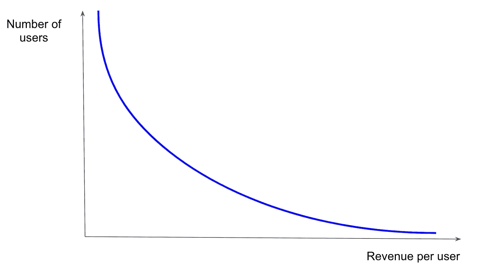

# 用户会成为顶级客户吗？

> 原文：<https://towardsdatascience.com/automating-interpretable-feature-engineering-for-predicting-clv-87ece7da9b36?source=collection_archive---------18----------------------->

## 自动化可解释的特征工程

Source: Pixabay

# 介绍

这篇文章将展示自动化可解释特征工程和深度特征综合的有效性，并将其应用于预测客户终身价值。

首先，我将写客户终身价值预测的商业价值，并将其扩展到用户的分类，分为顶级客户和非顶级客户，并对每种客户进行定义。随后是机器学习方法，并显示管道在这个特定问题上表现如何的结果。

如果你还没有，请在继续之前阅读这篇由威廉·科尔森撰写的[帖子](/why-automated-feature-engineering-will-change-the-way-you-do-machine-learning-5c15bf188b96)，它提供了对 DFS 的解释。如果你只对问题和结果感兴趣，那么你可以简单地跳过方法论部分。项目中使用的所有代码都可以在 [Github](https://github.com/josolnik/msc-thesis-bux) 上找到。

# 问题定义

清楚地了解一家企业的经营状况至关重要，可以通过多种方式进行衡量。

在 SaaS 企业中，用于衡量这一点的一个基本指标是 CLV(客户终身价值)和 CAC(客户获取成本)，当这两个指标结合起来时，对于确定企业的盈利能力是一个有用的启发。

CLV 衡量的是一个特定的客户在他们的整个生命周期中能为企业创造多少收入，而 CAC 衡量的是企业为获得这个客户所花费的成本。CAC 更容易衡量，因为它在漏斗开始时(T4 收购阶段)在大多数企业中变得可以量化。CLV 只有在一定时间后才变得清晰(在收入阶段)。例如，一年的使用量可以代表客户一生中会花费多少。

一般的经验法则是 CAC 不应该超过 CLV 的 1/3，但是在这个问题上几乎没有共识。这是一个商业决策，如果关注的是盈利能力，那么通过更多地依赖有机增长(降低 CAC)来最小化阈值是一个优先事项(1/4 或更低)。另一方面，如果重点是高增长，那么一个公司可能倾向于 1/1 甚至更高。

SaaS 企业的用户群产生的收入通常遵循幂律分布:一小部分用户(定义为顶级客户)产生大部分收入。([帕累托原理](https://betterexplained.com/articles/understanding-the-pareto-principle-the-8020-rule/))。

Power-law distribution of generated revenue per user

那么，我们如何预测客户的终身价值呢？或者更进一步，我们如何预测哪个用户将成为顶级客户？

# 方法学

这是我在 BUX 实习期间完成的硕士论文中研究的问题，该公司是一家总部位于阿姆斯特丹的金融科技公司，它开发了一款移动应用，可以实现简单实惠的交易。他们面临着许多其他 SaaS 企业面临的类似问题——根据使用其产品的客户/用户的行为数据预测客户终身价值。

如上所述，该管道已用于 BUX 的用户。使用该产品有两个阶段。第一阶段是用户处于 funBUX 阶段，为了学习如何交易而交易虚拟货币。当用户转换到 seriousBUX 阶段，他就变成了客户，开始用真金白银交易。由于该业务通过严肃的 BUX 交易的佣金和融资费产生收入，这种转换也成为用户成为顶级客户的条件。这是用户和客户的区别——只有客户产生收入，当用户开始使用产品时，不知道他们是否会最终转化为客户。当解释由深度特征合成构建的特征时，这在结果部分将是有用的。

论文背后的主要思想是建立一个通用的机器学习管道，使可解释的特征工程自动化。让我们把它分解成两个部分:

*   可推广的机器学习管道:管道可以在具有相同数据结构的其他问题上重用(下面将详细介绍，描述为实体集)。
*   可解释特征工程的自动化:大量特征是基于底层数据表和这些表之间的关系自动构建的。使用两种算法来解释模型水平和个体水平上的预测，而不是使用黑盒算法来提供更少的可解释预测。

当建立了所有的特征时，选择最相关的特征以避免过度拟合(以最小化[样本外误差](https://en.wikipedia.org/wiki/Generalization_error))。当业务中出现不同的问题时(如预测客户流失、预测转化率等)，可以通过改变目标值来选择不同的特性。在这种情况下，这是可推广管道的主要价值主张。

如今，数据科学家经常面临的问题是无法回答所有的业务问题。这样，投入的精力和时间就可以回答“我们可以用我们的数据预测吗？”因为在该过程中投入的人力较少。它远没有取代数据科学家，而是让他们的工作更有成效。当底层数据显然可以回答一个业务问题时，可以投入额外的时间，凭直觉手动构建功能，而这种直觉是 DFS 构建的现有功能中所没有的。该算法的作者在他们的[论文](http://www.jmaxkanter.com/static/papers/DSAA_DSM_2015.pdf)中对此进行了更深入的研究。

> 对企业来说，回答 5 个 80%正确率的问题通常比回答 1 个 95%正确率的问题更有价值

当然，这取决于商业案例，但有时甚至[简单的启发式方法也可能奏效](https://developers.google.com/machine-learning/guides/rules-of-ml/#before_machine_learning)——见规则 1)。在优化渠道上投入的额外时间与在其他问题上投入的精力和时间的机会成本相结合，往往会产生[收益递减](https://en.wikipedia.org/wiki/Diminishing_returns)。不过，这条规则也有例外。

为了自动构建功能，数据被分为三个实体(DFS 的必要输入):群组、用户和交易。

Entity set (input into Deep Feature Synthesis)

这些实体定义了问题空间，它可以被描述为人类行为的预测。这显然是一个模糊的定义，它只能解决行为预测问题的子集。为了使系统具有通用性，数据需要以这种方式构建，否则，需要构建不同的实体结构(正如在 DFS 的文档中看到的那样，这并不难改变)。

使用的主要底层算法是深度特征合成(DFS)和局部可解释模型不可知解释(LIME)。DFS 侧重于自动化特征工程和生成可解释的特征，而 LIME 侧重于为单个预测创建可解释的解释。

对于 DFS 来说，上面提到的两个来源肯定为其背后提供了充分的直觉。对于石灰，有一个帖子提供了解释，你也可以找到[的原始论文](https://arxiv.org/abs/1602.04938)。LIME 是模型不可知的，它提供了一个局部的近似值，而不是试图理解整个模型，它只提供了对单个实例的预测的解释。

Explaining individual predictions to a human decision-maker ([source](https://www.oreilly.com/learning/introduction-to-local-interpretable-model-agnostic-explanations-lime))

随机森林算法被用作预测器，因为与更复杂的基于树的算法(如梯度提升树和 XGBoost)相比，其性能差异很小。

该系统有两部分——通用部分和定制部分。可概括部分可用于上述实体集结构的任何问题，而定制部分使系统能够用于更改数据源、目标值、添加手动功能等。这两个部分都表示为效用函数，即构建整个端到端管道的构件。在整个实现过程中还有很多细节，所以这篇论文可以在[这里](https://github.com/josolnik/msc-thesis-bux/blob/master/automating_interpretable_feature_engineering.pdf)看到更多的细节。

DFS 构建的功能是从 3 周的行为数据中提取的，以预测 6 个月使用后的客户价值，该价值用作实际客户终身价值的代理。

选择 6 个月的时间跨度而不是更长的时间跨度，因为这样可以将更多最近的客户包括在学习过程中(因为每个客户都需要至少 6 个月的数据，而不是更多)。6 个月的客户价值和 1 年的客户价值之间的皮尔逊相关系数是 0.95，这表明 6 个月的时间提供了足够的信息来使用它作为 CLV 的代理。

# 结果

## 性能赋值

该管道在顶级客户分类中进行了测试，这些客户根据产生的收入位于第 99 个百分点。正如分类问题经常出现的情况那样，这意味着高度的类别不平衡。准确性不是评估渠道的有用指标(将所有客户分类为非顶级客户的无用模型提供了 99%的准确性)。

这就是为什么要使用 precision(正确分类的顶级客户在所有顶级客户中所占的比例)、recall(正确分类的顶级客户在顶级客户总数中所占的比例)和 F1 得分(两者之间的调和平均值)。

基于所建立的特征，产生用户成为顶层客户的概率。默认的[决策边界](https://en.wikipedia.org/wiki/Decision_boundary)为 0.5。这意味着，如果一个用户成为顶层客户的概率是 0.6，就会被归类为顶层客户。如果是 0.4，就归类为非顶级客户。

使用 5 重交叉验证评估管道，同时考虑数据中不同折叠的性能差异。

这些指标是:

> AUC 分数:0.83
> 
> F1 分数:0.56 +- 0.03
> 
> 精度:0.73 +- 0.05
> 
> 召回率:0.48 +- 0.05

不同性能指标的微小差异表明，管道在不同的折叠上表现同样出色。

Confusion matrix before thresholding (threshold = 0.5)

业务问题的本质更重视识别尽可能多的顶层客户，因此最小化假阴性率(将顶层客户识别为非顶层客户)比假阳性率(将非顶层客户识别为顶层客户)更重要。

为了做到这一点，我们最大化回忆。通过使用阈值函数，阈值变为 0.2。这产生了 0.65 的召回率和 0.5 的精确度。这直观地意味着，我们能够正确识别 65%的顶级客户，同时在对一个客户进行分类时有 50%的把握是正确的。

考虑到行为数据并不是特别细粒度的(产品中交互的每日摘要),而且绝大多数特性都是自动构建的，这无疑是一个很好的性能。除此之外，由于特征的最大深度是 2(因为有 3 个实体), DFS 的全部能力没有被探索，而有许多更复杂的实体集的[例子](https://github.com/Featuretools)可以探索更广泛的特征空间。

Confusion matrix after thresholding (threshold = 0.2)

## 解释

说到管道的可解释性，有两个部分:

*   功能解释(使用 DFS 构建)
*   个别预测的解释(用石灰建造)

用管道构建 292 个特征，选择其中 20 个最相关的特征，并基于这些特征进行最终预测(可以作为管道参数改变的任意数目)。

DFS 支持用自然语言解释所有功能，如以下 5 个最相关的功能示例所示:

5 most relevant features for predicting whether a user will become a top-tier customer

正如我们所看到的，这些特性可以用自然语言来解释，并融入了直觉，否则将由数据科学家手动构建，通常需要领域专家的帮助。这个列表中唯一手动构建的功能是*Conversion _ Completed _ hours _ till _ event*，因为这是一个明显的低挂水果，没有被 DFS 捕获。

某一事件的时间是一组人工构建的特征。还有来自群组实体的其他手动构建的特征，描述用户开始使用产品的环境——主要是不同产品类型(如货币、指数或股票)的市场波动性。在用户实体上，人工特征描述了用户的交易部分，例如加密交易者或外汇交易者(由各种产品类型的交易决定)。虽然这些功能最初被期望提供一些有价值的信息增益，但是聚集的 DFS 功能提供了最大的价值。

使用黑盒算法(如性能通常更好的神经网络)还不可能对这些特征做出如此清晰的解释。石灰和 SHAP 是一些旨在改变这种状况的方法。使用像 DFS 这样的技术的理由是，执行速度、可解释性和较低的计算复杂性超过了额外性能的重要性。

除了对特征的解释，管道的输出还提供了对单个预测的概率的解释。例如，下面我们可以看到一个用户成为顶级客户的概率为 0.74。它还包括单个特征的贡献，如交易价值的分散程度、最大交易金额和总投资额。

Interpretation of an individual prediction (using LIME)

**结论**

考虑到绝大多数特性都是使用 DFS 构建的，这表明有可能快速回答这样的问题:“我们能使用我们的数据预测这一点吗？”。如果问题是肯定的，那么可以应用管道来解决问题。

如前所述，目标值是应用于根据业务用例产生分类的管道。虽然它被应用于对顶级客户进行分类，但它也可以用于行为数据的任何维度(例如，哪个用户将流失，哪个用户将购买特定产品，等等)。)这个用例特别有趣，因为用户群中的幂律分布式收入生成的业务动态(这导致数据集中目标值的高等级不平衡)。

当定期预测新的传入用户时，可以通过将管道脚本作为作业进行调度，并将预测加载到数据库中进行可视化来实现。

值得一提的是，构建整个管道花了 6 周时间，如果没有 DFS 和 LIME 的库，这绝对是不可能的，这两个库都提供了很好的例子。所以我要感谢作者们为开源社区创造的所有价值。