# 面向初学者的 AWS EC2

> 原文：<https://towardsdatascience.com/aws-ec2-for-beginners-56df2e820d7f?source=collection_archive---------6----------------------->

## 了解为什么应该使用 Amazon Web Services Elastic Compute Cloud(EC2 ),以及如何在 Windows 虚拟机(Windows Server)上设置基本的数据科学环境。

有时候，人们会受到台式机或笔记本电脑性能的限制。假设一位数据科学家有一个大型数据集，他们想对其进行一些分析。科学家继续尝试将整个数据集加载到内存中，出现了如下所示的错误。

Unable to load a CSV file into Memory (R Code)

由于可用内存耗尽，导致了该错误。操作系统无法再分配 500Mb 内存。虽然对于这种类型的问题有许多不同的解决方案，但是一种可能的解决方案是升级计算机的 RAM。除了必须在更多的 RAM 上投资之外，一些计算机可以升级的范围也有限制。本教程中探讨的潜在解决方案是在云中使用一个具有更多 RAM 和 CPU 的虚拟机(AWS)。

AWS EC2 上的虚拟机，也称为实例，有许多优点。一些优势包括高度可伸缩性(人们可以选择具有更多 RAM、CPU 等的实例)，它们易于启动和停止(在免费层之外，客户为他们使用的东西付费)，并且它们允许选择不同的平台(操作系统)。需要强调的重要一点是，虽然本教程涵盖了如何启动基于 Windows 的虚拟机，但有许多不同类型的虚拟机用于许多不同的目的。

就这样，让我们开始吧。如果你迷路了，我推荐看一下附带的[视频](https://www.youtube.com/watch?v=mf5u2chPBjY)。

# 创建一个 AWS 帐户并登录 AWS。

1.在亚马逊网站上([这是链接](https://aws.amazon.com/)，点击“登录控制台”。如果您有帐户，请登录。如果你没有，你将需要做一个。

2.在 EC2 仪表板上，单击 EC2。

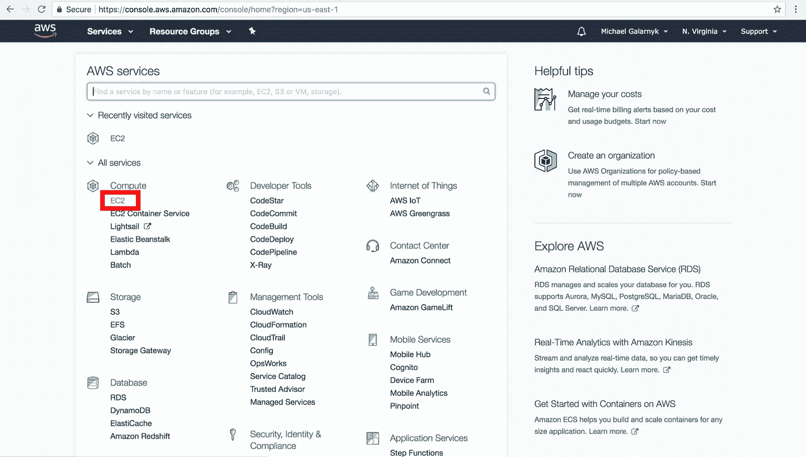

# 创建实例

3.在 Amazon EC2 控制台上，单击 Launch Instance。

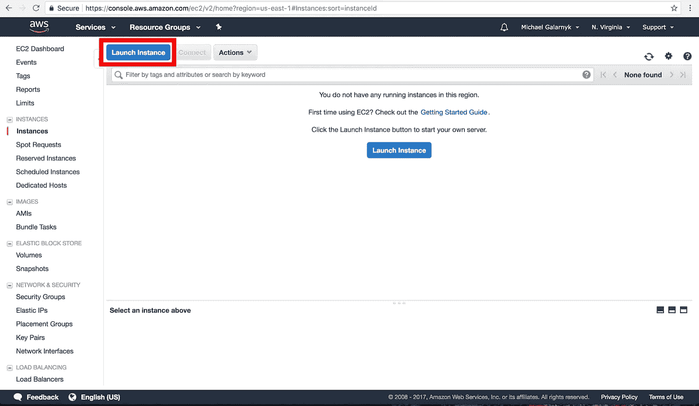

4.单击 Microsoft Windows Server 2016 Base 所在行中的“选择”按钮。请注意，这将创建一个基于 Windows 的实例，而不是典型的基于 Linux 的实例。这将影响您连接到实例的方式。如果你对启动 Linux 实例感兴趣，请看这篇[教程](https://medium.com/@GalarnykMichael/aws-ec2-part-1-creating-ec2-instance-9d7f8368f78a)。

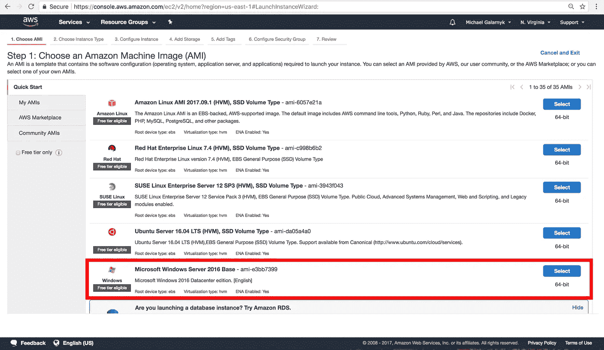

5.确保选择 t2 micro(自由实例类型)。

然后点击“查看并启动”

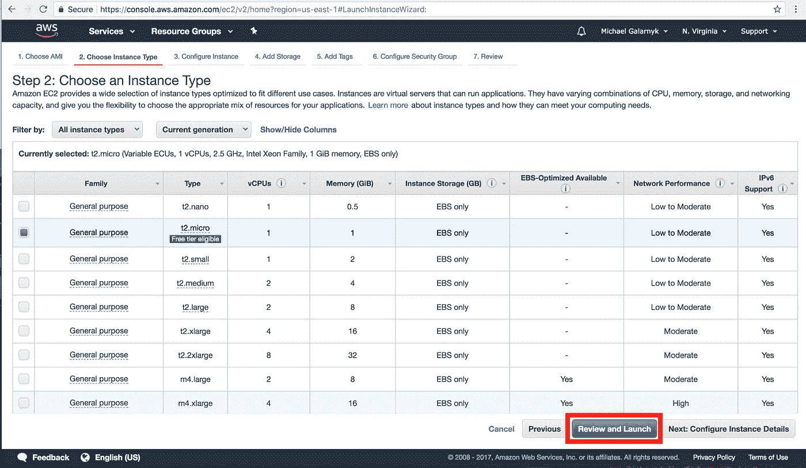

6.点击启动。

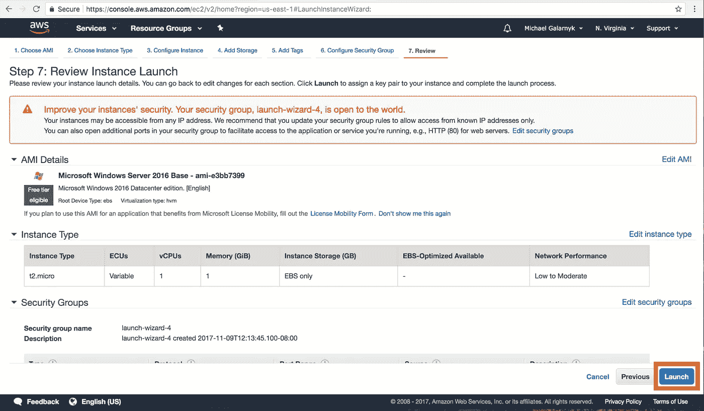

7.选择“创建新的密钥对”。在下面的框(“密钥对名称”)中，填写密钥对名称。我将我的关键数据命名为 DataCampTutorial，但是您可以随意命名。点击“下载密钥对”。这将下载密钥。把它放在安全的地方。

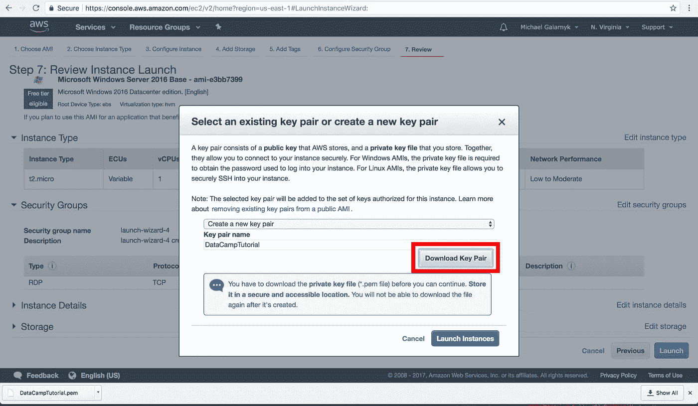

接下来，单击“启动实例”

8.实例现在已经启动。回到亚马逊 EC2 控制台。我建议您单击红色矩形中的内容，因为它会将您带回控制台。

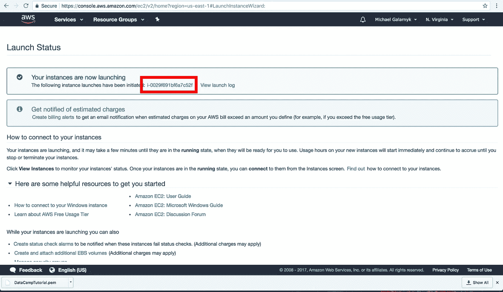

9.等到看到“实例状态”正在运行时，再继续下一步。这可能需要几分钟时间。

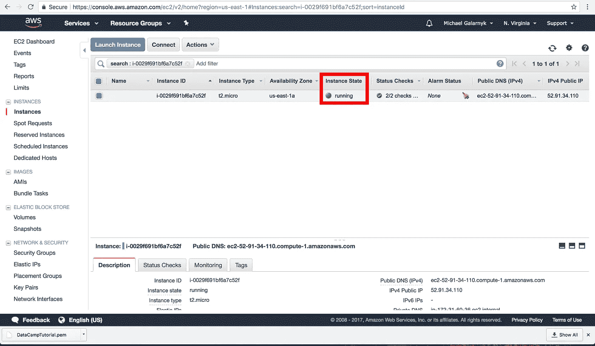

# 连接到您的实例

10.点击连接。如果您选择一个 linux 实例，您可以使用 SSH 连接到一个 Linux 实例。

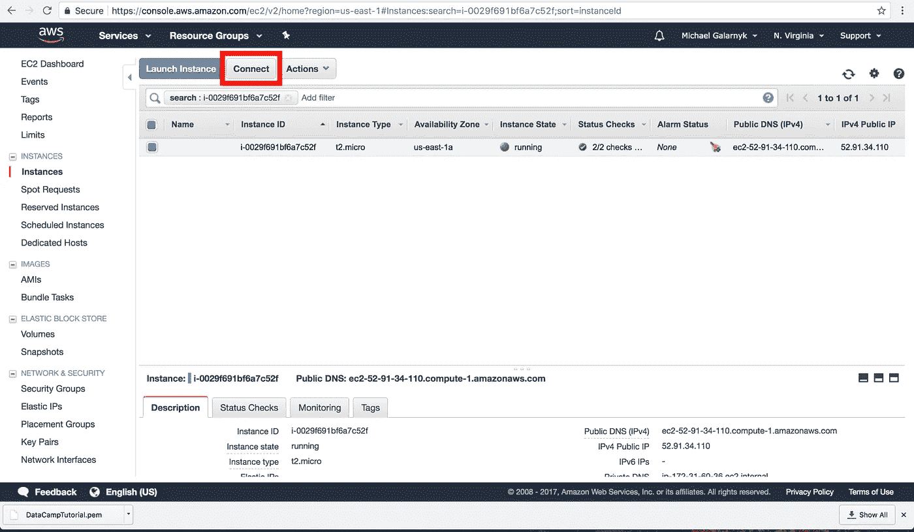

11.点击“下载远程桌面文件”。将远程桌面文件(rdp)保存在安全的地方。

12.点击“获取密码”。请记住，在启动实例后，您必须等待至少 4 分钟才能尝试检索您的密码。

13.选择从步骤 7 下载的 pem 文件，然后单击“解密密码”。

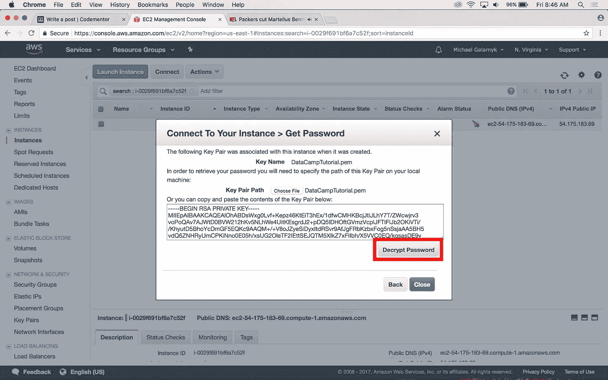

14.解密密码后，将其保存在安全的地方。您将需要它来登录您的实例。

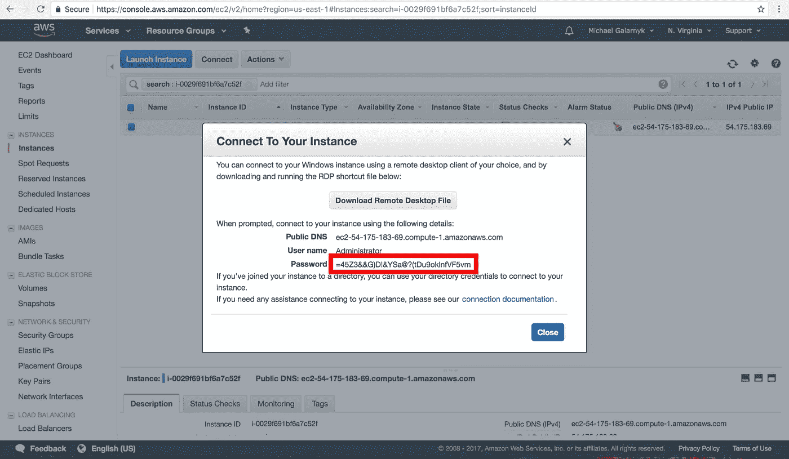

15.打开您的 rdp 文件。点击继续。如果您的本地电脑是 Mac，您需要从 App Store 下载“Microsoft Remote Desktop”才能打开您的 rdp 文件。

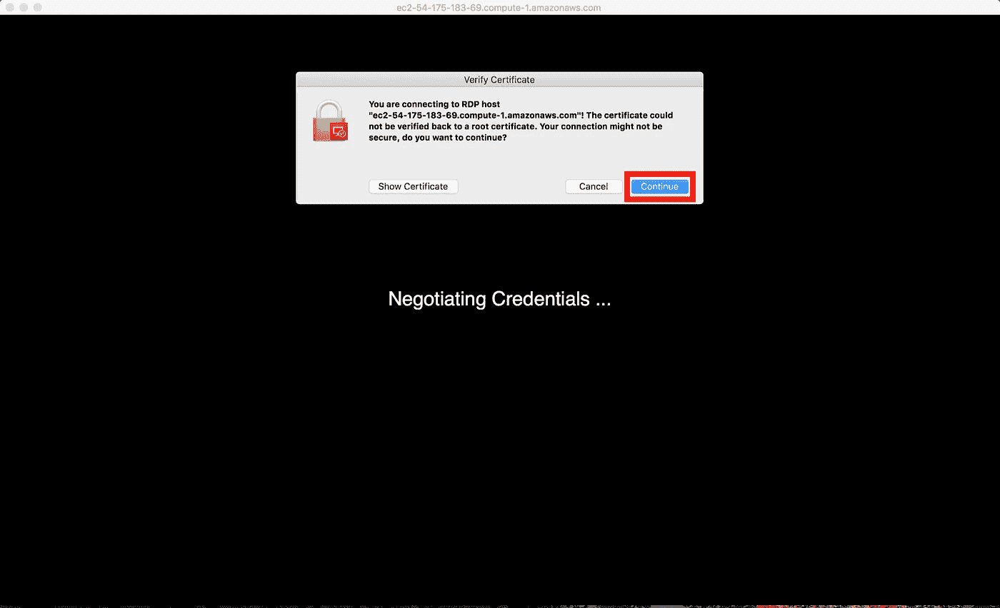

16.输入您在步骤 14 中获得的密码

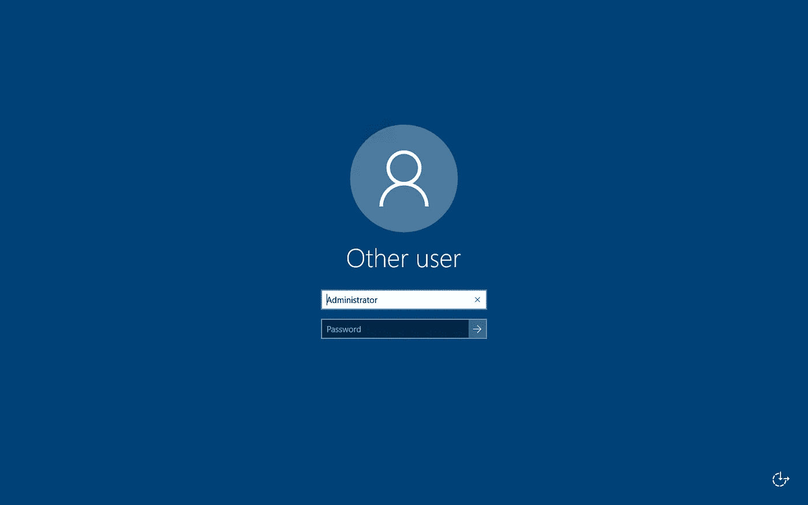

输入密码后，您应该会看到这样的屏幕

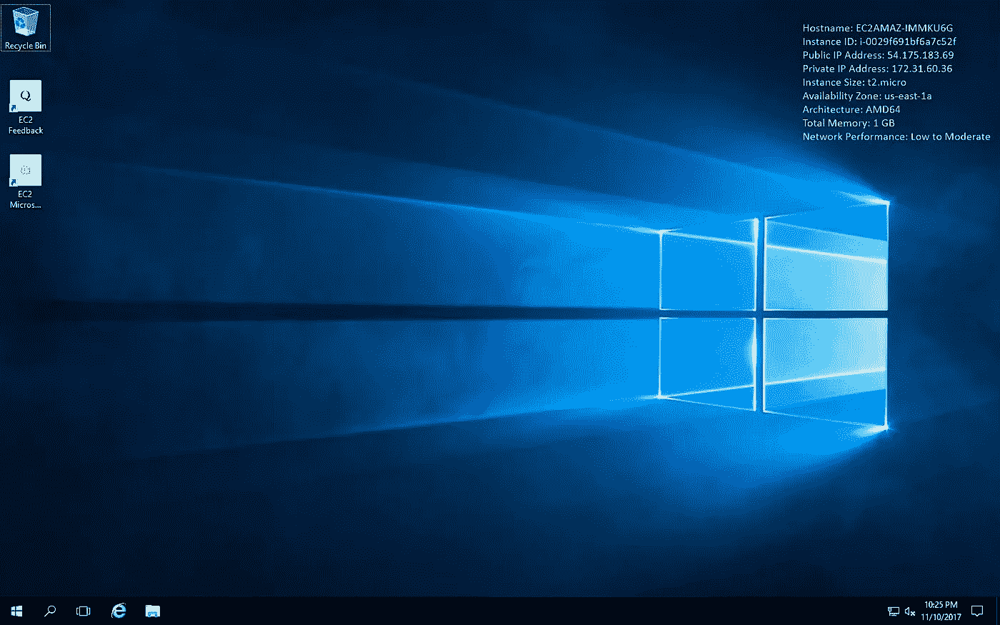

# 下载 Firefox

为了能够安装 R、 [Python](https://hackernoon.com/tagged/python) 和/或 Git，拥有一个浏览器真的很有帮助。该实例预装了启用了增强安全配置的 Internet Explorer，这可能很难使用。下载 FireFox 作为替代浏览器，以避免 Internet Explorer 增强的安全性。

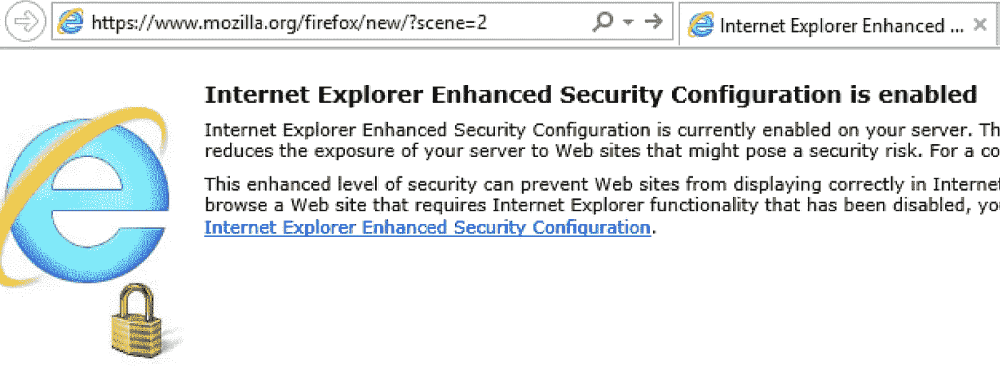

1.  当您看到下面的弹出窗口时，单击“添加”。

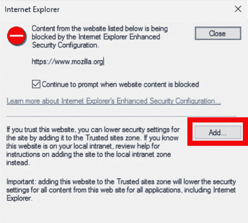

再次点击“添加”。

3.当你进入 FireFox 页面时，你可能需要点击几次 add(类似于步骤 1 和 2 ),直到 FireFox 下载开始。如果下载没有自动开始，那么点击“点击这里”。

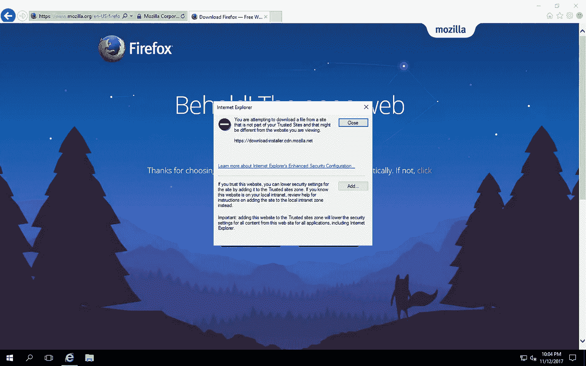

现在已经安装了 FireFox，请确保使用 FireFox 作为您的浏览器。这将比从 Internet Explorer 中持续处理安全问题要简单得多。

# 安装 R、Python 和 Git

现在已经安装了 FireFox，您可以像在普通的 windows 机器上一样安装 R 和 Python 了。如果您需要帮助安装，这里有一些链接到下面的指南。

*   [在 Windows 上安装 R 和 R studio](https://medium.com/@GalarnykMichael/install-r-and-rstudio-on-windows-5f503f708027)
*   [在 Windows 上安装 Python(Anaconda)](https://medium.com/@GalarnykMichael/install-python-on-windows-anaconda-c63c7c3d1444)
*   [在 Windows 上安装 Git](https://hackernoon.com/install-git-on-windows-9acf2a1944f0)

# 停止或终止实例(重要)

在使用完一个实例后，最好是**停止**或者**终止**该实例。为此，请转到 Amazon EC2 控制台，单击“Actions ”,然后单击“Instance State ”,您将可以选择停止或终止实例。

如果您计划再次使用该实例，请停止该实例。如果您不打算再次使用该实例，请终止该实例。

虽然本教程中的实例在“[自由层](https://aws.amazon.com/free/faqs/)”中，但我建议终止该实例，这样你就不会忘记它。

Please Terminate your Instance

# 结论

本教程提供了启动和连接 EC2 实例的快速指南，以及如何着手建立一个基本的数据科学环境。如果您想继续 EC2 学习，我建议您查看教程“[使用云中的 Jupyter 笔记本进行深度学习](https://www.datacamp.com/community/tutorials/deep-learning-jupyter-aws)”，其中介绍了如何为深度学习应用程序设置基于 linux 的 EC2 GPU 实例。如果您对本教程有任何问题或想法，请在下面的评论中或通过 [Twitter](https://twitter.com/GalarnykMichael) 联系我们。

*原载于*[*www.datacamp.com*](https://www.datacamp.com/community/tutorials/aws-ec2-beginner-tutorial)*。*