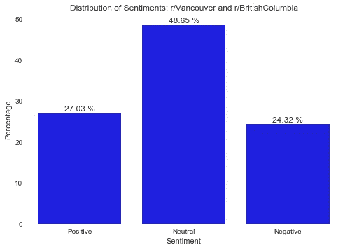
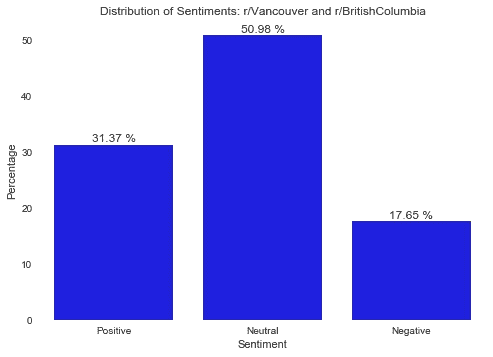
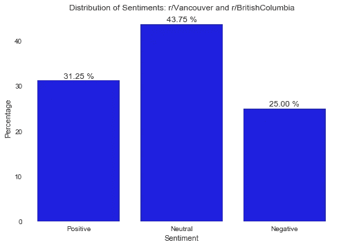
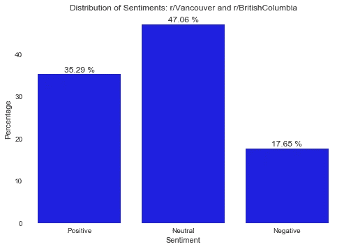
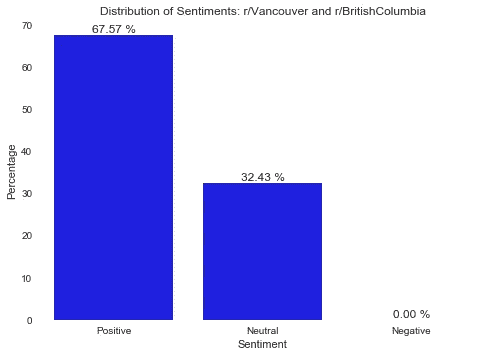

# 不列颠哥伦比亚政治:情绪分析预测霍根获胜

> 原文：<https://towardsdatascience.com/b-c-politics-sentiment-analysis-predicts-horgan-win-682fe8b0eb44?source=collection_archive---------7----------------------->

The candidates: The NDP’s John Horgan, the Liberal’s Christy Clark and the Green Party’s Andrew Weaver. Adapted from the Vancouver Courier. Photo by Dan Toulgoet.

对 Reddit 帖子的情绪分析表明，NDP 领导人约翰·霍根将在 5 月 9 日星期二赢得不列颠哥伦比亚省的选举。这项研究表明，虽然 Reddit 用户在 [r/Vancouver](https://www.reddit.com/r/vancouver/) 和 [r/BritishColumbia](https://www.reddit.com/r/britishcolumbia/) 子编辑中发布了更多关于简蕙芝和不列颠哥伦比亚自由党的信息，但他们对霍根和不列颠哥伦比亚新民主党的看法要积极得多。

**什么是情感分析？**

情感分析，也称为观点挖掘，旨在识别给定文本中说话者或作者的感觉和态度。该技术可以根据作者使用的单词来确定文本是积极的、消极的还是中性的。具有积极情绪的单词使文本倾向于积极得分；否定词，否定。因此，情感分析程序可以快速有效地扫描大量的评论、帖子或页面，并将它们分类为表达对某个主题的情感范围。

情感分析在未来几年将变得越来越重要，原因有二；首先，随着固定电话被废弃，越来越少的人接听民意调查者的电话，传统的民意调查方法正在迅速失去可信度和有效性。其次，Twitter、脸书、Instagram 和 Reddit 等网站上的互联网对话呈指数级增长，这意味着数以百万计的个人观点突然可以通过这些技术进行审查。

在最近的美国大选中，社交媒体分析比民调更能预测特朗普的胜利。

该领域还处于起步阶段，但很可能会迅速发展，并在不久的将来成为民意研究的标准组成部分，甚至可能取代民调本身，成为评估政治竞争的标准手段。

**Reddit 的观点**

对来自两个政治上最活跃的不列颠哥伦比亚相关子区 r/Vancouver 和 r/BritishColumbia 的最近 1000 个帖子的情绪分析表明，Horgan 将在本周二获胜。

Sentiment towards the B.C. Liberal Party. Net Positive Sentiment: 2.7%

Sentiment towards the B.C. NDP. Net Positive Sentiment: 13%

根据 Reddit 的说法，这些图表显示了各方的偏好。根据研究结果，对 NDP 的净正面情绪为 13%，对自由党的净正面情绪为 2.7%。

任何观察不列颠哥伦比亚政治的人都会证明，这听起来是对的。你会发现，在任何一个晚宴上，任何一方的支持者和反对者都势均力敌。说到领导者，差距就更大了:

Sentiment towards Christy Clark. Net Positive Sentiment: 6%

Sentiment towards John Horgan. Net Positive Sentiment: 17%

根据这项测试，霍根个人在净正面情绪竞赛中领先克里斯蒂，17%对 6%。这是政治专家们可以深入研究的事情:霍根明显领先，我们可以宣布他是未来的赢家。

但这当然有些为时过早。

**一些注意事项**

情绪分析能够识别与候选人相关的积极帖子，如“无论你怎么说简蕙芝，她仍然是一位出色的活动家，”以及“是的，不列颠哥伦比亚省 NDP 领导人约翰·霍根很生气——但这是一种好的方式。”负面帖子也很容易识别，比如“金钱和傲慢会让简蕙芝输掉不列颠哥伦比亚的选举吗？”“不列颠哥伦比亚省 NDP 领导人霍根在一些问题上不明确，在资金上不具体。”但是很少有帖子这么明确。很多帖子都是模棱两可的，导致大量帖子不得不贴上“中立”的标签。

进一步，一个问题出现了:我们能相信 Reddit 上用户的情绪吗？样本量很小，在 Reddit 上发帖的人不一定能代表整体人群。他们对候选人的感觉是否准确地代表了总体人口？Reddit 用户会投票吗？

此外，这项研究没有包括非英语语言的情感——鉴于某些语言的构成，这是一个相当重要的缺失。

更重要的是，情绪和投票意向之间的关系还不清楚。很有可能一个选民会同情一个政党，但仍然不投他们的票。那些对霍根有利的数据，显示他远远领先于克拉克？嗯，韦弗的不列颠哥伦比亚绿党也有一个净积极。这是百分之百。

Sentiment towards the B.C. Green Party. Net Positive Sentiment: 100%

Sentiment towards Andrew Weaver. Net Positive Sentiment: 37.5%

虽然很明显绿党不会彻底赢得选举，但他们似乎有 Reddit 的投票！这些都是非常好的消息。

**指路**

因此，关键问题是样本大小、样本构成以及情绪与投票意向的关系。随着可供分析的项目数量呈指数级增长，前两个问题在未来可能会变得不那么严重，情感与意图之间的关系将永远是一个黑箱。有可能通过小规模的投票来填补特定的空白，以确定每个个案中的确切关系。

目前，可以肯定的是，根据 Reddit 的报道，下周这个时候，这个省将会有一个新政府。

*要了解更多关于情绪分析和我使用的 Python 包，名为 VADER，请查看* [*我的 github*](https://github.com/serenamm/bc-election-analysis-may2017) *。*