# 婴儿步入舞台:可视化虹膜数据集

> 原文：<https://towardsdatascience.com/baby-steps-into-tableau-visualizing-iris-data-set-ed476e16f879?source=collection_archive---------8----------------------->

Source: Google Images

Tableau 有一句口号是“ ***，改变你对数据的看法。经过一番思考，我们很容易得出这样一个结论:这句口号非常中肯。Tableau 作为一种工具给了我们力量，向我们展示了数据的奥秘。更重要的是，Tableau 教会了我们如何利用数据的力量，揭开这些谜团。因此，在这篇进入 Tableau 的文章中，我将带你通过使用[虹膜数据集来了解 Tableau 的重要特性。](https://archive.ics.uci.edu/ml/datasets/iris)***

现在 Tableau 不仅仅是一个数据可视化软件，它还是一个商业智能应用程序(BI App)。有了 Tableau，商业智能变成了自助服务。

本质上，Tableau 是一个专注于商业智能的数据可视化软件。现在，对于你们中的一些人来说,“商业智能”这两个词可能会让人感到困惑，甚至会让一些人不知所措。但是，在数据可视化(即以可视化形式呈现数据)的帮助下，简单地支持或帮助组织做出决策的想法，无论是从运营到战略的任何事情，都是商业智能的核心。

Tableau 是用现代分析增强整个企业商业智能的领导者。根据 Gartner 的 2017 年魔力象限，Tableau 是商业智能和分析平台的明确领导者。

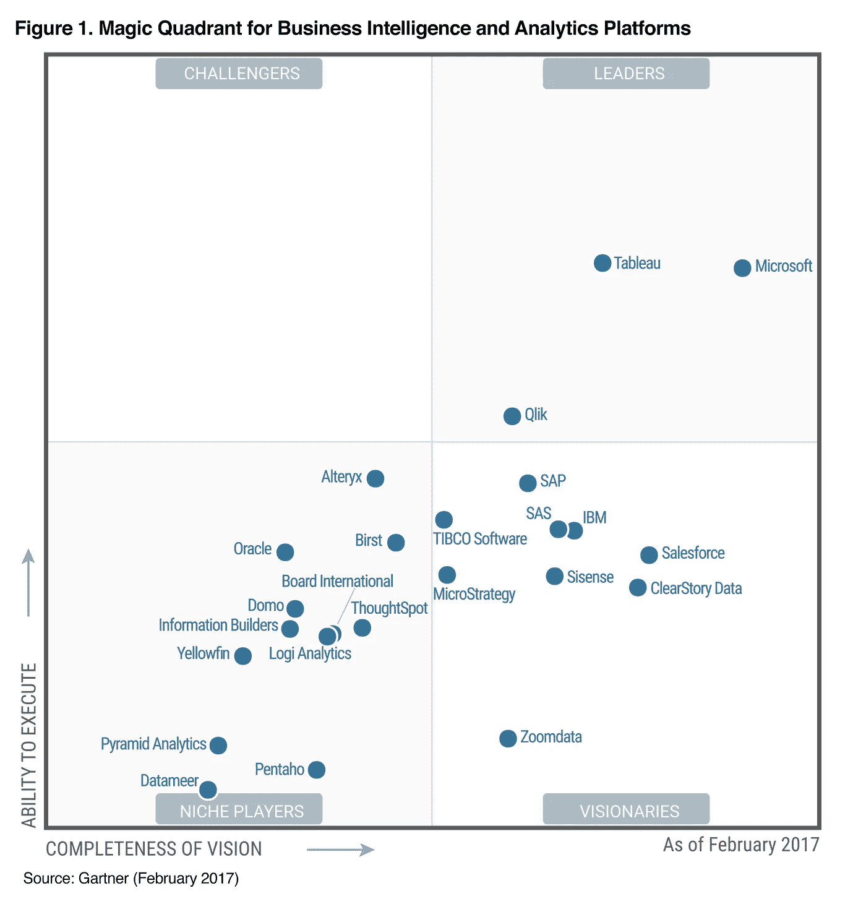

现在我们有了 Tableau 是什么的想法，让我们现在了解它的用户界面，以便最终能够使用该软件。

# Tableau 的界面

Tableau 的工作空间的结构非常容易理解，它是用一种简单的方法制作的，即使如此，它也没有简单到可以简单的程度，可能需要一些时间来适应。

让我们深入研究一下。

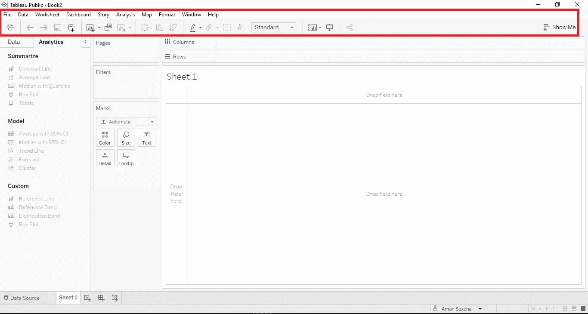

在页面顶部，我们有一些用于文件、数据、工作表、仪表板等的下拉框。通过经常使用，你会发现最有价值的命令存在于这些下拉菜单中。

在这些下拉菜单下，我们有一个工具栏，工具栏包括许多有用的命令。第一个是保存，添加一个新的数据源，暂停任何来自数据源的自动更新，添加一个新的工作表，复制和几个其他命令，这些命令将在我们创建可视化时发挥作用。

左上角的 Tableau 徽标命令会将您带到起始页，如果要连接到另一个数据源，您可能需要返回到起始页。

要返回，我们只需再次点击徽标。

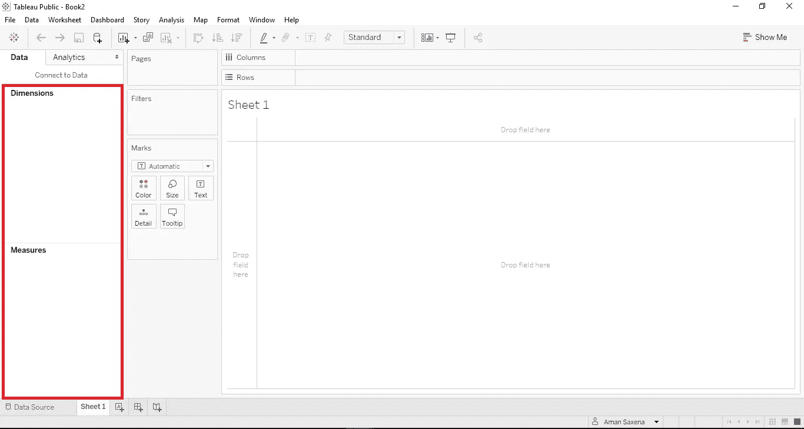

此外，页面左侧还有数据窗格。如果我们在“数据”选项卡上，我们会看到它列出了所有打开的数据源，并从该数据源中选择字段作为维度或度量。

度量是连续变量，本质上是数字。而维度是离散变量，如文本字符串和日期。

数据窗格还将显示我们可能有的任何集合或参数。

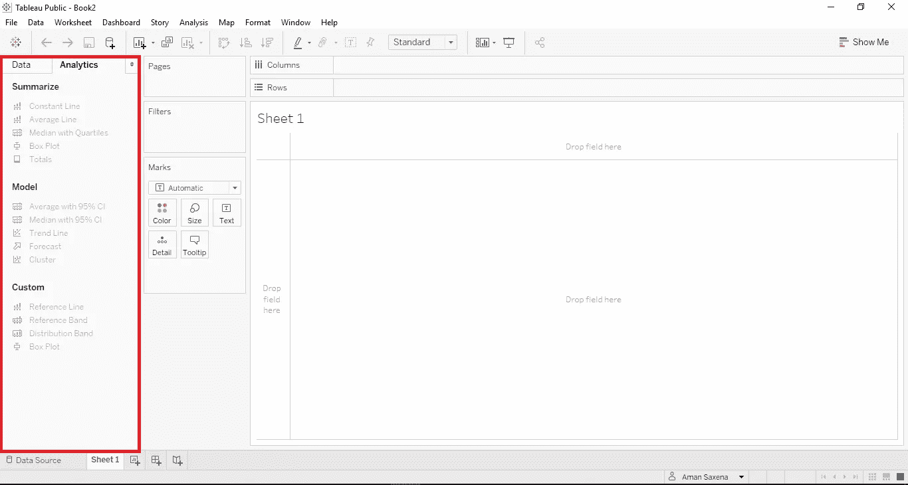

如果我们单击“analytics”选项卡，我们可以直接以拖放元素的形式显示我们的分析片段。如果它们与我们当前正在处理的视图或视觉类型无关，某些元素将会变灰。例如，时间线上的总计。

如果我们选择类似趋势线的东西，我们可以将它带到这些拖放区中的任何一个，以控制其属性的各个方面，如模型类型以及它应该应用于哪个度量等。

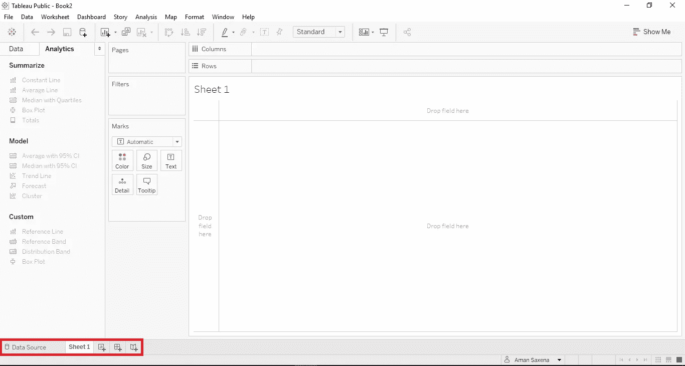

在底部，我们有新的工作表标签。我们可以使用这些选项卡创建工作表、仪表板和故事。我们可以做诸如重命名工作表、复制工作表、复制格式等许多事情。

如果工作簿有很多工作表，我们可以使用右下角的控件轻松导航。

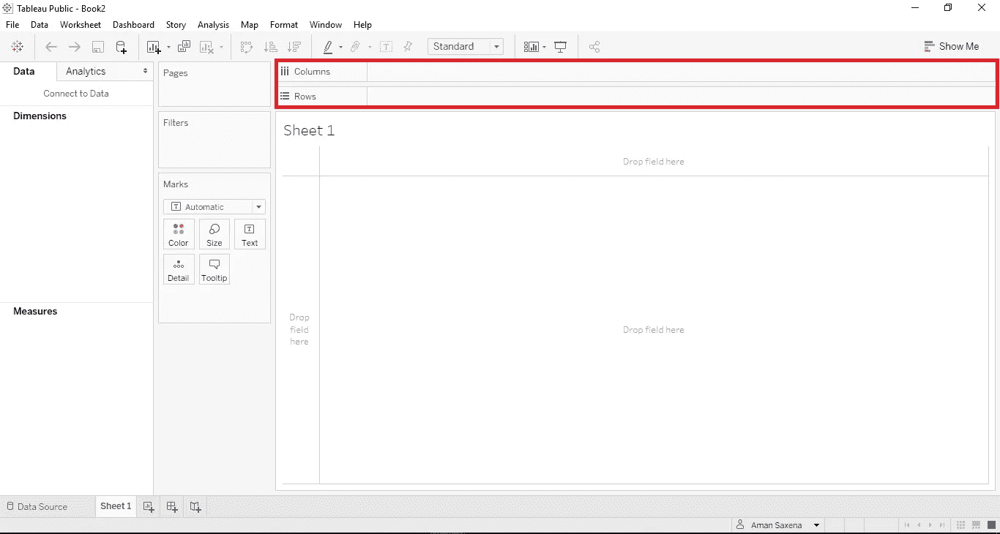

界面最重要的部分之一是界面右侧中央的行和列架。要创建我们的可视化，我们只需将维度和度量从数据窗格拖到列和行架中。我们也可以这样做，将我们的维度和度量直接拖到画布上，让 Tableau 自动分离行和货架。

当我们将维度和度量值拖动到列和行卡片时，我们将观察到一个特定的配色方案。蓝色代表尺寸，绿色代表尺寸。

对于您创建的几乎每个可视化，我们都将向列架和行架添加维度和度量。

当我们举一个实际的例子并看到第一手的应用时，这一点将会更加清楚。

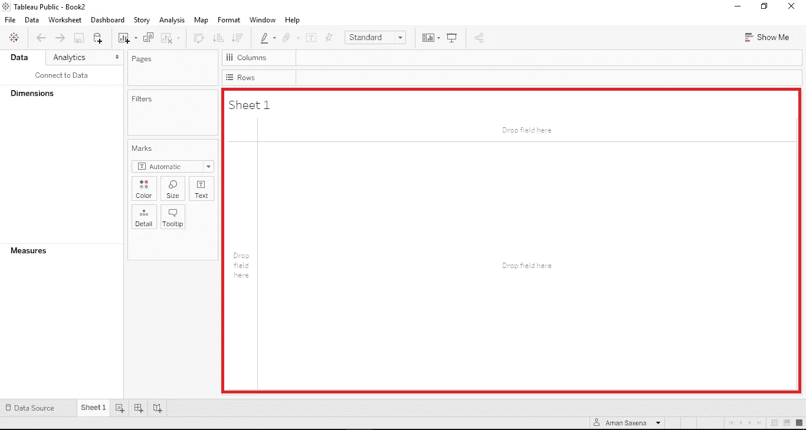

然后，我们有一个中央工作区，一旦行和列中有了度量和维度，可视化就会出现在这里。

在这里，我们可以给出工作表标题，为我们的可视化写标题，安排我们的可视化，还可以做一些格式化。

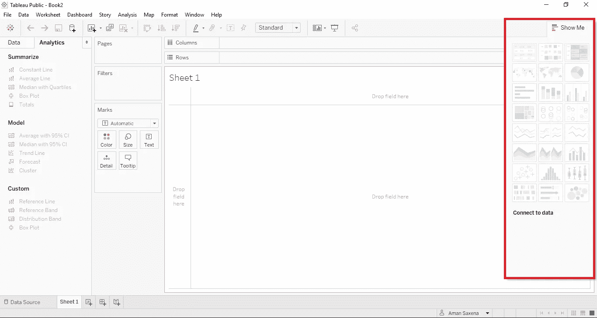

在右上角，我们有“演示”选项。

如果您不确定要创建什么样的可视化或 Tableau 中有哪些可用选项，可以单击“演示”选项，该选项将显示各种类型的可视化，您可以使用所选的维和度量或从当前存储在列和行中的数据创建这些可视化。

“演示”选项的一个优点是它会自动告诉您哪些类型的图表适合您所拥有的数据。因此，Tableau 试图向您介绍数据可视化的一些最佳实践。

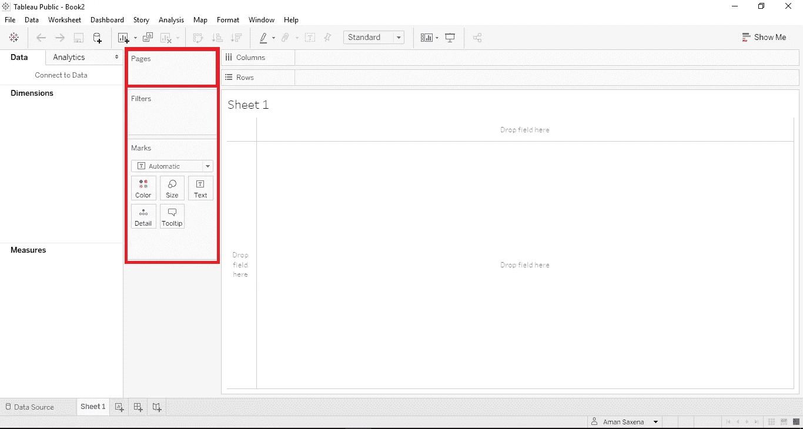

现在来看 Tableau 界面最重要的部分之一。页面、过滤器和标记卡位于页面的中央左侧，靠近我们的行和列架以及工作区。

这两种卡片，过滤器和标记，在大多数可视化中被广泛使用。

过滤器允许我们从可视化中排除某些数据类型。例如，我们可能希望从我们的可视化和用于特定可视化的数据中排除一些值。

为此，我们可以设置一个范围并删除值。

另一方面，标记允许我们更详细地格式化图表。Marx card 由其他几个架子组成，每个架子上都可以放置字段，单击这些字段可以编辑它们的特征。更改标记类型可以更改标记卡上的架子，这样选择形状会调出形状架子。

根据视图的组成，可以有多个标记卡，每个测量一个。

将字段放置在颜色大小或形状架上时，将自动创建颜色大小和形状等图例。但是，可以通过单击菜单并选择隐藏卡片来删除图例。要恢复图例，右键单击画布本身的任意位置，选择 legend 并选择所需的图例。

# 应用:使用 Tableau 创建我们的第一个可视化

为了更加清晰地理解我们刚刚学到的关于 Tableau 界面的知识，让我们看一个例子并创建我们的第一个可视化。

对于这第一个可视化，我们将使用 UCI 机器学习库中非常著名的 [Iris 数据集创建一些简单的图表。](https://archive.ics.uci.edu/ml/datasets/iris)

这是一个相当简单的数据集，有 150 个实例、4 个属性和一个类；即萼片长度、萼片宽度、花瓣长度、花瓣宽度和具有三个类别的类别属性，即刚毛鸢尾、杂色鸢尾和海滨鸢尾。

尽管我们目前不会对该数据集进行任何分类或预测分析，但该数据集已被广泛用于进行此类分析。

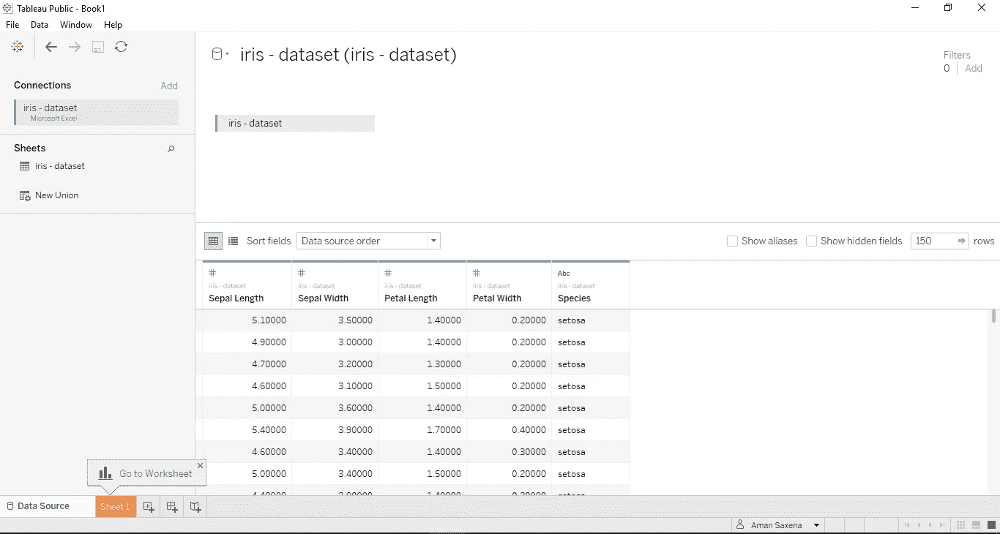

就像我们将带有 Iris 数据集的 excel 表导入 Tableau 一样，我们可以立即查看数据集的各种实例和属性。在这里，我们还可以更改各种属性的数据类型。

现在让我们直接进入工作表，开始我们的可视化。

对于这里的第一个例子，我们看到了花瓣长度和花瓣宽度之间的图，它根据物种进行了颜色编码，这可以在图例中看到。

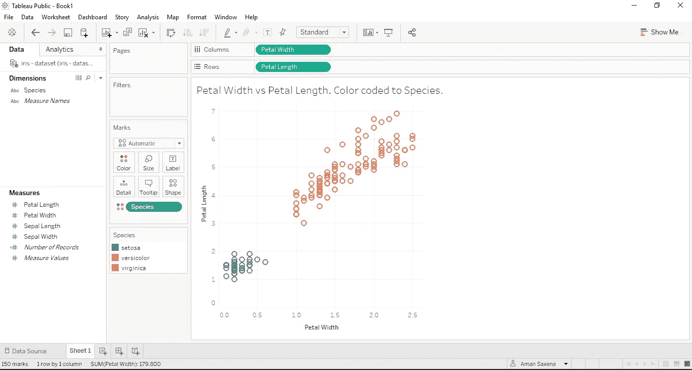

在这里，在数据窗格中，我们可以看到度量和维度之间的属性划分。如前所述，数字属性属于 measures 类别，而类属性属于 dimensions 类别。

我们已经创建了一个非常简单的散点图，显示了花瓣长度和花瓣宽度之间的关系，考虑到了各种物种。哪一个被分别放在列和行的架子上？

在标记卡中，我们可以清楚地看到，指定的属性已被放到颜色架上，以根据物种对分散点进行颜色编码。我们还可以看到颜色代码的补充图例。

让我们尝试另一种可视化方式，这次是直方图。

这种可视化表现了基于花瓣长度、花瓣宽度、萼片长度和萼片宽度的三个物种之间的比较。

我们可以看到，这四个属性是 rows shelf 的一部分，类变量 species 是 Columns shelf 的一部分。

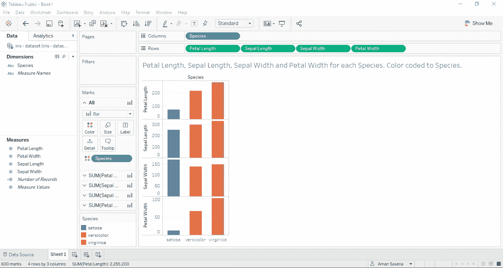

此外，使用标记卡根据物种进行了颜色编码，正如上一个示例中所做的那样，我们还可以在图表的 X 轴上看到物种，因为物种也是色谱柱架的一部分。

# 结论

既然我们已经看到了这两个例子，那么 Tableau 及其界面的可用性一定非常清楚。

Tableau 有很多功能，可以通过使用各种选项进行很多小的调整，这些选项你只会在练习制作自己的可视化效果时遇到。

有很多东西需要探索，所以访问 UCI 机器学习库或任何像 Kaggle 这样的数据集资源，迈出可视化世界的第一步，成为这个领域要求你成为的探索者。

*原载于 2018 年 9 月 14 日*[*【stepupanalytics.com】*](https://stepupanalytics.com/getting-into-tableau-visualizing-iris-data-set/)*。*