# 在简单的 RNN/LSTM 上推导反向传播(专长。艾丹·戈麦斯)

> 原文：<https://towardsdatascience.com/back-to-basics-deriving-back-propagation-on-simple-rnn-lstm-feat-aidan-gomez-c7f286ba973d?source=collection_archive---------0----------------------->

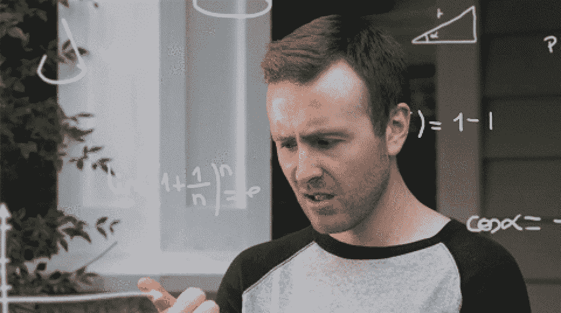

Gif from this [website](https://giphy.com/gifs/cbc-comedy-what-3o7btPCcdNniyf0ArS)

Aidan Gomez 做了一项惊人的工作，详细解释了反向传播 LSTM 一般是如何工作的。我也做了我的[这篇文章](https://medium.com/@SeoJaeDuk/only-numpy-deriving-forward-feed-and-back-propagation-in-long-short-term-memory-lstm-part-1-4ee82c14a652)。然而，我的朋友[阿部康](https://medium.com/@abraham.kang_80395)对我的帖子有一个问题。

所以今天，我想回顾一下反向传播的一些基本概念，同时将我的帖子和 Aidan 的帖子联系起来。

最后，我们学校的所有实验室都在翻新，因此我没有白板可以写，所以我会尽我所能在笔记本上写得尽可能整洁。

**衍生品的快速重述**

首先，让我们在继续之前练习一些导数。看着上面的图片，如果你觉得一切都有意义，请继续，否则我会建议你通过阅读[这篇文章](https://magoosh.com/hs/ap-calculus/2017/calculus-review-derivative-rules/)来复习更多关于衍生品的知识。

另外请注意，f(x) = tanh(x)的导数是 1-tanh(x ),可以改写为 1-f(x)。

**链式法则的快速重述**

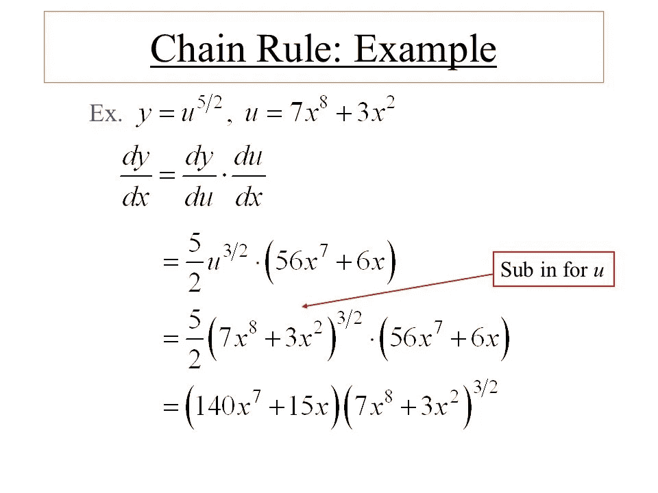

Image from this [website](http://slideplayer.com/slide/10776187/)

所以链式法则也非常简单，上面我们可以看到，我们想要对函数 y 的 x 求导，但是，函数 y 本身不包含变量 x，所以我们不能直接求导。谢天谢地，函数 y 包含变量 u，u 包含 x，所以我们最终能够对函数 y 的 x 求导，这要感谢链式法则。

**多变量衍生工具的快速重述**

**蓝色** →对变量 x 的导数
**红色** →对变量 Out 的导数

现在让我们回顾一下多变量的导数，它只是对每一项单独求导。此外，现在请忽略变量的名称(如 x 或 out ),它没有重要的意义。让我们看另一个例子。

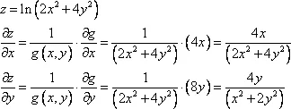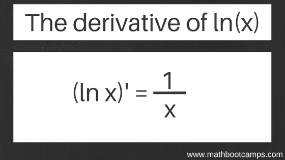

Left Image from this [website](http://www.columbia.edu/itc/sipa/math/calc_rules_multivar.html), Right Image from this [website](https://www.mathbootcamps.com/derivative-natural-log-lnx/)

因为 ln(x)的导数是 1/x，如果我们对每个方程分别对 x 和 y 取偏导数，我们会得到类似上面的结果。最后，让我们看一个在[逻辑 sigmoid 函数](https://en.wikipedia.org/wiki/Logistic_function)中的多变量函数的例子。

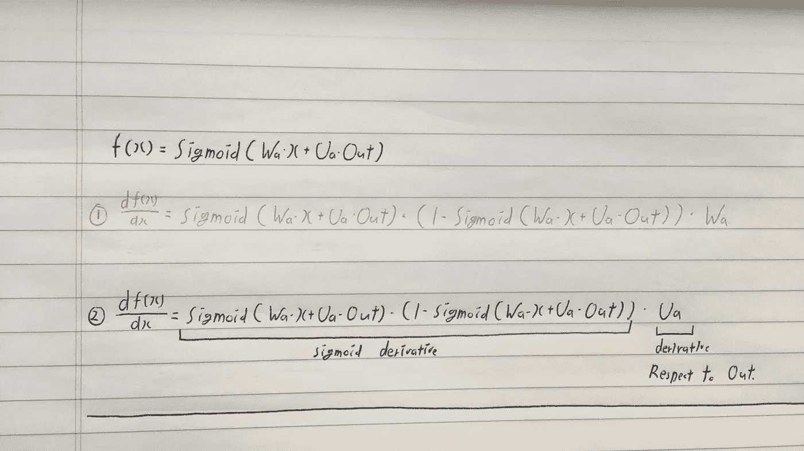

**蓝色** →对变量 x 的导数
红色 →对变量 Out 的导数

**递归神经网络的基本构建模块**

Modified Image from this [website](https://www.techleer.com/articles/185-backpropagation-through-time-recurrent-neural-network-training-technique/)

所以上图告诉了我们简单递归神经网络的基本构建模块，具有**四个状态**(用符号 **s** 表示)、**三个输入**(用符号 **x** 表示)和一个**误差**(用符号 **E** 表示)。现在让我们把它放进数学方程，但是没有任何激活函数。

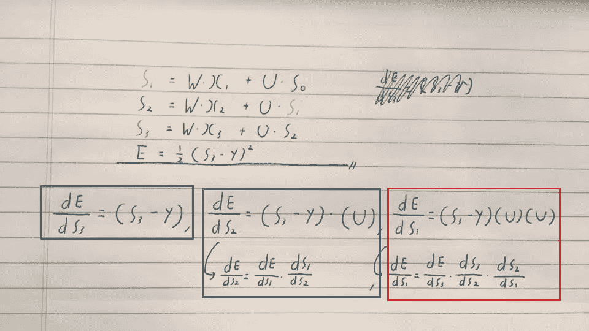

**绿框** →相对于状态 3 的误差导数
**蓝框** →相对于状态 2 的误差导数
**红框** →相对于状态 1 的误差导数

现在让我们看看每个状态的导数，很简单，对吧？使用链式法则以及多变量导数，我们能够对每个状态取导数，以相应地更新权重(U)。(请注意，我没有对状态 0 求导，我们使用的是 L2 损失函数。).现在让我们通过对输入求导来完成这个任务。

**绿框** →相对于输入 3 的误差导数
**蓝框** →相对于输入 2 的误差导数
**红框** →相对于输入 1 的误差导数

**LSTM 的前馈操作**

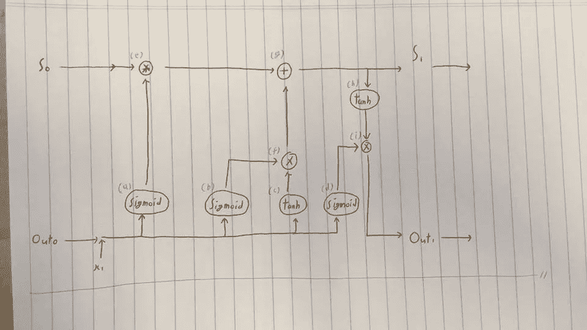

Right Image from this [website](https://medium.com/@aidangomez/let-s-do-this-f9b699de31d9)

前馈操作看起来非常复杂，但是，当我们做实际的数学运算时，它非常简单。左图是 LSTM 的图形表示，右图是来自 [Aidan Gomez](https://medium.com/@aidangomez?source=post_header_lockup) 的数学表示。现在让我们写下状态 1 和状态 2 的数学表达式(请注意，我在这篇文章中互换使用了状态和时间戳这两个术语)。我将使用艾登的符号，因为它会更容易理解。

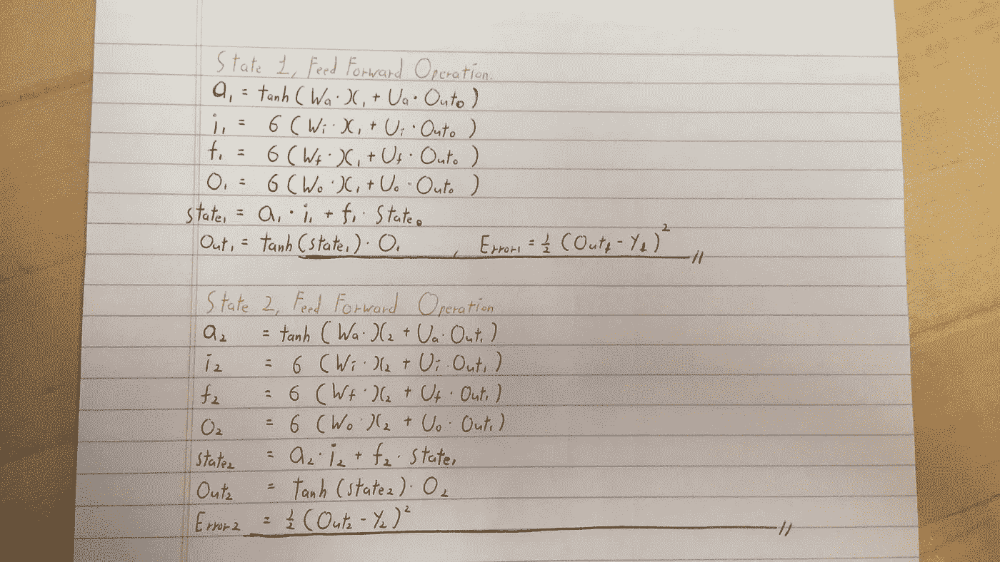

请再次注意，我们使用的是 L2 成本函数。现在让我们来看一个数字例子，下面两张图片来自 [Aidan](https://medium.com/@aidangomez?source=post_header_lockup) 的博客文章。(请注意，在我的笔记中，为了简单起见，我没有写偏见术语。)

Aidan 也使用了状态 0 和 1，而我使用了状态 1 和 2。

**时间戳 2 处的反向传播**

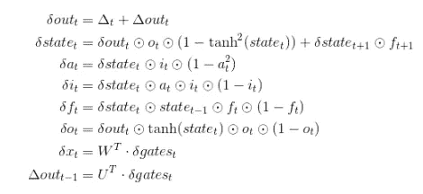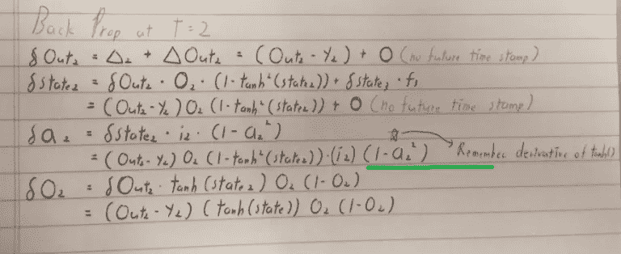

Left Image Back Propagation equations by Aidan

这里有两点需要注意…

1.绿线→请记住 Tanh()的导数可以这样改写。如果您不记得原因，请向上滚动。

2.我没有对 i(2)和 f(2)求导。原因是因为那两项与 a(2)具有非常相似的导数结构。我将在下面详细解释原因。

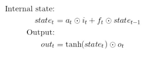

如果我们观察 state(t)是如何计算的，我们可以看到涉及到 a(t)，i(t)，f(t)和 state(t-1)项。所以当我们对变量 a(t)求导时，我们可以知道，这和对 i(t)求导非常相似。然而，有一个术语我们需要更深入地研究，那就是 o(t)。因为这个术语是在我们计算状态(t)之后使用的，导数也是不同的。

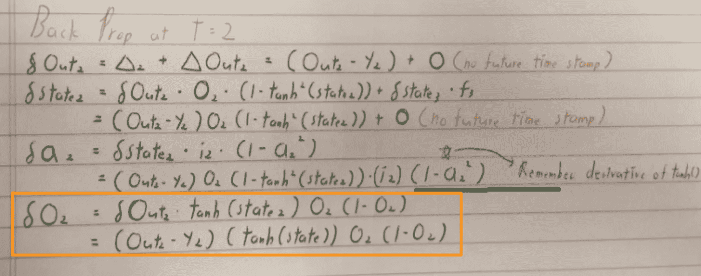

**橙色框** →关于 o(2)的导数

我们可以清楚地看到，导数方程与 a(2)相比有一些差别。

记住这些想法，我们可以看到，在时间戳 2 推导反向传播并不困难，因为它是 LSTM 的最外层。

**时间戳 1 处的反向传播**

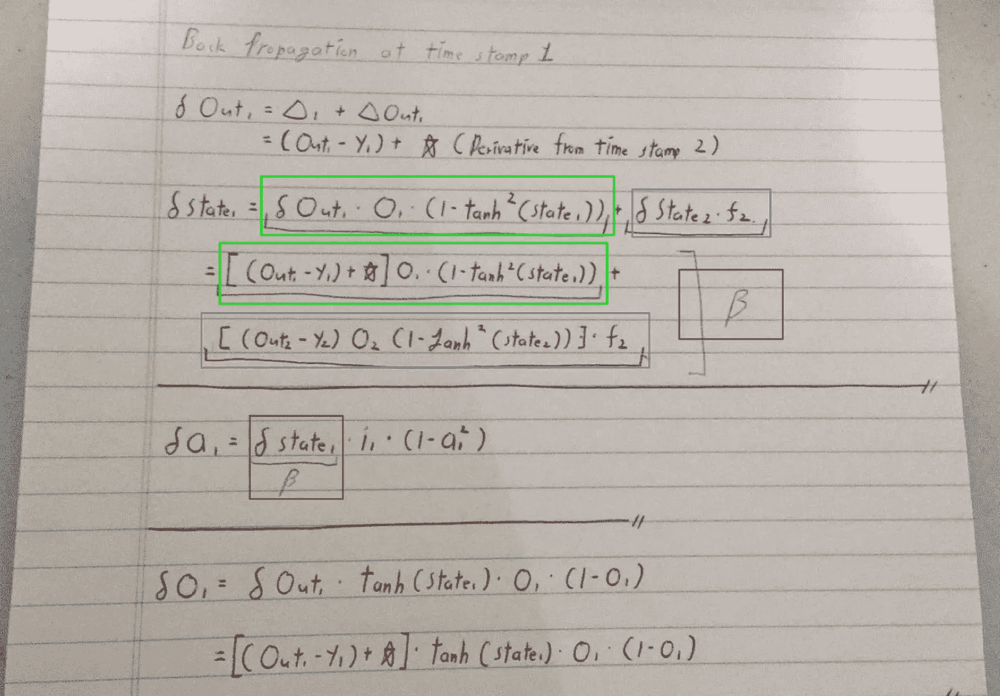

**绿框** →时间戳 1
**处误差函数的直接导数部分蓝框** →时间戳 2
**处的导数部分红框** →将符号汇总为β

上图是时间戳为 1 时的反向传播操作。现在，我再次使用艾登的符号，然而有一部分，我的朋友已经指出。

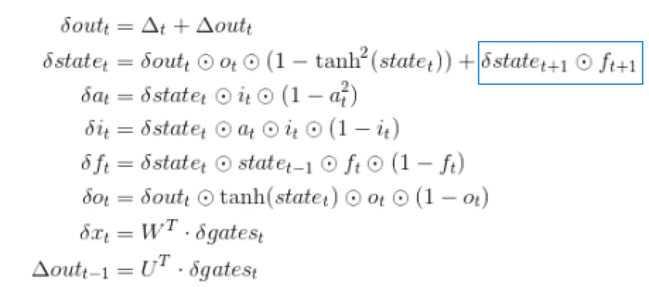

**蓝框** →计算 t 点的导数时，为什么需要 t+1 的一项？

在第一个网站上，它肯定看起来令人困惑，所以让我们更深入地看看前馈操作。

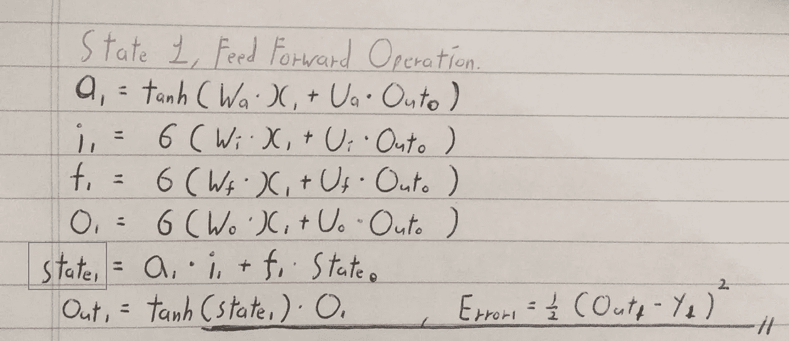

**蓝框** →当时间戳为 1(左图)和时间戳为 2(右图)时，显示状态 1

请注意，我会交替使用“时间戳”和“状态”这两个术语。不管怎样，我们可以观察到，当对状态 1 求导时。我们需要两个方程。

1.  首先，当时间戳为 1(绿框)时，我们需要渐变
2.  第二，我们需要时间戳为 2 时的梯度。(蓝色方框)

让我们回顾一下蓝框术语的来源。(关于状态(2)的导数)

所以在上面的导数之后，我们还需要加上 f(2)项。其原因可以解释如下。

请记住，在前馈操作期间，当时间戳为 2 时，我们将状态(1)乘以 f(2)。因此，如果我们对状态(1)求导，我们也需要乘以该项。

**时间戳 1 时相对于 O 的反向传播**

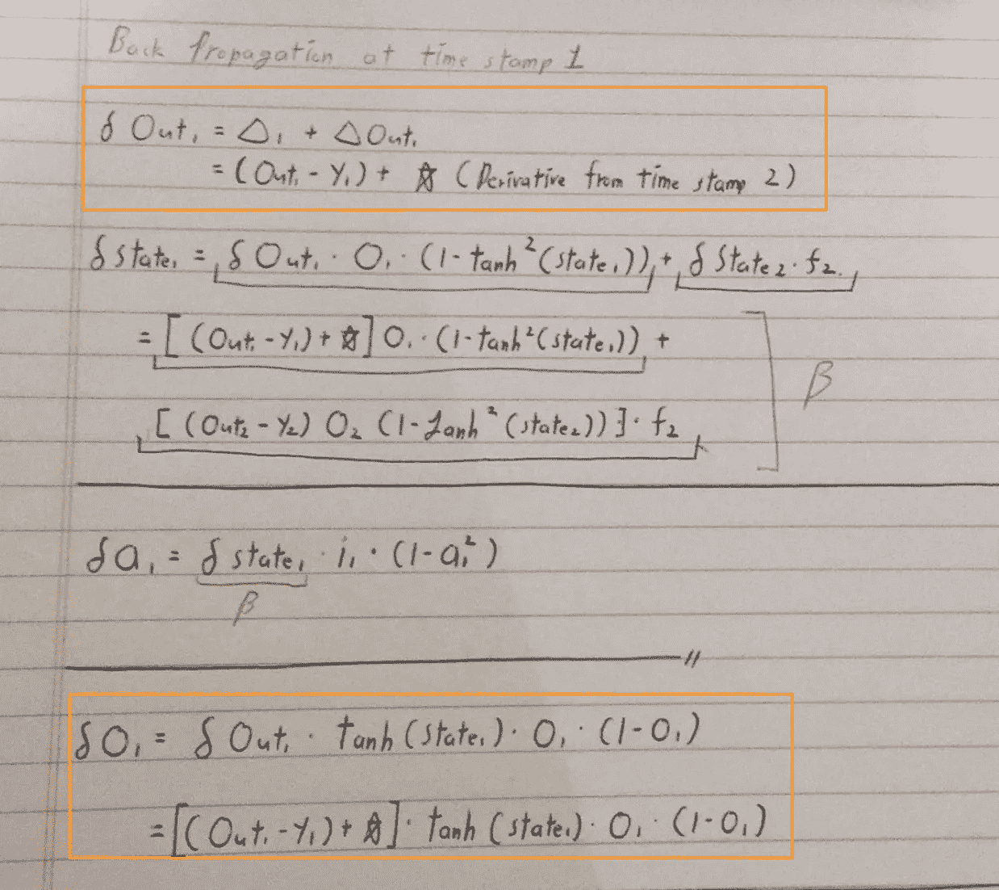

**橙色框** →相对于 O 项的导数

现在让我们考虑关于 o 项的反向传播过程，与我们在上一节中所做的反向传播相比，有一个有趣的事实需要我们注意。

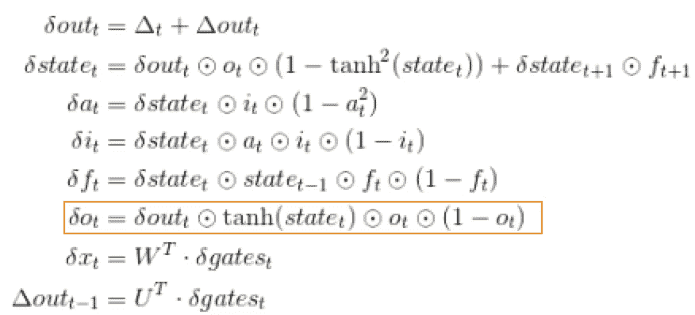

**橙盒** →艾丹反向传播方程

没有 t+1 的项。对状态(t)求梯度时，这是一个明显的区别。换句话说…..

a)在对状态(t)取梯度时→我们需要考虑来自未来时间戳状态(t+1)的梯度

b)在对 o(t)取梯度时→我们不需要考虑来自未来时间戳状态(t+1)的梯度

当考虑时间标记 1 的反向传播时，可以再次看到这一点。

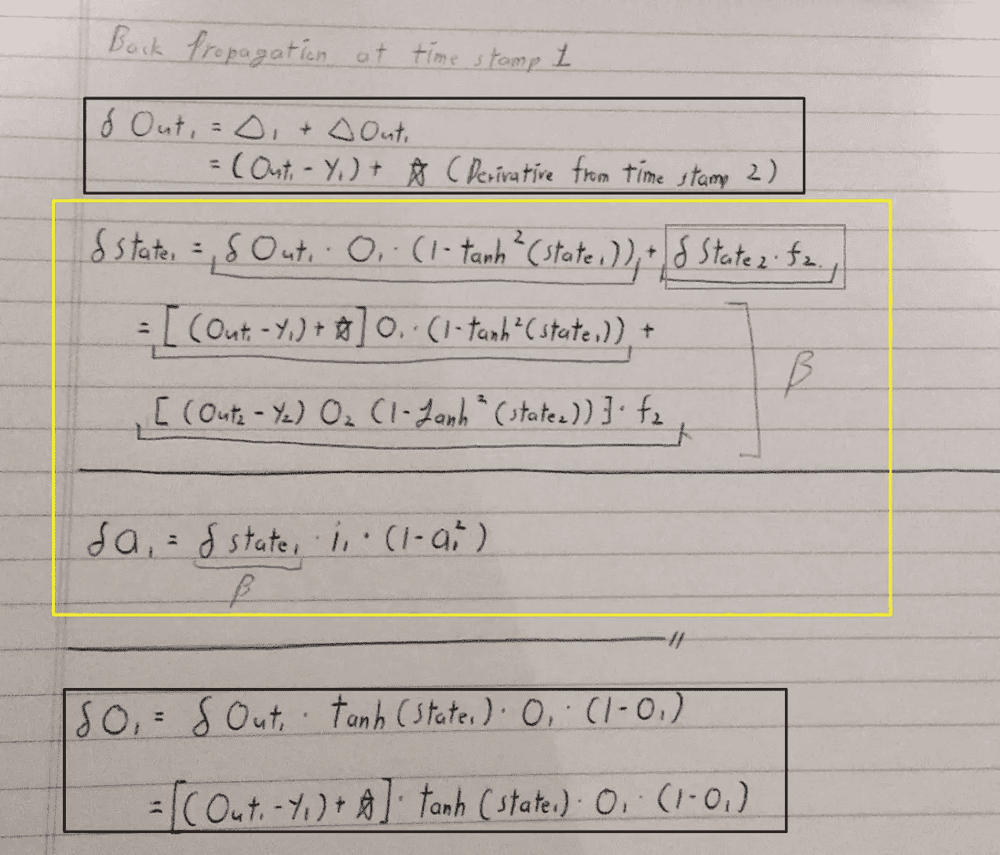

**蓝框** →其中状态(2)(换言之状态(t+1)存在
**黄框** →受状态(t+1)影响的导数
**黑框** →不受状态(t+1)影响的导数

为了进一步证实这个想法，让我们看一下我以前的博客帖子，在那里我更详细地介绍了反向传播。

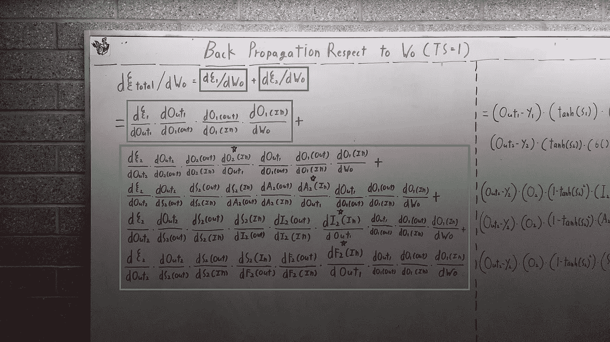

Image from this [post](https://becominghuman.ai/only-numpy-deriving-forward-feed-and-back-propagation-in-long-short-term-memory-lstm-part-1-4ee82c14a652)

**蓝框** →从时间戳 1
**的成本函数对 o(用 W(o)表示)求导；绿框** →从时间戳 2 的成本函数对 o(用 W(o)表示)求导

到目前为止，我们可以理解导数，但是现在让我们看看数学。

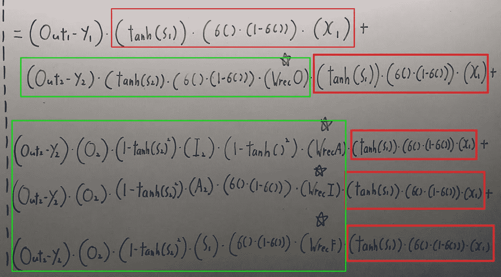

请暂时忽略绿色/红色框。好的，这是我们得到的数学公式，但是现在让我们比较一下，我们从之前的帖子到现在的帖子得到的公式。为了便于比较，让我们扩展等式，如下所示。

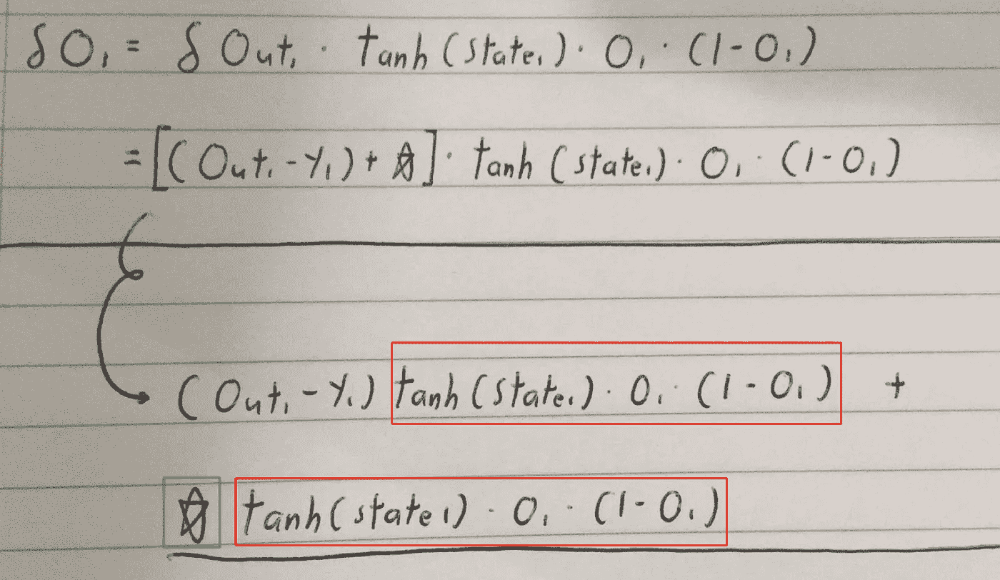

**红框** →公式展开的重复项
**绿框** →时间戳 2 的导数

现在把所有的东西放在一起，我们从上面看到的所有的绿盒子元素，进入**黑星**变量。所有的红框元素都完全一样。(除了输入的 x 符号)。

这里我们可以确认的是，当对 o 项求导时(见下文)，我们不需要考虑状态(t+1)的导数。

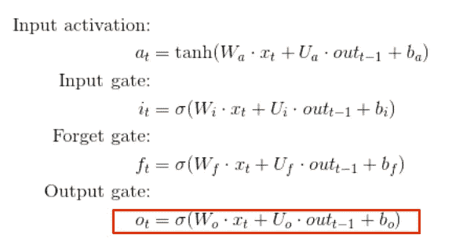

**最后的话**

希望这篇文章可以澄清一些困惑，但是我知道我的英文解释不是最好的。所以如果你有任何问题，请在下面评论。

如果发现任何错误，请发电子邮件到 jae.duk.seo@gmail.com 给我，如果你想看我所有写作的列表，请在这里查看我的网站。

与此同时，在我的 twitter 上关注我[这里](https://twitter.com/JaeDukSeo)，访问[我的网站](https://jaedukseo.me/)，或者我的 [Youtube 频道](https://www.youtube.com/c/JaeDukSeo)了解更多内容。

**参考**

1.  反向传播一个 LSTM:一个数值例子。(2016).中等。检索于 2018 年 5 月 1 日，来自[https://medium.com/@aidangomez/let-s-do-this-f9b699de31d9](https://medium.com/@aidangomez/let-s-do-this-f9b699de31d9)
2.  微积分评论:衍生规则——Magoosh 高中博客。(2017).Magoosh 高中博客。2018 年 5 月 1 日检索，来自[https://magoosh . com/hs/AP-calculus/2017/calculus-review-derivative-rules/](https://magoosh.com/hs/ap-calculus/2017/calculus-review-derivative-rules/)
3.  微积分的规则-多元。(2018).Columbia.edu。检索于 2018 年 5 月 1 日，来自[http://www . Columbia . edu/ITC/SIPA/math/calc _ rules _ multivar . html](http://www.columbia.edu/itc/sipa/math/calc_rules_multivar.html)
4.  lnx 的衍生和例子—mathbootpcamps。(2016).数学夏令营。检索于 2018 年 5 月 1 日，来自[https://www.mathbootcamps.com/derivative-natural-log-lnx/](https://www.mathbootcamps.com/derivative-natural-log-lnx/)
5.  基于递归神经网络的电价预测。(2018).Slideshare.net。检索于 2018 年 5 月 1 日，来自[https://www . slide share . net/taegyunjeon 1/electric-price-forecasting-with-recurring-neural-networks](https://www.slideshare.net/TaegyunJeon1/electricity-price-forecasting-with-recurrent-neural-networks)
6.  微分 3 微分的基本法则积和商法则链式法则经济学中的边际函数高阶导数。— ppt 下载。(2018).Slideplayer.com。检索于 2018 年 5 月 1 日，来自[http://slideplayer.com/slide/10776187/](http://slideplayer.com/slide/10776187/)
7.  反向传播一个 LSTM:一个数值例子。(2016).中等。检索于 2018 年 5 月 2 日，来自[https://medium.com/@aidangomez/let-s-do-this-f9b699de31d9](https://medium.com/@aidangomez/let-s-do-this-f9b699de31d9)
8.  只有 Numpy:推导长期短期记忆中的前馈和反向传播(LSTM)第 1 部分。(2018).成为人类:人工智能杂志。2018 年 5 月 2 日检索，来自[https://becoming human . ai/only-numpy-derivating-forward-feed-and-back-propagation-in-long-short-term-memory-lstm-part-1-4ee 82 c 14 a 652](https://becominghuman.ai/only-numpy-deriving-forward-feed-and-back-propagation-in-long-short-term-memory-lstm-part-1-4ee82c14a652)