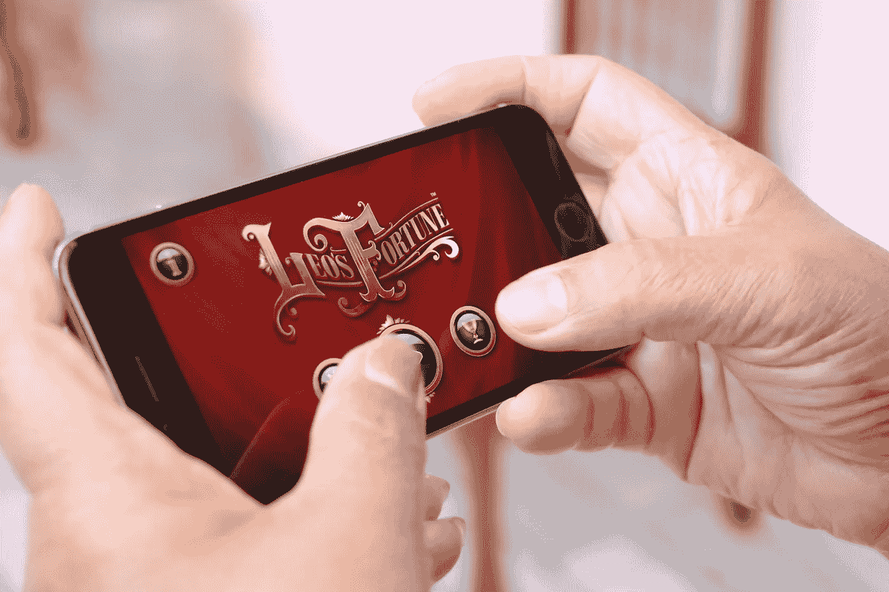
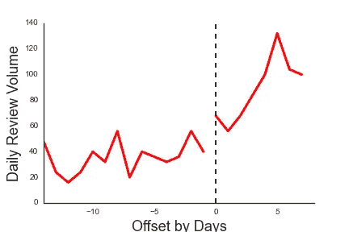

# 争取你(竞争对手)的钱

> 原文：<https://towardsdatascience.com/bang-for-your-competitor-s-buck-c4d318d275f7?source=collection_archive---------3----------------------->

Image from [pexels.com](https://www.pexels.com/photo/apps-business-cellular-telephone-communication-278998/)

2014 年 12 月 23 日，iOS 游戏 [The Room Two](https://itunes.apple.com/us/app/the-room-two/id667362389?mt=8) 的开发者醒来时发现了一些不可思议的巨额销售。事实上，至少比上个月的任何一天都要大。他们收到了 52 条评论，是前一周平均水平的两倍多。而且不止于此。在接下来的两周，第二会议室平均每天收到 60 条评论，几乎是 12 月 23 日之前一个月每天平均评论的三倍。这是圣诞奇迹吗？不知何故。事情是这样的:12 月 23 日，苹果在 AppStore 的首页打出了一条横幅，宣传包括每款 99 美分的“神奇应用&游戏”在内的促销活动。房间二是*而不是*特色应用之一。事实上，第二房间的*竞争者*、[狮子座的财富](https://itunes.apple.com/us/app/id830544402)之一也在其中。狮子座的财富价格降低了 75%至 99c。

Daily Review Volume for The Room Two mobile app. The dotted line represents that day the Leo’s Fortune went on 75% sale

是的，不仅竞争对手降价，苹果公司也大力促销。然而，不知何故，这帮助了房间二。

那么为什么会出现这种情况呢？苹果的 AppStore 就像今天的许多商店一样，根据用户的浏览和购买行为向他们推荐产品。与亚马逊在其产品页面中的“购买了该商品的顾客也购买了”部分非常相似，苹果在许多 iOS 应用程序的页面上都有“顾客也购买了”部分。这些推荐是由机器学习算法产生的，这些算法读取用户的观看/购买行为，并试图理解相关性:亚马逊知道经常购买这顶帽子的用户也会购买那些手套，网飞知道经常喜欢这个节目的用户也会观看另一个节目。*而且苹果知道经常浏览/购买《狮子座的财富》的用户也浏览/购买了《房间二》。*

再次关注苹果 AppStore 的具体设置，我们可以想象应用程序页面之间的这些联系会影响用户在应用程序之间的“行走”:如果我在愤怒的小鸟和水果忍者的页面上，我有可能会点击水果忍者图标并进入他们的页面。诸如此类。可以想象愤怒的小鸟页面访问量的突然增加或减少会对水果忍者页面的访问量产生实质性的影响。

作为我在西北大学博士论文的一部分，我收集并分析了 4 次大型 iOS 促销活动的数据，并获得了许多有趣的见解。在这篇文章中，我将集中讨论一个问题。我的问题很简单:一个应用页面访问量的突然增加如何影响该应用类似应用的访问量，即“顾客也购买了”栏目下的应用。

我发现了一个有趣的二分法。首先，我发现，当被推广的应用程序将其价格降至免费(即使其原价仅为 99 美分)时，其竞争对手的销售额大幅下降。这里有一个原因的解释:当一个用户看到一个点击*和*免费的东西时，没有什么可失去的。*而且没有理由看得更远。*

事情变得非常有趣了。当被推广的应用程序降价 3 美元或 9 美元时(记住这是 AppStore，中间价格是 0！)他们的竞争对手看到他们的销售额有了*的增长。当用户看到一个在售但仍不免费的应用程序时，他们会有动力在做出承诺前进一步探索。除了查看页面上的其他应用程序，还有什么更好的探索方式呢？*

总的来说，当一束假设的强光照射在一款免费应用上时，竞争对手的页面会变得更暗。但是当聚光灯照在一个 99 美分的应用上时(即使总的绝对折扣更大)，竞争对手不可避免地会偷走一些光。

## 那么这对开发者意味着什么呢？

开发者，你需要意识到你的“邻居”和他们的行为。你的营销活动应该考虑到你的竞争对手在做什么，并实时做出反应。你应该意识到*你的*营销活动也能让*他们*受益。另一方面，如果奥普拉把你的一个竞争对手放在她的“银河中最喜欢的东西”列表中，不要失去所有的希望。只要竞争对手不是免费的，这也能促进你的销售。

## 这对苹果意味着什么？

苹果的激励措施之一是通过不断向用户提供优秀的创新应用来尽可能地让他们开心。但是 AppStore 有超过 150 万个应用程序，因此没有一个用户会去探索哪怕是整个系列中的一小部分。这正是这些推荐系统诞生的初衷:帮助用户发现和浏览新内容。

不可避免的是，任何这样的大型系统都会将大部分成功集中在少数几个应用程序上。随着成功的应用程序变得越来越成功，富人变得越来越富的效应也会出现一些变化。

我们的发现可以为苹果(以及任何其他集中式市场)提供另一种方式，以某种方式“推动”成功的分布:通过巧妙地决定如何填充“顾客也购买了”部分。例如，如果一款应用获得了广泛的成功，将它放在*更少的*付费应用的“顾客也购买了”部分是一个好主意，这样就可以为其他不太成功但同样出色的应用腾出位置。

## 超越苹果和移动应用

产生这篇文章的数据是特定于苹果的应用商店的，但是洞察力不是。类似的效果发生在所有类型的具有这种推荐算法的平台上。任何类型的卖家都应该意识到他们的营销活动会以意想不到的(有时是积极的)方式影响他们的竞争对手。对他们来说，集中式市场可以利用这些见解更好地在他们平台的卖家中分配焦点，并进一步帮助他们的客户发现优秀的内容。

感谢阅读！

*这篇文章最初写于 2016 年，当时约尔戈斯还是一名博士生，从事在线消费者评论的研究。*