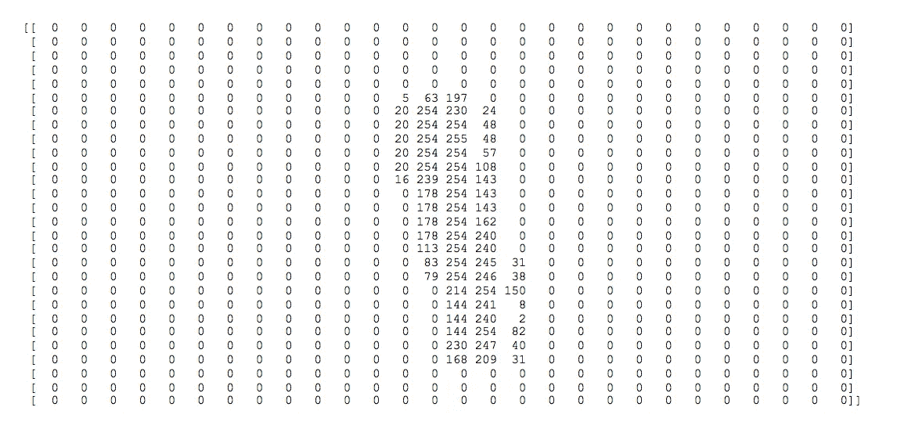
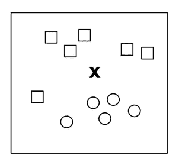
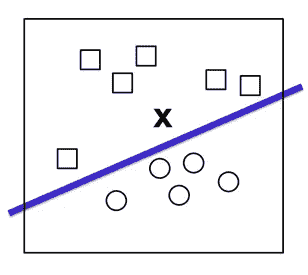
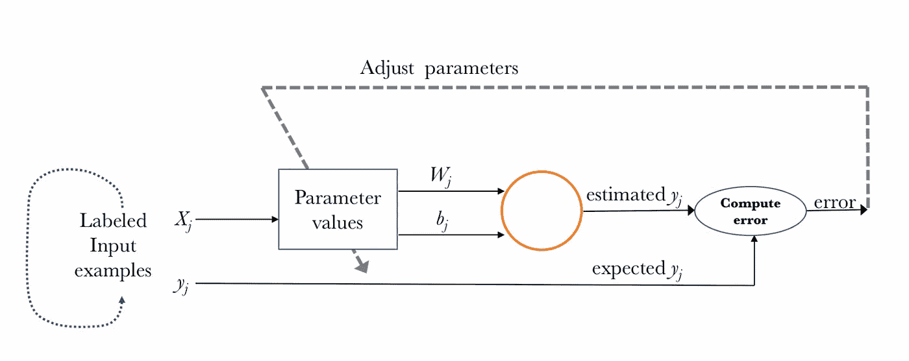
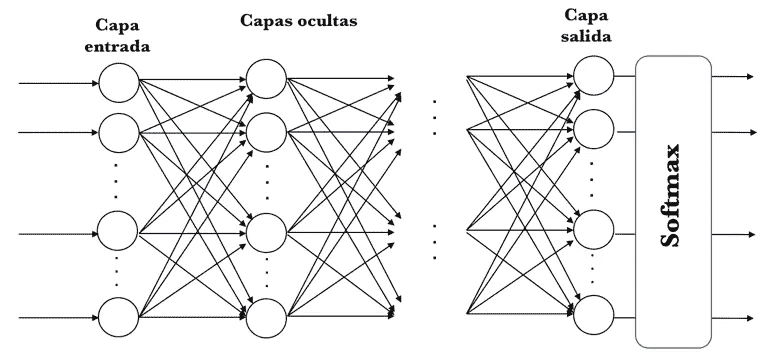
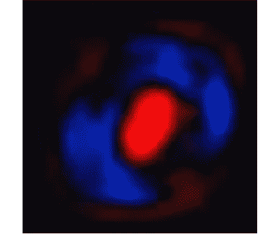
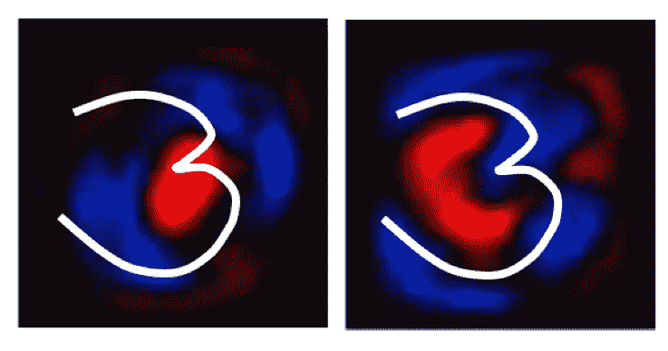

# 神经网络

> 原文：<https://towardsdatascience.com/basic-concepts-of-neural-networks-1a18a7aa2bd2?source=collection_archive---------4----------------------->

## 初学者的基本概念

torres.ai

同样，当你开始用一种新语言编程时，有一个用 *Hello World print* 做这件事的传统，在深度学习中，你首先要创建一个手写数字的识别模型。通过这个例子，这篇文章将介绍神经网络的一些基本概念，尽可能减少理论概念，目的是为读者提供一个特定案例的全局视图，以方便阅读后续文章，其中该领域的不同主题将得到更详细的处理。

# 研究案例:数字识别

在这一节中，我们将介绍我们将用于第一个神经网络示例的数据:MNIST 数据集，它包含手写数字的图像。

MNIST 数据集可以从*MNIST 数据库*页面[【1】](https://torres.ai/densely-connected-networks/#_ftn1)下载，由手工制作的数字图像组成。该数据集包含用于训练模型的 60，000 个元素和用于测试模型的 10，000 个附加元素，并且对于第一次进入模式识别技术来说是理想的，而不必花费大量时间预处理和格式化数据，这在数据分析中是非常重要和昂贵的步骤，并且在处理图像时具有特殊的复杂性；这个数据集只需要很小的改动，我们将在下面进行评论。

这个黑白图像数据集已被归一化为 20×20 像素，同时保留了它们的纵横比。在这种情况下，重要的是要注意图像包含灰度级，这是归一化算法中使用的*反走样*[【2】](https://torres.ai/densely-connected-networks/#_ftn2)技术的结果(将所有图像的分辨率降低到较低的分辨率)。随后，图像以 28×28 像素为中心，计算这些像素的质心并移动图像，以便将该点定位在 28×28 视场的中心。这些图像具有以下样式:

Pixel images of handwritten texts (From: [MNIST For ML Beginners](https://www.tensorflow.org/versions/r0.9/tutorials/mnist/beginners/index.html), tensorflow.org)

此外，数据集对每张图像都有一个标签，表明它代表哪个数字，因此是一种监督学习，我们将在本章中讨论。

该输入图像用矩阵表示，每个 28×28 像素的亮度值在[0，255]之间。例如，此图像(训练集的第八个图像)

用这个 28×28 点的矩阵来表示(读者可以在本章的笔记本上查一下):

另一方面，记住我们有标签，在我们的例子中是 0 到 9 之间的数字，表示图像代表哪个数字，也就是说，它与哪个类相关联。在这个例子中，我们将用 10 个位置的向量来表示每个标签，其中对应于表示图像的数字的位置包含 1，其余的包含 0。这个将标签转换成与不同标签的数量一样多的零的向量，并将 1 放入对应于标签的索引中的过程被称为*独热编码*。

# 感知器

在继续之前，对单个神经元如何工作以实现其从训练数据集学习的目的的简单直观的解释可能对读者有所帮助。让我们看一个非常简单的例子来说明人工神经元如何学习。

## 回归算法

基于上一章已经解释的内容，让我们对经典的机器学习回归和分类算法做一个简单的提醒，因为它们是我们深度学习解释的起点。

我们可以说，回归算法使用误差测量值*损失*对不同输入变量(*特征*)之间的关系进行建模，这将在迭代过程中被最小化，以便“尽可能准确地”做出预测。我们将讨论两种类型:逻辑回归和线性回归。

逻辑回归和线性回归的主要区别在于模型的输出类型；当我们的输出是离散的时，我们谈论逻辑回归，当输出是连续的时，我们谈论线性回归。

根据第一章中介绍的定义，逻辑回归是一种监督学习算法，用于分类。我们接下来将使用的示例是一个二元分类，它通过分配 0 或 1 类型的离散值来识别每个输入示例属于哪个类。

## 普通的人工神经元

为了展示基本神经元是怎样的，让我们假设一个简单的例子，其中我们在二维平面中有一组点，并且每个点已经被标记为“正方形”或“圆形”:

给定一个新的点“ *X* ，我们想知道它对应的标签是什么:

一种常见的方法是画一条线将两个组分开，并使用这条线作为分类器:

在这种情况下，输入数据将由( *x1，x2* )形式的向量表示，这些向量表示它们在这个二维空间中的坐标，我们的函数将返回‘0’或‘1’(在线的上方或下方)，以知道它应该被分类为“正方形”还是“圆形”。正如我们已经看到的，这是一个线性回归的例子，其中遵循第 1 章给出的符号的“线”(分类器)可以定义为:

更一般地说，我们可以将这条线表示为:

为了对输入元素 X 进行分类，在我们的例子中输入元素 X 是二维的，我们必须学习与输入向量维数相同的权重向量 W，即向量( *w1，w2* )和 *b* 偏差。

有了这些计算值，我们现在可以构建一个人工神经元来对新元素 *X* 进行分类。基本上，神经元将计算出的权重的向量 *W* 应用于输入元素 *X* 的每个维度中的值，并在最后添加偏差 *b.* 其结果将通过非线性“激活”函数来产生结果“0”或“1”。我们刚刚定义的这种人工神经元的功能可以用更正式的方式来表达，例如:

现在，我们将需要一个函数来对变量 *z* 进行转换，使其变为‘0’或‘1’。虽然有几个函数(我们将在第 4 章中称之为“激活函数”)，但在本例中，我们将使用一个被称为*sigmoid*[【3】](https://torres.ai/densely-connected-networks/#_ftn3)的函数，该函数针对任何输入值返回 0 到 1 之间的实际输出值:

如果我们分析前面的公式，我们可以看到它总是倾向于给出接近 0 或 1 的值。如果输入 z 相当大且为正，则负 z 处的“e”为零，因此 *y* 取值为 1。如果 *z* 具有大的负值，那么对于“e”的大正数，公式的分母将是一个大的数字，因此 *y* 的值将接近 0。从图形上看，sigmoid 函数呈现如下形式:

到目前为止，我们已经介绍了如何定义人工神经元，这是神经网络可以拥有的最简单的架构。具体来说，这种架构在本主题的文献中被命名为感知器[【4】](https://torres.ai/densely-connected-networks/#_ftn4)(也称为*线性阈值单元* (LTU))，由 Frank Rosenblatt 于 1957 年发明，并在视觉上概括为以下方案:

最后，让我帮助读者直观地了解这个神经元如何从我们已经标记为“正方形”或“圆形”的输入数据中学习权重 *W* 和偏差 *b* (在第 4 章中，我们将介绍如何以更正式的方式完成这个过程)。

对于所有已知的带标签的输入示例，这是一个迭代过程，将通过模型估计的标签值与每个元素的标签期望值进行比较。在每次迭代之后，以这样的方式调整参数值，即随着我们以最小化上述损失函数为目标继续迭代，所获得的误差变得越来越小。下面的方案希望以一种通用的方式直观地总结一个感知器的学习过程:

## 多层感知器

但是在继续讨论这个例子之前，我们将简要介绍当神经网络是由我们刚刚介绍过的感知器构造而成时，它们通常采用的形式。

在该领域的文献中，当我们发现神经网络具有一个*输入层*，一个或多个由感知器组成的层，称为*隐藏层*，以及具有几个感知器的最后一层，称为*输出层*时，我们称之为多层感知器(MLP)。一般来说，当基于神经网络的模型由多个隐藏层组成时，我们称为*深度学习*。在视觉上，它可以用以下方案来表示:

MLP 通常用于分类，特别是当类别是排他性的时，如在数字图像分类的情况下(从 0 到 9 的类别)。在这种情况下，由于一个名为 softmax 的函数，输出图层返回属于每个类的概率。视觉上，我们可以用以下方式表示它:

正如我们将在第四章介绍的，除了 sigmoid 之外，还有几个激活函数，每个都有不同的属性。其中之一就是我们刚刚提到的那个 *softmax* 激活函数[【5】](https://torres.ai/densely-connected-networks/#_ftn5)，它将有助于呈现一个简单的神经网络的示例，以在两个以上的类中进行分类。目前，我们可以将 softmax 函数视为 sigmoid 函数的推广，它允许我们对两个以上的类进行分类。

# Softmax 激活功能

我们将以这样的方式来解决这个问题:给定一个输入图像，我们将获得它是 10 个可能数字中的每一个的概率。这样，我们将有一个模型，例如，可以预测图像中的 9，但只有 80%的把握是 9。由于这张图片中数字底部的笔画，它似乎有 5%的几率成为 8，甚至有一定的概率成为任何其他数字。虽然在这种特殊情况下，我们会认为我们的模型的预测是 9，因为它是概率最高的一个，但这种使用概率分布的方法可以让我们更好地了解我们对预测的信心程度。这在这种情况下很好，因为数字是手工制作的，当然在很多情况下，我们不能 100%确定地识别数字。

因此，对于这个 MNIST 分类的例子，我们将为每个输入例子获得一个输出向量，该输出向量具有在一组互斥标签上的概率分布。也就是说，10 个概率的向量(每个概率对应于一个数字)以及所有这 10 个概率的总和导致值 1(概率将在 0 和 1 之间表示)。

正如我们已经提出的，这是通过在我们的具有 softmax 激活函数的神经网络中使用输出层来实现的，其中该 softmax 层中的每个神经元依赖于该层中所有其他神经元的输出，因为所有这些神经元的输出之和必须是 1。

但是 softmax 激活功能是如何工作的呢？softmax 函数基于计算特定图像属于特定类别的“证据”,然后将这些证据转换为它属于每个可能类别的概率。

一种测量某一图像属于特定类别的证据的方法是对属于该类别的每个像素的证据进行加权求和。为了解释这个想法，我将使用一个可视化的例子。

假设我们已经学习了数字 0 的模型(我们将在后面看到这些模型是如何学习的)。目前，我们可以把模型看作是“某种东西”,它包含了知道一个数是否属于某一类的信息。在这种情况下，对于数字 0，假设我们有一个如下所示的模型:

Source: Tensorflow tutorial[[6]](https://torres.ai/densely-connected-networks/#_ftn6))

在这种情况下，对于 28×28 像素的矩阵，其中红色像素(在书的白/黑版本中是最浅的灰色)表示负权重(即，减少其所属的证据)，而蓝色像素(在书的黑/白版本中是最深的灰色)表示正权重(其证据是更大的增加)。黑色代表中性值。

假设我们在上面画了一个零。一般来说，零点的轨迹会落在蓝色区域(请记住，我们讨论的是归一化为 20×20 像素的图像，后来以 28×28 的图像为中心)。很明显，如果我们的笔画越过红色区域，很可能我们写的不是零；因此，使用基于如果我们通过蓝色区域则相加，如果我们通过红色区域则相减的度量标准似乎是合理的。

为了确认它是一个好的度量，现在让我们想象我们画了一个三；很明显，我们用于零的前一个模型中心的红色区域会影响前面提到的指标，因为，正如我们在该图的左部看到的，当写 3 时，我们忽略了:

Source: Tensorflow tutorial[[6]](https://torres.ai/densely-connected-networks/#_ftn6))

但另一方面，如果参考模型是对应于数字 3 的模型，如上图右侧所示，我们可以看到，一般来说，代表数字 3 的不同可能走线大多位于蓝色区域。

我希望读者看到这个直观的例子后，已经直觉地知道上面提到的权重的近似值是如何让我们估计出它是多少的。

Source: Tensorflow tutorial[[6]](https://torres.ai/densely-connected-networks/#_ftn6))

上图显示了为这十个 MNIST 类中的每一个学习的具体模型示例的权重。请记住，在这个视觉表示中，我们选择了红色(黑白图书版中的浅灰色)来表示负权重，而我们将使用蓝色来表示正权重。

一旦属于 10 个类别中的每一个的证据被计算出来，这些必须被转换成概率，其所有成分的总和加 1。为此，softmax 使用计算证据的指数值，然后将它们归一化，使总和等于 1，形成概率分布。属于类别 *i* 的概率为:

直观地说，使用指数得到的效果是，多一个单位的证据具有乘数效应，少一个单位的证据具有反效应。关于这个函数有趣的事情是，一个好的预测在向量中有一个接近 1 的值，而其余的值接近 0。在弱预测中，将有几个可能的标签，它们将具有或多或少相同的概率。

# **参考文献**

[【1】](https://torres.ai/densely-connected-networks/#_ftnref1)MNIST 手写数字数据库。[en línea]。可在:[http://yann.lecun.com/exdb/mnist](http://yann.lecun.com/exdb/mnist)【咨询日期:2017 年 2 月 24 日】。

[【2】](https://torres.ai/densely-connected-networks/#_ftnref2)维基百科，(2016)。抗锯齿。可用地点:【https://es.wikipedia.org/wiki/Antialiasing【访问时间:2016 年 9 月 1 日】。

[【3】](https://torres.ai/densely-connected-networks/#_ftnref3)维基百科，(2018)。乙状结肠函数。可用时间:[https://en.wikipedia.org/wiki/Sigmoid_function](https://en.wikipedia.org/wiki/Sigmoid_function)【访问时间:2018 年 2 月 3 日】。

[【4】](https://torres.ai/densely-connected-networks/#_ftnref4)维基百科(2018)。感知器。可在[https://en.wikipedia.org/wiki/Perceptron](https://en.wikipedia.org/wiki/Perceptron)获得【2018 年 12 月 22 日访问】

[【5】](https://torres.ai/densely-connected-networks/#_ftnref5)维基百科，(2018)。Softmax 函数[en línea]。可用地点:[https://en.wikipedia.org/wiki/Softmax_function](https://en.wikipedia.org/wiki/Softmax_function)【访问时间:2018 年 2 月 22 日】。

[【6】](https://torres.ai/densely-connected-networks/#_ftnref6)tensor flow，(2016)教程 MNIST 初学者。[en línea]。可在:[https://www . tensor flow . org/versions/r 0.12/tutorials/mnist/初学者/](https://www.tensorflow.org/versions/r0.12/tutorials/mnist/beginners/) 【访问时间:2018 年 16 月 2 日】。

*原载于 2018 年 9 月 16 日*[***Torres . ai***](https://torres.ai/densely-connected-networks/)*。*