# 基础医疗数据探索/可视化——心脏病

> 原文：<https://towardsdatascience.com/basic-medical-data-exploration-visualization-heart-diseases-6ab12bc0a8b7?source=collection_archive---------6----------------------->

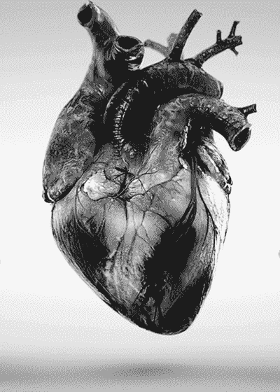

GIF from this [website](https://giphy.com/gifs/heart-amazing-RZxO4rRIUhy5a)

今天，我想再次练习我的数据探索技能，我想在这个 [**心脏病数据集**](https://archive.ics.uci.edu/ml/datasets/Heart+Disease) **上练习。**

> **请注意，这篇帖子是为了我未来的自己回顾和回顾数据探索的基本技术。**

**数据集**

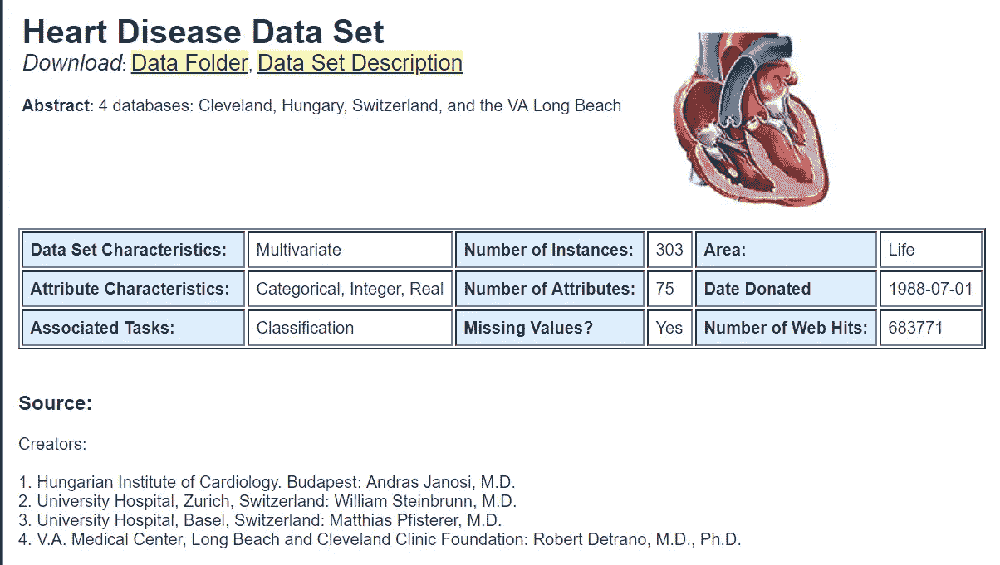

Image from this [website](https://archive.ics.uci.edu/ml/datasets/Heart+Disease)

这个数据集包含 302 个患者数据，每个数据有 75 个属性，但是我们只使用其中的 14 个，如下图所示。

如果有人对每个属性的确切含义感兴趣，请看看下面的屏幕截图。

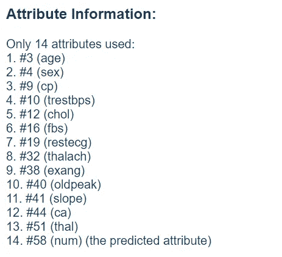

Image from this [website](https://archive.ics.uci.edu/ml/datasets/Heart+Disease)

**数据集概述/清理/查看**

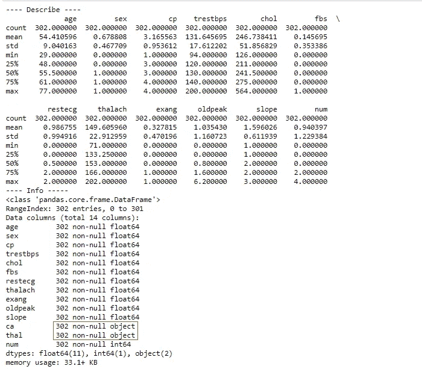

**红框** →数据类型对象

像往常一样，让我们从简单的开始，看看一般的平均值，标准差和其他东西。很快，我们可以认识到我们的一些数据是在对象类型中。

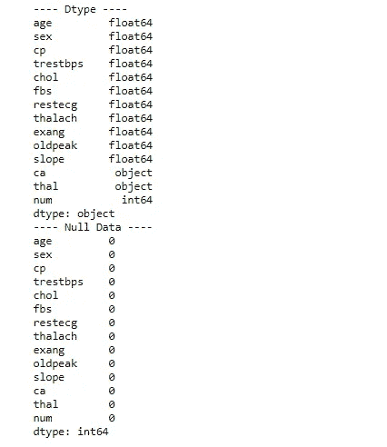

然而，我们也可以观察到没有空变量的事实。

在进行简单的清理后，将非数字值更改为 NaN 并用 0 替换 NaN。我们现在可以有把握地说，我们的数据有些干净。

**前/后 10 行**

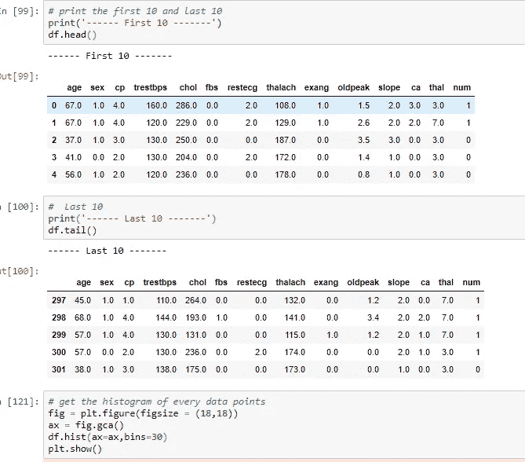

同样，为了更好地理解数据，让我们检查第一/最后几行。如上所述，没有什么太不寻常的。

**数据直方图**

通过简单的数据直方图，我们可以很容易地观察到不同属性的分布。这里需要注意的一点是，我们很容易看出哪些属性是分类值，哪些不是。

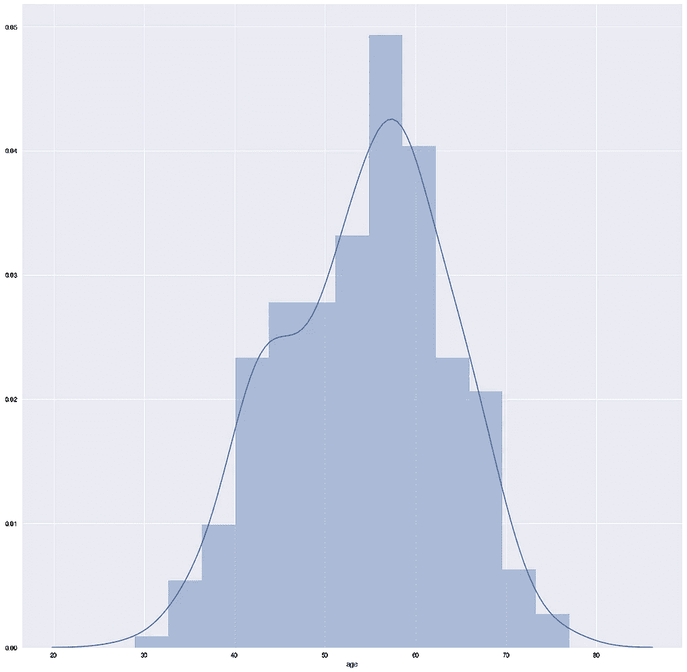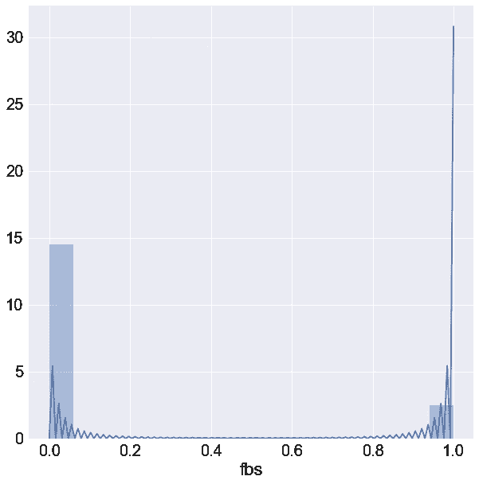

为了更仔细地观察，让我们来看看年龄和空腹血糖的分布。我们可以看到，年龄分布非常类似于高斯分布，而 fbs 是一个分类值。

**方差-协方差矩阵**

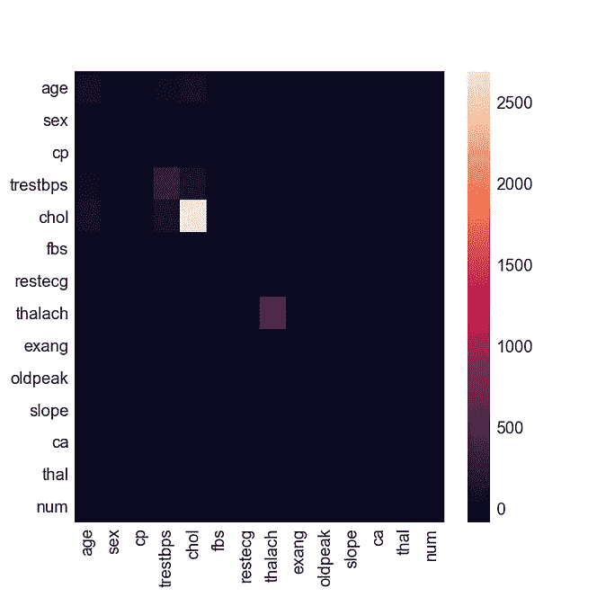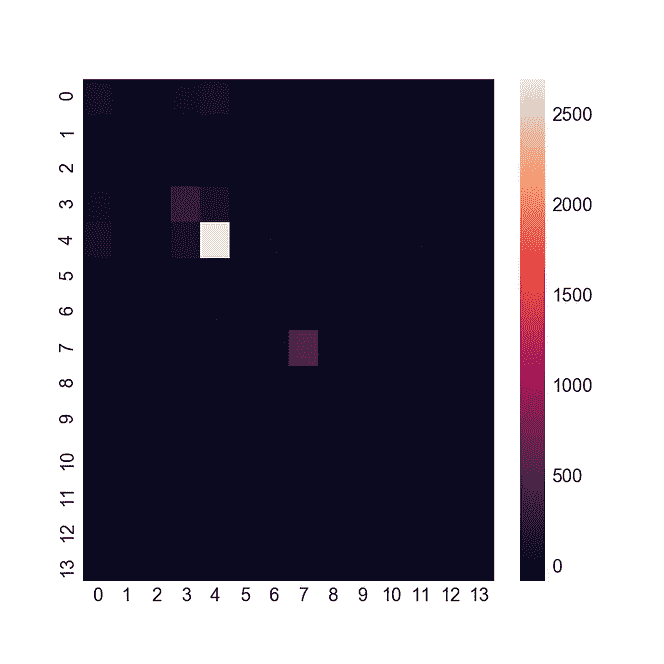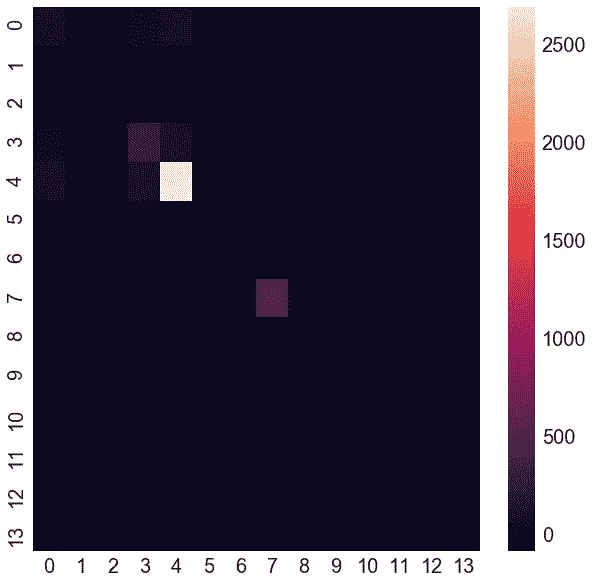

上面看到的所有图像都是方差-协方差矩阵，然而不同的是，对于最左边的一个，我使用 Numpy 手动计算。中间的那个我用了 Tensorflow，最后右边的那个我用了内置的数据框函数。而且我们可以观察到，大多数属性并没有很强的协变关系。

**相关矩阵**

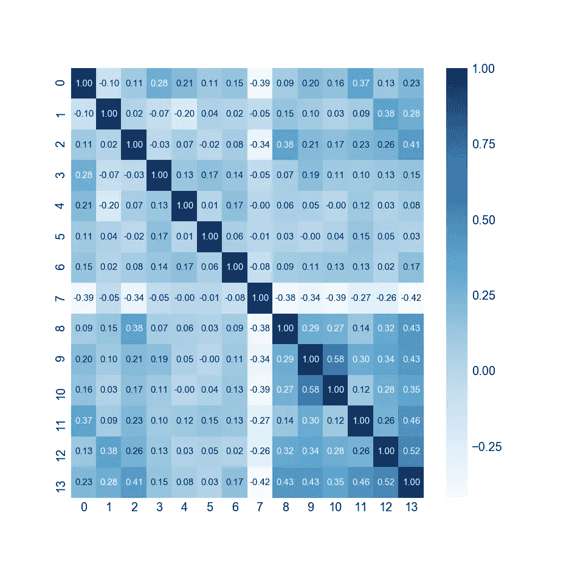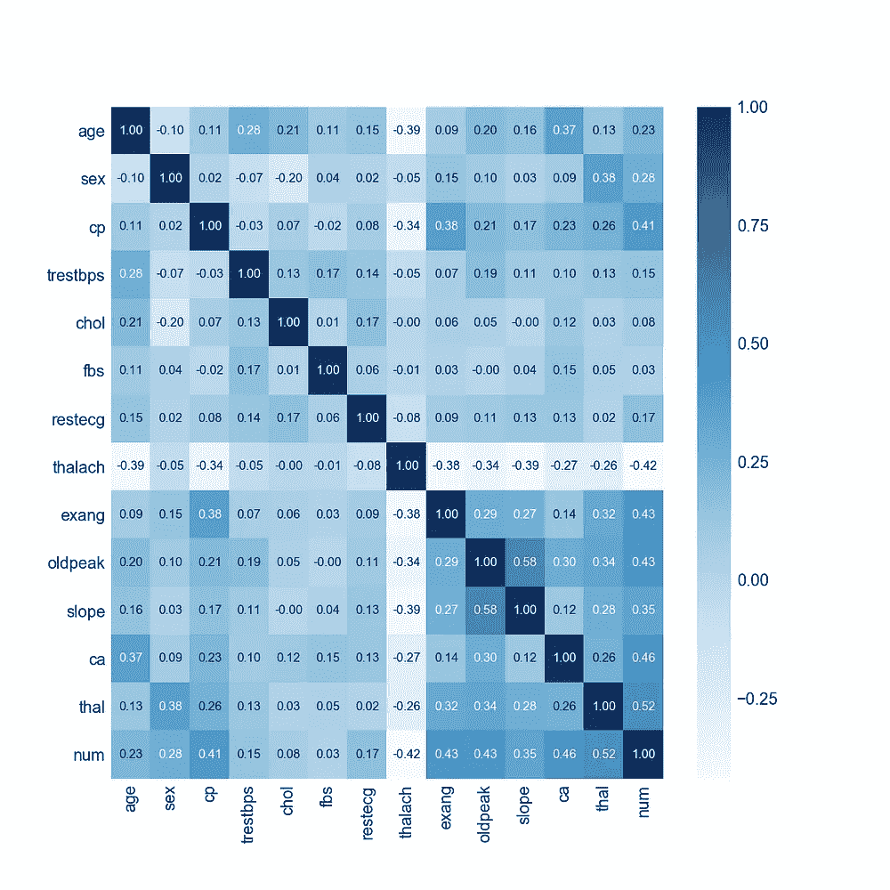

同样，左边的图像是通过手动 numpy 计算创建的，我们可以观察到，在这些属性中，实际上彼此之间有很强的相关性。(尤其是心脏病和 thal)

**交互式直方图**

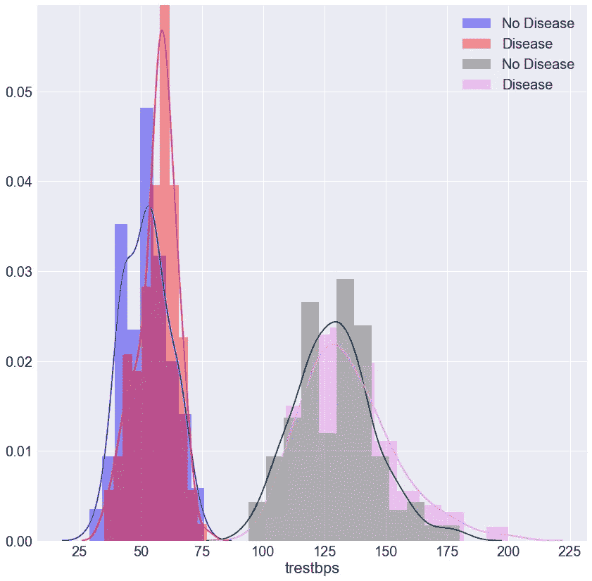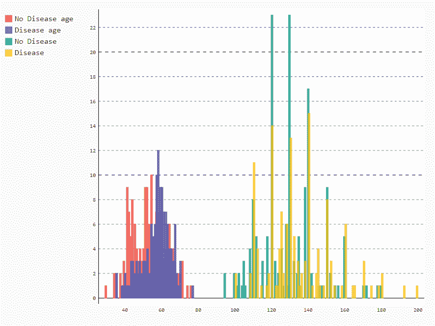

现在我知道这是多余的，但我想包括，因为有一个互动的部分。[👌](https://emojipedia.org/ok-hand-sign/) [👌](https://emojipedia.org/ok-hand-sign/)

**柱状图/箱线图/对线图**

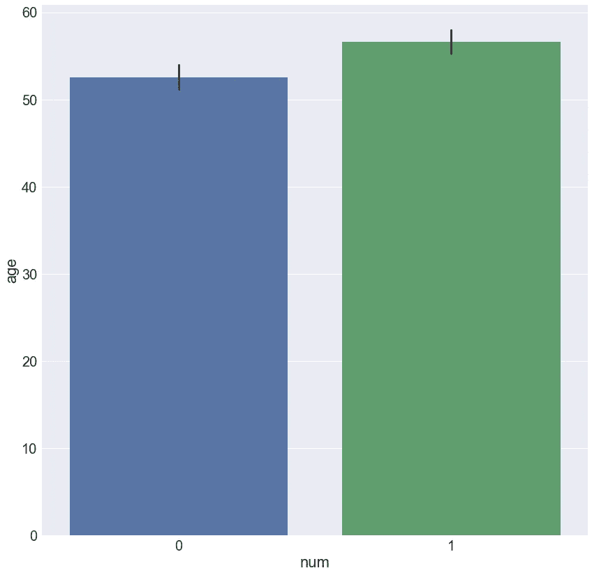

让我们先来看看心脏病患者和非心脏病患者的平均年龄。我们可以观察到年龄稍大的人患心脏病的几率更大。(仅来自这个数据集。)

同样，当我们创建一个与患有/未患有心脏病的平均人数相关的方框图时，我们可以观察到年轻人患心脏病的可能性较小。

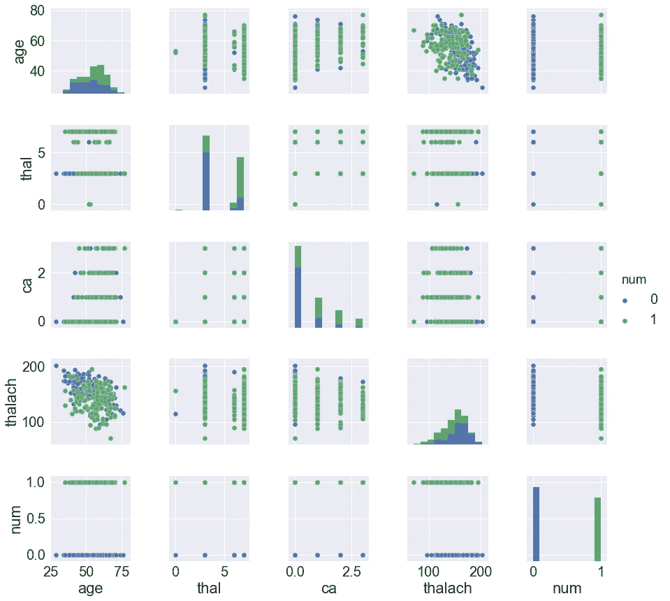

最后，我想展示这一对相对于一些属性的图，如年龄、身高、ca
(胸痛类型)、thalach(达到的最大心率)和心脏病的存在。从相关矩阵中可以看出，我们可以观察到年龄和 thalach 之间有很强的负相关性。

**一致流形逼近和投影嵌入(UMAP)
t 分布随机邻居嵌入(t-SNE)**

再次遵循之前[博文](/basic-medical-data-exploration-with-interactive-code-aa26ed432265)的传统，我想执行简单的降维技术，看看我们是否能够将数据分成两组。如上所述，umap 在聚类每个类方面做得相当不错。

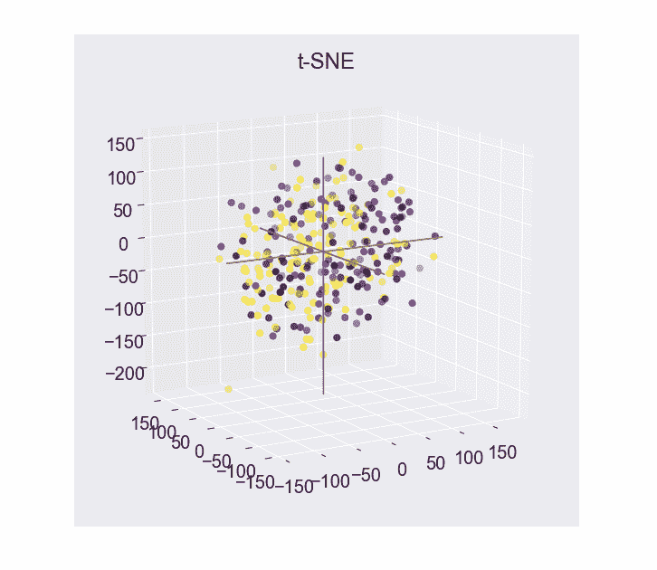

最后，上面是 t-SNE 降维的结果图。

**GitHub 代码**

要获取这篇文章的代码，请[点击这里。](https://github.com/JaeDukSeo/Daily-Neural-Network-Practice-2/blob/master/Medical_EXP/heart/heart.ipynb)

**遗言**

这是另一个很好的绘图和简单的数据探索会议，我希望在不久的将来创造更多的先进的阴谋。

如果发现任何错误，请发电子邮件到 jae.duk.seo@gmail.com 给我，如果你想看我所有写作的列表，请在这里查看我的网站。

同时，在我的推特[这里](https://twitter.com/JaeDukSeo)关注我，并访问[我的网站](https://jaedukseo.me/)，或我的 [Youtube 频道](https://www.youtube.com/c/JaeDukSeo)了解更多内容。我还实现了[广残网，请点击这里查看博文 pos](https://medium.com/@SeoJaeDuk/wide-residual-networks-with-interactive-code-5e190f8f25ec) t。

**参考**

1.  UCI 机器学习知识库:心脏病数据集。(2018).Archive.ics.uci.edu。检索于 2018 年 6 月 25 日，来自[https://archive.ics.uci.edu/ml/datasets/Heart+Disease](https://archive.ics.uci.edu/ml/datasets/Heart+Disease)
2.  RPubs——用于心脏病预测的机器学习。(2016).Rpubs.com。检索于 2018 年 6 月 25 日，来自 https://rpubs.com/mbbrigitte/heartdisease
3.  DataFrame，H. (2018)。如何给熊猫数据框添加标题行？堆栈溢出。检索于 2018 年 6 月 25 日，来自[https://stack overflow . com/questions/34091877/how-to-add-header-row-to-a-pandas-data frame](https://stackoverflow.com/questions/34091877/how-to-add-header-row-to-a-pandas-dataframe)
4.  JaeDukSeo/每日神经网络实践 2。(2018).GitHub。检索于 2018 年 6 月 25 日，来自[https://github . com/JaeDukSeo/Daily-Neural-Network-Practice-2/blob/master/Medical _ EXP/Pima _ Indians/a . ipynb](https://github.com/JaeDukSeo/Daily-Neural-Network-Practice-2/blob/master/Medical_EXP/Pima_Indians/a.ipynb)
5.  熊猫。data frame . describe—pandas 0 . 23 . 1 文档。(2018).Pandas.pydata.org。检索于 2018 年 6 月 25 日，来自[https://pandas . py data . org/pandas-docs/stable/generated/pandas。DataFrame.describe.html](https://pandas.pydata.org/pandas-docs/stable/generated/pandas.DataFrame.describe.html)
6.  Pandas DataFrame:替换一列中的所有值，b. (2018)。Pandas DataFrame:根据条件替换列中的所有值。堆栈溢出。检索于 2018 年 6 月 25 日，来自[https://stack overflow . com/questions/31511997/pandas-data frame-replace-all-values-in-a-column-based-on-condition](https://stackoverflow.com/questions/31511997/pandas-dataframe-replace-all-values-in-a-column-based-on-condition)
7.  系列？，P. (2018)。熊猫—如何在 DataFrame 系列中用零值替换字符串？。堆栈溢出。检索于 2018 年 6 月 25 日，来自[https://stack overflow . com/questions/33440234/pandas-how-to-replace-string-with zero-values-in-a-data frame-series](https://stackoverflow.com/questions/33440234/pandas-how-to-replace-string-with-zero-values-in-a-dataframe-series)
8.  pandas . to _ numeric-pandas 0 . 23 . 1 文档。(2018).Pandas.pydata.org。检索于 2018 年 6 月 25 日，来自[https://pandas . pydata . org/pandas-docs/stable/generated/pandas . to _ numeric . html](https://pandas.pydata.org/pandas-docs/stable/generated/pandas.to_numeric.html)
9.  dataframe，H. (2018)。我如何用零替换熊猫数据帧的一列中的所有 NaN 值？堆栈溢出。检索于 2018 年 6 月 25 日，来自[https://stack overflow . com/questions/13295735/how-can-I-replace-all-the-nan-values with a-column-of-a-pandas-data fra](https://stackoverflow.com/questions/13295735/how-can-i-replace-all-the-nan-values-with-zeros-in-a-column-of-a-pandas-datafra)
10.  dataframe，P. (2018 年)。使用 seaborn 为数据帧绘制直方图。堆栈溢出。检索于 2018 年 6 月 25 日，来自[https://stack overflow . com/questions/32923301/plotting-histogram-using-seaborn-for-a-data frame/33137122](https://stackoverflow.com/questions/32923301/plotting-histogram-using-seaborn-for-a-dataframe/33137122)
11.  0.11.0，h. (2018)。如何为熊猫增加 Dataframe.hist 的图形大小 0.11.0？堆栈溢出。检索于 2018 年 6 月 25 日，来自[https://stack overflow . com/questions/43392588/how-to-increase-the-figure-size-of-data frame-hist-for-pandas-0-11-0](https://stackoverflow.com/questions/43392588/how-to-increase-the-figure-size-of-dataframe-hist-for-pandas-0-11-0)
12.  matplotlib？，H. (2018)。如何改变用 matplotlib 绘制的图形的大小？。堆栈溢出。检索于 2018 年 6 月 25 日，来自[https://stack overflow . com/questions/332289/how-do-you-change-the-size-of-figures-drawn-with-matplotlib](https://stackoverflow.com/questions/332289/how-do-you-change-the-size-of-figures-drawn-with-matplotlib)
13.  可视化数据集的分布— seaborn 0.8.1 文档。(2018).Seaborn.pydata.org。检索于 2018 年 6 月 25 日，来自[https://seaborn.pydata.org/tutorial/distributions.html](https://seaborn.pydata.org/tutorial/distributions.html)
14.  seaborn . distplot-seaborn 0 . 8 . 1 文档。(2018).Seaborn.pydata.org。检索于 2018 年 6 月 25 日，来自[https://seaborn.pydata.org/generated/seaborn.distplot.html](https://seaborn.pydata.org/generated/seaborn.distplot.html)
15.  零？，H. (2018)。如何将现有 Pandas 数据帧的所有值设置为零？。堆栈溢出。检索于 2018 年 6 月 25 日，来自[https://stack overflow . com/questions/42636765/how-to-set-the-all-the-values-of-an-existing-pandas-data frame-to-zero](https://stackoverflow.com/questions/42636765/how-to-set-all-the-values-of-an-existing-pandas-dataframe-to-zero)
16.  DataFrame，C. (2018)。将数据帧中的字符串转换为浮点数。堆栈溢出。检索于 2018 年 6 月 25 日，来自[https://stack overflow . com/questions/16729483/converting-strings-to-floats-in-a-data frame](https://stackoverflow.com/questions/16729483/converting-strings-to-floats-in-a-dataframe)
17.  pandas & Seaborn——Python | Tryolabs 博客中的数据处理和可视化指南。(2017).Tryolabs.com。检索于 2018 年 6 月 25 日，来自[https://tryolabs . com/blog/2017/03/16/pandas-seaborn-a-guide-to-handle-visualize-data-elegantly/](https://tryolabs.com/blog/2017/03/16/pandas-seaborn-a-guide-to-handle-visualize-data-elegantly/)
18.  协方差矩阵。(2018).Stattrek.com。检索于 2018 年 6 月 25 日，来自 https://stattrek.com/matrix-algebra/covariance-matrix.aspx
19.  如何在 Python 中构建方差-协方差矩阵？(2015).Firsttimeprogrammer.blogspot.com。检索于 2018 年 6 月 25 日，来自[http://first time programmer . blogspot . com/2015/01/how-to-build-variance-协方差-matrix.html](http://firsttimeprogrammer.blogspot.com/2015/01/how-to-build-variance-covariance-matrix.html)
20.  seaborn . bar plot-seaborn 0 . 8 . 1 文档。(2018).Seaborn.pydata.org。检索于 2018 年 6 月 25 日，来自[https://seaborn.pydata.org/generated/seaborn.barplot.html](https://seaborn.pydata.org/generated/seaborn.barplot.html)
21.  seaborn . pair plot-seaborn 0 . 8 . 1 文档。(2018).Seaborn.pydata.org。检索于 2018 年 6 月 25 日，来自[https://seaborn.pydata.org/generated/seaborn.pairplot.html](https://seaborn.pydata.org/generated/seaborn.pairplot.html)
22.  3D 散点图— Matplotlib 2.2.2 文档。(2018).Matplotlib.org。检索于 2018 年 6 月 25 日，来自[https://matplotlib.org/gallery/mplot3d/scatter3d.html](https://matplotlib.org/gallery/mplot3d/scatter3d.html)
23.  Pyplot 教程— Matplotlib 2.0.2 文档。(2018).Matplotlib.org。检索于 2018 年 6 月 25 日，来自[https://matplotlib.org/users/pyplot_tutorial.html](https://matplotlib.org/users/pyplot_tutorial.html)
24.  笔记本，P. (2018)。Python & Matplotlib:在 Jupyter Notebook 中进行 3D 绘图交互。堆栈溢出。检索于 2018 年 6 月 25 日，来自[https://stack overflow . com/questions/38364435/python-matplotlib-make-3d-plot-interactive-in-jupyter-notebook](https://stackoverflow.com/questions/38364435/python-matplotlib-make-3d-plot-interactive-in-jupyter-notebook)
25.  颜色示例代码:colormaps _ reference . py—Matplotlib 2 . 0 . 2 文档。(2018).Matplotlib.org。检索于 2018 年 6 月 25 日，来自[https://matplotlib . org/examples/color/colormaps _ reference . html](https://matplotlib.org/examples/color/colormaps_reference.html)
26.  r:解一个方程组。(2018).Stat.ethz.ch 于 2018 年 6 月 25 日检索，来自[https://stat . ethz . ch/R-manual/R-devel/library/base/html/solve . html](https://stat.ethz.ch/R-manual/R-devel/library/base/html/solve.html)
27.  r 求解函数示例— EndMemo。(2018).Endmemo.com。检索于 2018 年 6 月 25 日，来自 http://www.endmemo.com/program/R/solve.php
28.  r:标准差。(2018).Stat.ethz.ch 于 2018 年 6 月 25 日检索，来自[http://stat . ethz . ch/R-manual/R-devel/library/stats/html/SD . html](http://stat.ethz.ch/R-manual/R-devel/library/stats/html/sd.html)
29.  (2018).Users.stat.umn.edu。检索于 2018 年 6 月 25 日，来自[http://users.stat.umn.edu/~helwig/notes/datamat-Notes.pdf](http://users.stat.umn.edu/~helwig/notes/datamat-Notes.pdf)
30.  相关和依赖。(2018).En.wikipedia.org。检索于 2018 年 6 月 25 日，来自[https://en.wikipedia.org/wiki/Correlation_and_dependence](https://en.wikipedia.org/wiki/Correlation_and_dependence)
31.  霍尔茨，Y. (2017)。#372 3D PCA 结果。Python 图表库。检索于 2018 年 6 月 26 日，来自[https://python-graph-gallery.com/372-3d-pca-result/](https://python-graph-gallery.com/372-3d-pca-result/)
32.  操作员，I. (2018)。Tensorflow 中的交互式会话-卷积运算符的不同输出。堆栈溢出。检索于 2018 年 6 月 26 日，来自[https://stack overflow . com/questions/40221651/interactive-session-in-tensor flow-different-output-for-convolution-operator](https://stackoverflow.com/questions/40221651/interactive-session-in-tensorflow-different-output-for-convolution-operator)
33.  tensorflow，D. (2018)。张量流中两个向量的点积。堆栈溢出。检索于 2018 年 6 月 26 日，来自[https://stack overflow . com/questions/40670370/tensor flow 中两个向量的点积](https://stackoverflow.com/questions/40670370/dot-product-of-two-vectors-in-tensorflow)
34.  安装 mpld3 —将 Matplotlib 引入浏览器。(2018).mpld 3 . github . io . 2018 年 6 月 26 日检索，来自[http://mpld3.github.io/install.html](http://mpld3.github.io/install.html)
35.  NumPy . histogram—NumPy 1.14 版手册。(2018).Docs.scipy.org。检索于 2018 年 6 月 26 日，来自[https://docs . scipy . org/doc/numpy/reference/generated/numpy . histogram . html](https://docs.scipy.org/doc/numpy/reference/generated/numpy.histogram.html)
36.  使用 pygal 在 IPython 笔记本中进行交互式绘图。(2015).伊诺·德·布鲁因。检索于 2018 年 6 月 26 日，来自 http://ino.pm/blog/ipython-pygal/#.WzGzS6dKiUk
37.  使用交互式代码探索基础医学数据。(2018).走向数据科学。检索于 2018 年 6 月 26 日，来自[https://towards data science . com/basic-medical-data-exploration-with-interactive-code-aa 26 ed 432265](/basic-medical-data-exploration-with-interactive-code-aa26ed432265)
38.  JaeDukSeo/每日神经网络实践 2。(2018).GitHub。检索于 2018 年 6 月 26 日，来自[https://github . com/JaeDukSeo/Daily-Neural-Network-Practice-2/blob/master/Medical _ EXP/heart/heart . ipynb](https://github.com/JaeDukSeo/Daily-Neural-Network-Practice-2/blob/master/Medical_EXP/heart/heart.ipynb)