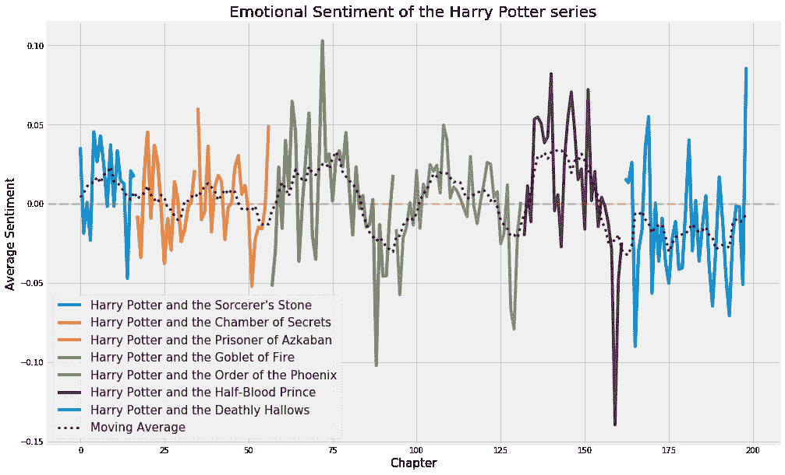
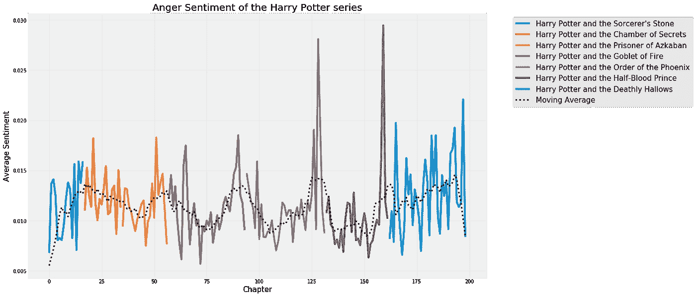
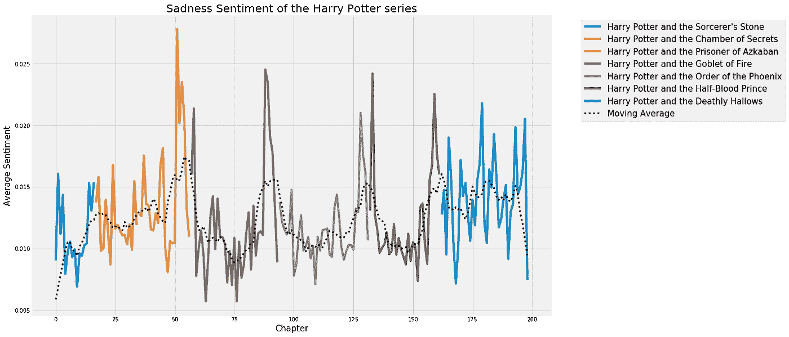
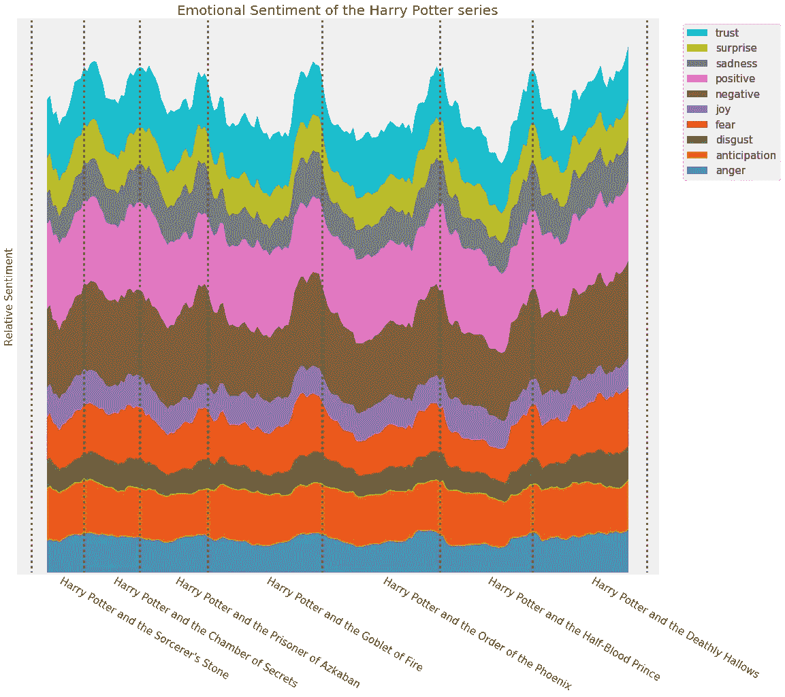
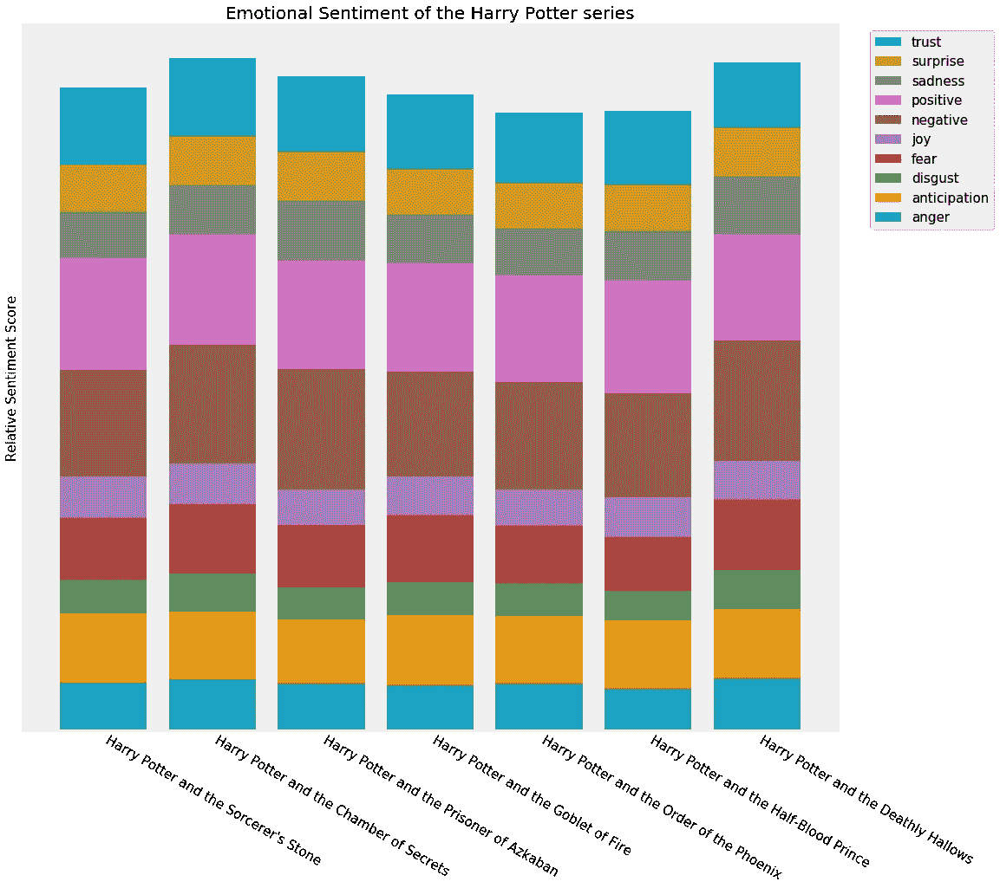

# 《哈利·波特》文本的情感分析

> 原文：<https://towardsdatascience.com/basic-nlp-on-the-texts-of-harry-potter-sentiment-analysis-1b474b13651d?source=collection_archive---------4----------------------->

## 附带 Matplotlib 高级特性的附加教程！


我是 Greg Rafferty，湾区的数据科学家。你可以在我的 [github](https://github.com/raffg/harry_potter_nlp) 上查看这个项目的代码。如有任何问题，请随时联系我！

在这一系列的文章中，我通过《哈利·波特》的镜头来看一些简便的自然语言处理技术。本系列之前关于基本自然语言处理的文章着眼于使用潜在狄利克雷分配的[主题建模](/basic-nlp-on-the-texts-of-harry-potter-topic-modeling-with-latent-dirichlet-allocation-f3c00f77b0f5)、[正则表达式](/regex-on-the-texts-of-harry-potter-96b8a3878303)和[文本摘要](/text-summarization-on-the-books-of-harry-potter-5e9f5bf8ca6c)。

## 什么是情感分析？

在之前的一篇文章中，我研究了主题建模，这是一种学习给定文本主题的自然语言处理技术。情感分析的存在是为了了解*人们对那个话题说了什么*——是好是坏？随着互联网在我们日常生活中的使用越来越多，每天每秒钟都有大量的非结构化文本发布在博客帖子、论坛、社交媒体和评论网站上，仅举几例。情感分析系统可以获取这种非结构化数据，并自动为其添加结构，捕捉公众对产品、服务、品牌、政治等的看法。例如，这些数据在市场分析、公共关系、产品评论、净推广者评分、产品反馈和客户服务等领域具有巨大的价值。

我已经用哈利波特的文本演示了很多这样的 NLP 任务。这些书富含读者能从内心感受到的情感体验。电脑能捕捉到这种感觉吗？让我们来看看。

## VADER

我用 C.J .休顿的 [VADER](https://github.com/cjhutto/vaderSentiment) 包提取每本书的感悟。VADER 是一个专门针对社交媒体的词汇和基于规则的工具，它代表了 Valence**A**ware**D**ictionary 和 s**E**entiment**R**easing。给定一个文本字符串，它输出一个介于 0 和 1 之间的十进制数来表示文本的消极、积极和中性，以及一个介于-1 和 1 之间的复合分数，它是一个聚合度量。

关于 VADER 软件包的开发、验证和评估的完整描述可以在[本文](http://comp.social.gatech.edu/papers/icwsm14.vader.hutto.pdf)中阅读，但要点是该软件包的作者首先构建了一个与情感相关的词汇特征列表，然后将该列表与一些描述短语的语法结构如何增强或减弱情感的规则相结合。当与人类评分员进行测试时，VADER 的准确率高达 96%到 84%。

VADER 最擅长短文本(最多两个句子)，把它一次应用到一整章会导致极端和大部分没有价值的分数。相反，我逐个循环每个句子，得到 VADER 分数，然后取一章中所有句子的平均值。



Goblet of Fire, Chapter 16: Harry discovers the missionary position

通过绘制每本书每一章的 VADER 复合乐谱，我们可以清楚地标记书中的事件。上图中三个最大的峰值是哈利在第 70 章左右被火焰杯选中，塞德里克·迪戈里在第 88 章左右死亡，以及邓布利多在第 160 章左右死亡。

下面是生成该图表的代码([我的 Github](https://github.com/raffg/harry_potter_nlp/blob/master/sentiment_analysis.ipynb) 上有完整的笔记本)。数据存在于字典中，以每本书的书名作为关键字；每本书的值是另一个字典，每个章节的编号是一个键。每个章节的值是一个由章节标题和章节文本组成的元组。我定义了一个函数来计算数据的移动平均值，这基本上使曲线变得平滑了一点，并且更容易看到贯穿故事的长的多章节弧线。为了将每本书绘制成不同的颜色，我创建了一个名为`book_indices`的字典，其中每本书的标题作为关键字，值是该书的起始章节号和结束章节号的 2 元素元组(就好像所有的书都与整个系列中按顺序编号的章节连接在一起)。然后，我根据章节号将故事分成几个部分。

```
import matplotlib.pyplot as plt# Use FiveThirtyEight style theme
plt.style.use('fivethirtyeight')# Moving Average function used for the dotted line
def movingaverage(interval, window_size):
    window = np.ones(int(window_size))/float(window_size)
    return np.convolve(interval, window, 'same')length = sum([len(hp[book]) for book in hp])
x = np.linspace(0, length - 1, num=length)
y = [hp[book][chapter][2]['compound'] for book in hp for chapter in hp[book]]plt.figure(figsize=(15, 10))
for book in book_indices:
    plt.plot(x[book_indices[book][0]: book_indices[book][1]],
             y[book_indices[book][0]: book_indices[book][1]],
             label=book)
plt.plot(movingaverage(y, 10), color='k', linewidth=3, linestyle=':', label = 'Moving Average')
plt.axhline(y=0, xmin=0, xmax=length, alpha=.25, color='r', linestyle='--', linewidth=3)
plt.legend(loc='best', fontsize=15)
plt.title('Emotional Sentiment of the Harry Potter series', fontsize=20)
plt.xlabel('Chapter', fontsize=15)
plt.ylabel('Average Sentiment', fontsize=15)
plt.show()
```

我还使用 [TextBlob 朴素贝叶斯和模式分析器](https://textblob.readthedocs.io/en/dev/_modules/textblob/en/sentiments.html)制作了同样的图表，结果更差(这些图表见我的 Github 上的 [Jupyter 笔记本](https://github.com/raffg/harry_potter_nlp/blob/master/sentiment_analysis.ipynb))。朴素贝叶斯模型是根据电影评论训练出来的，这些电影评论一定不能很好地解释哈利波特世界。模式分析器工作得更好(几乎和 VADER 一样好)；它基于[模式](https://www.clips.uantwerpen.be/pattern)库，一个与 VADER 非常相似的基于规则的模型。

## 情感词汇

我还通过使用由加拿大国家研究委员会创建的超过 14000 个单词的[词典](http://saifmohammad.com/WebPages/NRC-Emotion-Lexicon.htm)来研究情绪，每个单词都被分为与两种情绪(消极、积极)或八种情绪(愤怒、期待、厌恶、恐惧、快乐、悲伤、惊讶、信任)中的任何一种相关或不相关。他们友好地向我提供了词典的访问权限，我写了一个 Python 脚本，它循环一章中的每个单词，在词典中查找，并输出该单词所关联的任何情绪。然后，每一章被赋予每种情绪的分数，该分数对应于该章包含的与该情绪相关联的词的数量与该章中的总字数的比率(这基本上使分数标准化)。

这是“愤怒”和“悲伤”情绪的曲线图。我觉得很有意思的是，愤怒总是伴随着悲伤而存在，但悲伤有时可以在没有愤怒的情况下存在:



Wow, Voldemort. You really pissed off Harry when you killed the adults in his life



Those mood swings hit hard during puberty

再一次，看看我的 Github 上的 [Jupyter 笔记本](https://github.com/raffg/harry_potter_nlp/blob/master/sentiment_analysis.ipynb)，看看所有情绪的详细图表。这是一个精简版:


让我们来看看我是如何制作这些支线剧情的:

```
length = sum([len(hp[book]) for book in hp])
x = np.linspace(0, length - 1, num=length)fig, ax = plt.subplots(4, 3, figsize=(15, 15), facecolor='w', edgecolor='k')
fig.subplots_adjust(hspace = .5, wspace=.1)
fig.suptitle('Sentiment of the Harry Potter series', fontsize=20, y=1.02)
fig.subplots_adjust(top=0.88)ax = ax.ravel()for i, emotion in enumerate(emotions):
    y = [hp_df.loc[book].loc[hp[book][chapter][0]][emotion] for book in hp for chapter in hp[book]]
    for book in book_indices:
        ax[i].plot(x[book_indices[book][0]: book_indices[book][1]],
                 y[book_indices[book][0]: book_indices[book][1]],
                 label=book, linewidth=2)ax[i].set_title('{} Sentiment'.format(emotion.title()))
    ax[i].set_xticks([])fig.legend(list(hp), loc='upper right', fontsize=15, bbox_to_anchor=(.85, .2))
fig.tight_layout()
fig.delaxes(ax[-1])
fig.delaxes(ax[-2])
plt.show()
```

但是看到所有的情绪如何相互比较真的变得很有趣。用这么多的差异叠加 10 条线很快就变得一团糟，所以我再次使用移动平均线:


有趣的是，矛盾的情绪会相互对立，最明显的是上面代表“积极”和“消极”情绪的粉色和棕色线条。请注意，由于移动平均窗口大小为 20 个数据点，前 10 章和后 10 章已从图中删除。

我去掉了 y 轴，因为这些数字对我们来说毫无意义(仅仅是小数:那种情绪的单词量与该章总单词量的比率)。我还删除了水平和垂直图表线，以清理情节。我并不特别在意标记常规的章节号，但我确实想在书上做标记；因此，我添加了那些垂直的虚线。图例在这个图中被颠倒了，这对于可读性或任何东西来说都不是必需的，但我这样做是为了与接下来的面积图和柱形图保持一致。

我是这样做的:

```
# use the Tableau color scheme of 10 colors
tab10 = matplotlib.cm.get_cmap('tab10')length = sum([len(hp[book]) for book in hp])
window = 20# use index slicing to remove data points outside the window
x = np.linspace(0, length - 1, num=length)[int(window / 2): -int(window / 2)]fig = plt.figure(figsize=(15, 15))
ax =fig.add_subplot(1, 1, 1)# Loop over the emotions with enumerate in order to track colors
for c, emotion in enumerate(emotions):
    y = movingaverage([hp_df.loc[book].loc[hp[book][chapter][0]][emotion] for book in hp for chapter in hp[book]], window)[int(window / 2): -int(window / 2)]
    plt.plot(x, y, linewidth=5, label=emotion, color=(tab10(c)))

# Plot vertical lines marking the books
for book in book_indices:
    plt.axvline(x=book_indices[book][0], color='black', linewidth=2, linestyle=':')
plt.axvline(x=book_indices[book][1], color='black', linewidth=2, linestyle=':')plt.legend(loc='best', fontsize=15, bbox_to_anchor=(1.2, 1))
plt.title('Emotional Sentiment of the Harry Potter series', fontsize=20)
plt.ylabel('Relative Sentiment', fontsize=15)# Use the book titles for X ticks, rotate them, center the left edge
plt.xticks([(book_indices[book][0] + book_indices[book][1]) / 2 for book in book_indices],
           list(hp),
           rotation=-30,
           fontsize=15,
           ha='left')
plt.yticks([])# Reverse the order of the legend
handles, labels = ax.get_legend_handles_labels()
ax.legend(handles[::-1], labels[::-1], loc='best', fontsize=15, bbox_to_anchor=(1.2, 1))ax.grid(False)plt.show()
```

我还做了一个面积图来显示每一章的整体情感品质。这也是一个移动平均值，以消除更极端的峰值，并更好地显示所有书籍中的故事:



这本书似乎以一点前一个故事的拖尾情绪开始，但在中间章节很快平静下来，只是在结尾时又回来了。

```
length = sum([len(hp[book]) for book in hp])
window = 10
x = np.linspace(0, length - 1, num=length)[int(window / 2): -int(window / 2)]fig = plt.figure(figsize=(15, 15))
ax = fig.add_subplot(1, 1, 1)y = [movingaverage(hp_df[emotion].tolist(), window)[int(window / 2): -int(window / 2)] for emotion in emotions]plt.stackplot(x, y, colors=(tab10(0),
                            tab10(.1),
                            tab10(.2),
                            tab10(.3),
                            tab10(.4),
                            tab10(.5),
                            tab10(.6),
                            tab10(.7),
                            tab10(.8),
                            tab10(.9)), labels=emotions)# Plot vertical lines marking the books
for book in book_indices:
    plt.axvline(x=book_indices[book][0], color='black', linewidth=3, linestyle=':')
plt.axvline(x=book_indices[book][1], color='black', linewidth=3, linestyle=':')plt.title('Emotional Sentiment of the Harry Potter series', fontsize=20)
plt.xticks([(book_indices[book][0] + book_indices[book][1]) / 2 for book in book_indices],
           list(hp),
           rotation=-30,
           fontsize=15,
           ha='left')
plt.yticks([])
plt.ylabel('Relative Sentiment', fontsize=15)# Reverse the legend
handles, labels = ax.get_legend_handles_labels()
ax.legend(handles[::-1], labels[::-1], loc='best', fontsize=15, bbox_to_anchor=(1.2, 1))ax.grid(False)plt.show()
```

请注意，在此图表中，为了可读性，反转图例变得非常必要。默认情况下，图例项是按字母顺序向下添加的，但数据是自下而上堆叠的。因此，图例和面积图的颜色走向相反——在我看来，非常混乱，难以理解。因此，在底部绘制“愤怒”,我也希望它在传奇的底部，同样在顶部绘制“信任”。

最后，一个堆叠条形图显示了各种情绪在书籍中的权重:



自然，与任何积极情绪相关的词也会与“积极”情绪相关，同样也与“消极”情绪相关，所以这两种情绪承载了书籍的大部分情绪质量也就不足为奇了。我发现值得注意的是，每本书的情绪相对一致，只是在数量上略有不同，但重量一致，除了红色的“恐惧”情绪；它似乎是整个系列中变化最大的。我也希望随着赌注越来越高，在整个系列赛中，情感的累积量会增加；然而，虽然最后一本书确实是最高的，但其他 6 本书没有显示出这种逐渐增加，而是几乎相反，从第 2 本书开始持续下降。

```
books = list(hp)
margin_bottom = np.zeros(len(books))fig = plt.figure(figsize=(15, 15))
ax = fig.add_subplot(1, 1, 1)for c, emotion in enumerate(emotions):
    y = np.array(hp_df2[emotion])
    plt.bar(books, y, bottom=margin_bottom, label=emotion, color=(tab10(c)))
    margin_bottom += y# Reverse the legend
handles, labels = ax.get_legend_handles_labels()
ax.legend(handles[::-1], labels[::-1], loc='best', fontsize=15, bbox_to_anchor=(1.2, 1))plt.title('Emotional Sentiment of the Harry Potter series', fontsize=20)
plt.xticks(books, books, rotation=-30, ha='left', fontsize=15)
plt.ylabel('Relative Sentiment Score', fontsize=15)
plt.yticks([])
ax.grid(False)
plt.show()
```

这个图中棘手的地方是使用`margin_bottom`变量来堆叠每一列。除此之外，它只是使用了一些以前剧情中的技巧。