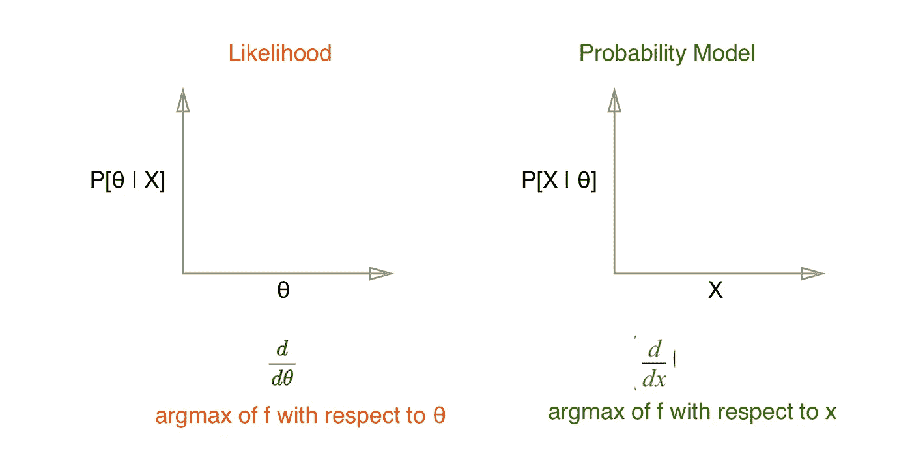
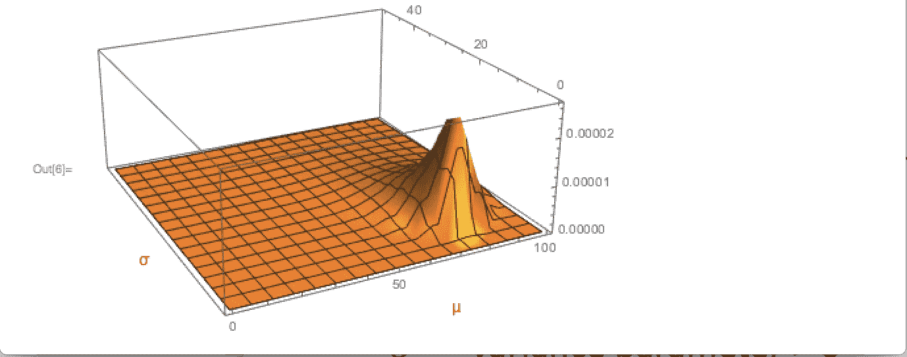

# 最大似然估计的贝叶斯分类器

> 原文：<https://towardsdatascience.com/bayes-classifier-with-maximum-likelihood-estimation-4b754b641488?source=collection_archive---------5----------------------->

监督学习的基本概念是给你带标签的数据来训练模型。并且我们假设有一个最优且相对简单的分类器，它将给定的输入映射到大多数输入的适当分类。训练模型后，目标是找到一个与最佳分类器一样有效的近似分类器，以便相同的分类器可以用于未标记/看不见的数据。

# **统计模型方法**

开始时，**标记的训练数据**用于训练目的。利用测试数据，假设某个概率分布，并且预先计算其所需的参数，以便在分类器中使用。

[http://www.cs.columbia.edu/~verma/classes/ml/lec/lec1_intro_mle_bayes_naive_evaluation.pdf](http://www.cs.columbia.edu/~verma/classes/ml/lec/lec1_intro_mle_bayes_naive_evaluation.pdf)

当给定初始数据时，此处假设数据是独立选取且同分布的(i.i.d .)，然后检查数据类型以决定可以使用什么概率模型。例如，如果数据是掷硬币，则使用伯努利模型，如果是掷骰子，则可以使用多项式模型。在我下面的例子中，使用了高斯模型，这是最常见的现象。为了确保分布是正态的，通常会进行[正态性测试](https://en.wikipedia.org/wiki/Normality_test)。

在学习算法阶段，其输入是训练数据，输出是分类器所需的参数。为了从训练数据中选择分类器的参数，可以使用最大似然估计(MLE)、贝叶斯估计(最大后验概率)或损失准则的优化。在本文中，我将介绍一个使用最大似然估计贝叶斯分类器参数的例子。

**使用最大似然估计分类器的参数**

第一步是我们需要弄清楚什么是样本分布。给定一系列训练数据，假设正态高斯总体，sigma 和 mu 的估计值是多少？使用统计方法，我们将假设一个概率模型，这意味着我们将预测假设某个概率分布模型的数据的可能性有多大？然后，我们可以通过似然估计找到最佳拟合概率模型。

[http://www.cs.columbia.edu/~verma/classes/ml/lec/lec1_intro_mle_bayes_naive_evaluation.pdf](http://www.cs.columbia.edu/~verma/classes/ml/lec/lec1_intro_mle_bayes_naive_evaluation.pdf) NOTE: L is for likelihood and P is for probability model

概率模型和可能性之间的差异:

(1)它们有不同的图形(2)当你对一个函数求导时，你对不同的变量求导(3) argmax 是针对不同的变量计算的。

值得注意的是，对于特定的θ和 X 值，似然函数和概率函数具有相同的输出(注意:我说的是一个特定的输出，而不是输出列表，因为它们的结果是不同的图形)。因此，**给定参数θ**，似然函数和概率函数的概率分布是相同的。在似然函数中，给定θ，你可以计算特征向量的概率分布。

**单变量高斯例子**

例如**给定一个人的体重，这个人是男是女？**

设 X 是一组重量数据。设 x_i 为第 I 个权重值。

设 Y 是一个类，y_0 是男性，y_1 是女性

**分类器** : *贝叶斯分类器*

[http://www.cs.columbia.edu/~verma/classes/ml/lec/lec1_intro_mle_bayes_naive_evaluation.pdf](http://www.cs.columbia.edu/~verma/classes/ml/lec/lec1_intro_mle_bayes_naive_evaluation.pdf)

argmax 选择提供最大输出值的输入。在这种情况下，给定一个权重值，它选择给出最高后验概率的性别。

[http://www.cs.columbia.edu/~verma/classes/ml/lec/lec1_intro_mle_bayes_naive_evaluation.pdf](http://www.cs.columbia.edu/~verma/classes/ml/lec/lec1_intro_mle_bayes_naive_evaluation.pdf)

利用贝叶斯定理，将 P[Y|X]替换为 P[X|Y]*P[Y]/P[X]。请注意，我们只对给出最高概率的 Y 值感兴趣，所以 P[X]不是我们感兴趣的，它独立于 P[Y]。所以，它可以从等式中去掉。

[http://www.cs.columbia.edu/~verma/classes/ml/lec/lec1_intro_mle_bayes_naive_evaluation.pdf](http://www.cs.columbia.edu/~verma/classes/ml/lec/lec1_intro_mle_bayes_naive_evaluation.pdf)

在对 y = y_0 计算上述等式一次和对 y = y_1 计算第二次之后，选择具有最高概率的 y 值。

但是我们不知道 P[X|Y](假设是女性或男性，得到权重的输入特征向量的概率)和 P[Y](男性或女性在人群中的分数)。这就是 MLE(最大似然估计)在估计这些概率时发挥作用的地方。

**P[Y]的估计**

P[Y]在学习阶段用最大似然估计。为了估计男性或女性的人口比例，使用 MLE 从训练数据计算男性或女性的比例。这里“m”是指男性群体，p 代表从测试数据中得到只有男性数据序列的概率，而(1-p)代表女性数据序列的概率。“n”代表总样本量。

为了得到 P[Y]，即男性或女性的分数人口，似然函数的导数设置为 0，我们可以求解 P。然后我们得到 m/n 作为分数人口。

**P[X | Y]的估计**

P[X|Y]是得到体重输入数据的概率(不管有无标注)，假设男性或女性。为了得到这个概率，我需要知道什么是(1)权重的总体概率分布以及(2)该分布所需的参数。假设概率分布为正态高斯分布；在本例中，单变量高斯分布。

[http://www.cs.columbia.edu/~verma/classes/ml/lec/lec1_intro_mle_bayes_naive_evaluation.pdf](http://www.cs.columbia.edu/~verma/classes/ml/lec/lec1_intro_mle_bayes_naive_evaluation.pdf)

但是我不知道 mu 和 sigma。因此，我将使用 MLE(最大似然估计)从我的训练数据中估计 mu 和 sigma 的值

Figure 5

每个模型是以给定的 x 值权重作为输入的 mu 和 sigma 的不同常数值的概率分布。请注意，权重的 x 值由似然函数提供。因为有无限对 mu 和 sigma，所以有无限多的这些模型。例如，假设女性的平均体重为 135 磅，给定的体重值为 110 磅，则输出概率约为 0.005。

[http://www.wolframalpha.com/input/?i=plot+PDF%5BNormalDistribution%5B135,+15%5D,+x%5D+from+x+%3D+0+to+200](http://www.wolframalpha.com/input/?i=plot+PDF%5BNormalDistribution%5B135,+15%5D,+x%5D+from+x+%3D+0+to+200)

[http://www.wolframalpha.com/input/?i=plot+PDF%5BNormalDistribution%5B135,+15%5D,+x%5D+from+x+%3D+0+to+200](http://www.wolframalpha.com/input/?i=plot+PDF%5BNormalDistribution%5B135,+15%5D,+x%5D+from+x+%3D+0+to+200)

似然函数所做的是采用具有 mu 和 sigma 值及其概率的模型，并输出获得 mu 和 sigma 的给定权重值的概率作为输入。

想象一下，图 5 围绕着一个 for 循环，它为每个模型运行；在这种情况下，无限数量的模型。结果，上面的三维图形被绘制出来。因为我们这里的目标是估计 sigma 和 mu 值，所以具有最高概率的 sigma 和 mu 值对(在图中具有峰值)将被选为估计值。

为了估计 sigma 和 mu 值，我们需要从似然函数图中找到最大值概率值，并查看 mu 和 sigma 值给我们的值。因此，我们对似然函数求导，将其设为 0，并求解 sigma 和 mu。然后这些值被用来计算 P[X|Y]。

**多元高斯例子**

例如**给定一个人的体重 x 身高，这个人是男是女？**

这与前面的例子非常相似。

首先，确定分类器为贝叶斯分类器。

[http://www.cs.columbia.edu/~verma/classes/ml/lec/lec1_intro_mle_bayes_naive_evaluation.pdf](http://www.cs.columbia.edu/~verma/classes/ml/lec/lec1_intro_mle_bayes_naive_evaluation.pdf)

P[Y =男性]和 P[Y =女性]是在学习算法阶段计算的**类先验值**。对于 P[X|Y =男性]和 P[X|Y =女性],在学习算法阶段估计多元高斯分布参数。

[http://www.cs.columbia.edu/~verma/classes/ml/lec/lec1_intro_mle_bayes_naive_evaluation.pdf](http://www.cs.columbia.edu/~verma/classes/ml/lec/lec1_intro_mle_bayes_naive_evaluation.pdf)

这是我们模型的概率分布:

[http://www.cs.columbia.edu/~verma/classes/ml/lec/lec1_intro_mle_bayes_naive_evaluation.pdf](http://www.cs.columbia.edu/~verma/classes/ml/lec/lec1_intro_mle_bayes_naive_evaluation.pdf)

这是可能性函数的图表:

[http://www.cs.columbia.edu/~verma/classes/ml/lec/lec1_intro_mle_bayes_naive_evaluation.pdf](http://www.cs.columbia.edu/~verma/classes/ml/lec/lec1_intro_mle_bayes_naive_evaluation.pdf)

**贝叶斯分类器和朴素贝叶斯的区别:**

与贝叶斯分类器不同，朴素贝叶斯假设特征是独立的。在我们的上述示例中，使用朴素贝叶斯，我们将假设体重和身高相互独立，并且其协方差为 0，这是多元高斯模型所需的参数之一。

现在的问题是**为什么我们要使用贝叶斯分类器？**因为它是最优分类器，这里证明的是。

那么这是否意味着**我们的分类问题解决了**？不会，因为我们需要极其多的数据根据赫夫丁不等式。

如果我希望我的错误率小于 20%，那么在从下面的不等式中求解 n 之后，我需要 10 个⁰⁰数据。注意:D 代表维度

如果我知道我的概率分布的一个参数/s，那么我应该从下面的等式中解出 n 来估计所需的最小数据量:

由于贝叶斯分类器的最优性需要太多的数据，分类问题仍在进行中。

如果您有任何反馈，请留下您的评论或给我发电子邮件至 logicdevildotcom@gmail.com