# Bayesball:击球率的贝叶斯分析

> 原文：<https://towardsdatascience.com/bayesball-bayesian-analysis-of-batting-average-102e0390c0e4?source=collection_archive---------5----------------------->


Photo by [Joshua Peacock](https://unsplash.com/@jcpeacock?utm_source=medium&utm_medium=referral) on [Unsplash](https://unsplash.com?utm_source=medium&utm_medium=referral)

除了我将附上的简短代码块，你可以在这篇文章的末尾找到整个 Jupyter 笔记本的链接。

我发现数据科学或统计学中的一个有趣但难以理解的主题是贝叶斯分析。在我的大会数据科学沉浸式训练营期间，我有机会探索贝叶斯统计，但我真的认为我需要一些复习和强化。

这是我个人的努力，以更好地理解贝叶斯思维，以及如何将它应用到现实生活中。

对于这篇文章，我的灵感主要来自于 Youtube 上的一个系列，作者是[拉斯姆斯·贝斯](https://www.youtube.com/user/rasmusab/feed)，“贝叶斯数据分析介绍”。他真的很擅长让你对贝叶斯分析有一个直观的认识，不是用所有复杂的公式来轰炸你，而是给你提供一个贝叶斯统计的思维过程。

我为这篇文章选择的主题是棒球。老实说，我不是一个体育迷。我很少看体育比赛。作为一个韩国人，棒球是韩国最著名的运动，我相信在 MLB 也有一些韩国球员。承认这一点有点尴尬，但我听说过 Chan-Ho Park，但仅此而已。

那为什么选择棒球？

> “我不知道你是否知道，但棒球的吸引力是小数点。没有其他运动像它那样完全依赖于连续性、统计数据和有序性。棒球迷比注册会计师更关注数字。”—体育记者吉姆·默里

他们说棒球可能是世界上记录最好的运动。历史累积了过去一百年棒球统计的记录。然而，仅仅收集数据并不能让棒球在统计学方面变得有趣。可能更重要的方面是游戏的个体性。例如，在击球时，谁在外场打球对击球手能否打出本垒打影响很小。在其他体育项目中，尤其是足球和篮球，个人数据的意义可能会被球场上其他地方发生的事情的重要性所冲淡。这就是棒球统计数据对球员比较有用的地方。

棒球统计数据由许多指标组成，有些很直接，有些很高级。我选择看一看的指标是[击球率(AVG)](https://en.wikipedia.org/wiki/List_of_Major_League_Baseball_career_batting_average_leaders) 。在棒球运动中，平均击球率是由击球次数除以击球次数来定义的。通常报告到小数点后三位。

对击球率可能会有批评，但根据 C. Trent Rosecrans 的说法，“尽管如此，击球率相对于所有其他统计数据来说确实是历史和背景。我们都知道 0.300 的打者是什么，我们知道 0.200 的打者有多差，0.400 的打者有多棒。”

常规赛好像还没开始，马上就要开始了(3 月 29 日)。但是有春季训练。在美国职业棒球大联盟(MLB)，春训是常规赛开始前的一系列练习和表演赛。

我想回答的问题如下:

*   我应该如何解读 2018 春训的击球率
*   我如何比较两个球员的击球率

在我进入代码之前，我将简要介绍一下 Rasmus B eth 在他的视频中解释了什么。

我们首先需要三样东西来实现贝叶斯分析。
1。数据
2。生成模型
3。在先的；在前的

在我的情况下，数据将是 2018 年春训的击球率记录。数据仅仅是我们观察到的。

创成式模型是在给定参数作为输入时生成数据的模型。这些参数是生成分布所需的值。例如，如果您知道平均值和标准偏差，您可以通过运行下面的代码轻松地生成所选大小的正态分布数据。稍后我们将看到其他类型的分布用于贝叶斯分析。

```
import matplotlib.pyplot as plt
import numpy as npmu, sigma = 0, 0.1 # mean and standard deviation
s = np.random.normal(mu, sigma, 1000)
plt.hist(s)
```

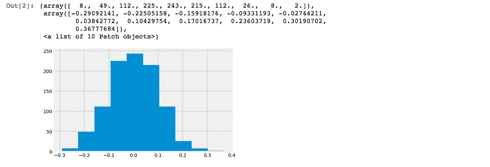

在贝叶斯分析的情况下，我们反转生成模型，并尝试用观察到的数据来推断参数。

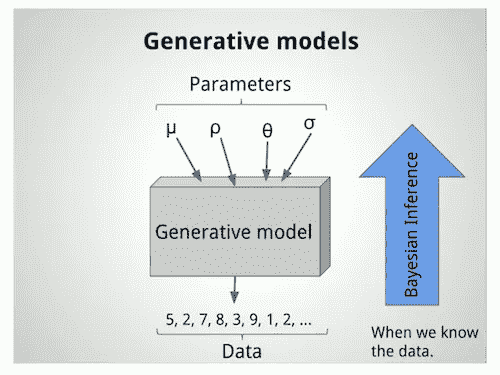

Image Courtesy of Rasmus Bååth, “[Introduction to Bayesian data analysis part 1](https://www.youtube.com/watch?v=3OJEae7Qb_o)”

最后，先验是模型在看到数据之前所拥有的信息。任何概率都是同等可能的吗？或者我们有一些可以利用的先验数据吗？或者我们能做出什么有根据的猜测吗？

我将首先定义一个函数来为一个玩家抓取[福克斯体育的统计页面](https://www.foxsports.com/mlb/stats)。我将其定义为能够提取春训或常规赛的击球数据。

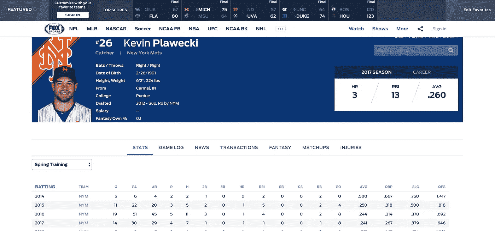

```
import pandas as pd
import seaborn as sns
import requests
from bs4 import BeautifulSoupplt.style.use('fivethirtyeight')%matplotlib inline
%config InlineBackend.figure_format = 'retina'def batting_stats(url,season):
    r = requests.get(url)
    soup = BeautifulSoup(r.text, 'lxml')
    table = soup.find_all("table",{"class": "wisbb_standardTable tablesorter"})[0]
    table_head = soup.find_all("thead",{"class": "wisbb_tableHeader"})[0]
    if season == 'spring':
        row_height = len(table.find_all('tr')[:-1])
    else:
        row_height = len(table.find_all('tr')[:-2])
    result_df = pd.DataFrame(columns=[row.text.strip() for row in table_head.find_all('th')], index = range(0,row_height)) 

    row_marker = 0
    for row in table.find_all('tr')[:-1]:
        column_marker = 0
        columns = row.find_all('td')
        for column in columns:
            result_df.iat[row_marker,column_marker] = column.text.strip()
            column_marker += 1
        row_marker += 1
    return result_df
```

现在来看看我该选谁来分析。

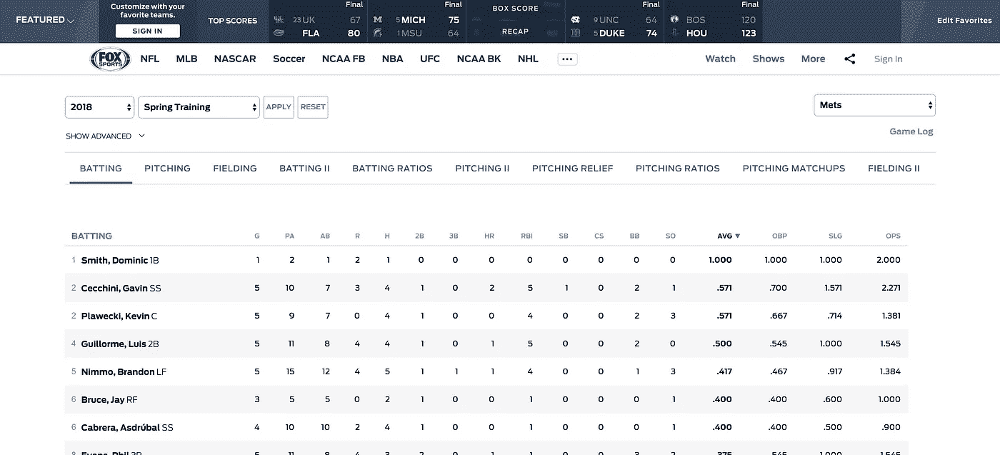

上面的屏幕是纽约大都会队的春季训练统计页面(正如我已经承认的，我对棒球知之甚少，我选择纽约大都会队是因为我喜欢它的标志)。如果你按照球员的击球率(AVG)来排列球员，你可以看到多米尼克·史密斯(DS)是第一名，加文·切基尼(GC)是第二名。他们是好运动员吗？我不知道。但是如果只看 AVG 的话，DS 1.000 AVG 是最好的。

但是通过谷歌搜索，我发现[“近年来，全联盟的平均打击率通常在 0.260”](http://m.mlb.com/glossary/standard-stats/batting-average)左右徘徊。如果是这样，那么 DS 和 GC 的 AVG 似乎太高了。通过进一步观察两位球员的 At-Bats (AB)，Hits (H)，很明显 DS 只有 1 个 AB，CS 有 7 个。此外，通过进一步查看其他球员的 AB，2018 年最高 AB 为 13，2017 年纽约大都会队的最高 AB 为 60。

# 场景 1

假设我对他们过去的表现一无所知，唯一观察到的数据是 2018 年春训。我不知道我应该从 AVG 那里期待什么样的价值范围。基于此，我应该如何解读 2018 年春训的统计数据？

让我们刮一下 DS 的春季训练数据。

```
ds_url_st = "[https://www.foxsports.com/mlb/dominic-smith-player-stats?seasonType=3](https://www.foxsports.com/mlb/dominic-smith-player-stats?seasonType=3)"
dominic_smith_spring = batting_stats(ds_url_st,'spring')
dominic_smith_spring.iloc[-1]
```

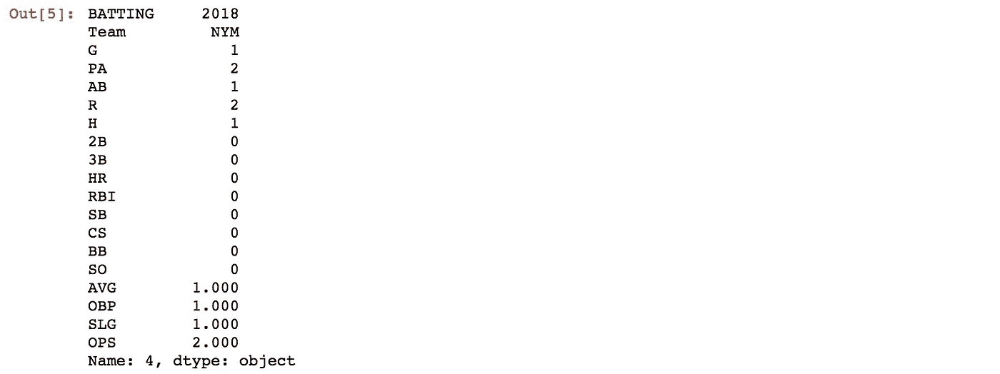

```
n_draw = 20000
prior_ni = pd.Series(np.random.uniform(0, 1, size = n_draw)) 
plt.figure(figsize=(8,5))
plt.hist(prior_ni)
plt.title('Uniform distribution(0,1)')
plt.xlabel('Prior on AVG')
plt.ylabel('Frequency')
```

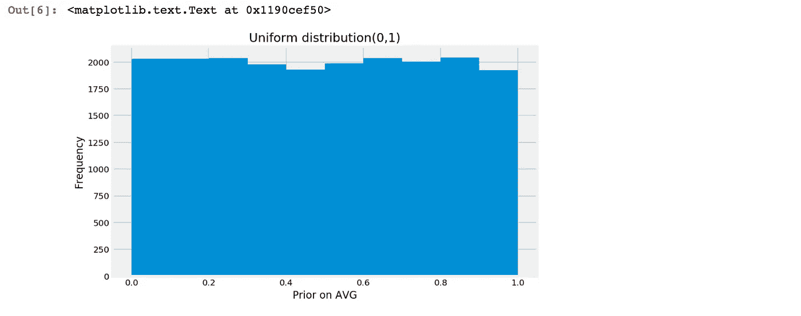

先验代表我们在看到数据之前的信念。在上面的分布中，任何概率几乎都是等概率的(由于随机生成，会有细微的差别)。因此，这意味着我对这个球员一无所知，我甚至没有任何关于 AVG 的有根据的猜测。我假设 0.000 AVG 等同于 1.000 AVG 或者 0 到 1 之间的任何其他概率。

现在我们观察到的数据表明有 1 个 AB 和 1 个 H，因此有 1.000 个 AVG。这可以用二项式分布来表示。具有二项式分布的随机变量 X 表示在一系列 n 个独立的是/否试验中的成功次数，每个试验以概率 p 产生成功。在 AVG 的情况下，AVG 是成功的概率，AB 是试验的次数，H 是成功的次数。

记住这些，我们可以定义我们的逆向生成模型。

我们将从我们定义的均匀分布中随机选取一个概率值，并将该值用作我们的生成模型的参数。假设我们随机选取的值是 0.230，这意味着在二项分布中有 23%的成功几率。试验次数为 1 (DS 有 1 个 AB)，如果生成模型的结果与我们观察到的结果相匹配(本例中 DS 有 1 H)，那么我们保持概率值为 0.230。如果我们重复这种生成和过滤，我们将最终得到一个概率分布，它生成了与我们观察到的结果相同的结果。

这成为我们的后路。

```
def posterior(n_try, k_success, prior):
    hit = list()
    for p in prior:
        hit.append(np.random.binomial(n_try, p))
    posterior = prior[list(map(lambda x: x == k_success, hit))]
    plt.figure(figsize=(8,5))
    plt.hist(posterior)
    plt.title('Posterior distribution')
    plt.xlabel('Posterior on AVG')
    plt.ylabel('Frequency')
    print('Number of draws left: %d, Posterior mean: %.3f, Posterior median: %.3f, Posterior 95%% quantile interval: %.3f-%.3f' % 
      (len(posterior), posterior.mean(), posterior.median(), posterior.quantile(.025), posterior.quantile(.975)))ds_n_trials = int(dominic_smith_spring[['AB','H']].iloc[-1][0])
ds_k_success = int(dominic_smith_spring[['AB','H']].iloc[-1][1])
posterior(ds_n_trials, ds_k_success, prior_ni)
```

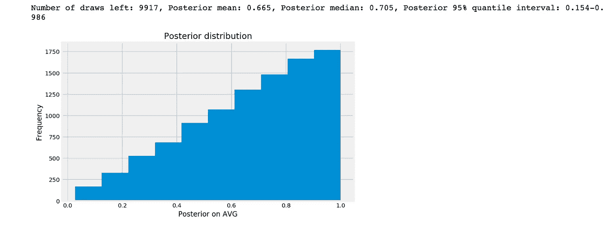

后验分布中 95%的分位数区间称为可信区间，应该与频率主义者意义上的置信区间略有不同。您可以使用另一个可信的区间，当我提到 Pymc3 时，我会回到这个问题。

贝叶斯可信区间和 Frequentist 置信区间的一个主要区别是它们的解释。贝叶斯概率反映了一个人的主观信念。按照这种方法，我们可以声称真实参数在一个具有可测概率的可信区间内。这个属性很有吸引力，因为它使您能够对参数做出直接的概率陈述。许多人发现这个概念是理解概率区间的一种更自然的方式，也更容易解释。另一方面，置信区间使您能够声称区间覆盖了真实参数。如果我们收集一个新样本，计算置信区间，并重复多次，我们计算的 95%的区间将在该区间内具有真实的 AVG 值。

可信区间:“根据我们观察到的数据，AVG 的真实值有 95%的可能性落在可信区间内”

置信区间:“当我根据这类数据计算置信区间时，AVG 的真实值有 95%的可能性落在置信区间内。”

注意区别:可信区间是给定固定界限的参数值的概率陈述。置信区间是给定固定参数值时关于边界的概率。

通常在现实生活中，我们想知道的是真实参数而不是边界，在这种情况下，贝叶斯可信区间是正确的方法。在这种情况下，我们感兴趣的是球员的真实 AVG。

根据上述后验分布，我 95%确定 DS 真实 AVG 将在 0.155 到 0.987 之间。但这是一个非常宽泛的说法。换句话说，在我观察了一个没有先验知识的试验后，我不太确定 ds 的真实 AVG。

# 场景 2

对于第二个场景，让我们假设我们知道去年的春训数据。

```
dominic_smith_spring.iloc[-2:]
```


现在我们有了 2017 年春训统计，我们的先验应该反映了这一知识。这不再是均匀分布了，因为我们知道在 2017 年春训中，DS 的 AVG 是 0.167。

[贝塔分布](https://www.statlect.com/probability-distributions/beta-distribution)是具有两个参数的连续概率分布，*阿尔法*和*贝塔*。它最常见的用途之一是对实验成功概率的不确定性进行建模。特别是，在已经观察到 *n* 次试验中的 *k* 次成功的情况下， *X* 的条件分布是β分布，其中参数 *k+1* 为*α*，参数*n k+1*为*β*。

```
n_draw = 20000
prior_trials = int(dominic_smith_spring.iloc[3].AB)
prior_success = int(dominic_smith_spring.iloc[3].H)
prior_i = pd.Series(np.random.beta(prior_success+1, prior_trials-prior_success+1, size = n_draw)) 
plt.figure(figsize=(8,5))
plt.hist(prior_i)
plt.title('Beta distribution(a=%d, b=%d)' % (prior_success+1,prior_trials-prior_success+1))
plt.xlabel('Prior on AVG')
plt.ylabel('Frequency')
```

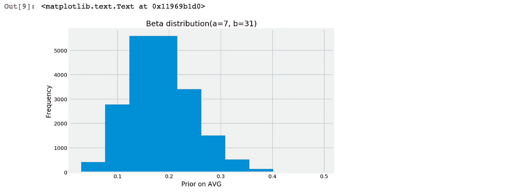

```
posterior(ds_n_trials, ds_k_success, prior_i)
```

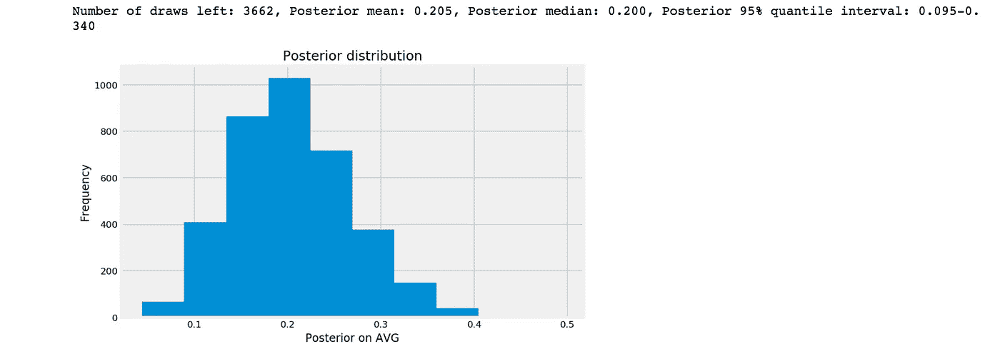

与情形 1 中的均匀先验的后验相比，95%分位数区域已经变窄。现在我可以说，我 95%确定 DS 的真实 AVG 将在 0.095 到 0.340 之间。然而，考虑到 0.300 以上的 AVG 通常被称为最佳击球手，该声明意味着该球员可以是最差的击球手或最佳击球手。我们需要更多的数据来缩小我们的可信区域。

# 场景 3

对于这个场景，我们假设我不仅有 2017 年春训的统计数据，还有 2017 年常规赛的统计数据。这对我拿到后路后的说法有什么影响？

```
ds_url = "[https://www.foxsports.com/mlb/dominic-smith-player-stats?seasonType=1](https://www.foxsports.com/mlb/dominic-smith-player-stats?seasonType=1)"
dominic_smith_reg = batting_stats(ds_url,'regular')
dominic_smith = dominic_smith_reg.append(dominic_smith_spring.iloc[3], ignore_index=True)
dominic_smith
```


```
ds_prior_trials = pd.to_numeric(dominic_smith.AB).sum()
ds_prior_success = pd.to_numeric(dominic_smith.H).sum()n_draw = 20000
prior_i_02 = pd.Series(np.random.beta(ds_prior_success+1, ds_prior_trials-ds_prior_success+1, size = n_draw)) 
plt.figure(figsize=(8,5))
plt.hist(prior_i_02)
plt.title('Beta distribution(a=%d, b=%d)' % (ds_prior_success+1,ds_prior_trials-ds_prior_success+1))
plt.xlabel('Prior on AVG')
plt.ylabel('Frequency')
```


```
posterior(ds_n_trials, ds_k_success, prior_i_02)
```

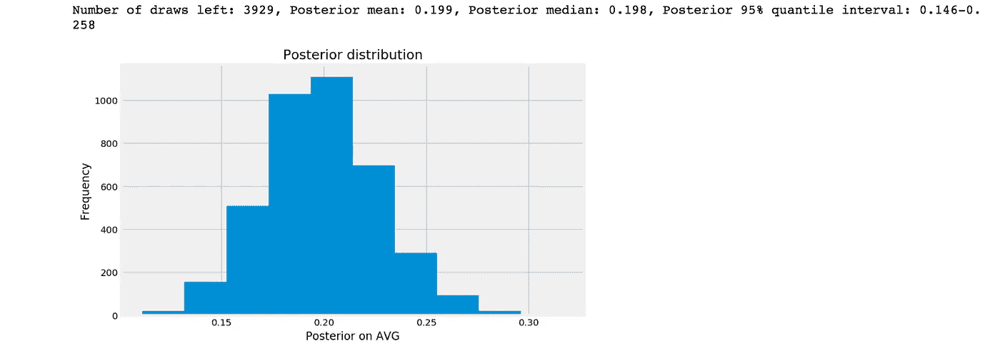

现在我可以说，我 95%确定 DS 的真实 AVG 将在 0.146 到 0.258 之间。这可能不是精确的，但与情景 1 和情景 2 相比，可信区间现在要窄得多。

# 场景 4

我想比较两个球员，看看谁在 AVG 方面更好。我观察到的数据是 2018 年春训的结果，我的先验知识是 2017 年春训和常规赛。现在我想比较一下 DS 和 GC。

直到场景 3，我通过拒绝产生与我观察到的结果不同的所有参数来模拟采样。但是这种类型的随机样本生成和过滤通常在计算上是昂贵的，并且运行缓慢。但幸运的是，我们可以使用一个工具，使采样器在高概率区域花费更多时间，从而提高效率。概率编程工具如 [Pymc3](https://github.com/pymc-devs/pymc3) 可以通过使用巧妙的算法如 [HMC 坚果](http://blog.fastforwardlabs.com/2017/01/30/the-algorithms-behind-probabilistic-programming.html)有效地处理抽样程序。

让我们先从福克斯体育台的加文·切奇尼的数据开始。

```
gc_url_st = "[https://www.foxsports.com/mlb/gavin-cecchini-player-stats?seasonType=3](https://www.foxsports.com/mlb/gavin-cecchini-player-stats?seasonType=3)"
gc_url_reg = "[https://www.foxsports.com/mlb/gavin-cecchini-player-stats?seasonType=1](https://www.foxsports.com/mlb/gavin-cecchini-player-stats?seasonType=1)"
gavin_cecchini_spring = batting_stats(gc_url_st,'spring')
gavin_cecchini_reg = batting_stats(gc_url_reg,'regular')
gc_n_trials = int(gavin_cecchini_spring.iloc[1].AB)
gc_k_success = int(gavin_cecchini_spring.iloc[1].H)
gc_prior = pd.DataFrame(gavin_cecchini_reg.iloc[1]).transpose().append(gavin_cecchini_spring.iloc[0])
gc_prior
```


```
gc_prior_trials = pd.to_numeric(gc_prior.AB).sum()
gc_prior_success = pd.to_numeric(gc_prior.H).sum()def observed_data_generator(n_try,observed_data):
    result = np.ones(observed_data)
    fails = n_try - observed_data
    result = np.append(result, np.zeros(fails))
    return resultds_observed = observed_data_generator(ds_n_trials,ds_k_success)
gc_observed = observed_data_generator(gc_n_trials,gc_k_success)
```

现在我们已经准备好安装一个 Pymc3 模型。

```
import pymc3 as pm
with pm.Model() as model_a:    
    D_p = pm.Beta('DS_AVG', ds_prior_success+1, ds_prior_trials-ds_prior_success+1)
    G_p = pm.Beta('GC_AVG', gc_prior_success+1, gc_prior_trials-gc_prior_success+1)
    DS = pm.Bernoulli('DS', p=D_p, observed=ds_observed)
    GC = pm.Bernoulli('GC', p=G_p, observed=gc_observed) 
    DvG = pm.Deterministic('DvG', D_p - G_p)
    start = pm.find_MAP()
    trace = pm.sample(10000, start=start)pm.plot_posterior(trace, varnames=['DS_AVG','GC_AVG','DvG'],ref_val=0)
```


如果我们在 Pymc3 中使用 plot_posterior 函数绘制 DS_AVG、GC_AVG 和 DvG (DS_AVG — GC_AVG)的后验分布，我们会看到 HPD 项而不是分位数。最高概率密度(HPD)区间是另一种我们可以用于后验概率的可信区间。HPD 区间选择最窄的区间，这将涉及选择包括众数在内的最高概率密度值。

我再次发现[的另一个帖子](http://www.sumsar.net/blog/2014/10/probable-points-and-credible-intervals-part-one/)由拉斯姆斯·贝斯提供了一个易于理解的分位数区间和最高密度区间的直观比较。以下是模式和最高密度区间，涵盖了六种不同后验分布 95%的概率密度。


Image Courtesy of Rasmus Bååth, “[Probable Points and Credible Intervals, Part 1: Graphical Summaries](http://www.sumsar.net/blog/2014/10/probable-points-and-credible-intervals-part-one/)”

分位数区间包括中间值，50%的概率在它的左边，50%的概率在它的右边，分位数区间在两边留下 2.5%的概率(在 95%可信区间的情况下)。

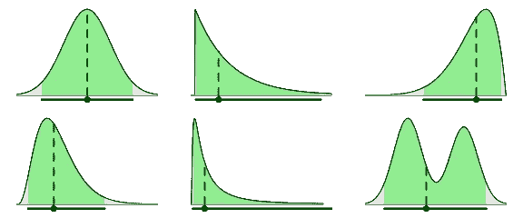

Image Courtesy of Rasmus Bååth, “[Probable Points and Credible Intervals, Part 1: Graphical Summaries](http://www.sumsar.net/blog/2014/10/probable-points-and-credible-intervals-part-one/)”

在 DS 和 GC 的击球率的情况下，看起来众数和中位数没有太大的不同，如果是这样，HPD 区间将类似于分位数区间。让我们看看他们看起来怎么样。

```
pm.summary(trace)
```

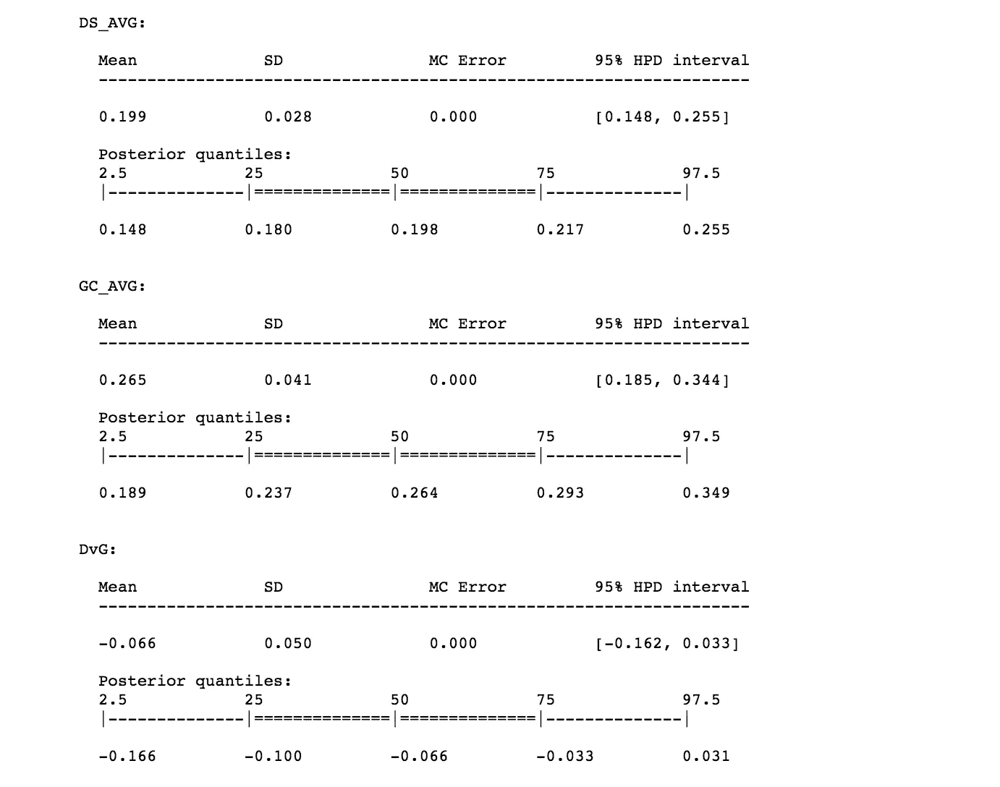

我们可以看到，对于 DS 和 GC，HPD 区间和分位数区间要么完全相同，要么在小数位数上略有不同。

我想回答的问题是，就 AVG 而言，谁是更好的球员，我应该说我不能确定。至少，我不能 95%确定这两个球员在 AVG 方面是不同的。我计算并绘制的差异表明，两个玩家的 AVG 差异(DS-GC，因此如果 DvG 更正，则意味着 DS 更好，否则如果 DvG 更负，则意味着 GC 更好)，可以在-0.162 到 0.033 之间。

该区间包括 0.000，这表示两个玩家的 AVG 之间没有差异。因此，有一些证据表明 GC 比 DS 更好(因为 DvG 后验分布在负区域比在正区域具有更大的区域)，但是我不能 95%确定这两个玩家在 AVG 方面是不同的。

也许有了更多的数据，我就能确定它们的区别。毕竟，这是贝叶斯思维的精髓。这并不是说真相不存在，而是我们不能完全了解它，我们所能希望做的就是随着越来越多的证据变得可用，更新我们的理解。

感谢您的阅读，您可以从下面的链接中找到整个 Jupyter 笔记本。

[https://github . com/tthustle a/Bayes ball/blob/master/Bayes ball . ipynb](https://github.com/tthustla/Bayesball/blob/master/Bayesball.ipynb)