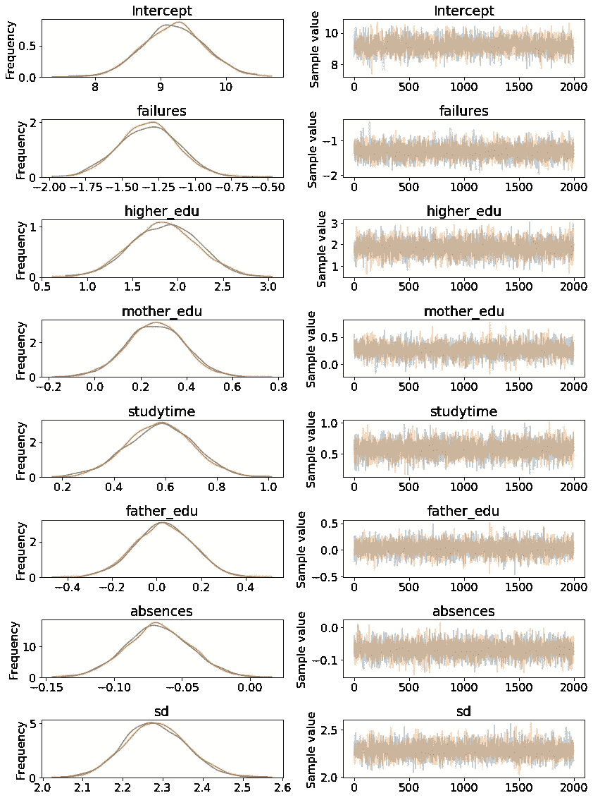
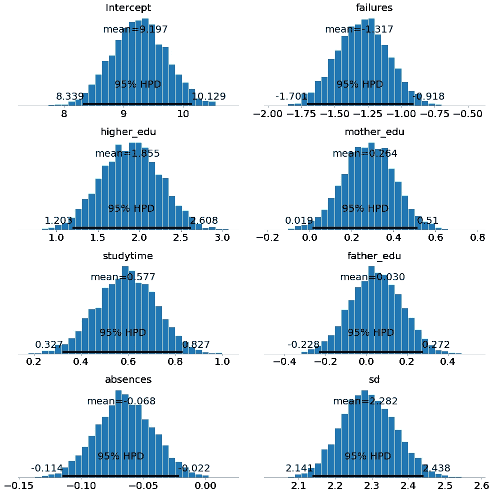
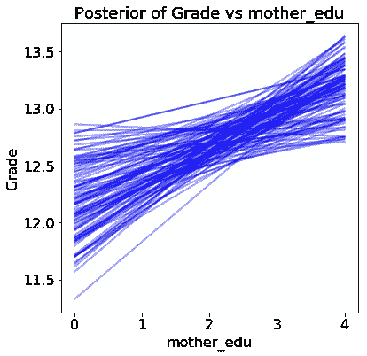
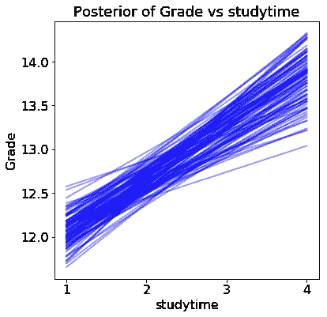
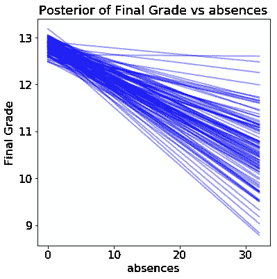
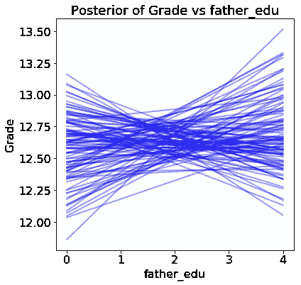
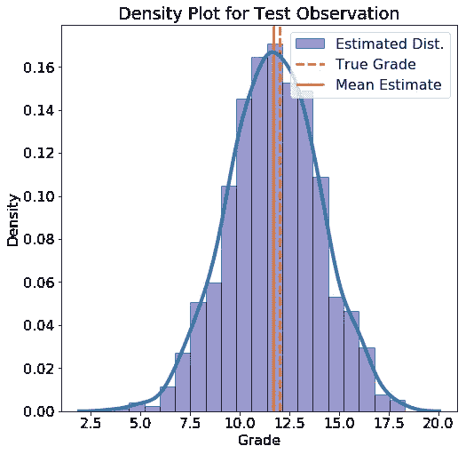
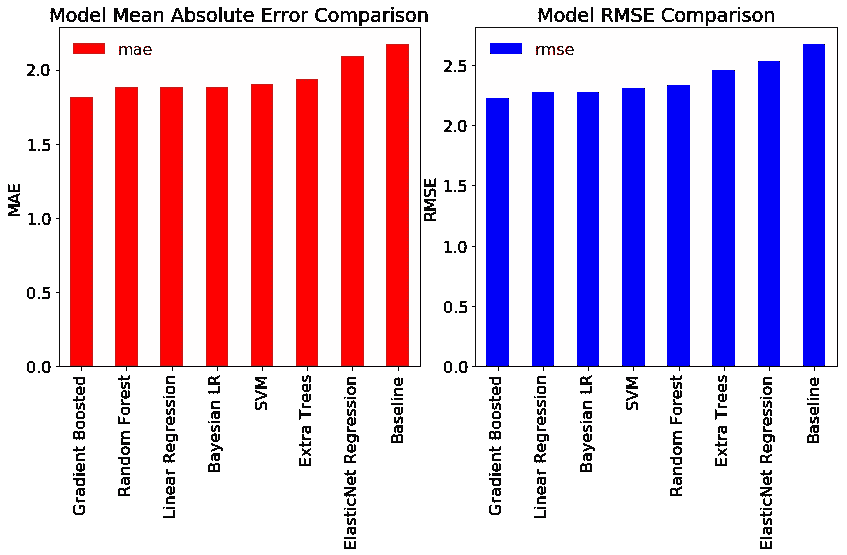

# Python 中的贝叶斯线性回归:使用机器学习预测学生成绩第 2 部分

> 原文：<https://towardsdatascience.com/bayesian-linear-regression-in-python-using-machine-learning-to-predict-student-grades-part-2-b72059a8ac7e?source=collection_archive---------0----------------------->


## 实施模型、解释结果和做出预测

在这个贝叶斯机器学习项目的第一部分中，我们概述了我们的问题，进行了全面的探索性数据分析，选择了我们的特性，并建立了基准。这里我们将在 Python 中实现贝叶斯线性回归来构建模型。训练完模型后，我们将解释模型参数并使用模型进行预测。这个项目的全部代码可以在 GitHub 上的 [Jupyter 笔记本](https://github.com/WillKoehrsen/Data-Analysis/blob/master/bayesian_lr/Bayesian%20Linear%20Regression%20Project.ipynb)中找到，我鼓励任何人去看看！

提醒一下，我们正在研究一个**监督的、回归的**机器学习问题。使用学生成绩的数据集，我们希望建立一个模型，该模型可以根据学生的个人和学术特征来预测最终学生的分数。特征选择后的最终数据集为:


我们有 6 个特征(解释变量)用于预测目标(响应变量)，在这种情况下是分数。训练集中有 474 名学生，测试集中有 159 名学生。为了了解变量分布(因为我真的很喜欢这个图)，这里有一个变量对图，显示了散点图、直方图、密度图和相关系数。


关于这个情节的细节和所有变量的意义[请查看第一部分](https://medium.com/@williamkoehrsen/bayesian-linear-regression-in-python-using-machine-learning-to-predict-student-grades-part-1-7d0ad817fca5)和笔记本。现在，让我们继续用 Python 实现贝叶斯线性回归。

# 贝叶斯线性回归

让我们简单回顾一下[频率主义者](https://en.wikipedia.org/wiki/Frequentist_inference)和[贝叶斯](https://en.wikipedia.org/wiki/Bayesian_inference)线性回归。线性回归的 Frequentist 观点假设数据是从以下模型生成的:


其中，响应 y 由模型参数β乘以输入矩阵 X 加上随机采样噪声或潜在变量引起的误差得出。在普通的最小二乘法(OLS)中，模型参数β是通过寻找使训练数据的误差平方和最小的参数来计算的。OLS 的输出是给定训练数据的“最佳”模型参数的单点估计。然后，这些参数可用于预测新的数据点。

相反，贝叶斯线性回归假设响应是从概率分布中取样的，例如[正态(高斯)分布](http://www.statisticshowto.com/probability-and-statistics/normal-distributions/):


高斯均值是参数β和输入 X 的乘积，标准差是σ。在贝叶斯模型中，不仅响应被假设为从分布中抽样，而且参数也被假设为从分布中抽样。目标是在给定输入 X 和输出 y 的情况下，确定模型参数的[后验概率分布](http://www.statisticshowto.com/posterior-distribution-probability/):


后验概率等于数据的似然性乘以模型参数的先验概率，再除以归一化常数。如果我们有一些领域知识，我们可以用它来分配模型参数的先验，或者我们可以使用[非信息先验](https://stats.stackexchange.com/questions/27813/what-is-the-point-of-non-informative-priors):不假设任何变量的具有大标准偏差的分布。使用无信息的先验意味着我们“让数据说话”一个常见的优先选择是对β使用正态分布，对σ使用半柯西分布。

实际上，对于连续值来说，计算精确的后验分布在计算上是很困难的，因此我们求助于抽样方法，如[马尔可夫链蒙特卡罗](/markov-chain-monte-carlo-in-python-44f7e609be98) (MCMC)从后验中抽取样本，以逼近后验。[蒙特卡洛](https://en.wikipedia.org/wiki/Monte_Carlo_method)是指抽取随机样本的一般技术，[马尔可夫链](https://en.wikipedia.org/wiki/Markov_chain)是指抽取的下一个样本仅基于上一个样本值。这个概念是，随着我们抽取更多的样本，后验概率的近似值最终将收敛于模型参数的真实后验分布。

贝叶斯线性建模的最终结果不是对模型参数的单一估计，而是一个分布，我们可以用它来对新的观察结果进行推断。这种分布允许我们在模型中展示我们的不确定性，并且是贝叶斯建模方法的[好处之一。随着数据点数量的增加，不确定性应该会降低，表明我们的估计具有更高的确定性。](http://twiecki.github.io/blog/2013/08/12/bayesian-glms-1/)

## 用 Python 实现贝叶斯线性建模

目前 Python 中概率编程和贝叶斯推理最好的库是 [PyMC3。](http://docs.pymc.io/notebooks/getting_started)它包括许多用于构建贝叶斯模型和使用 MCMC 方法推断模型参数的实用程序。我们将使用 PyMC3 的[广义线性模型(GLM)模块](http://twiecki.github.io/blog/2013/08/12/bayesian-glms-1/)，特别是`GLM.from_formula`函数，它使得构建贝叶斯线性模型极其简单。

使用该模块执行贝叶斯线性回归只需要两个步骤:

1.  构建一个将特征与目标相关联的公式，并确定数据可能性的先验分布
2.  使用 MCMC 的参数后验分布样本

## 公式

我们不需要为每个模型参数分别定义概率分布，而是传递一个 R 风格的公式，将特征(输入)与目标(输出)联系起来。以下是将分数与学生特征联系起来的公式:

```
**Grade ~ failures + higher_edu + mother_edu + studytime + father_edu + absences**
```

在此语法中，~，读作“是的函数”。我们告诉模型，等级是波浪号右侧六个特征的线性组合。

该模型是在使用`with`语句的上下文中构建的。在对`GLM.from_formula`的调用中，我们传递公式、数据和数据可能性族(这实际上是可选的，默认为正态分布)。该函数解析公式，为每个要素添加随机变量(以及标准差)，添加数据的似然性，并将参数初始化为合理的起始估计值。默认情况下，模型参数先验被建模为正态分布。

一旦建立了 GLM 模型，我们就使用 MCMC 算法从后验样本中进行采样。如果我们不指定哪种方法，PyMC3 会自动选择最适合我们的方法。在下面的代码中，我让 PyMC3 选择采样器，并指定样本数 2000，链数 2，调谐步数 500。

在这种情况下，PyMC3 选择了[不掉头采样器](https://arxiv.org/abs/1111.4246)，并用 jitter+adapt_diag 初始化采样器。老实说，我真的不知道这些是什么意思的全部细节，但我假设比我聪明得多的人正确地实现了它们。有时仅仅知道如何使用工具比理解实现的每个细节更重要！

采样器运行几分钟，我们的结果存储在`normal_trace`中。这包含每个模型参数的所有样本([，除了被丢弃的调谐样本](http://www.mit.edu/~ilkery/papers/GibbsSampling.pdf))。跟踪本质上是我们的模型，因为它包含了我们进行推理所需的所有信息。为了了解贝叶斯线性回归的作用，我们可以使用 PyMC3 中的内置函数来检查轨迹。

轨迹图在左侧显示了模型参数的后验分布，在右侧显示了在变量轨迹中绘制的样本的进展。这两种颜色代表采样的两个差分链。

```
pm.traceplot(normal_trace)
```



这里我们可以看到，我们的模型参数不是点估计，而是分布。每个分布的平均值可以作为最可能的估计，但是我们也使用整个范围的值来表明我们不确定真实值。

查看后验分布的另一种方式是直方图:

```
pm.plot_posterior(normal_trace)
```



这里我们可以看到平均值，我们可以用它作为最可能的估计，也可以看到整个分布。95% HPD 代表 95%的最高后验密度，是我们参数的**可信区间**。[可信区间](https://en.wikipedia.org/wiki/Credible_interval)是频率统计中置信区间的贝叶斯等价([尽管有不同的解释](https://stats.stackexchange.com/questions/2272/whats-the-difference-between-a-confidence-interval-and-a-credible-interval))。

我们还可以看到所有模型参数的摘要:

```
pm.df_summary(normal_trace)
```


我们可以用与 OLS 线性回归大致相同的方式来解释这些权重。例如在模型中:

*   以前的课堂失败和缺席有负面影响
*   高等教育计划和学习时间有积极的影响
*   母亲和父亲的教育有积极的影响(尽管母亲的更积极)

标准偏差栏和 hpd 限值让我们了解我们对模型参数的信心程度。例如，`father_edu` 特性的 95% hpd 从-0.22 到 0.27，这意味着我们不能完全确定模型中的影响是积极的还是消极的！数据似然性也有较大的标准偏差(`sd`行),表明目标存在较大的不确定性。总的来说，我们在模型中看到了相当大的不确定性，因为我们处理的样本数量很少。只有几百名学生，我们没有足够的数据来精确地确定模型参数。

# 解释可变效应

为了查看单个变量对成绩的影响，我们可以在保持其他变量不变的情况下改变该变量的值，并查看估计的成绩如何变化。为此，我们使用`plot_posterior_predictive`函数，并假设除了感兴趣的变量(查询变量)之外的所有变量都处于中值。我们为查询变量生成一系列值，函数通过从后验分布中提取模型参数来估计整个范围内的等级。代码如下:

结果显示了来自后验样本的 100 个样本的估计等级与查询变量范围的关系:



每条线(每个图中有 100 条线)是通过从后验迹线中选取一组模型参数并评估查询变量范围内的预测坡度而绘制的。线的分布显示了模型参数的不确定性:线越分散，模型对该变量的影响就越不确定。

对于一个变量，父亲的教育程度，我们的模型甚至不能确定增加变量的效果是积极的还是消极的！



如果我们使用这个模型来做决策，我们可能要在部署它之前三思，而不是首先收集更多的数据来形成更确定的估计。只有几百名学生，模型参数有相当大的不确定性。例如，我们不应该声称“父亲的教育水平对成绩有积极影响”，因为结果表明这个结论几乎没有什么确定性。

如果我们使用频率主义方法，并且只看到一个点估计，我们可能会因为有限的数据量而做出错误的决策。在数据集有限的情况下，贝叶斯模型是显示模型中不确定性的绝佳选择。

# 做预测

说到预测，贝叶斯模型可以用来估计*分布*。我们记得贝叶斯线性回归的模型是:


其中，β是系数矩阵(模型参数)，X 是数据矩阵，σ是标准差。如果我们想要对新的数据点进行预测，我们可以通过将模型参数乘以我们的数据点来找到平均值，并使用模型参数的标准偏差，从而找到估计输出的正态**分布**。

在这种情况下，我们将从轨迹中取每个模型参数的平均值作为参数的最佳估计值。如果我们取轨迹中参数的平均值，那么预测的分布就变成:

```
**Grade ~ N(9.20 * Intercept - 1.32 * failures + 1.85 * higher_edu + 0.26 * mother_edu + 0.58 * studytime + 0.03 * father_edu - 0.07 * absences,  2.28^2)**
```

对于新的数据点，我们代入变量的值，并构建等级的概率密度函数。作为一个例子，这里有一个来自测试集的观察结果以及概率密度函数(参见[笔记本](https://github.com/WillKoehrsen/Data-Analysis/blob/master/bayesian_lr/Bayesian%20Linear%20Regression%20Project.ipynb)中构建这个分布的代码):

```
**Test Observation:
failures = 0, higher_edu = 1, mother_edu = 2, studytime = 1,
father_edu = 2, absences = 8**
```



```
**True Grade = 12
Average Estimate = 11.6763
5% Estimate = 7.7618    95% Estimate = 15.5931**
```

对于该数据点，平均估计值与实际等级相符，但也存在较大的估计区间。如果我们有更多的学生，估计的不确定性会更低。

我们还可以对不在测试集中的任何新点进行预测:

```
**New Observation:
absences = 1, failures = 0, father_edu = 1
higher_edu = 1, mother_edu = 4, studytime = 3**
```


```
**Average Estimate = 13.8009
5% Estimate = 10.0696    95% Estimate = 17.4629**
```

## 与标准机器学习模型的比较

在本系列的第一部分中，我们计算了许多标准机器学习模型的基准以及一个简单的基线。为了计算 MAE 和 RMSE 度量，我们需要对测试集中的所有数据点进行单点估计。我们可以使用估计分布的平均值做出“最有可能”的预测。产生的指标以及基准测试的指标如下所示:



贝叶斯线性回归实现了与最佳标准模型几乎相同的性能！然而，贝叶斯线性建模的主要好处不在于准确性，而在于可解释性和量化我们的不确定性。[任何模型都只是对真实世界的估计](https://en.wikipedia.org/wiki/All_models_are_wrong)，在这里我们已经看到了我们应该对基于有限数据训练的模型有多么缺乏信心。

## 后续步骤

对于任何想开始学习贝叶斯建模的人，我建议看看这本笔记本。在这个项目中，我只研究了一半的学生数据(我使用了数学成绩，另一半包含葡萄牙语课程成绩),所以可以对另一半进行同样的分析。此外，我们可以改变数据可能性的分布——例如，改变为一个[学生的 t 分布](http://www.statisticshowto.com/probability-and-statistics/t-distribution/)——然后看看这如何改变模型。与大多数机器学习一样，通过尝试不同的设置，可以学到相当多的东西，而且往往没有单一的正确答案！

# 结论

在这一系列文章中，我们走过了用于解决数据科学问题的完整机器学习过程。我们从探索性数据分析开始，进而建立基线，尝试几种不同的模型，实施我们选择的模型，解释结果，并使用该模型进行新的预测。虽然模型实现的细节可能会改变，但这个[的总体结构](/the-7-steps-of-machine-learning-2877d7e5548e)将很好地服务于大多数数据科学项目。此外，希望这个项目让你了解了贝叶斯机器学习的独特能力，并为你的技能组合增加了另一个工具。学习新技能是数据科学最令人兴奋的方面，现在您又多了一项部署来解决您的数据问题。

一如既往，我欢迎反馈和建设性的批评。你可以在推特上找到我。