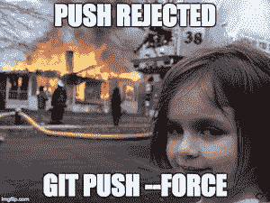

# 数据科学家应该向软件工程师学习的 4 件事

> 原文：<https://towardsdatascience.com/be-a-better-data-scientist-1a5ad87fe48?source=collection_archive---------2----------------------->

## 任何数据科学家都应该掌握的软件工程实践

执行机器学习(ML)研究被认为是一项“艺术”工作，因此它通常几乎没有技术标准或通用的技术最佳实践。

在 CRISP-DM 流程模型中，端到端 ML 项目的不同阶段很容易可视化，如下图所示。从高层次的角度来看，任何机器学习项目都有两个主要阶段:研究**阶段:从业务理解到对所选模型技术的清晰性能评估，以及生产**阶段(又名部署)。

The CRISP-DM Process

虽然很明显，我们在开发生产代码时要求的相同级别的软件实践在做研究时并不需要或不相关，但我确实认为大多数数据科学家在他们的日常研究工作中没有利用足够的软件工程实践，这最终影响了他们的成果和效率。

在这篇文章中，我想回顾一些众所周知的软件工程实践，这些实践很容易实现，并且对任何数据科学家都非常有益。无论您是单独工作还是作为团队的一部分，在编写自己的研究代码时采用这些实践肯定会让您成为更好的数据科学家。我们开始吧。

> **使用你的版本控制系统**

版本控制系统(VCS)是伟大的工具，不仅因为它们让我们在不同的团队成员之间共享和同步相同的代码(或者仅仅是文件)。对于一个开发者来说，它们也是很好的工具，可以享受:版本化你的代码，回滚，远程备份等等。

VCS 已经被工程团队广泛采用，令人高兴的是，使用某种形式的 VCS 工具的数据科学家越来越多。然而，从我的经验来看，大多数使用 VCS 的 DS 倾向于对如何正确使用它们有一个知识缺口。这些糟糕的做法有双重影响，一方面，数据科学家觉得工具没有给他带来足够的价值，而他需要投入大量时间来使它工作(复杂的合并，代码以意想不到的方式被更改等等)。以下是我在观察数据科学家 VSC 的工作时遇到的一些常见陷阱。在我的示例中，我使用 git 作为 VSC 特定的参考，但是在其他 VSC 系统中，概念也非常相似:

*   ***提交\推送\拉取很少*** —提交是使用 VCS 时最原子化的部分。不经常提交，可能会使您面临代码丢失的风险，而不经常与集中的存储库同步将总是导致代码冲突和与其他团队成员的长时间合并。
*   ***提交冗余文件*** —并非所有文件都应该提交给 git。有些文件只是本地配置文件，或者可能是本地的中间结果文件，您最好自己保存它们。Git ignore 是一个很好的工具，可以用来管理那些你想在 Git 中忽略的文件。在您的提交中包含本地文件会导致冗余的提交、长的同步周期以及每当团队成员从远程存储库推/拉时反复出现的冲突。
*   ***不利用树枝\标签*** —很多人根本不知道树枝和标签的真正力量。当真正的意图和需要是维护同一代码库的不同版本时，许多人只是使用主要的“主”分支，甚至覆盖现有的代码，而不是使用在主要建模里程碑上版本化代码的能力，以及并行维护不同分支的可能性。

> **手动做可以轻松自动化的事情**

在敏捷商业环境中拥有工作软件的需求是开发 [CI\CD](https://www.atlassian.com/continuous-delivery/ci-vs-ci-vs-cd) 工程实践的关键触发因素。作为任何 CI/CD 实践核心的最基本的概念是自动化。我们希望确保一个特定的流程在每一次执行中，以及在不同的环境中运行时，能够自动地、系统地工作。

在进行 ML 研究时，我认为自动化在两个主要方面对高效研究至关重要:

*   ***数据准备*** —每个数据科学家都知道，做研究是一项迭代任务，在这项任务中，你经常要从头开始重建数据集。原因可能有很多:您决定添加更多的要素，您发现了数据集中的数据问题，您想要添加更多的数据源，您发现了一些数据泄漏，或者您甚至想要选择不同的样本进行处理。不管原因是什么，事实是，在您的研究过程中，您可能会多次重建数据集。数据准备工作通常是 ML 项目中最耗时的阶段，因此也需要大部分数据科学家的编码工作。结合对迭代过程的需要，它是如此大的时间和代码消费者的事实，以及确保我们使用通过一些基本测试的数据准备代码(见我的下一个项目)是很好的激励因素，以确保我们的数据准备代码被正确处理，并且我们可以在单击按钮时重新创建用于建模的基本数据集。
*   ***打包&部署*** —我们的代码几乎总是使用某种形式的第三方和对其运行环境的假设。在 python 中，我们可能会导入第三方包，并假设特定的 python 和包版本。在 R 中，代码假定了特定的 R 版本和已安装的包。除了确保我们使用语言最佳实践来管理代码依赖关系(如 python 中的“需求”文件)， [docker containers](https://www.docker.com/) 也可以是很好的工具，确保您的代码将在(几乎)任何使用虚拟化概念的环境中运行。对于这种方式，我们的目标应该是有一个基本的打包脚本(或 docker 构建脚本),当执行时，它安装所需的代码依赖项，并可以容易地部署在任何新的计算机\远程环境中。拥有这样的自动化应用程序打包，可以在不同的团队成员之间轻松共享，而不需要在他们的开发环境中做任何假设，并且当试图在远程环境中执行您的代码和模型时，这也是一个很好的工具。在研究过程中，一个非常有益的常见情况是利用云资源，通常是在本地资源不足以完成任务时。在这种情况下，您可能需要为任何远程执行打包和部署您的应用程序。强烈建议能够自动执行这一周期性任务。

> 你测试过你的代码吗？

在常规的软件开发中，开发工作和测试工作之间有着明显的区别。很明显，没有通过任何测试的代码不应该被部署到产品中(换句话说，它不会被实际使用)。然而，令人惊讶的是，在做研究时，测试的概念相当模糊或者根本不存在，即使这样，数据科学家也是根据这个研究代码来总结其工作和发现的。我想强调一下，让我们再说一遍，但这次是从相反的方向:通常，数据科学家得出的结论和模型是基于根本没有经过任何测试的代码！

虽然研究代码中的错误可能不会影响系统的功能，但是它可能会导致错误的结论和非最优的解决方案(相对于功能故障，这实际上更难发现，因为它们需要随着时间的推移监控生产中模型的质量)。显然，这些隐藏的错误有可能严重影响业务决策。

QA(质量保证)的概念在工程团队中得到了很好的发展，并且可以以多种形式出现，从单元测试到系统测试。考虑到研究环境中代码的动态特性，这些方法中的一些在做研究时应用起来似乎过于复杂。然而，我确实认为有两个基本的实践是任何数据科学家都应该经常做的，这可以显著提高你的研究代码的质量和保证水平。

*   ***先测试再用***——就这么简单。你写完了你的研究代码。握住你的手指，不要用它。首先做一些健全性测试，看看它是否如预期的那样工作(甚至手动测试在这里也会有所帮助)。一个基本且重要的例子是测试您的数据准备代码。在开始建模阶段之前，导出数据集的样本，确保数据集是按预期创建的。使用你的描述性统计工具和知识。确保每个场分布看起来合理，看看简单的相关矩阵，看看基本的相关性是否有意义，等等。
*   ***执行代码评审***——与同事一起进行代码评审不仅是发现潜在错误或代码问题的好工具，也是确保一些基本编码标准的好方法，也是确保技术/科学团队之间知识共享的好方法。让一个同行查看您的代码，不仅会发现一些代码错误，还会发现一些概念上的误解或错误，比如检测数据泄漏或糟糕的评估过程。

> **维护或创建编码标准**

许多人认为代码标准实践只与大型开发团队相关。然而，任何在生活中做过编码的人都知道，你可能认为是编码时间的大约 90%的时间实际上是花在阅读和理解你面前的代码的行为上，即使那是你自己的代码！拥有一个混乱的代码，你需要投入大量的时间和精力去理解代码的编写方式，甚至在处理它实际做什么之前，这是一种浪费时间的行为。

代码标准是一个很大的概念，通常每种语言都有自己的最佳实践。对于研究阶段，我确实认为保持清晰和标准的编码格式可以节省大量时间，无论是对于需要使用别人编写的代码的同行，还是对于消耗自己代码的单个数据科学家。

这种格式编码标准可以包括:

清晰的项目结构、标准的函数和变量命名约定、模块化的功能代码(而不是很长的单一脚本)、适当的注释、删除冗余的依赖、代码缩进等等。

当我开始用 R 编程时，我非常惊讶，我发现没有正式的明确约定\ R 项目看起来应该如何的最佳实践。

我认为任何数据科学家都应该确保他的代码是干净的，并且符合最著名的行业标准。如果这样的标准不存在，创建一个你自己的。如果你是团队的一员，那么团队就要就一些明确的工作标准达成一致，这一点甚至更为重要。

[*柳文欢·拉松*](https://www.linkedin.com/in/oren-razon/) *是一位经验丰富的首席技术官，拥有超过 12 年的经验，在初创公司和全球企业中领导基于人工智能的产品从业务开始到生产。*

*柳文欢是一家基于机器学习隐形模式的初创公司的联合创始人，之前是一家成功的机器\深度学习专业服务公司 YellowRoad 的联合创始人。*