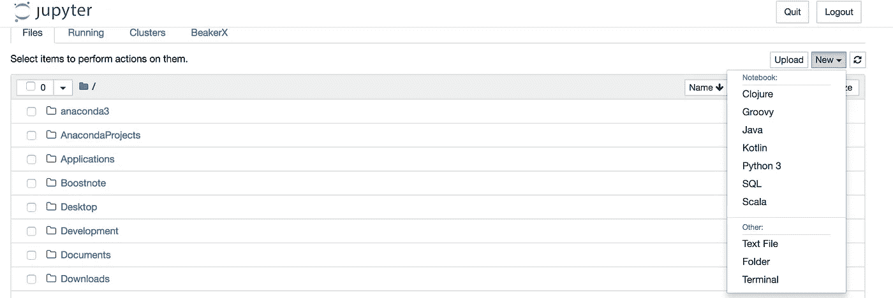
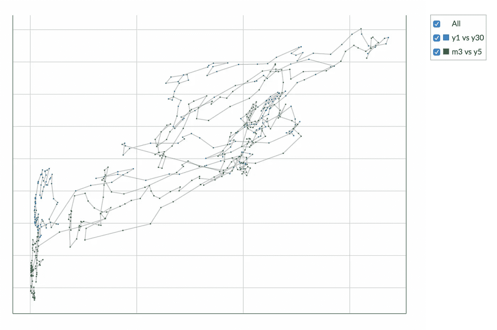

# 用于数据可视化的 BeakerX 和 Python

> 原文：<https://towardsdatascience.com/beakerx-and-python-for-data-visualization-b143f960c93c?source=collection_archive---------14----------------------->


Jupyter Notebooks 为数据工程师提供了一个强大的工具，可以即时从海量数据中提取见解。典型地，Pythonistas 使用笔记本来快速编译代码、测试/调试算法和扩展程序执行；一个健壮的 Javascript 内核([这里是](https://github.com/n-riesco/ijavascript))现在也可以作为 IJavascript 用于笔记本，但是当然，即使是笔记本使用的 Javascript 仍然遵守变量声明的单赋值约束。由于 Jupyter 提升了 Python 安装包，Jupyter 笔记本迅速发展成为 Python 学习和数据科学的默认平台，数据可视化越来越成为大规模数据集和预测映射的可访问窗口。

[BeakerX](http://beakerx.com/) 是由 [Two 适马](https://www.twosigma.com/)发起的一个开源项目，这是一家投资管理公司，为他们的投资决策提供机器学习和分布式计算。作为适马众多开源项目中的一个，BeakerX 是迄今为止最强大、对社区贡献最大的项目，其多方面的目标是扩展 Jupyter 生态系统。

尽管这个项目——更确切地说是 Jupyter 扩展的分组——乍一看似乎增加了 Jupyter 笔记本的绘图和通用数据可视化库存，但它也为笔记本增加了多语言支持；通过 BeakerX 的安装，用户可以用 JVM 语言和其他语言(Groovy、Scala、Clojure、Kotlin、Java、SQL，当然还有 Python)创建一个笔记本。或者，如下所示，Python 和 Javascript 的混合(通过 Jupyter 的 magics 和 autotranslation)结合起来，从 Python 操作的数据集创建 D3.js 交互式可视化:


Python and Javascript in the same notebook — for a future post?

迟早会给我们带来:

Python & D3.js, via BeakerX

然而，BeakerX 的可视化和交互功能正是这个项目的初衷，我们将通过一个交互示例来展示它的易用性。(尽管 BeakerX 的官方[活页夹](https://hub.mybinder.org/user/twosigma-beakerx-6vipmfp4/notebooks/StartHere.ipynb)中的许多例子都是用 Groovy 编写的，但我们在这里将重点关注 Python。)

## 装置

首先，确保`PATH`被正确声明(这是关于 MacOS 安装的*)。MacOS 上的 Python 和 Anaconda 有时可能无法按预期执行，尤其是当您的机器上有多个 Python 版本时(例如 Python 2.7&3.6)；Pandas 可能在一个位置，而可执行的 Python 版本在另一个位置(在这种情况下，您可以通过终端为必要的版本起别名)。我发现在尝试安装 BeakerX 的首选方法`conda install`之前，以下方法可以确保事情指向正确的方向。*

```
~ $ export PATH=~/anaconda3/bin:$PATH
```

一旦处理完毕，一个接一个地运行下面的代码行，它们应该会毫无问题地执行和安装相关的库:

```
~ $ conda create -y -n beakerx 'python>=3'
~ $ source activate beakerx
~ $ conda config --env --add pinned_packages 'openjdk>8.0.121' 
~ $ conda install -y -c conda-forge ipywidgets beakerx
```

**( *NB。BeakerX 与 Python 版本> 3.4 一起工作。)***

在那里，从 Anaconda Navigator 或您的终端初始化您在`localhost:8888`的 Jupyter 笔记本，

```
~ $ jupyter notebook
```



Take note of the available JVM languages, in addition to Python 3 and SQL

初始化后，我喜欢运行下面的代码来检查一切是否正常:


我们准备好出发了…

## 该项目

熟悉 BeakerX 功能的最佳方式是解析官方活页夹，并从熟悉的数据可视化技术开始，如时间序列输出、热图或直方图，所有这些都可能是数据科学家通过 [Seaborn 的](https://seaborn.pydata.org/)基于 matplotlib 的库或 [Bokeh](https://bokeh.pydata.org/en/latest/) 库所熟悉的。我们将关注基于 Python 的输出容器示例的一小部分，这里的[是](https://hub.mybinder.org/user/twosigma-beakerx-vjxvf84c/notebooks/doc/python/OutputContainers.ipynb)。

我们将使用 Python 和 Pandas 从大约 300 行数据中创建一个交互式散点图，最终结果如下:

Finished product

这些数据是 BeakerX 自己的，可以在 GitHub repo 上找到。为了便于测试，有一个数据的最小化版本，但是我将使用完整的版本，它只有 314 行长，因此生成了一个更完整的图。

(有一点需要简要说明:散景的交互性本身就很强大和令人满意，而 bqplot——通过彭博——同样提供了标准化的 2D 可视化选项。但是 BeakerX 更适合与 Spark 集群计算框架集成，一个简短的教程[展示了在 BeakerX 的领导下，TensorFlow 和神经网络集成是如何轻松实现的。)](https://mesosphere.com/blog/dcos-tensorflow-jupyter-beakerx/)

尽管如此，出于介绍的目的，我们还是将重点放在一个简单的散点图上。因此，首先，我们必须通过 Pandas`read`数据，并打印前 5 行以检查是否一切正常:


Did we import Pandas?

敏锐的读者会注意到我们*只跑了*`import beakerx`(或者，T2)。然而，我们可以在不进口熊猫的情况下经营熊猫…

查看源代码可以发现，BeakerX 将 Pandas 合并到了它的构建中，提供了自动编译的`pd.dataframe`和其他 Pandas 调用的功能。

如果不了解 Pandas 库，当基于 Python 的笔记本生成可视化或处理数据时，可能很容易忽略 BeakerX 允许的大量简写代码。因此，知道`pd`引用了什么是有帮助的，即使`read_csv`是相当不言自明的。(只要确保`.csv`在一个可到达的目录中！)在这种情况下，BeakerX 依赖于 panda，但它也用更多类似电子表格的动作来增强 panda 的基本方法。正如下面可以看到的，BeakerX 对 Pandas 库的处理带来了更大的灵活性，从而(更)容易实现可视化。这次，对前 20 行数据运行`df.head(20)`:

接下来，我们将处理美学:


以及处理绘图的代码:


当涉及到这样的绘图时，熟悉熊猫当然有所帮助，但如果你使用过 Jupyter 笔记本，那么你已经完成了关于熊猫、其数据帧和某种绘图的基础知识。IPython 旨在轻松处理这些事情。但简单来说…

我们将数据帧设置为`df`，在我们调用`plot.add`来构建绘图的地方，我们同样调用`Points`和`Line`参数作为数据的`x`和`y`轴。因此，`df.y1`是`df`数据帧中的`y1`列；`df.y30`是`df`数据框中的`y30`列。等等。此外，为了便于说明，我们将`setShowLegend`布尔值设置为`True`，将鼠标悬停在图例中的项目上会根据所选的动作照亮或隐藏相应的数据点。

最终，这将产生一个整洁的、交互式的(参见。多亏了 BeakerX，只需几行 Python 代码就能绘制出来:



(完整笔记本见[本要旨](https://nbviewer.jupyter.org/gist/rscheiwe/4960901d17412c59daba78520aba9e42)，或官方活页夹[此处](https://hub.mybinder.org/user/twosigma-beakerx-d1gcmh6m/notebooks/doc/python/OutputContainers.ipynb)。)

## 结论

由于内置了多语言功能和笔记本 magics，BeakerX 是一个效率和工作流的发电站，很高兴看到更多的神经网络处理开发，特别是通过 TensorFlow 或分布式计算框架。这样的进步将允许更多的编程新手容易和直观地理解人工智能编程的复杂内部工作原理。

但在我看来，最令人兴奋的是它是开源的，是适马推动数据科学社区的两个项目之一。许多[活跃的问题](https://github.com/twosigma/beakerx/issues)可供每个人挖掘并着手处理。