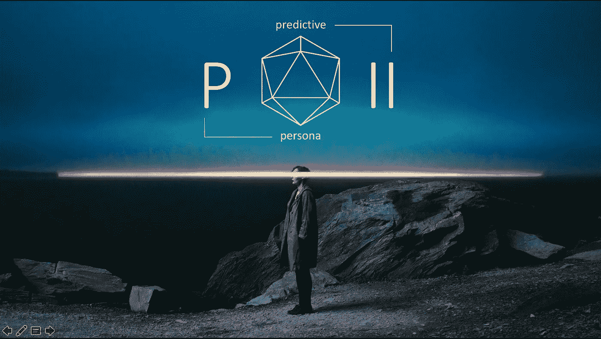
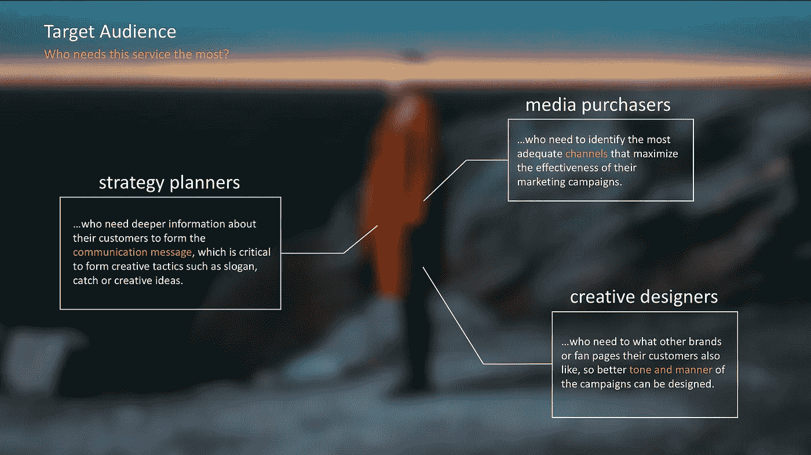
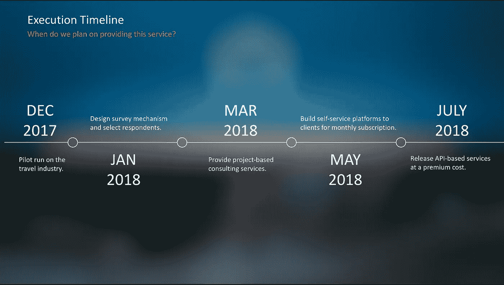
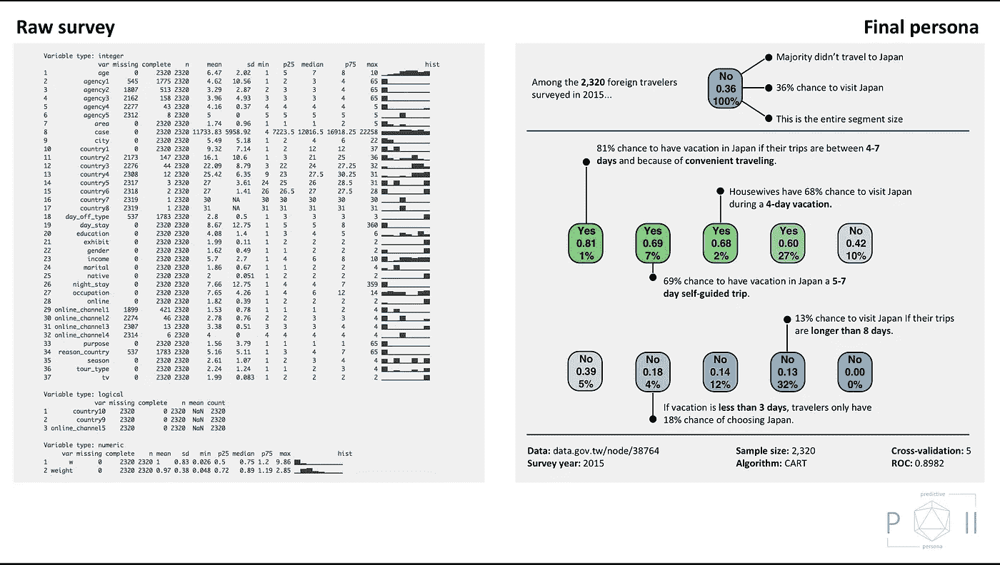

# 漂亮的数据科学演示

> 原文：<https://towardsdatascience.com/beautiful-data-science-presentations-9e9d8fd91446?source=collection_archive---------0----------------------->

## 制作视觉上吸引人的 PowerPoint 幻灯片的介绍。

> **概述**

这篇简短博客文章的目标读者是对 3 种不同用途的演示感兴趣的人:销售工具包、流程和分析报告。当然，这篇文章的核心思想不仅限于数据科学项目，因此来自该领域之外的人也可能会发现它很有用。

我们将通过一个数据即服务项目来展示这个想法，其中输入是大量的消费者调查，输出是一些描述我们目标受众的人物角色。

> **商业计划书**

商业计划书或销售套件的目的是为我们的数据科学咨询服务吸引潜在客户。他们可能来自不同的背景，在品牌或营销机构的营销职能部门中属于不同的员工级别。因此，我们希望通过吸引人的视觉设计，尽可能简单地传达我们的想法。

我们看到了这张由 ODESZA ( ***)制作的专辑封面，请注意，这仅用于演示和教育目的，该专辑拥有版权，因此我们需要所有者的许可才能修改它*** ):

让我们将我们的服务名称添加到图片中，使其成为我们的主要视觉效果，并将其修改为我们的封面。

然后，我们希望通过确定可能的工作角色来吸引他们的注意力。他们可能是战略规划者、媒体购买者或创意设计师。还建议用不同的颜色突出显示关键词。

接下来，我们将通过识别他们日常工作中可能出现的问题，给他们一个继续阅读的理由。注意，我们可以谷歌关键词，如“ **resource icon png white** ”来获得符合我们观点的小图标。我们还可以使用 PowerPoint 内置功能 **Arrange** 来对齐文字和图标之间的空间，使幻灯片更加美观，同时表现出对细节的关注等专业性。

我们需要更详细地告诉观众我们的解决方案能提供什么。同样，图标可以帮助我们更好地将想法联系起来，也可以节省观众理解我们服务的时间。

在接下来的部分，我们需要通过确定我们服务中的 4 个关键要素来解释服务实际上是如何工作的。注意，也建议找风格相似的图标。比如下面的图标轮廓都比较细。虽然这可能很费时间，除非我们想创建自己的图标。

最后，我们需要给出执行计划的明确时间表，否则我们的观众可能会发现我们的服务不切实际。此外，关键里程碑可能会更好地描述如何实际执行该服务。

这总结了数据科学业务提案中最重要的部分，可能会引起观众的极大兴趣，因此我们可以进入下一阶段。

> **工艺流程**

这个阶段的观众是更懂技术的工程师或科学家。虽然他们可能每天都在处理流程图，但也值得一提的是，漂亮整洁的图标可以帮助他们不太懂技术的观众更好地理解复杂的概念。我们想推荐的一个很好的资源是**麦肯锡洞察**，其中我们可以使用他们精心设计的展品作为我们的演示模板，比如这个:

现在，我们可以使用这个模板，并采取相关的图标来显示我们自己的服务的流程。PowerPoint 中的吸管工具非常适合将幻灯片上的颜色与插入的图片或其他对象进行匹配，如下所示。

一旦我们更好地理解了我们的服务是如何工作的，我们实际上就可以用它来构建一个 PoC，并拿出一个演示报告。

> **分析报告**

这可能是我们演示中最具技术性的部分，因为它与展示我们数据科学项目的实际结果有很大关系。这里对观众来说最重要的是最终的输出是什么样的。这里的受众可能是项目利益相关者，如营销主管或机构中的品牌负责人。我们希望向他们展示我们调查数据的输入以及我们角色的输出。

根据我们选择的机器学习模型，我们可能需要不同的可视化方法。虽然分类和回归树(CART)被认为是一种不太准确和稳健的方法，但它的可解释性和可解释性对我们的营销受众非常有帮助。出于演示目的，我们选择了去年去过日本的目标受众作为调查对象。我们可以清楚地看到每个角色是如何选择的，以及哪些关键特征可以帮助我们区分我们的目标受众和其他人，即去年没有去日本的人。

这篇简短的博文大致总结了这一点，因为我们可以看到，制作漂亮的演示文稿需要时间和精力，它们可能更有助于向业务人员、技术人员或工程师以及管理层解释复杂的数据科学项目。

这是我们第一次讨论数据科学中的交流和表达方面。建议定期访问不同的资源来探索演示模板，包括 R 或 Python 图库、行业报告或简单的 Google for cool business 演示模板。

O 笔以专案为基础的工作。
jchen6912@gmail.com