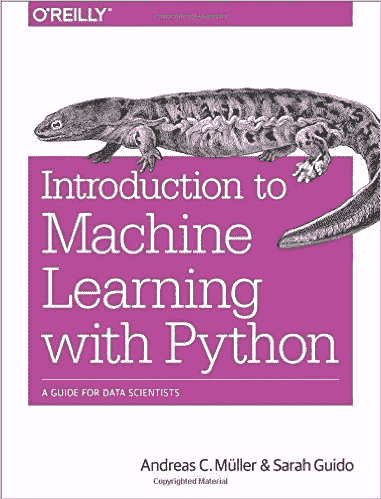
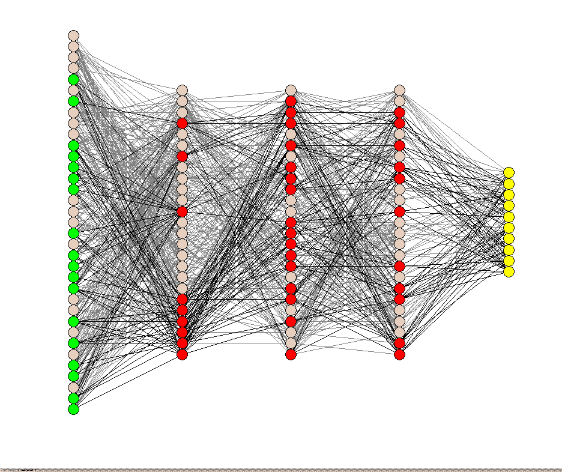

# 成为机器学习极客

> 原文：<https://towardsdatascience.com/becoming-a-machine-learning-geek-a956a98a7498?source=collection_archive---------3----------------------->

“Big Data in 21st Century.” Source: Marketing Land.

最近写了一篇关于 [*家*](https://medium.com/@moorissa/i-found-home-30a23324ab1a#.hw7p0ox3w) 的帖子。什么是你的家？

我认为家是任何你可以自由做自己的地方。最快乐的时候，最原始的你。

当我开始阅读我的机器学习[教材](http://shop.oreilly.com/product/0636920030515.do)时，我差不多就是这样。尽管我很开心(也很书呆子气)，但我还是疯狂地阅读了这本书，即使是在地铁上或吃着一碗拉面的时候。作者安德里亚斯·穆勒(Andreas Mueller)是我现在的教授，我很感激我学到了这么多关于机器学习在现实世界中的应用。

Highly recommended for those interested in Machine Learning.

那么什么是机器学习呢？一个科技网站将其定义为“一种人工智能(AI ),它为计算机提供了无需明确编程就能学习的能力。基本上都是从数据中提取知识。随着机器学习在我们日常生活中无处不在的应用，它可以被视为统计学和计算机科学的交叉领域。

在我最近参与的[机器学习中的女性](http://wimlds.org/)纽约分会中，我有机会回答他们关于使用数据集的问题。以下是我的想法，希望对那些对探索数据世界感兴趣的人有所帮助！

## **1。说说你处理过的最乱最丑的数据集吧。你是如何让它变得可用的？**

我使用 Python 和 SQL 从互联网上的各种类型中搜集数据。我发现的最难控制的数据集通常是那些缺少很多值、特征不一致以及用于识别空值的不同值的数据集。虽然这可能会延长清理过程，但我通过理解每个变量的含义、删除无关紧要的功能、创建虚拟对象以及使数据集的值保持一致，使其变得可用。

## **2。告诉我一个你不得不处理一个对你来说是新的数据集的时候。你是怎么探索出来的？你是如何理解这些数据的？**

我处理的数据集通常很大很复杂，具有从分类和有序到离散和连续的特征。为了探索和加深对数据的理解，我将首先进入布局文件，仔细通读该列中使用的每个特性/变量，对它们的类型进行分类，并查看是否有潜在的相关特性。

我喜欢通过各种类型的图表来可视化数据特征之间的关系，从条形图、直方图和箱线图到散点图、线性和径向形式。了解我们试图构建什么以及我们的模型将如何被使用是很重要的，因此我们知道在探索我们的数据时要寻找什么。我用于数据探索的一些工具通常涉及 R (ggplot2 非常有用)、Python (matplotlib！)，SAS，Excel(谁没有？)，以及 D3(基于 Javascript 的库提供了一些很酷的交互特性)。

## **3。告诉我一个你建立的预测模型。你用了什么方法？你是如何验证你的模型的？**

我在构建预测模型时使用了各种类型的监督学习技术，从广义线性模型和 k 近邻技术到决策树和神经网络。然而，大多数时候，由于数据集的复杂性较低，我使用分类和回归来建立预测模型。

我使用交叉验证(通常是 k-fold)和网格搜索以及不同的参数技术，并可能结合其他方法来很好地验证模型，避免过拟合或欠拟合。为了进一步验证，迭代过程对于确保 R 平方不仅是好的，而且是精确的是非常重要的。建设管道也有助于避免信息泄露。

## **4。告诉我一个你做过的地理空间分析或者你制作的地图。**

我最近赢得了哥伦比亚大学商学院(Columbia Business School)举办的一场黑客马拉松，在那里我开发了一个交互式数据可视化工具，以确定治疗糖尿病、精神障碍和艾滋病毒等常见疾病的医生短缺的社区。这个想法是纽约市的公共机构或医疗服务提供者自己可以利用这些信息在地理上更好地匹配医生和病人。除了这次经历，我还喜欢在业余时间玩玩可视化，看看我最近用 D3 制作的这张简单的地图，来确定世界各国的幸福排名:http://moorissa.com/happy-countries/。

## 5.告诉我你的一些技能，这些技能可能有助于探索机器学习领域的数据。

云(亚马逊 AWS 或谷歌云)、D3、Excel、Git & GitHub、HTML & CSS、Javascript、Python、R、SAS、Spark Apache、Tensorflow、Hadoop MapReduce。

Moorissa 是一名研究生，目前在哥伦比亚大学学习机器学习，希望有一天她可以利用这些技能让世界变得更美好，一次一天。