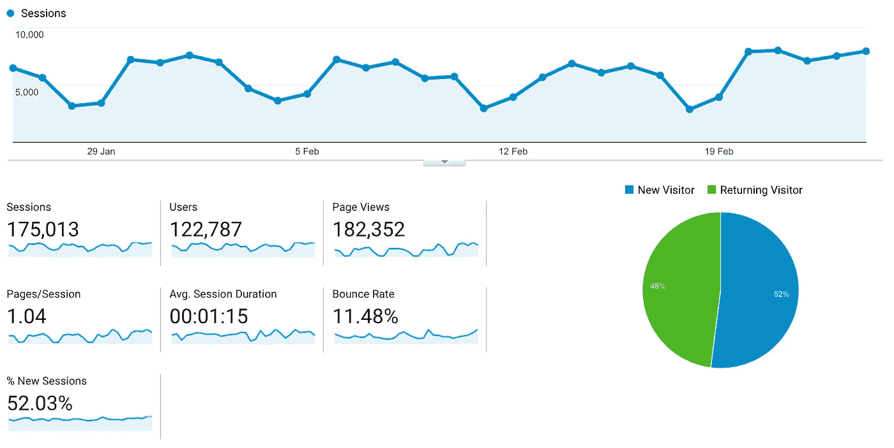
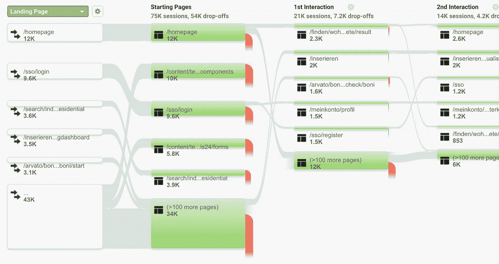
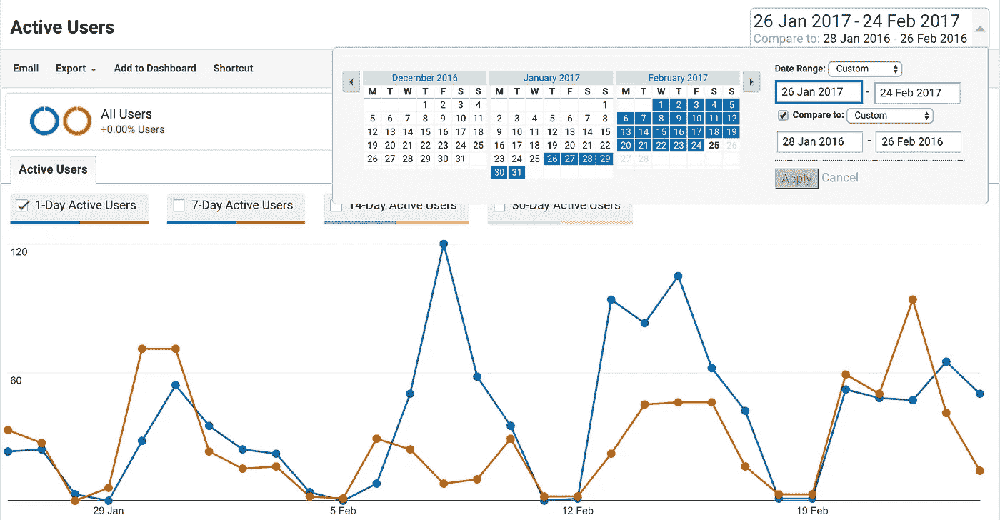

# 成为数据驱动的第 1 级:拥有您信任的用户数据

> 原文：<https://towardsdatascience.com/becoming-data-driven-level-1-having-user-data-you-trust-9d1c485b8db9?source=collection_archive---------2----------------------->

在本系列的第一部分[中，我们将讨论如何获得你信任和理解的用户行为数据。这意味着涵盖漏斗和跟踪事件的设置和初步理解。如果你已经知道这些事情，那么请随意跳过。](https://medium.com/@moowahaha/becoming-data-driven-624515a5fb9d)

虽然世界上有很多分析系统，但谷歌分析是事实上的标准。它免费提供高级数据，并与其他系统共享许多相同的词汇和核心概念，如事件跟踪。事件跟踪非常棒:它支持漏斗和实验分析。稍后我会深入探讨这意味着什么，但关于谷歌分析，我想提出两点。第一，可靠。我使用过各种实验和分析框架，当我们不相信来自这些系统的数字时，我们经常与谷歌分析中的数字进行比较，这是信任的明显标志。第二，它是可用的。它的高水平分析和跟踪事件的方法使它受到初创公司和一些世界上最大的在线品牌的欢迎，因为它让缺乏数据分析背景的人能够理解正在发生的事情。**成为数据驱动的一个关键因素是，组织中的每个人都可以读取和解释用户数据。**

Some no-effort, high-level user data from Google Analytics

为了完整起见，[以下是你如何为你的网站](https://developers.google.com/analytics/devguides/collection/analyticsjs/)、 [iOS 应用](https://developers.google.com/analytics/devguides/collection/ios/)或 [Android 应用](https://developers.google.com/analytics/devguides/collection/android/)设置谷歌分析。

# 跟踪

而 Google Analytics 自带大量高级流量数据，如流量、留存、来源、语言等。，它不会提供太多的机会洞察力。这就是“跟踪事件”有用的地方。有了少量的代码，你就可以开始了解某件事情发生了多少次，人们是如何使用你的产品的。例如，您可以在按下特定按钮或呈现特定页面时触发跟踪事件。测量事件的相对发生率是漏斗分析和实验的基础，因此将跟踪放在你理解的地方是至关重要的。

让我们介绍一个使用事件来跟踪用户如何通过销售袜子的在线商店的实际例子。这个商店有六个页面:

1.  包含搜索表单的主页。
2.  搜索结果，包含一堆袜子。
3.  列表详细信息页面，包含特定袜子的大量信息。它在页面的顶部和底部有两个“添加到购物车”按钮。
4.  带有“结帐”和“从购物车中删除”按钮的购物车。
5.  带有信用卡表单和“立即支付”按钮的支付页面。
6.  支付确认页面。

人们向确认页面的移动是你的漏斗，很多用户在漏斗的顶端随意浏览你的网站，一些人沿着漏斗向下购买，也就是所谓的“转化”。

首先，你可以使用[页面跟踪](https://developers.google.com/analytics/devguides/collection/analyticsjs/pages)来跟踪每个页面，从主页到付款确认。谷歌将跟踪哪些页面被默认点击，但页面跟踪事件是分配有意义的名称和更详细信息的好方法，使分析更容易。

接下来可以介绍[事件跟踪](https://developers.google.com/analytics/devguides/collection/analyticsjs/events)。事件跟踪可用于计算任何任意事件；在我们的示例中，我们可以为以下内容添加跟踪事件:

*   列表详细信息页面有两个“添加到购物车”按钮——为每个按钮引发一个事件，以了解哪个按钮的点击率最高。
*   购物车有“结帐”和“从购物车中删除”按钮。了解哪个按钮被按下可以告诉你有多少用户误用了购物车，或者有多少比例的用户进入了你的漏斗。
*   支付页面上的“立即支付”按钮。
*   不要忘记在付款确认页面上跟踪！以防您在“立即支付”和确认之间有一些您可能想要检测的损失(例如，导致错误和收入损失的错误)。

Sample tracking event JavaScript

有了这种跟踪，您现在正在收集数据，这些数据将构成一些后续分析的基础。恭喜你。现在我们可以弄清楚如何阅读它来理解机会。

值得注意的是，谷歌分析[也支持一些专门为电子商务设计的功能](https://developers.google.com/analytics/devguides/collection/analyticsjs/ecommerce)。

# 了解您的漏斗

通过你设置的跟踪事件，你可以开始了解用户是如何与你的产品互动的。

Example Behavior Flow

谷歌分析有几种不同的方式来查看和分析您的跟踪事件。一个简单的起点是“[行为流](https://support.google.com/analytics/answer/2785577)”。这构建了事件、页面或屏幕被触发的顺序以及与会话期间相邻事件、页面或屏幕的比率的图片，从初始登陆到某个最终端点。这份报告对你的漏斗和用户如何使用你的产品提供了一些见解，但也有一个缺点:它可能会对一定比例的事件进行采样，而不是对高容量产品的每一个事件进行计数。如果你的转化率很低，你可能会在漏斗的末端得到稍微不准确的结果。尽管如此，这仍然是一个不错的起点。

您可以开始构建[自定义报告](https://support.google.com/analytics/answer/1151300)。有了这些，你可以衡量和比较不同的事件随着时间的推移。重要的是要了解趋势，以检测你的产品是增长还是停滞。但是有龙。按周衡量是常见的，但这是危险的。以袜子零售商为例，这将是一项季节性业务，在假期期间可能会出现不成比例的销售额，然后可能在 1 月份下降。在可能的情况下，更好的比较通常是同比，即与前一年的类似日期进行比较。有时候同比比较很棘手，因为比如说，情人节可能是某年的某个星期一，而第二年的某个星期三。因此，你必须对一年的 365 天进行补偿，并将一周中的每一天与前一年对齐，直到我们拥有十进制表示地球绕太阳旋转的技术。

Sample year-on-year comparison with date correction so day of week lines up.

在早期，你可能不一定知道有多少用户可以通过你的漏斗的最佳版本(在后面的文章“成为数据驱动 3:使用数据做出令人敬畏的决定”中有更多的信息)。然而，你可以为自己设定一些漏斗优化的目标:如果有 5%的用户点击你的主页进行搜索，你可以尝试不同的方法来达到 7%。试图达到这个目标不仅会给你一些努力改善漏斗的想法，还会让你成为一个袜子亿万富翁。

# 进一步阅读

*   如果你有兴趣了解更多关于谷歌分析的信息，看看[谷歌分析学院](https://analyticsacademy.withgoogle.com/)。
*   虽然我使用谷歌分析作为一种方式来说明一些概念，但也有替代方案。这里是对这些替代品的一个稍微陈旧但相当彻底的回顾。
*   [漏斗分析的维基百科页面不错](https://en.wikipedia.org/wiki/Funnel_analysis)。

# 包裹

在这里，我们已经讨论了如何使用 Google Analytics 跟踪和查看产品中发生的事情的纯技术练习。这是容易的部分。当你试图利用数据做出决策，并围绕数据和目标塑造组织时，事情会变得越来越难。[下一篇文章](https://medium.com/towards-data-science/becoming-data-driven-level-2-using-data-to-avoid-shitty-decisions-6756b778f1?source=linkShare-8b5d780c2f07-1488613135)将讲述如何减少在令人遗憾的项目上浪费时间的可能性……“避免糟糕的决定”，如果你愿意的话。