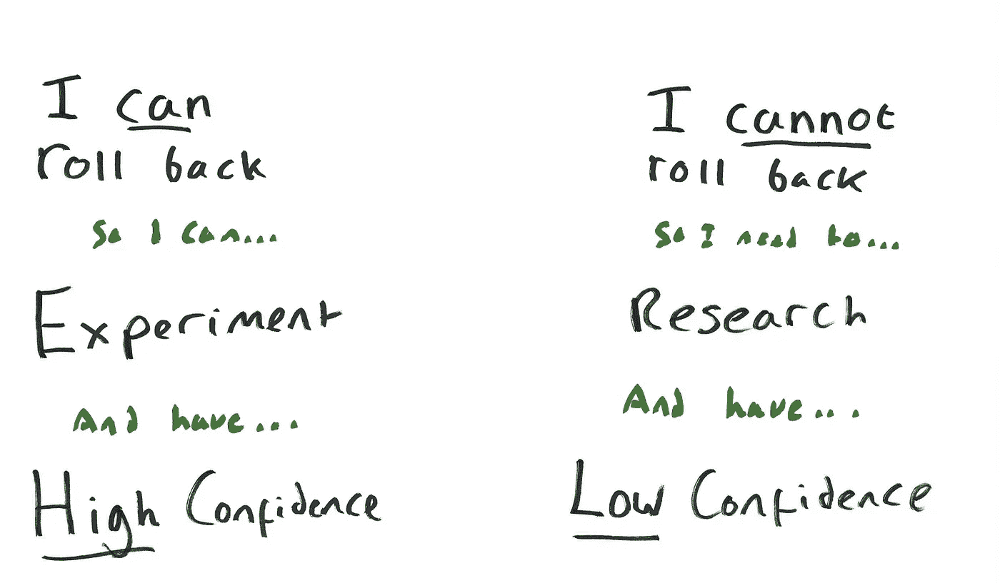

# 成为数据驱动的第二级:使用数据来避免不明智的决策

> 原文：<https://towardsdatascience.com/becoming-data-driven-level-2-using-data-to-avoid-shitty-decisions-6756b778f1?source=collection_archive---------5----------------------->

“用数据来避免糟糕的决策”只是“降低风险”的一种委婉说法。本系列中的第 2 级是关于降低发布在线产品变更的可能性，这种变更可能不会产生投资回报或具有潜在危害。鉴于[第 1 级](https://medium.com/@moowahaha/becoming-data-driven-level-1-having-user-data-you-trust-9d1c485b8db9#.fhnms16vu)是跟踪&报告的技术练习，第 2 级及以上更具哲理性。

# 你是“假设”中的“屁股”

当提出改变现有产品或推出新产品的想法时，了解你的假设是什么是很重要的。如果你知道你的假设是什么——尤其是那些你信心不足的假设——你就可以开始想办法将这些假设转化为事实。你要问自己的问题是:做这件事的最好方法是什么？这里有一张图是 *100%正确的*，并且由*科学家*进行了同行评审，以帮助构建讨论框架:

如果您可以启动和删除某些东西，而不会永久损害您的用户体验(“回滚”)，那么您应该尝试通过实验在真实用户身上进行测试，让您对结果有很高的信心。另一种方法是预先进行研究，寻找先例、市场数据或在受控环境中进行用户测试。虽然本文关注的是该图的左侧，但这两种方法在正确的上下文中都是完全有效的，甚至是互补的，只是基于真实用户数据时可信度更高。这里有一些故事…

# 新产品 MVP

MVP 的意思是“最小可行产品”。MVP 是一个产品或特性，它包含了测试一个想法的可行性所需的最少的功能或工作量。当谈到现有产品时，在现有用户基础上进行实验的能力是一个优势。但是当用户群还不存在的时候，你需要更有创造力。

根据他们的网站“Rocket Internet 建立并投资互联网公司，将成熟的在线商业模式带到新的、快速增长的市场”。这意味着，他们通常会采用一种他们知道在一个市场成功的产品，并在另一个市场尝试，以此来降低一些风险。然而，失败的风险远非为零，这一模型的一个广为人知的假设是，一个在美国行得通的想法在另一个国家也会行得通。因此，需要制定策略来检验这一假设。例如，当他们评估 [Shopwings](https://www.shopwings.com.au/) (一种从超市送货上门的服务)的可行性时，他们派了一帮学生去当地的商店购买每件商品并拍照。每张照片都被放在网站上，并附有描述和合理的价格。钱花在了这个网站的广告上，就用户而言，这是真实的和运行的。一旦他们建立了足够的信心，他们就可以筹集资金，雇佣一个完整的团队来生产产品并交付货物。Rocket 已经非常擅长这种技术，并利用它创办了许多公司。

同样方法的一个更著名的例子是在线鞋类零售商 [Zappos](http://www.zappos.com/) 。创始人尼克·斯温穆恩(Nick Swinmurn)从当地一家鞋类零售商那里拍摄了鞋子的照片，并建立了一个网站进行销售。当订单来了，他去商店，购买和运输鞋子。以较低的成本，这解决了人们愿意冒险在网上买鞋的假设。有趣的是，Zappos 启发 Rocket Internet 创建了 [Zalando](https://www.zalando.de/) ，它现在是欧洲最大的在线时装零售商之一。

# 新功能 MVP

一个 MVP 不一定是一个全新的产品。它可以是现有产品上的新特性，允许您运行实验或执行用户测试，这取决于您的回滚能力。新产品 MVP 同样适用的原则是:我们试图用最少的努力来测试关于我们新特性的假设。

一个涵盖很多基础的例子是在 [LYKE](https://www.lyke.co.id/) 上运行的一个小实验，这是一个为注重时尚的印尼人开发的购物应用。LYKE 的一个显著区别在于，推荐是用户体验的核心。这意味着主屏幕、搜索结果和推送通知的内容会受到先前浏览和购买行为的严重影响，而不是像传统做法那样，受到用户输入的搜索标准或由员工管理的列表的影响。然而，建立足够的数据来生成推荐需要用户浏览或购买，因此新用户的体验不如现有用户好。

为了克服这一点，LYKE 决定引入一个 onboarding 流程，用户在第一次打开应用程序时会被问及关于他们口味的问题。研究完成了，设计完成了，用户在实验室接受了测试，并且有了很高的信心。最大的风险是，如果用户理解这样做的价值，他们会愿意提供这些信息。为了测试这一假设，设计了一个 MVP，其中包含关于购物偏好的问题，但没有完成的功能所需的任何其他功能。50%的新用户暴露于此，在奇数和偶数设备 id 之间任意划分(更多关于进一步划分受众)。没有围绕它建立推荐模型，也没有存储数据。谷歌分析事件(如此简单……)被用来跟踪有多少人在入职时关闭了应用程序，在哪个阶段，有多少人没有进入主屏幕，有多少人进一步参与并购买了应用程序，而对照组则没有这种体验。为了便于比较，对控制组和变量组触发的跟踪事件进行了不同的命名。实验显示，大多数人都关闭了应用程序。一些有价值的东西是以低成本学到的:大多数用户只想购物，任何妨碍购物的东西都是不必要的干扰。

上面例子中的一个关键点是，这个项目对 LYKE 的价值与对用户的价值不同。LYKE 重视其个性化体验，但大多数用户只是想购物，而没有意识到科学在指导他们的行为。通过这种方式的实验，该团队以低廉的代价失败了，并了解了很多关于他们的用户想要他们的应用程序的东西，理解了中断他们的流量的真正影响，并帮助指导未来的产品决策。利用第一次实验的数据，他们可以理解问题的落点和最佳点。有了这些数据，他们又尝试了一次，取得了更大的成功……这次用了“跳过”按钮。

# 实验类型

如果你没注意到，我用了很多“实验”这个词。在上面的例子中，我介绍了两种不同类型的实验:

*   [绿野仙踪测试](https://en.wikipedia.org/wiki/Wizard_of_Oz_experiment)。这是一个对用户来说似乎完全功能化的 MVP，但是，在引擎盖下，是一些更加手动的东西，就像 Rocket 或 Zappos 的例子。
*   [A/B/n 检测](https://en.wikipedia.org/wiki/A/B_testing)或[多元检测](https://en.wikipedia.org/wiki/Multivariate_testing_in_marketing)。将你的现有受众分成两个或更多随机的“桶”，向他们展示你的产品或功能的稍微不同的版本，并比较两组之间的行为差异。如在 LYKE 例子中所解释的。

这些很特别，因为对用户来说，它们是真实的。这给了你很多信心，根据你得到的数据，你是否应该改变(改变你的计划)，放弃或进一步投资。你也可以通过调查、研究、[门房 MVP](https://grasshopperherder.com/concierge-vs-wizard-of-oz-test/)或者直接的登录页面来测试你的想法的有效性，这些页面解释了如果一个产品以某种方式为用户表达兴趣而存在，它会做什么。虽然我喜欢 A/B/n 测试&绿野仙踪测试的故事，但是人们经常会遇到一些危险…

# 实验危险

当您对用户进行 A/B/n 测试时，您需要确保用户在存储桶之间的合理分布。LYKE 将用户分为奇数和偶数设备 id，但这是一个可怕的想法，原因有二。首先，如果您同时运行两个实验，而没有在存储桶之间随机分配用户，那么一组用户将看到两个实验的变体，一组用户将看到两个实验的对照。你实际上希望它比这更混合，这样你就可以确定哪个实验导致了哪个影响。

Two mice

未能对用户进行随机分组的第二个问题是，如果你按顺序进行实验，你会有一个总是被实验的受众，而另一个是“干净”的受众。随着时间的推移，与另一个群体相比，这可能会开始影响一个群体的潜在行为。如果你的实验经常改变你的流程的基本部分，那么如果使用你的产品是不可预测的或不稳定的，那将会使那些“不同的用户”感到沮丧。按顺序运行实验还会使安排工作变得很麻烦。

下一个常见的危险是看着实验结果说“是的，够好了”\_(ツ)_/。如果你进行实验，你需要确信结果不是随机的。想象你将一枚硬币抛 1000 次，大概它落在一边的次数会比另一边多一点。如果你再次做同样的事情，假设硬币的重量分布均匀，有 50%的机会它会更频繁地落在另一边。为了确信你的结果不是随机的，你可以测试“统计显著性”。有大量的统计显著性计算器供您选择，如[这个](http://getdatadriven.com/ab-significance-test)、[这个](https://vwo.com/ab-split-test-significance-calculator/)、[这个](https://www.hubspot.com/ab-test-calculator)或[这个](https://abtestguide.com/calc/)。尽管有不必要的页面超时，但后者是我的最爱。

统计显著性是一个很好的方法来判断一个变化是否可能是随机的结果，但是有理由偶尔暂时忽略这一点:一些变化需要时间让用户适应。如果他们习惯于把一个按钮放在一个地方，而你把它移到另一个地方，那么在他们再次恢复过来并调整习惯之前，预计他们会有些沮丧或惊讶。我不确定是否有一个好的公式来解释这一点，但当我在 iOS 和 Android 原生应用上工作时，我们经常假设更新后两三天的行为变化，并忽略这一时期进行分析，除非它是灾难性的。我们忽略它，部分是因为在应用程序更新后参与度往往会增加，部分是因为如果最新版本包含应用程序核心流程的变化，用户可能会经历一次调整。

在开始实验之前，心中有一个可以衡量的明确目标是非常重要的，理想的目标是改善你的业务，这不同于衡量对新功能的吸收。当然，衡量你的新功能是否被使用是很重要的，但是更重要的是了解这个功能是否使你的产品更有效。假设你在你的袜子销售网站上运行一个新的愿望清单功能的实验。这个“愿望清单”允许用户保存他们最喜欢的袜子，供以后查看。你当然可以衡量有多少人使用这个功能，但更重要的是要确保访问意愿列表的人继续购买(“转化”)。如果很多人使用愿望清单，但由于某种原因没有购买，那么愿望清单可能会很混乱。

最后一个危害是我所说的“情感过度投资”。当你建立一个东西时，很自然地希望它成功。如果数据显示你构建的东西没有像你希望的那样工作，那么调查一下为什么，因为你可以学到一些东西。但是注意不要找理由来证明你改变的成功。如果上一段中的愿望清单示例导致用户列出很多愿望，但购买更少的袜子，这可能是意想不到的。如果你调查并发现这种下降是真实的，请随时更改功能并再次尝试，但不要不加更改地推出这一功能，除非你对暂时少卖袜子感到舒服。

# 进一步阅读

*   关于不同类型的 MVP 的好文章。
*   [可用性测试](https://en.wikipedia.org/wiki/Usability_testing)，我已经懒洋洋地称之为“用户测试”。我现在不会改变对它的引用。
*   Zappos 的故事是在重复已经写好的[精益创业](http://theleanstartup.com/)。值得一读。
*   [A/B 测试框架列表](http://mashable.com/2015/01/30/ab-testing-tools/#UmWi1BdbHaq6)。
*   LYKE 构建了一个分桶系统来帮助将用户分配到桶中(比奇数/偶数设备 id 更好！).[来看看](https://github.com/rocket-internet-berlin/RocketBucket/)。

# 包裹

我们讲述了识别假设的重要性，以及测试假设以增强信心的一些方法。然后，我开始长篇大论地谈论做实验时应该避免什么。从中得出的关键是，有相当简单的技术来确定你将要发布的东西是否是一个好主意，并了解你的用户。你甚至可以用实验来对真正的用户冒真正的风险，只要你能体面地回滚。如果你不能，那么你应该把你的努力更多的放在研究和用户测试上。

[下一篇文章](https://medium.com/@moowahaha/becoming-data-driven-level-3-using-data-to-make-awesome-decisions-522179766043)是关于使用数据(比如通过实验收集的数据)来帮助指导决策。回头见！再见了。再见！