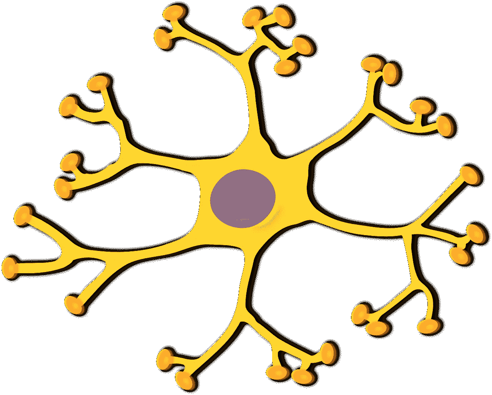
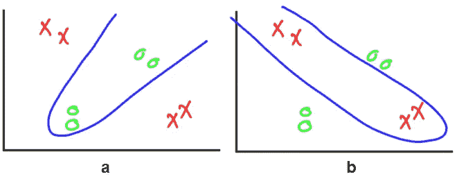
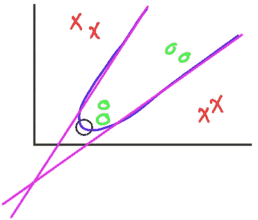
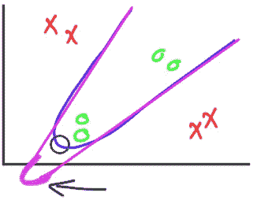
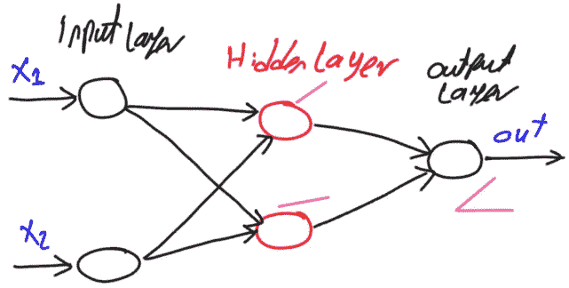
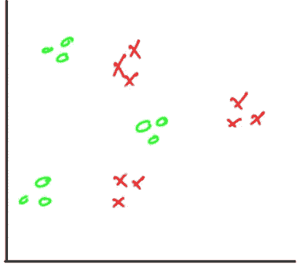
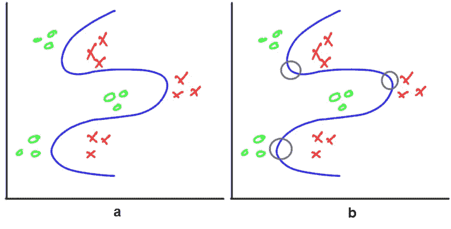
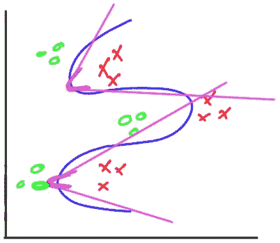
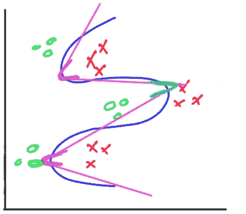
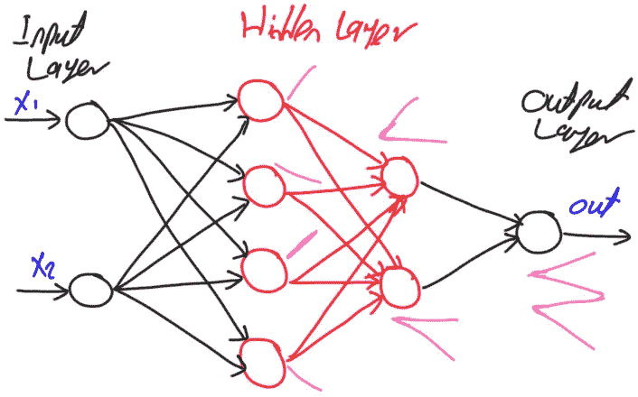

# 新手问“人工神经网络要用多少个隐层/神经元？”

> 原文：<https://towardsdatascience.com/beginners-ask-how-many-hidden-layers-neurons-to-use-in-artificial-neural-networks-51466afa0d3e?source=collection_archive---------1----------------------->

人工神经网络(ann)的初学者很可能会问一些问题。这些问题包括使用多少个隐藏层？每个隐藏层有多少个隐藏神经元？使用隐藏层/神经元的目的是什么？增加隐藏层/神经元的数量总是能得到更好的结果吗？我很高兴地告诉大家，我们可以回答这样的问题。明确地说，如果要解决的问题很复杂，回答它们可能会太复杂。到本文结束时，您至少可以了解这些问题是如何回答的，并能够根据简单的例子进行自我测试。

# 介绍

ANN 的灵感来自于生物神经网络。为简单起见，在计算机科学中，它被表示为一组层。这些层分为三类，即输入层、隐藏层和输出层。

知道输入和输出层的数量及其神经元的数量是最容易的部分。每个网络都有一个输入层和一个输出层。输入层中神经元的数量等于正在处理的数据中输入变量的数量。输出层中神经元的数量等于与每个输入相关联的输出的数量。但是挑战在于知道隐藏层及其神经元的数量。

以下是了解分类问题中隐藏层和每个隐藏层的神经元数量的一些准则:

1.  根据这些数据，画出一个预期的决策边界来分隔这些类。
2.  将决策边界表示为一组线。请注意，这些线的组合必须服从决策边界。
3.  选定线的数量表示第一个隐藏层中隐藏神经元的数量。
4.  为了连接由前一层创建的线，添加了一个新的隐藏层。请注意，每次需要在前一个隐藏层中的线条之间创建连接时，都会添加一个新的隐藏层。
5.  每个新隐藏层中隐藏神经元的数量等于要建立的连接的数量。

为了让事情更清楚，让我们将前面的指导方针应用到一些例子中。

# 示例 1

让我们从一个简单的两类分类问题的例子开始，如图 1 所示。每个样本有两个输入和一个表示类标签的输出。这与异或问题非常相似。

**Figure 1**

要回答的第一个问题是是否需要隐藏层。确定是否需要隐藏层的规则如下:

> 在人工神经网络中，当且仅当数据必须非线性分离时，才需要隐藏层。

查看图 2，似乎这些类必须是非线性分离的。单行不行。因此，我们必须使用隐藏层，以获得最佳决策边界。在这种情况下，我们可能仍然不使用隐藏层，但这将影响分类精度。所以，最好使用隐藏层。

为了添加隐藏层，我们需要回答以下两个问题:

1.  所需的隐藏层数是多少？
2.  每个隐藏层中隐藏神经元的数量是多少？

按照前面的过程，第一步是绘制划分两个类的决策边界。如图 2 所示，有不止一个可能的决策边界可以正确分割数据。我们将用于进一步讨论的是图 2(a)。

**Figure 2**

按照指导方针，下一步是用一组线来表达决策边界。

使用一组线来表示决策边界的想法来自于这样一个事实，即任何人工神经网络都是使用单层感知器作为构建块来构建的。单层感知器是一个线性分类器，它使用根据以下等式创建的线来分离类别:

y = w1 * x1+w2 * x2+⋯+w1 * x1+b

其中 **x_i** 为输入， **w_i** 为其权重， **b** 为偏置， **y** 为输出。因为每增加一个隐藏神经元都会增加权值的数量，因此建议使用最少数量的隐藏神经元来完成任务。使用比所需更多的隐藏神经元将增加更多的复杂性。

回到我们的例子，说 ANN 是使用多个感知器网络构建的，等同于说网络是使用多条线构建的。

在这个例子中，判定边界由一组线代替。这些线从边界曲线改变方向的点开始。在这一点上，放置了两条线，每一条都在不同的方向上。

因为边界曲线只有一个点改变方向，如图 3 中灰色圆圈所示，所以只需要两条线。换句话说，有两个单层感知器网络。每个感知器产生一条线。

**Figure 3**

知道只需要两条线来表示决策边界告诉我们，第一个隐藏层将有两个隐藏神经元。

到目前为止，我们有一个带有两个隐藏神经元的隐藏层。每个隐藏神经元可以被视为线性分类器，如图 3 中的线所示。将有两个输出，一个来自每个分类器(即隐藏神经元)。但是我们要构建一个单一的分类器，用一个输出表示类标签，而不是两个分类器。结果，两个隐藏神经元的输出将被合并成单个输出。换句话说，这两条线将由另一个神经元连接。结果如图 4 所示。

幸运的是，我们不需要添加另一个具有单个神经元的隐藏层来完成这项工作。输出层神经元将完成这项任务。这种神经元将合并先前生成的两条线，使得网络只有一个输出。

**Figure 4**

知道了隐藏层及其神经元的数量后，网络架构就完成了，如图 5 所示。

**Figure 5**

# 示例 2

另一个分类示例如图 6 所示。它类似于前面的例子，其中有两个类，每个样本有两个输入和一个输出。区别在于决策边界。这个例子的边界比上一个更复杂。

**Figure 6**

根据指南，第一步是绘制图 7(a)所示的决策边界。

下一步是将决策边界分割成一组线，其中每条线将被建模为人工神经网络中的感知器。在画线之前，应如图 7(b)所示标出边界改变方向的点。

**Figure 7**

问题是需要多少行？每个顶点和底点将有两条线与之相关联，总共四条线。中间点的两条线将与其他点共享。要创建的行如图 8 所示。

因为第一隐藏层将具有与行数相等的隐藏层神经元，所以第一隐藏层将具有四个神经元。换句话说，有四个分类器，每个都由一个单层感知器创建。目前，网络将产生四个输出，每个分类器一个。下一步是将这些分类器连接在一起，以使网络只生成一个输出。换句话说，这些线将通过其他隐藏层连接在一起，以生成一条曲线。

**Figure 8**

由模型设计者来选择网络的布局。一种可行的网络架构是建立具有两个隐藏神经元的第二隐藏层。第一个隐藏神经元将连接前两条线，最后一个隐藏神经元将连接后两条线。第二个隐藏层的结果。第二层的结果如图 9 所示。

**Figure 9**

至此，有两条分离的曲线。因此，网络有两个输出。下一步是将这些曲线连接在一起，以便整个网络只有一个输出。在这种情况下，输出层神经元可以用于进行最终连接，而不是添加新的隐藏层。最终结果如图 10 所示。

**Figure 10**

网络设计完成后，完整的网络架构如图 11 所示。

**Figure 11**

欲了解更多信息，

深度学习+用人工神经网络解异或简介

slide share:[https://www . slide share . net/AhmedGadFCIT/brief-introduction-to-deep-learning-solution-xor-using-ANNs](https://www.slideshare.net/AhmedGadFCIT/brief-introduction-to-deep-learning-solving-xor-using-anns)

YouTube:[https://www.youtube.com/watch?v=EjWDFt-2n9k](https://www.youtube.com/watch?v=EjWDFt-2n9k)