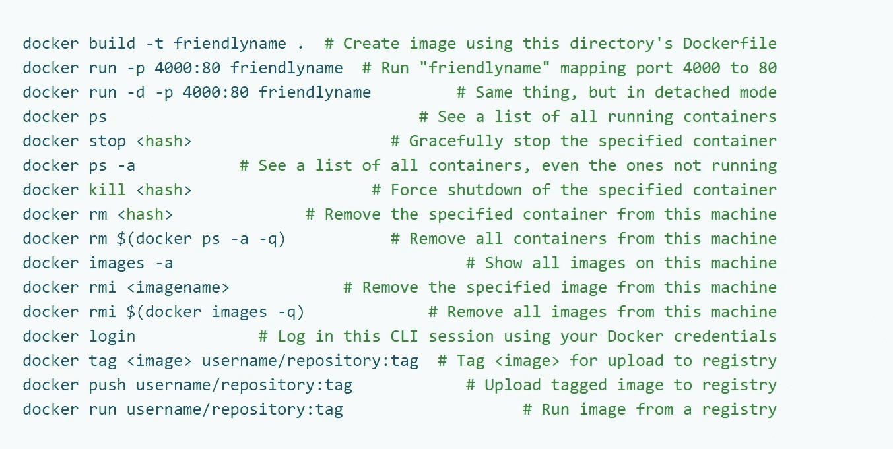

# 数据科学入门指南— Python + Docker

> 原文：<https://towardsdatascience.com/beginners-guide-to-data-science-python-docker-3181fd321a5c?source=collection_archive---------5----------------------->

## 每样都来一点

# 范围

我最近发现了[安舒尔·巴吉](https://medium.com/u/80e447e76fa9?source=post_page-----3181fd321a5c--------------------------------)的[上映](http://opened.ai)的公告

[](https://medium.com/opened-ai/ai-for-education-global-hackweek-7edc7db87d4f) [## 人工智能教育全球黑客周:7 月 28 日至 8 月 4 日

### 你的开源人工智能项目将获得 17，000 美元的奖金

medium.com](https://medium.com/opened-ai/ai-for-education-global-hackweek-7edc7db87d4f) 

尽管我不知道 S#！关于机器学习，我注册了，希望学习，并希望建立一个有用的工具。*嗯，老实说，注册的好处(AWS 积分、Bluemix 积分等)也很吸引人。*

所以这是我的尝试，从新手开始，慢慢走向机器学习中令人满意的水平，并根据我的研究和我觉得对我这样的初学者有趣和有用的话题，发表更多的故事。

# 那么到底什么是机器学习呢？

> 让计算机在没有明确编程的情况下运行。

就是这样！现在你只需要知道这些。

# 数据科学

你知道 Amazon.com 是怎么提出建议的。它知道你需要一双新袜子，甚至在你真正需要它们之前。这一切都是通过数据来完成的——你的数据，我的数据，所有这些数据。它会根据搜索查询，或者过去的购买记录，或者躲在橱窗后面列出你所有的对话，来预测你下一件想买的东西。

> 简而言之，数据科学是一种分析、处理大块数据并将其转换为信息的科学，这样就可以用它来预测你想要购买的下一件东西。也适用于教育、医疗、时尚等领域。

在第一个示例中，我们将获取一个水果度量(如大小、重量、质地)的样本数据集，标记为苹果和橙子。然后，我们可以使用 scikit-learn 的[决策树](http://scikit-learn.org/stable/modules/tree.html)(一个满足所有机器学习需求的糟糕模块)预测给定的一组新水果指标的水果。

第一次提交

## [码头工人](https://www.docker.com/)

> 一个可怕的工具，你应该昨天就学会了。

说真的，Docker 让开发环境的建立变得轻而易举。我倾向于在装有不同操作系统的不同机器上工作，安装了 Docker 就没有必要担心依赖性。

步骤:

1.  安装[对接器](https://www.docker.com/)。
2.  创建 Dockerfile(在名为“MyCatKnowEverything”的新文件夹中名为“Dockerfile”的文件)— Dockerfile 是一个文本文件，包含自动构建给定图像所需的所有命令。在这里是 python。

```
# Use an official Python runtime as a parent image
FROM python:3.6-slim

# Set the working directory to /app
WORKDIR /app

# Copy the current directory contents into the container at /app
ADD . /app

# Install any needed packages specified in requirements.txt
RUN pip install -r requirements.txt

# Define environment variable
ENV NAME World

# Run app.py when the container launches
CMD ["python", "app.py"]
```

3.Create requirements.txt —包含 python 模块，与 Docker 无关。在 Dockerfile 内部调用。

```
numpy
scipy
scikit-learn
```

## [Python](https://www.python.org/)

在文件夹 MyCatKnowEverything 中创建一个名为“app.py”的文件

```
from sklearn import tree#DataSet
#[size,weight,texture]
X = [[181, 80, 44], [177, 70, 43], [160, 60, 38], [154, 54, 37],[166, 65, 40],
     [190, 90, 47], [175, 64, 39],
     [177, 70, 40], [159, 55, 37], [171, 75, 42], [181, 85, 43]]

Y = ['apple', 'apple', 'orange', 'orange', 'apple', 'apple', 'orange', 'orange',
     'orange', 'apple', 'apple']

#classifier - DecisionTreeClassifier
clf_tree = tree.DecisionTreeClassifier();
clf_tree = clf_tree.fit(X,Y);

#test_data
test_data = [[190,70,42],[172,64,39],[182,80,42]];

#prediction
prediction_tree = clf_tree.predict(test_data);

print("Prediction of DecisionTreeClassifier:",prediction_tree);
```

**我不打算浏览代码，因为它是 Python 而不是 Java。**


Directory Structure

5.**运行**docker build-t<tag _ name>。| *example- docker build -t 这很简单。(不要忘记“.”)*

6.**运行** docker 运行< tag_name > | *示例——docker 运行 this_is_easy*


Output — see them apples there

不要被庞大的 docker run 命令吓到。“rm”在完成执行后删除容器,“name”只是给容器命名,“v”是用容器挂载一个卷。更多关于这个[这里](https://docs.docker.com/engine/tutorials/dockervolumes/)。

这里有几个 docker 命令，可以让你动起来



[https://docs.docker.com/get-started/part2/#recap-and-cheat-sheet-optional](https://docs.docker.com/get-started/part2/#recap-and-cheat-sheet-optional)

我们完了。我们刚刚使用 [Docker](https://hub.docker.com/r/ashishashen/python3-scikit-learn-minimal/) 创建了我们的第一个 Python 数据科学程序。

> **源代码:**

[](https://github.com/ashish-y/Docker_Python_DataScience/blob/master/README.md) [## a shish-y/Docker _ Python _ data science

### 用 docker + python + SciKit-learn 进行一些数据科学测试

github.com](https://github.com/ashish-y/Docker_Python_DataScience/blob/master/README.md) 

觉得这篇文章有帮助？别忘了推荐分享:)