# 使用 Graphext 进行行为分析

> 原文：<https://towardsdatascience.com/behaviour-analysis-using-graphext-ddca25ebd660?source=collection_archive---------10----------------------->

为什么人们会这样做？他们为什么买产品，为什么辞职，为什么换伴侣？这些动机中的许多可以从人们的行为中归纳出来，这些行为反映在数据中。

公司拥有大量关于客户、员工、供应商的数据……让我们将这些数据用于智能数据发现，看看我们能学到什么。

我们将使用我们在 Kaggle 中找到的来自 IBM 人力资源部门的数据集来演示一个示例:[https://www . ka ggle . com/pavansubhasht/IBM-HR-analytics-attraction-dataset](https://www.kaggle.com/pavansubhasht/ibm-hr-analytics-attrition-dataset)

在这个数据集中，每一行代表一个雇员，而列是描述它们的不同变量。这些变量包括分类和定量信息。让我们将数据集上传到 Graphext 并查看一下:

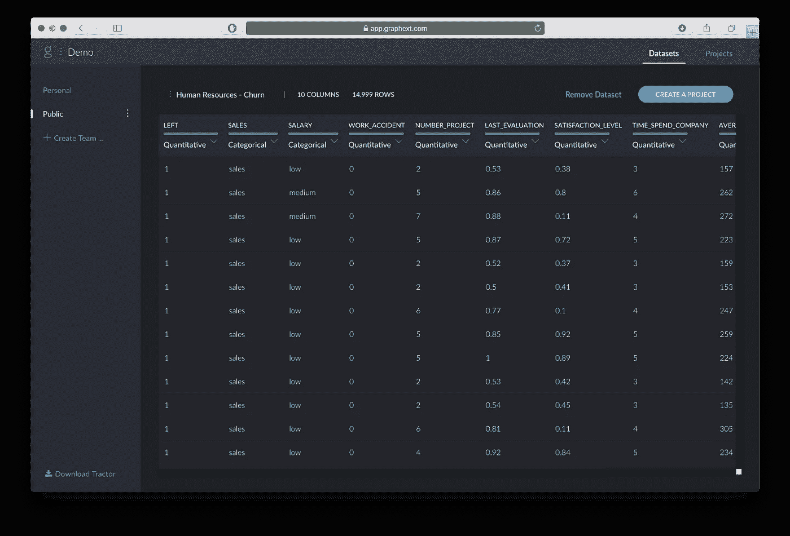

在这个例子中，我们想要分析员工离开的原因。在原始数据集的二进制变量“LEFT”列中，1 表示一名员工已经离开，0 表示他们已经留下。从我们的分析中排除这个“目标变量”列，然后我们可以使用其余的变量来观察可能会或可能不会导致人才流失的行为模式。让我们来看看输出。

在这个可视化中，每个节点都是一个雇员。彼此相似的节点位置更近，反之亦然。因此，我们可以看到具有不同模式的数据图。我们使用我们自己的高级降维方法创建了这个网络，并在此基础上运行了网络中社区检测的聚类算法。

因为我们有一个要解释的目标变量，所以让我们用变量“LEFT”给数据集着色，看看它是如何分布的。

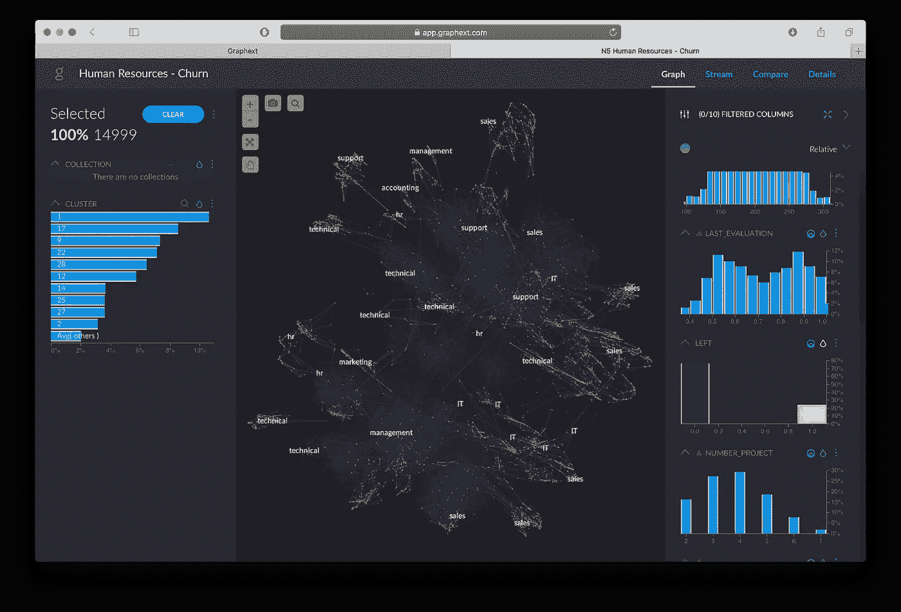

我们可以清楚地看到，以黄色表示的离职员工形成了不同的群体，表明他们有不同的行为模式，尽管他们都被归入了同一个“左派”类别。

使用预测模型的传统分析会从将所有“左”员工放在同一个篮子中开始，忽略了存在许多不同类型的“左”员工的事实。然而，使用智能数据发现，我们可以识别这些员工的行为模式，区分他们的行为，并在开始预测之前提出更好的问题。

让我们从人力资源的角度来看这个问题，把分析的重点放在“销售”部门和“低”工资的员工身上。通过点击这两个过滤器，我们可以缩小我们的数据选择。

现在，让我们用“左”或“不”来给员工涂色，看看这个小组的行为模式有何不同。

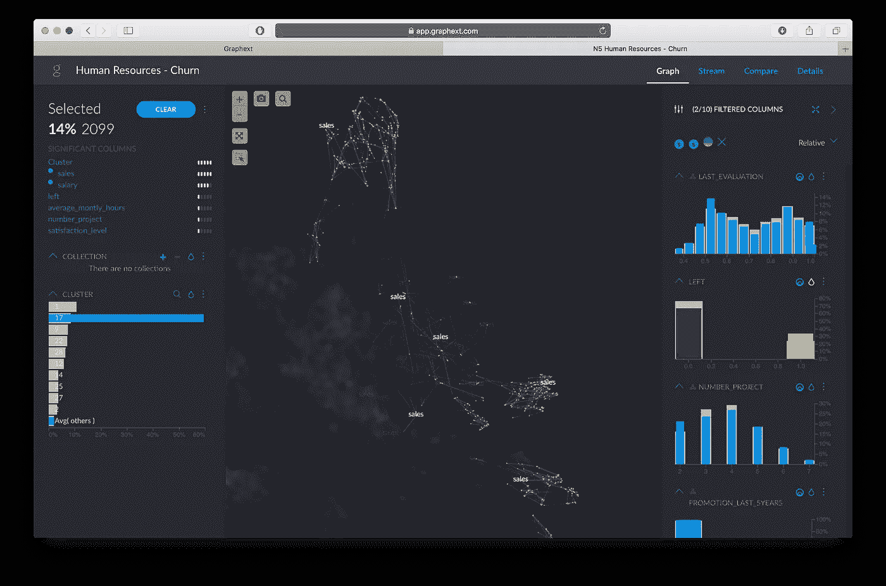

我们可以看到，至少有三组不同的员工“离开”了公司。

首先，我们选择左上方的集群，找出它们离开的原因。左边的面板会自动告诉我们是什么变量将这个群体从其他人群中分离出来。

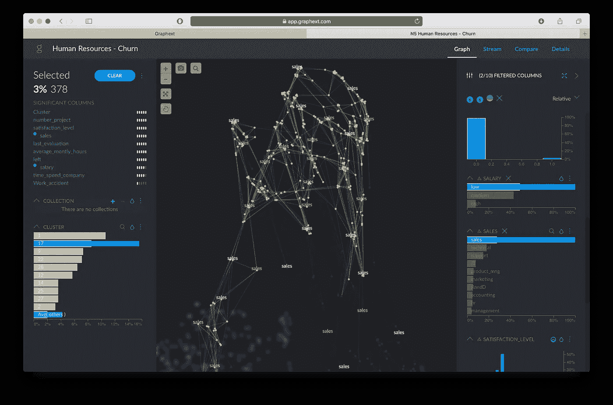

Graphext 自动告诉我们它们是由以下分布定义的:

*   我们能看到的“项目数量”非常少
*   “满意度”约为 4 分(满分 10 分)，与整个人口相比也非常低

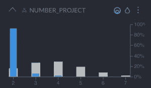

*   “最后评价”在 4-6 分之间(满分 10 分)，也非常低
*   “平均月小时数”，低于平均值

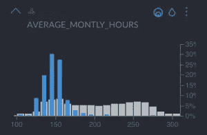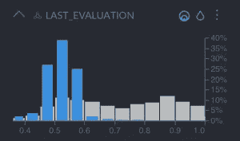

现在让我们问一个问题，你会主动在你的公司留住这类员工吗？这些员工不开心，只在几个项目中工作过，而且上次评估很糟糕。如果你想留住他们，你可以根据他们的需求提供专门的培训项目。

让我们继续，选择下一批已经离开的员工。

在这种情况下，它们由以下分布定义:

*   “平均每月小时数”，我们可以看到很高，但不是最高的
*   “在公司度过的时间”，大约在 5 到 6 年达到顶峰

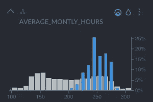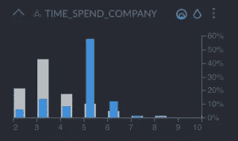

*   “最后评价”，我们可以看到非常高，意味着他们是非常好的员工
*   “满意度”，在分布中相当高，意味着他们很快乐

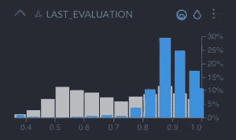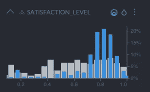

这些员工工作时间很长，对公司很满意。他们才是你真正想留住的人！这些员工离开可能是因为他们被另一家提供更高薪水的公司录用了。为了留住他们，惩罚计划可能会创造奇迹。

我们看到了两种截然不同的行为模式，需要不同的保持策略。用传统的预测模型分析这些数据会让你失去做出有实际影响的决策的机会。通过智能数据发现发现这些模式将允许您为每种特定行为创建更好的规范策略。

想了解更多？向我们索取[演示](https://graphext.com/demo)！