# 2018 年 CNN 推理的标杆硬件

> 原文：<https://towardsdatascience.com/benchmarking-hardware-for-cnn-inference-in-2018-1d58268de12a?source=collection_archive---------4----------------------->

CNN 推理和边缘计算即将到来——几乎每个移动平台(苹果、三星、华为)都将获得专用硬件来进行推理。而且，随着自动驾驶汽车的出现，有像英伟达的 Jetson Tx2 这样的机器人平台将推理带到了边缘。今年夏天，我有机会尝试了各种硬件平台，并了解了 CNN 推断的堆栈是如何相互竞争的。

今年夏天，我有机会在 Aquifi 实习，这是一家 3D 视觉初创公司，旨在实现制造业物流流程的自动化。通常，摄像机连接到进行推理处理的远程服务器。然而，他们的智能相机还包括一个附加的“片上系统”，所以我们想看看我们是否可以在边缘运行网络。3D vision 中的示例网络可大可小，例如:

小:[用于关键点检测的 KCNN](http://openaccess.thecvf.com/content_cvpr_2018_workshops/papers/w12/Di_Febbo_KCNN_Extremely-Efficient_Hardware_CVPR_2018_paper.pdf)
关键点在 3D 视觉中有许多用途，例如识别用于 3D 重建的良好特征。

大型: [MVCNN](http://vis-www.cs.umass.edu/mvcnn/) 用于识别 3D 形状
MVCNN 是一个大型网络，它采用许多 2D 图像来识别一幅 3D 图像。它使用一个 VGG 作为主干，以及一个“视图池”层来聚合各个 2D 影像的特征地图。

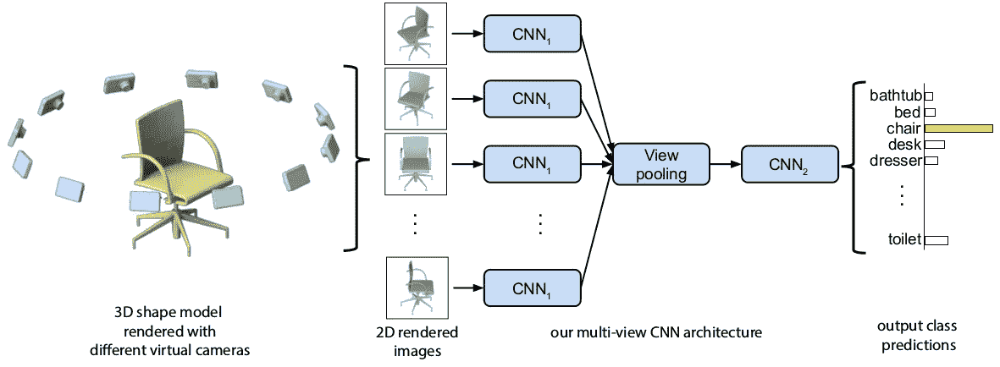

我测试的各种硬件有:
1)英伟达 Jetson Tx2
2) Movidius 2450(英特尔神经电脑棒/谷歌视觉套件)
3)英伟达 1080ti(benchline)
4)麒麟 970(华为手机)
5)高通 660
6) ActionSemiS900

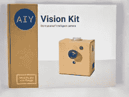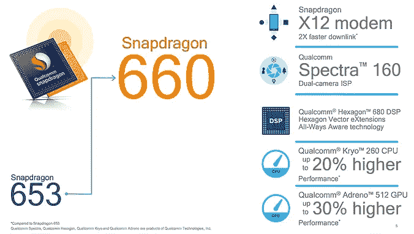

Hardware Platforms

# **要考虑的因素**

在 CNN 的推断中，需要考虑的事情很多。我将主要关注推理速度。
1)用电量
2)成本
3)开发容易度
4)推理速度

# CNN 的推论可以运行在哪里？

1)FPGA
2)GPU
3)DSP
4)ASIC
5)x86 或 Arm CPU
6)加速器(TPU NPE)

所有这些硬件在灵活性和效率方面都有各种各样的折衷。此外，公司现在正在生产新的名称，如 NPU(神经处理单元)或 TPU(张量处理单元)，但实际上这些只是矩阵乘法和相关算术运算的加速器。在同一平台中，设备通常有多种类型。例如，高通 660 在同一块主板上集成了 CPU、GPU 和 DSP(数字信号处理器)。这使得实现算法变得困难，因为你必须实现所有硬件的所有原语层。下图显示了高通平台上不同图层类型的兼容性。

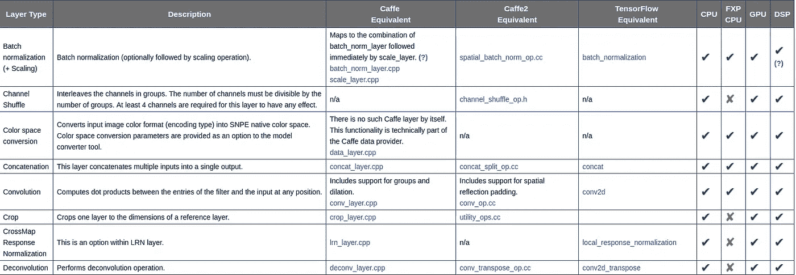

[https://developer.qualcomm.com/docs/snpe/network_layers.html](https://developer.qualcomm.com/docs/snpe/network_layers.html)

# 编译程序

那么你已经在 Tensorflow/Pytorch 中训练了一个模型，你实际上如何让它在这些特定的硬件上运行呢？虽然一般可以在 GPU 或 CPU 上运行网络进行训练，但在推理过程中，大多数平台一般都要求你在网络上运行自己专有的编译器。

**英伟达**:TensorRT
谷歌视觉套件:视觉软帽编译器
**麒麟 970:** 华为图形编译器
**高通:**SnapDragon-tensor flow-to-DLC
**神经计算棒:**神经棒图形编译器

尽管这些编译器有不同的实现，但我们可以假设它们做了以下一些事情:

1)自动层融合
2)内存优化
3)不同硬件处理器(CPU、GPU、DSP、NPU)之间的分配
4)权重&激活校准(INT8 或 FP16)

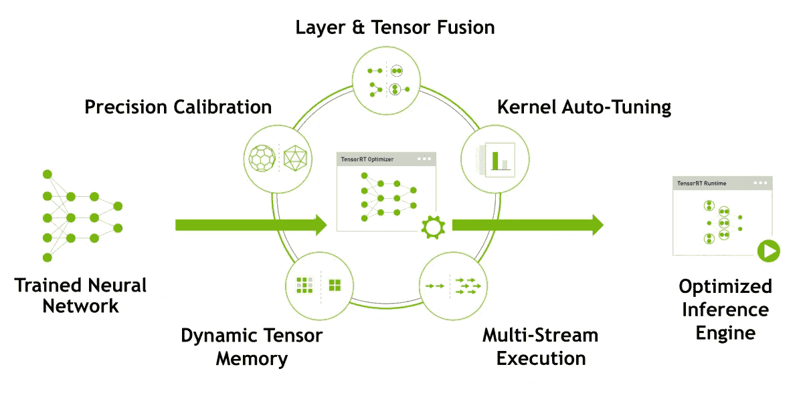

Nvidia TensorRT

# **型号**

InceptionV3: ~92 Mb，~ 2380 万参数
InceptionV2_Resnet: ~214Mb，~ 5580 万参数
MobilenetV1 _ 0p 5 _ 128:~ 1.89 Mb，~0.5 万参数
MobilenetV1_1p_224: ~16.3Mb，~ 420 万参数
MobilenetV1_0p5_160: ~5.2Mb，~ 130 万参数

选择的模型是那些最终适用于大多数平台的模型。我排除了 VGG，因为它相当大，永远不会运行移动。Resnets 也是被排除在外的热门选择。

# 结果

# **初始版本 3**

当每个平台具有不同的功能时，有时很难进行公平的评估。例如，在图中，高通将推理量化为 8 位。在 Nvidia TensorRT 中，您可以选择使用 FP32 或 FP16。麒麟 970 支持 8 位和 1 位量化。在这个图表中，一些有趣的点
1)英特尔神经计算棒是最慢的，比英特尔 i7–8700k CPU 慢 3 倍。
2) Nvidia Jetson Tx2 GPU 运行速度与英特尔 i7–8700k CPU 相同
3) 1080ti 比英特尔 i7–8700k CPU 快约 10 倍
4) Kirin970 和高通 660 移动平台速度相似
5) Jetson Tx2(Float TensorRT)与移动平台速度相似，但由于 Float 与 8 位推断不完全相同，因此这种比较并不公平。

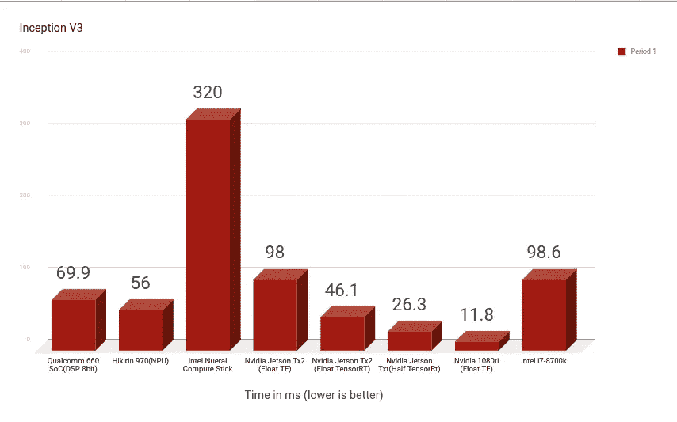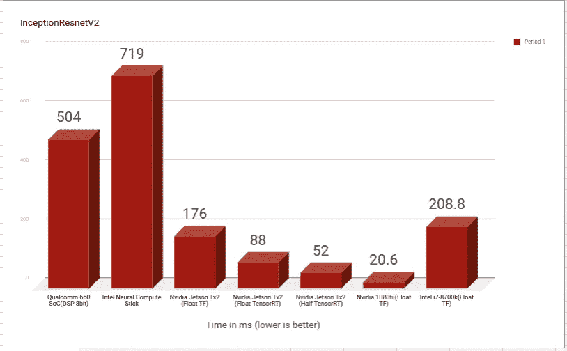

# 移动网络

对于更小的 mobilenets，这使得不太强大的硬件如 ActionSemiS900 甚至 RaspberryPi 能够进行推理。Mobilenets 是最先进的边缘计算，有两个主要参数可以调整:1)宽度乘数 2)输入图像的大小。

下图显示了
1)宽度乘数= 0.25 &输入大小= 128
2)宽度乘数= 0.5 &输入大小= 160

使用最小的 mobilenet，硬件可以在几毫秒内进行推断。此时，硬件之间的传播差异小于 50 毫秒。因此，加载模型权重、将数据从 CPU 传输到 GPU 以及其他各种事情可能比推理本身需要更长的时间。
**有趣点** 1)英特尔神经棒比谷歌视觉套件快 4 倍，二者使用相同的底层 Movidius 2450 板。相同层的软件实现很重要。
2)

# Nvidia Tx2 洞察

就速度而言 TensorRT(Half) < TensorRT(Float) < Tensorflow(Float), each faster by a factor of ~2x. We can expect the fastest verson TX2 TensorRT(Half) to be roughly 2–5x slower than 1080ti(Float) for various models — check out [这个](https://github.com/NVIDIA-Jetson/tf_to_trt_image_classification)再现了它。

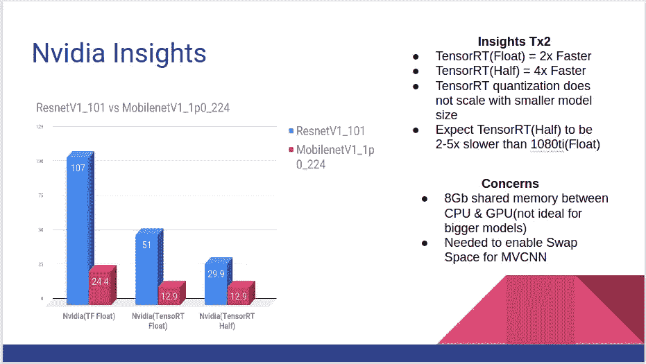

[https://github.com/NVIDIA-Jetson/tf_to_trt_image_classification](https://github.com/NVIDIA-Jetson/tf_to_trt_image_classification)

# **高通 660 洞见**

高通 660 是该平台的旧版本，当前版本是 845。就像 Mobilenets、mobilenetsd、InceptionV3 这样的小型网络而言，高通 660 提供了不错的速度。例如，它可以以 Mobiletnet_0p25_128 为主干，为 MobilenetSSD 做 10fps。虽然速度很快，但缺点是 SNPE 平台仍然相对较新。在尝试使用 snpe-tensorflow-to-dlc 编译器编译某些最先进的模型时，我遇到了一个问题。我在[论坛](https://developer.qualcomm.com/forums/software/snapdragon-npe-sdk)上看过类似的问题，但这是对新平台的预期。

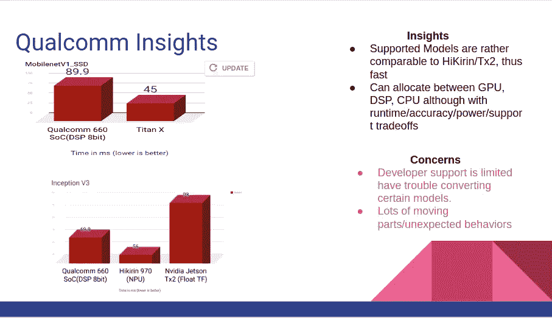

# **麒麟 970 见解**

对于 InceptionV3，麒麟 970 比高通 660 快一点。它甚至比高通的 SNPE 平台更新，因为华为 HiAI 平台于 2018 年 5 月发布。这个平台主要支持 Caffe。有一定的限制，如他们只支持 Tensorflow 1.3 和模型大小必须是<100mb. Most of the newest Mobilenets are trained with Tensorflow 1.6 or above. Thus, it is hard to compile some of the pretrained models on the internet currently.

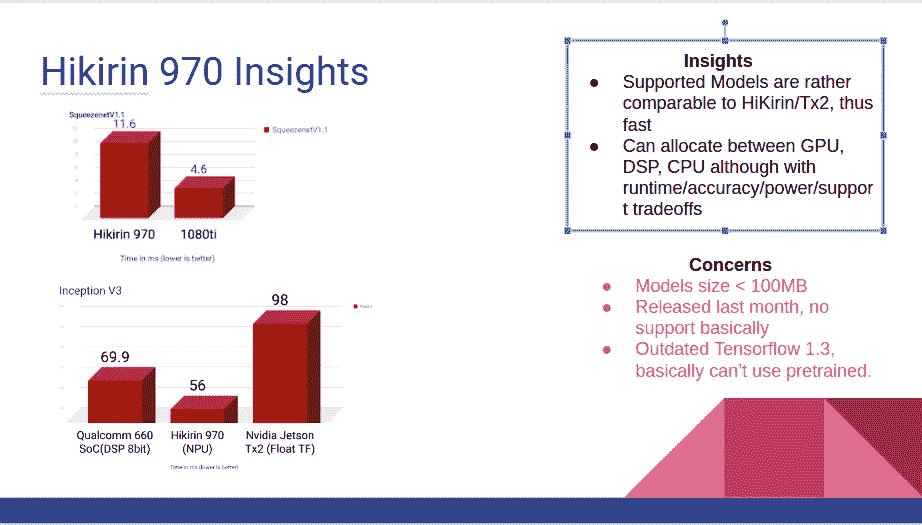

# **ActionSemiS900 & CPU TF 结果**

ActionSemiS900 是一款低功耗主板，配有 64 位四核 Cortex-A53 CPU 和 G6230 PowerVR GPU。虽然 PowerVR 为面向人工智能的应用程序推出了他们的 [PowerVR CLDNN SDK](https://www.imgtec.com/blog/introducing-the-powervr-cldnn-sdk/) ，但截至目前，它只支持拥有 PowerVR GPU 的 Chromebooks。因此，我在 Tensorflow 和 TFLite 上对 Cortex-A53 CPU 进行了一些测试。你可以实时运行所有的移动网络。TFLite 是谷歌的边缘计算方法，是 TF Mobile 的继任者。TFLite 对于特定型号来说速度稍快，但截至 2018 年 7 月，它还没有准备好生产-对于某些更大的型号，如 InceptionResnetV2(图中未显示)，它甚至慢了几个数量级。

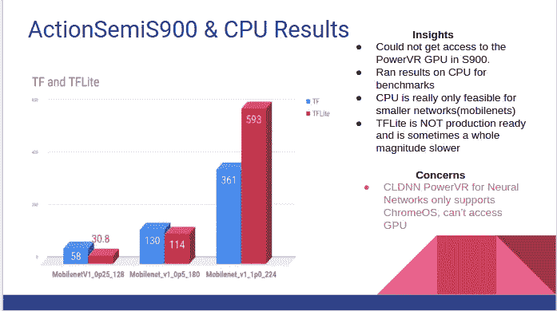

# **其他知名公司**

就硬件而言，它真的是狂野的西部。下面显示的是 4 家公司，他们特别想从事人工智能系统芯片业务。要查看除片上系统之外的硬件，请查看这个全面的[列表](https://github.com/basicmi/Deep-Learning-Processor-List)。简单总结一下这四个:
**恩智浦**:拥有各种 SoC 和其他解决方案，如 I.MX 8 系列用于 CNN 推断，使用 DeepView ML 工具包
**联发科:**芯片供应商对于中型手机，Helio P60 将类似于高通或华为的平台。使用他们的 NeuroPilot AI 平台，该平台被认为支持 TF，Caffe，ONNX，Android NN API
**意法半导体:**真正的大公司，在 1 月份的 CES 上宣布它想进入这个领域。
**RockChip:** 福州一家公司，宣称他们的 SoC 比 Jetson Tx2，Kirin970，Apple A11 都快…

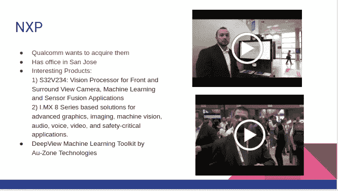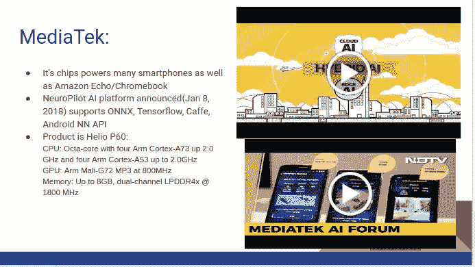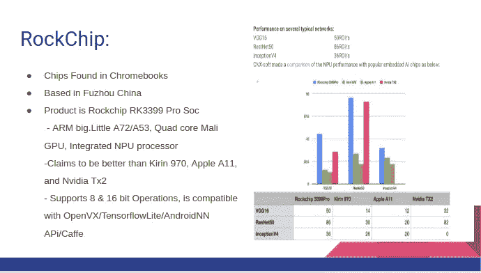

# 展望未来

可以预计，硬件/平台将在 ML 的未来发挥很大作用。如你所见，每个手机芯片供应商(苹果、华为、高通、联发科...)都在抢着建自己的加速器。尽管硬件将在不到一年的时间内上市，但软件平台可能需要更长的时间才能赶上。真的，Nvidia 比这些家伙领先 10 年，这些芯片供应商正在从头开始编写软件。使用不同的专有编译器可能会很笨拙，在未来，我希望有一个像 Android NN API 这样的通用接口，可以访问硬件。

Android NN API