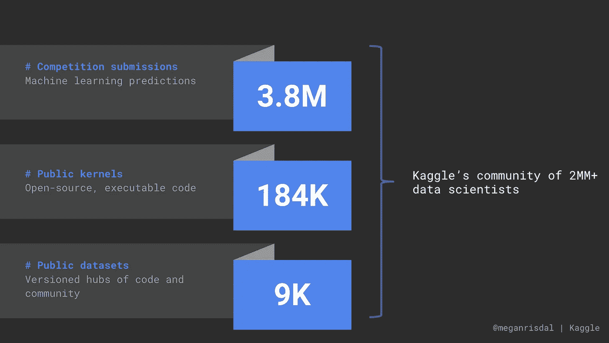
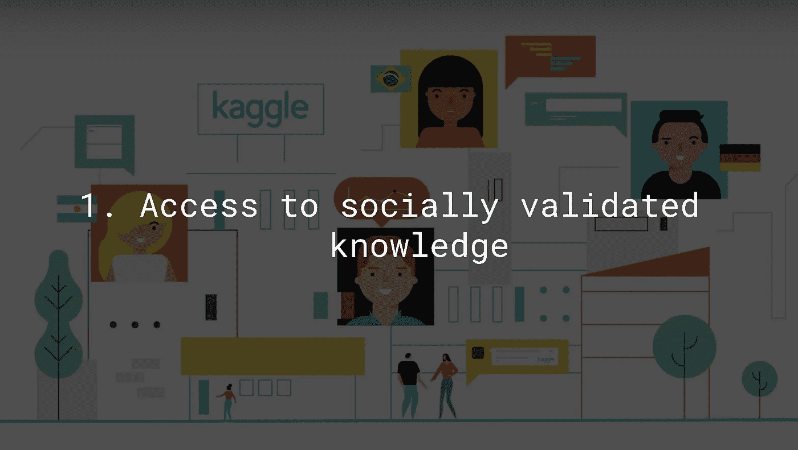
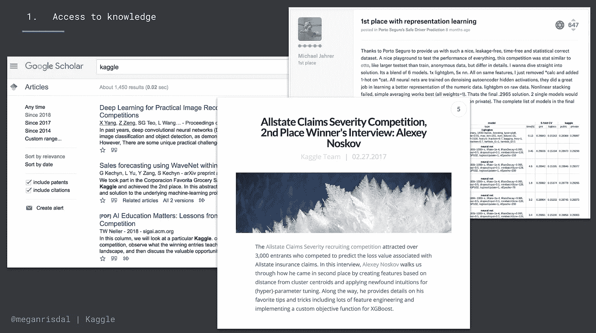
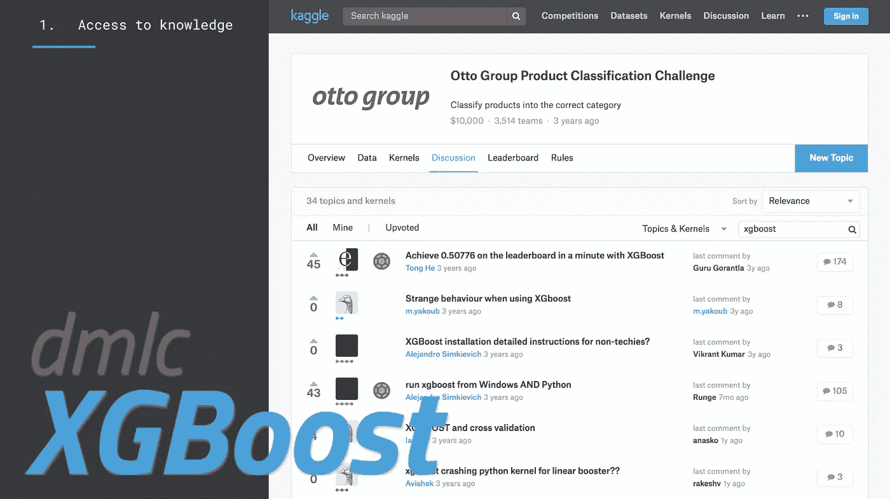
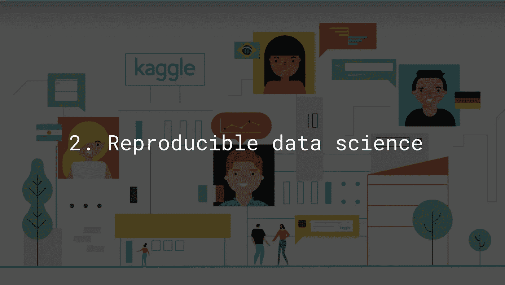
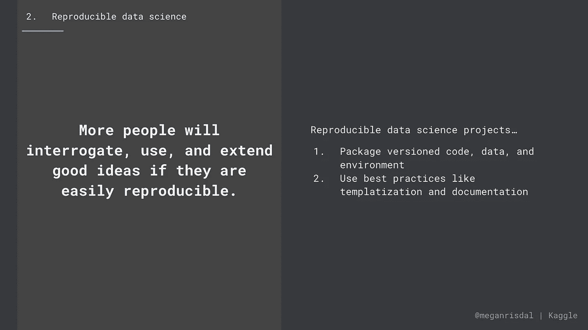

# 更好的协作数据科学

> 原文：<https://towardsdatascience.com/better-collaborative-data-science-d2006b9c0d39?source=collection_archive---------9----------------------->

## **从 Kaggle 社区学到的两个指导性见解**

*上周六，我在南加州最大的数据会议*[*Data Con LA 2018*](https://www.bigdatadayla.com/)*(原大数据日 LA)上做了主题演讲。这是我的博客形式的演讲。*

在我的主题演讲中，我分享了 Kaggle 的团队学到的两件事，这些事让数据科学家能够在项目中更高效地合作。这两种见解决定了我们的社区在过去八年中如何发展成为世界上最大的数据科学家在线社区。

1.  获得社会认可的知识的重要性
2.  使数据项目易于复制的重要性

## Kaggle 简介

首先，以防你没听说过 Kaggle，我给你提供一点背景。今天，超过 200 万 Kagglers 来到这个平台来做数据科学项目。他们参加机器学习竞赛，并在我们的数据集平台上发布和探索数据。对于竞赛和我们的数据集平台，用户可以用 R 或 Python 分析数据，并与我们的免费托管笔记本环境 Kernels 分享他们的工作。

Some recent stats about Kaggle’s prolific community. August 2018.

所有这些竞赛、内核中共享的开源代码以及公共数据集，都让我们对数据科学家如何合作解决问题有了更深入的了解。

有了这个简短的介绍，我想直接进入这两个洞见，从*获得社会认可的知识*开始。

我们很早就了解到，即使在竞争激烈的环境中，我们的社区也非常积极地分享知识，但有时发现和改进信息和想法很困难。

当 Kaggle 上的每个竞赛结束时，用户在论坛上分享获胜和创新的解决方案；他们已经在我们的博客上发布了 200 多个“我是如何做到的”采访。有时甚至发表关于新方法的论文，如使用 [WaveNet 进行销售预测](https://arxiv.org/pdf/1803.04037.pdf)或使用卷积神经网络诊断糖尿病视网膜病变的一些早期工作。

现在有一个传统，每当一个新的比赛开始时，竞争者会立即在我们的网站和互联网上搜寻他们可以用来启动他们在这个新挑战上的工作的见解。虽然一方面，这些内容的存在很棒，但每次需要访问它们时，这本身就是一个挑战。

现在，我想用一个例子来对比一下，在这个例子中，获取知识不仅容易，而且很容易。为此，让我们转向 XGBoost 梯度增强库的开发。

在早期，作者[陈天琦](https://www.kaggle.com/tqchen) [在竞争论坛](https://www.kaggle.com/c/otto-group-product-classification-challenge/discussion?sortBy=relevance&group=all&search=xgboost&page=1&pageSize=20&category=all&kind=topics)上引导竞争对手逐步安装和试用他的新软件。在那里，他对意外行为和撞车的报告做出反应。他甚至能够在比赛结束时通过调查寻求反馈。结果，他做了改进，修复了他知道对图书馆用户很重要的错误。

几年后，XGBoost 成为在结构化数据上进行机器学习的最成功的算法之一，这要归功于社区中用户的紧密反馈循环，在这个社区中，知识得到了积累，质量得到了提高。

回到每次比赛产生的知识洪流的例子。今天，我们提供工具来帮助用户发现与他们想要解决的问题相关的内容。

例如，我们的一个用户利用我们关于 Kaggle 的公共数据集 Meta Kaggle，创建了所有获奖解决方案的最终[主列表，使用多类分类等标签按问题陈述和特征](https://www.kaggle.com/sudalairajkumar/winning-solutions-of-kaggle-competitions)进行组织。例如，现在每当多类分类竞赛开始时，用户就可以一站式查阅过去在类似问题上的工作。

在一个类似的例子中，另一个 Kaggler 使用标签和其他流行度指标创建了一个[数据科学词汇表，其中包含了内核中共享的所有顶级开源代码，这些代码通过使用标签的技术](https://www.kaggle.com/shivamb/data-science-glossary-on-kaggle)进行组织。对于开始新数据项目的人来说，这是多么不可思议的资源啊！

那么我们的团队从这样的例子中学到了什么呢？我们的团队坚信，没有人应该从闪烁的光标开始数据科学项目。

这种洞察力对于新的数据科学家来说尤其重要。无论是刚开始学习的人还是团队中的新人。它甚至适用于一个新的商业或研究问题。

使用集中定位的和可搜索的知识，通过与当前问题的相关性来组织，用户应该能够更快地开始编写代码和回答问题。我们还了解到，像 XGBoost 这样在我们的社区中得到社会验证的知识，或者通过可用性和流行度指标得到验证的知识，对于识别和重复好的想法是至关重要的。

关于协作数据科学，我们学到的第二个观点是让您的工作具有可重复性的重要性。再现性不仅对你的队友很重要，对你的头号合作者也很重要:你未来的自己。

为了说明可再生数据科学的重要性，我将回到五年前的一场比赛。在这个例子中，一个用户出于好意，希望让更多的人参与到协作解决问题中来。

然而，在这篇论坛帖子中，我们观察到数据科学家在试图分享他们的工作时遇到的许多绊脚石。

1.  首先，在一个 pastebin 中共享他的代码。我们也经常看到用户将 Python 和 R 代码作为论坛附件添加给其他人下载，并弄清楚如何在本地运行。
2.  其次，他列出了他对数据形状的假设。他必须这么做，因为他没有分享数据本身。
3.  最后，真正有意思的是，他在自己的帖子上添加了一个更新。其他人(企图合作！)发现了一个 bug，所以他不得不在 pastebin 中调整他的代码。每个下载旧代码的人都被蒙在鼓里。

所有这些挑战，我们在早期的 Kaggle 论坛上反复看到，意味着代码、想法和结果极难重现。这是合作的巨大障碍，即使有意愿(或必要性)也是如此。

我们的团队没有忽视用户在协作方面的痛点。我们希望让用户能够轻松分享他们的想法并进行协作，因此我们构建了[内核](https://www.kaggle.com/kernels)，这是我们为笔记本和脚本提供的免费托管计算环境。从这里开始，事情发生了巨大的变化。

为了说明这一点，我在这里展示了一个[Fran ois Chollet 的教程内核](https://www.kaggle.com/fchollet/keras-deep-net-starter-code)，演示了如何使用他当时的新库 Keras，在预测西尼罗河病毒的比赛中获得可观的分数。

Franç ois Chollet 的 starter 内核与通过 pastebin 五年共享的代码形成了巨大的对比，因为内核是代码、数据和环境的版本包。这意味着大约 60 个用户能够从他们自己的副本中派生出他的代码并执行。

在这一点上，我希望你记得一个更早的统计数据:截至 2018 年 8 月，平台上有 **184，000 个公共开源内核**，任何人都可以派生、运行和修改。现在只需点击一个按钮；没有混乱的安装或数据下载需要。

内核促进可再现性的容易程度也对 Keras 在 Kaggle 上的流行轨迹产生了很大影响。就在 6 月，超过 1500 个 Python 内核在 Kaggle 上导入了 Keras。

最后，这不仅仅是工具和基础设施的问题。我们还观察到，Kaggle 用户为他们的数据项目采用的最佳实践往往分为以下两类:

1.  模板化
2.  证明文件

模板化是一种最佳实践，例如跨项目使用公共目录结构、模块化代码和数据，以及为团队中常用的代码片段创建和共享库。

然后是文档。除了记录代码，我们的用户还在 Kaggle 上记录他们的数据。我们采访过的顶级 Kagglers 也普遍报告说保持包括重现结果的步骤的密切日志，特别是如果他们在比赛中不使用内核的话。他们还使用“实验室风格”笔记来记录他们实验的想法、他们测试的假设以及他们在迭代项目时的结果。这意味着想法和无效的结果不会被放到抽屉里积灰，而是可以从中学习。此外，他们可以为将数据项目用作投资组合的一部分打下良好的基础。

那么我们从这些例子中得到了什么启示呢？如果数据科学中的好想法易于复制，更多的人将能够质疑、使用和扩展这些好想法。

可再生数据科学项目将版本化的代码、数据和环境打包在一起。他们还使用模板化和文档化等最佳实践。

## 结论

总之，我们的团队了解到，数据科学家最大的两个需求是获得社会认可的知识，以及复制他们和其他人的工作的能力。

这些见解和其他见解已经告知我们如何开发我们的数据集和内核产品，以允许用户今天在竞争之外的数据项目上进行合作。

如果你想发现更多关于数据科学家如何合作的见解，我鼓励你查看我们关于 Kaggle 的[公共数据集，Meta Kaggle](http://kaggle.com/kaggle/meta-kaggle) 。有大量的社区内核可供浏览并从中派生出您自己的数据项目！

