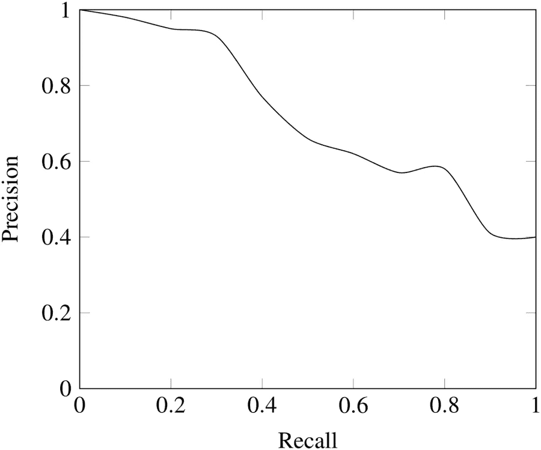
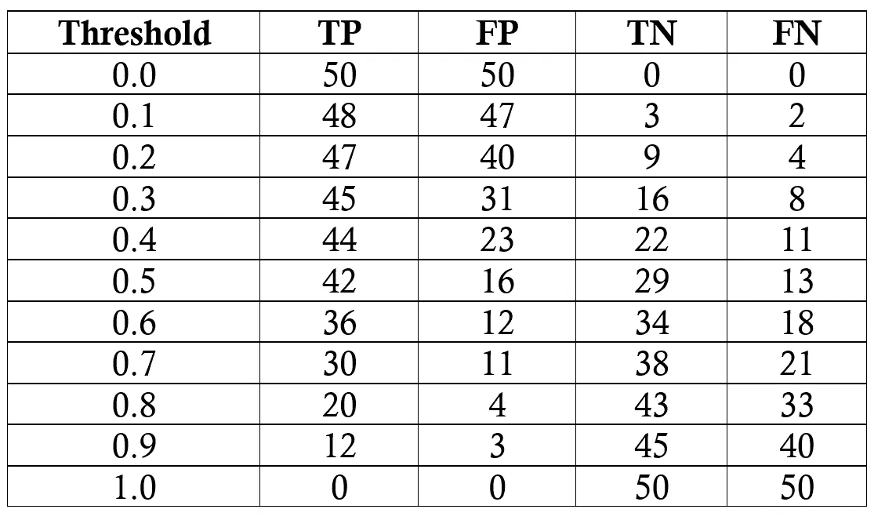

# 超越准确性:精确度和召回率

> 原文：<https://towardsdatascience.com/beyond-accuracy-precision-and-recall-3da06bea9f6c?source=collection_archive---------0----------------------->

**为分类任务选择正确的指标**

你会相信一个声称完全在大脑中创造了一个模型的人以超过 99%的准确率识别试图登机的恐怖分子吗？嗯，这里有一个模型:简单地给每个从美国机场起飞的人贴上非恐怖分子的标签。鉴于[每年平均有 8 亿乘客乘坐美国航班](https://www.rita.dot.gov/bts/press_releases/bts018_16)以及【2000 年至 2017 年有 19 名(已确认)恐怖分子登上美国航班，这个模型达到了惊人的 99.9999999%的准确率！这听起来可能令人印象深刻，但我怀疑美国国土安全部不会很快打电话购买这种型号。虽然这个解决方案具有近乎完美的准确性，但这个问题是一个准确性显然不是一个足够的度量标准的问题！

恐怖分子检测任务是一个[不平衡分类问题](https://www.analyticsvidhya.com/blog/2017/03/imbalanced-classification-problem/):我们需要识别两类——恐怖分子和非恐怖分子——其中一类代表绝大多数数据点。当疾病在公众中的发病率非常低时，另一个不平衡的分类问题出现在疾病检测中。在这两种情况下，积极阶层——疾病或恐怖分子——在数量上远远超过了消极阶层。这些类型的问题是数据科学中相当常见的情况，即准确性不是评估模型性能的好方法。

凭直觉，我们知道在恐怖分子检测问题中宣布所有数据点为阴性是没有帮助的，相反，我们应该专注于识别阳性病例。我们的直觉告诉我们应该最大化的指标在统计学中被称为**，或者模型在数据集中找到所有相关案例的能力。召回的精确定义是真阳性的数量除以真阳性的数量加上假阴性的数量。真阳性是被模型分类为阳性但实际上是阳性的数据点(意味着它们是正确的)，假阴性是被模型识别为阴性但实际上是阳性的数据点(不正确的)。在恐怖主义案例中，真正的阳性是被正确识别的恐怖分子，而假阴性是被模型标记为*而不是*恐怖分子的个体，而*实际上是*恐怖分子。召回可以被认为是模型在数据集中找到所有感兴趣的数据点的能力。**

****

**你可能会注意到这个等式的一些东西:如果我们把所有人都贴上恐怖分子的标签，那么我们的召回率就会达到 1.0！我们有一个完美的分类器，对吗？不完全是。与数据科学中的大多数概念一样，我们在选择最大化的指标时会有一个权衡。在召回率的例子中，当我们增加召回率时，我们降低了精确度。同样，我们凭直觉知道，将 100%的乘客贴上恐怖分子标签的模型可能没有用，因为那样我们就不得不禁止每个人乘坐飞机。统计学为我们提供了表达直觉的词汇:这种新模型会遭受低**精度，或者分类模型仅识别相关数据点的能力。****

****精确度被定义为真阳性的数量除以真阳性的数量加上假阳性的数量。假阳性是模型错误地标记为阳性而实际上是阴性的情况，或者在我们的示例中，模型归类为恐怖分子的个人不是恐怖分子。回忆表达了在数据集中找到所有相关实例的能力，而精确表达了我们的模型所说的相关数据点实际上是相关的数据点的比例。****

********

****现在，我们可以看到，我们的第一个模型将所有人都标记为*而不是*恐怖分子，这不是很有用。虽然它有近乎完美的准确性，但它的精确度和召回率都是 0，因为没有真正的阳性结果！假设我们稍微修改一下模型，将一个人正确地识别为恐怖分子。现在，我们的精度将是 1.0(没有假阳性)，但我们的召回率将非常低，因为我们仍然会有许多假阴性。如果我们走向另一个极端，将所有乘客归类为恐怖分子，我们将有 1.0 的召回——我们将抓住每一个恐怖分子——但我们的精确度将非常低，我们将拘留许多无辜的个人。换句话说，当我们提高精确度时，我们降低回忆，反之亦然。****

********

****The Precision-Recall Trade-off ([Source](http://computingengineering.asmedigitalcollection.asme.org/article.aspx?articleid=2610217))****

# ****结合精确度和召回率****

****在某些情况下，我们可能知道我们希望以牺牲其他指标为代价来最大化召回率或精确度。例如，在对患者进行后续检查的初步疾病筛查中，我们可能希望召回率接近 1.0——我们希望找到所有实际患病的患者——如果后续检查的成本不显著，我们可以接受较低的精确度。然而，在我们想要找到精确度和召回率的最佳结合的情况下，我们可以使用所谓的 [F1 分数](https://en.wikipedia.org/wiki/F1_score)来组合这两个指标。****

****F1 分数是精确度和召回率的调和平均值，在下面的等式中考虑了这两个指标:****

********

****我们使用[调和平均值而不是简单平均值，因为它会惩罚极值](https://stackoverflow.com/questions/26355942/why-is-the-f-measure-a-harmonic-mean-and-not-an-arithmetic-mean-of-the-precision)。精度为 1.0、召回率为 0.0 的分类器的简单平均值为 0.5，但 f 1 值为 0。F1 分数对这两个指标赋予了同等的权重，并且是一般 Fβ指标的一个具体示例，其中β可以调整为对召回率或精确度赋予更大的权重。(还有其他衡量精度和召回率的指标，如[精度和召回率的几何平均值](https://en.wikipedia.org/wiki/Fowlkes%E2%80%93Mallows_index)，但 F1 分数是最常用的。)如果我们想要创建一个具有召回率和精确度的最佳平衡的平衡分类模型，那么我们尝试最大化 F1 分数。****

# ****可视化精度和回忆****

****我已经向您抛出了几个新术语，我们将通过一个示例来展示它们在实践中的用法。在我们到达那里之前，我们需要简要地谈论一下用于显示精确度和召回率的两个概念。****

****首先是[混淆矩阵](http://www.dataschool.io/simple-guide-to-confusion-matrix-terminology/)，它有助于在给定模型预测标签的情况下快速计算精确度和召回率。二元分类的混淆矩阵显示了四种不同的结果:真阳性、假阳性、真阴性和假阴性。实际值构成列，预测值(标签)构成行。行和列的交叉点显示了四种结果中的一种。例如，如果我们预测一个数据点是正的，但它实际上是负的，这是一个假阳性。****

********

****从混淆矩阵到召回率和精确度需要找到矩阵中各自的值并应用以下等式:****

********

****显示分类模型性能的另一个主要可视化技术是[接收机工作特性(ROC)曲线](http://scikit-learn.org/stable/auto_examples/model_selection/plot_roc.html)。不要让复杂的名字把你吓跑了！这个想法相对简单:ROC 曲线显示了当我们改变模型中识别阳性的阈值时，召回率与准确率的关系是如何变化的。阈值代表一个值，高于该值的数据点被认为是正类。如果我们有一个识别疾病的模型，我们的模型可能会为每个患者输出一个介于 0 和 1 之间的分数，我们可以在此范围内设置一个阈值，用于将患者标记为患有疾病(阳性标记)。通过改变阈值，我们可以尝试达到正确的精确度和召回率的平衡。****

****ROC 曲线在 y 轴上绘出了真阳性率，在 x 轴上绘出了假阳性率。真阳性率(TPR)是召回率，假阳性率(FPR)是虚警的概率。这两者都可以从混淆矩阵中计算出来:****

********

****典型的 ROC 曲线如下所示:****

********

****Receiver Operating Characteristic Curve ([Source](http://www.statisticshowto.com/c-statistic/))****

****黑色斜线表示随机分类器，红色和蓝色曲线表示两种不同的分类模型。对于一个给定的模型，我们只能停留在一条曲线上，但我们可以通过调整我们对阳性病例进行分类的阈值来沿着曲线移动。通常，当我们降低阈值时，我们沿着曲线向右上方移动。阈值为 1.0 时，我们将位于图表的左下方，因为我们没有将数据点识别为阳性，导致没有*真阳性*和*假阳性* (TPR = FPR = 0)。随着阈值的降低，我们将更多的数据点识别为阳性，导致更多的真阳性，但也导致更多的假阳性(TPR 和 FPR 增加)。最终，在阈值为 0.0 时，我们将所有数据点识别为阳性，并发现我们位于 ROC 曲线的右上角(TPR = FPR = 1.0)。****

****最后，我们可以通过计算曲线(AUC) 下的总[面积来量化模型的 ROC 曲线，这是一个介于 0 和 1 之间的度量，数字越大表示分类性能越好。在上图中，蓝色曲线的 AUC 将大于红色曲线，这意味着蓝色模型在实现精确度和召回率的混合方面更好。随机分类器(黑线)获得的 AUC 为 0.5。](https://en.wikipedia.org/wiki/Receiver_operating_characteristic#Area_under_the_curve)****

# ****概述****

****我们已经讨论了几个术语，没有一个术语本身很难，但是加在一起可能会有点让人不知所措！让我们快速回顾一下，然后通过一个例子来巩固我们学到的新观点。****

******二元分类的四种结果******

*   ******真阳性:**标记为阳性的数据点实际上是阳性的****
*   ******假阳性:**标记为阳性的数据点实际上是阴性的****
*   ******真阴性:**标记为阴性但实际上是阴性的数据点****
*   ******假阴性:**标记为阴性但实际为阳性的数据点****

******召回率和精确度指标******

*   ******回忆:**分类模型识别所有相关实例的能力****
*   ******精度:**分类模型只返回相关实例的能力****
*   ******F1 得分:**使用调和平均值结合召回率和精确度的单一指标****

****可视化回忆和精确****

*   ******混淆矩阵:**显示来自分类问题的实际和预测标签****
*   ******受试者工作特征(ROC)曲线:**绘制真阳性率(TPR)对假阳性率(FPR)的曲线，作为模型的阳性分类阈值的函数****
*   ******曲线下面积(AUC):** 根据 ROC 曲线下面积计算分类模型整体性能的指标****

# ****示例应用程序****

****我们的任务是对 100 名患者进行诊断，这些患者中有 50%的人患有某种疾病。我们将假设一个黑盒模型，在这个模型中，我们输入关于患者的信息，并得到一个介于 0 和 1 之间的分数。我们可以改变将患者标记为阳性(患有疾病)的阈值，以最大化分类器的性能。我们将从 0.0 到 1.0 以 0.1 的增量评估阈值，在每一步计算精确度、召回率、F1 和 ROC 曲线上的位置。以下是每个阈值的分类结果:****

********

****Outcome of model at each threshold****

****我们将在阈值为 0.5 的情况下对召回率、精确度、真阳性率和假阳性率进行一次样本计算。首先我们制作混淆矩阵:****

********

****Confusion Matrix for Threshold of 0.5****

****我们可以使用矩阵中的数字来计算召回率、精确度和 F1 分数:****

********

****然后，我们计算真阳性和假阳性率，以找到 ROC 曲线的 y 和 x 坐标。****

********

****为了制作完整的 ROC 曲线，我们在每个阈值进行这个过程。正如您可能认为的那样，这非常繁琐，所以我们没有用手工来做，而是用 Python 这样的语言来做！任何人都可以在 GitHub 上看到带有计算的 Jupyter 笔记本。最终的 ROC 曲线如下所示，阈值高于点。****

********

****在这里，我们可以看到所有的概念走到了一起！阈值为 1.0 时，我们没有将患者归类为患有该疾病，因此召回率和精确度为 0.0。随着阈值的降低，回忆会增加，因为我们识别出更多患有该疾病的患者。然而，随着我们回忆的增加，我们的精确度会降低，因为除了增加*真*阳性，我们也会增加*假*阳性。阈值为 0.0 时，我们的回忆是完美的——我们找到了所有患有该疾病的患者——但我们的精确度很低，因为我们有许多假阳性。我们可以通过改变阈值来沿着给定模型的曲线移动，并选择使 F1 分数最大化的阈值。为了改变整个曲线，我们需要建立一个不同的模型。****

****每个阈值的最终模型统计如下:****

********

****基于 F1 分数，总体最佳模型出现在阈值 0.5 处。如果我们想在更大程度上强调精确性或回忆性，我们可以选择在这些度量上表现最好的相应模型。****

# ****结论****

****我们倾向于使用准确性，因为每个人都知道它意味着什么，而不是因为它是完成任务的最佳工具！虽然更适合的度量标准，如召回率和精确度，可能看起来很陌生，但我们已经有了一个直观的感觉，为什么它们更适合一些问题，如不平衡的分类任务。统计学为我们提供了计算这些度量的正式定义和方程式。[数据科学](https://www.datacamp.com/community/podcast/data-science-astronomy)是关于了解用于某项工作的正确工具，在开发分类模型时，我们通常需要超越准确性。了解了召回率、精确度、F1 和 ROC 曲线后，我们可以评估分类模型，并对任何只吹捧模型准确性的人持怀疑态度，特别是对于不平衡的问题。正如我们所看到的，准确性并不能对几个关键问题提供有用的评估，但是现在我们知道如何使用更智能的指标了！****

****一如既往，我欢迎建设性的批评、反馈和讨论。可以通过 Twitter [@koehrsen_will](https://twitter.com/koehrsen_will) 找到我。****