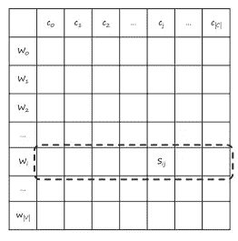
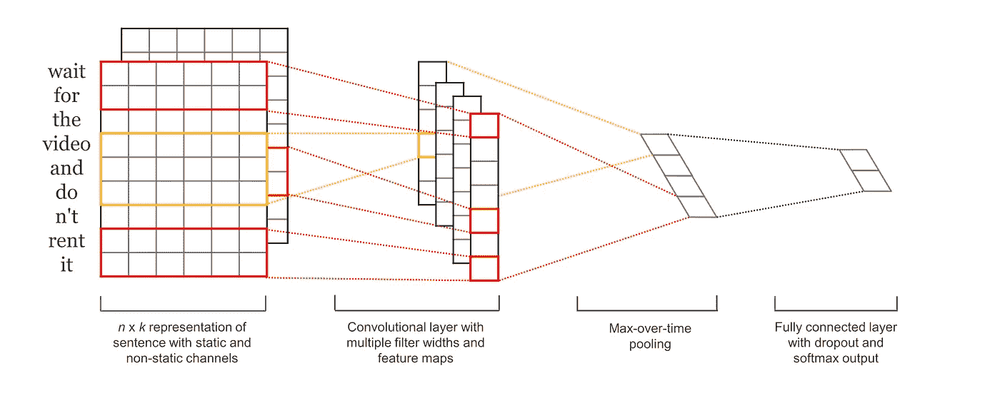
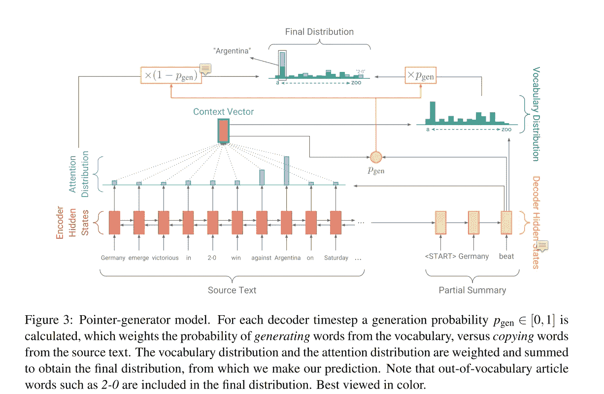
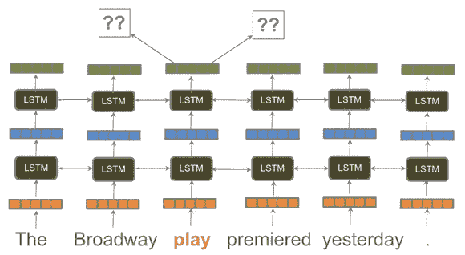
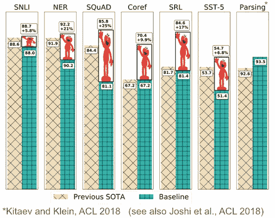
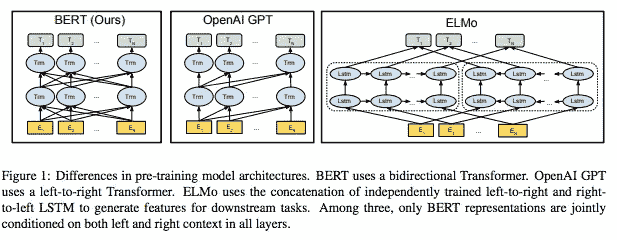

# 超越单词嵌入第 2 部分

> 原文：<https://towardsdatascience.com/beyond-word-embeddings-part-2-word-vectors-nlp-modeling-from-bow-to-bert-4ebd4711d0ec?source=collection_archive---------1----------------------->

从 BoW 到 BERT 的词向量和自然语言处理建模

# TL；速度三角形定位法(dead reckoning)

自从 [word2vec](https://en.wikipedia.org/wiki/Word2vec) 的出现，神经单词嵌入已经成为一种在文本应用程序中封装分布式语义的常用方法。本系列将回顾使用预训练单词嵌入的优点和缺点，并演示如何将更复杂的语义表示方案(如语义角色标记、抽象意义表示和语义依赖解析)整合到您的应用程序中。

## 介绍

本系列的最后一篇文章回顾了神经自然语言处理领域的一些最新里程碑。在本帖中，我们将回顾文本表示的一些进步。

计算机无法理解单词的概念。为了处理自然语言，需要一种表示文本的机制。文本表示的标准机制是**单词向量**，其中来自给定语言词汇的*单词或短语被映射到* [*的*](https://en.wikipedia.org/wiki/Real_number) [*向量*](https://en.wikipedia.org/wiki/Array_data_structure) *实数* *。*

# **传统词向量**

在直接进入 Word2Vec 之前，有必要简要回顾一下神经嵌入之前的一些传统方法。

**袋字**或弓矢量表示法是最常用的传统矢量表示法。每个单词或 n-gram 都链接到一个向量索引，并根据它是否出现在给定的文档中而标记为 0 或 1。

An example of a one hot bag of words representation for documents with one word.

BoW 表示经常用于文档分类方法中，其中每个单词、双单词或三单词的频率是训练分类器的有用特征。单词包表示的一个挑战是，它们不编码任何关于给定单词含义的信息。

在 BoW 中，单词的出现是均匀加权的，与它们出现的频率或上下文无关。然而，在大多数 NLP 任务中，一些单词比其他单词更相关。

**TF-IDF** ，简称 [**词频——逆文档频率**](https://en.wikipedia.org/wiki/Tf%E2%80%93idf) ，是一个数字统计量，意在反映一个词或 n-gram 对一个集合或[语料库](https://en.wikipedia.org/wiki/Text_corpus)中的[文档](https://en.wikipedia.org/wiki/Document)有多重要。它们根据给定单词出现的上下文为其提供一定的权重。TF–IDF 值与单词在文档中出现的次数成比例地增加，并被语料库中包含该单词的文档数量抵消，这有助于调整某些单词比其他单词出现得更频繁的事实。

[https://skymind.ai/wiki/bagofwords-tf-idf](https://skymind.ai/wiki/bagofwords-tf-idf)

然而，即使 tf-idf BoW 表示为不同的单词提供了权重，它们也不能捕捉单词的含义。

正如著名语言学家 J. R. Firth 在 1935 年所说，“*一个词的完整意义总是语境化的，脱离语境的意义研究是不可能被重视的。*

**分布式嵌入**使词向量能够封装上下文语境。每个嵌入向量是基于它与给定语料库中的其他单词的互信息来表示的。互信息可以被表示为全局共现频率，或者被顺序地或基于依赖性边限制到给定的窗口。

An example distributional embedding matrix each row encodes distributional context based on the count of the words it co-occurs with

分布向量先于用于单词嵌入的神经方法，并且围绕它们的技术仍然是相关的，因为它们提供了对更好地解释神经嵌入所学内容的洞察。要了解更多信息，你应该去读读戈德堡和利维的作品。

# **神经嵌入**

[**Word2Vec**](https://machinelearningmastery.com/develop-word-embeddings-python-gensim/)

预测模型学习它们的向量，以便提高它们对丢失的预测能力，例如从周围上下文单词的向量中预测目标单词的向量的丢失。

Word2Vec 是一个预测嵌入模型。有两种主要的 Word2Vec 架构用于产生单词的分布式表示:

*   [连续词袋](https://en.wikipedia.org/wiki/Bag-of-words_model#CBOW)(CBOW)——上下文词的顺序不影响预测([词袋](https://en.wikipedia.org/wiki/Bag-of-words)假设)。在连续跳格结构中，该模型使用当前单词来预测上下文单词的周围窗口。
*   [连续跳字](https://en.wikipedia.org/wiki/N-gram#Skip-gram)对附近的上下文单词的加权比对更远的上下文单词的加权更重。尽管顺序仍然没有被捕获，但是每个上下文向量被独立地与 CBOW 进行加权和比较，CBOW 相对于平均上下文进行加权。

CBOW and Skip-Gram Architectures

CBOW 速度较快，而 skip-gram 速度较慢，但对于不常用的单词效果更好。

[**手套**](https://nlp.stanford.edu/projects/glove/)

CBOW 和 Skip-Grams 都是“预测”模型，因为它们**只考虑局部环境**。Word2Vec 没有利用全局上下文。 [GloVe](https://nlp.stanford.edu/projects/glove/) 相比之下，嵌入利用了使用分布式嵌入的同现矩阵背后的相同直觉，但是使用神经方法将同现矩阵分解成更具表现力和更密集的词向量。虽然 GloVe 向量的训练速度更快，但 GloVe 或 Word2Vec 都不能提供更好的结果，应该对给定的数据集进行评估。

[**快速文本**](https://fasttext.cc/)

FastText 建立在 Word2Vec 的基础上，学习每个单词的向量表示和每个单词中的 n 元语法。然后，在每个训练步骤中，这些表示的值被平均为一个向量。虽然这给训练增加了许多额外的计算，但是它使得单词嵌入能够编码子单词信息。通过多种不同的方法，FastText 矢量被证明比 Word2Vec 矢量更准确

# 神经 NLP 架构的 10，000 英尺概述

除了更好的词向量表示之外，neural 的出现还导致了机器学习架构的进步，这些进步已经在[上一篇](https://medium.com/@aribornstein/beyond-word-embeddings-part-1-an-overview-of-neural-nlp-milestones-82b97a47977f)文章中列出。

本节将重点介绍神经架构中的一些关键发展，这些发展使得迄今为止所见的一些 NLP 进展成为可能。这并不意味着对深度学习和机器学习 NLP 架构的详尽审查，而是旨在展示推动 NLP 向前发展的变化。

## 深度前馈网络

线性深度前馈网络的出现，在 NLP 中也被称为[多层感知器(MLP)](https://en.wikipedia.org/wiki/Multilayer_perceptron) 引入了非线性建模的潜力。这种发展有助于 NLP，因为存在嵌入空间可能是非线性的情况。以下面的文档为例，其嵌入空间是非线性的，这意味着无法线性划分两个文档组。

It doesn’t matter how you fit a line there is no linear way to split the spam and ham documents

非线性 MLP 网络提供了正确模拟这种非线性的能力。

然而，这种发展本身并没有给 NLP 带来重大的变革，因为 MLP 不能对单词排序进行建模。虽然 MLP 为语言分类等任务的边际改进打开了大门，在这些任务中，可以通过模拟独立的字符频率来做出决策，但对于更复杂或模糊的任务，独立的 MLP 是不够的。

## 1D CNN

*Kim, Y. (2014). Convolutional Neural Networks for Sentence Classification*

在应用于自然语言处理之前[卷积神经网络(CNN)](https://en.wikipedia.org/wiki/Convolutional_neural_network)提供了突破性的结果随着 [AlexNet](https://en.wikipedia.org/wiki/AlexNet) 的出现，计算机视觉在自然语言处理中不再对像素进行卷积，而是在单个或多组单词向量上依次应用和汇集滤波器

在 NLP 中，CNN 能够通过充当嵌入的 ***n-gram 特征提取器*** 来模拟局部排序。CNN 模型在分类和各种其他 NLP 任务中为最先进的结果做出了贡献。

最近 [Jacovi 和 Golberg 等人](https://arxiv.org/abs/1809.08037)的工作有助于更深入地理解卷积滤波器所学的内容，他们证明了滤波器能够通过使用不同的激活模式对丰富的 n 元语法语义类进行建模，并且全局最大池诱导了从模型决策过程中过滤掉不太相关的 n 元语法的行为。

一个很好的入门 1D CNN 可以在下面的链接中找到。

 [## 自然语言处理的深度学习——第三部分

### 距离我写完这个系列的第一部分已经一个月了。在那里，我分享了我对单词向量的一点了解…

medium.com](https://medium.com/cityai/deep-learning-for-natural-language-processing-part-iii-96cfc6acfcc3) 

## RNNs (LSTM/GRU)

基于由 CNN 提供的局部排序，递归神经网络(RNNs)和它们的门控细胞变体(例如长短期记忆细胞(LSTMs)和门控递归单元(GRUs ))提供了用于对文本中的顺序排序和中间范围依赖性(例如句子开头的单词对句子结尾的影响)进行建模的机制。

 [## LSTM 和 GRU 的图解指南:一步一步的解释

### 嗨，欢迎来到长短期记忆(LSTM)和门控循环单位(GRU)的图解指南。我是迈克尔…

towardsdatascience.com](/illustrated-guide-to-lstms-and-gru-s-a-step-by-step-explanation-44e9eb85bf21) 

RNNs 的其他变体，如以从左到右和从右到左两种方式处理文本的[双向 RNNs](https://en.wikipedia.org/wiki/Bidirectional_recurrent_neural_networks) 和用于增强未被充分表示或不在词汇表中的单词嵌入的[字符级 RNNs](https://pytorch.org/tutorials/intermediate/char_rnn_classification_tutorial.html) ，导致了许多最先进的神经 [NLP 突破](http://karpathy.github.io/2015/05/21/rnn-effectiveness/)。

An sample of some different RNN architectures and coupled with example use cases.

## 注意和复制机制

虽然标准的 RNN 架构在 NLP 领域带来了令人难以置信的突破，但它们也面临着各种挑战。虽然在理论上他们可以捕捉长期的依赖关系，但他们往往难以建模更长的序列，这仍然是一个公开的问题。

对于诸如 [NER](https://medium.com/@aribornstein/beyond-word-embeddings-part-1-an-overview-of-neural-nlp-milestones-82b97a47977f) 或翻译之类的序列间任务，次优性能标准 RNN 编码器-解码器模型的一个原因是，它们将每个输入向量对每个输出向量的影响平均加权，而实际上输入序列中的特定单词在不同的时间步长可能具有更大的重要性。

[**注意机制**](https://skymind.ai/wiki/attention-mechanism-memory-network) 提供了对每个输入向量对 RNN 的每个输出预测的上下文影响进行加权的手段。这些机制是自然语言处理中当前或接近当前技术水平的主要原因。

An example of an attention mechanism applied to the task of neural translation in Microsoft Translator

此外，在[机器阅读理解](https://medium.com/@aribornstein/beyond-word-embeddings-part-1-an-overview-of-neural-nlp-milestones-82b97a47977f)和[摘要](https://medium.com/@aribornstein/beyond-word-embeddings-part-1-an-overview-of-neural-nlp-milestones-82b97a47977f)系统中，rnn 通常倾向于生成结果，这些结果虽然乍一看结构正确，但实际上是幻觉或不正确的。有助于缓解这些问题的一种机制是 [**复制机制**](http://www.abigailsee.com/2017/04/16/taming-rnns-for-better-summarization.html) **。**

Copy Mechanism from Get To The Point: Summarization with Pointer-Generator Networks Abigail See, et all

复制机制是在解码期间应用的附加层，它决定是从源句子还是从通用嵌入词汇表生成下一个单词更好。

## 与埃尔莫和伯特一起

[ELMo](https://allennlp.org/elmo) 是一个基于单词出现的上下文为其生成嵌入的模型，因此为其每次出现生成略微不同的嵌入。

例如，在上面使用标准单词嵌入的句子中，单词“ ***play*** ”编码了多个含义，如动词***play***或在句子 a theatre production 的情况下。在诸如 Glove、Fast Text 或 Word2Vec 的标准单词嵌入中，单词***play****的每个实例将具有相同的表示。*

*ELMo 使 NLP 模型能够更好地区分给定单词的正确含义。在它的发布中，它实现了在许多下游任务中的几乎即时的艺术状态，包括诸如共同引用的任务，这些任务在以前对于实际使用是不可行的。*

**

*ELMo 还为在域外数据集上进行迁移学习提供了有希望的启示。Sebastien Ruder 等一些人甚至将即将到来的 ELMo 称为 NLP 的[ImageNet moment](http://ruder.io/nlp-imagenet/)，虽然 ELMo 是具有实际现实世界应用的非常有前途的发展，并催生了最近的相关技术，如[BERT](https://arxiv.org/pdf/1810.04805.pdf)，它们使用注意力转换器而不是双向 RNNs 来编码上下文，但我们将在即将发布的帖子中看到，在神经 NLP 的世界中仍然有许多障碍。*

**

*Comparsion of [BERT](https://arxiv.org/pdf/1810.04805.pdf) and ELMo architectures from Devlin et. all*

# *行动号召:开始行动*

*下面是一些资源，可以帮助你开始学习上面提到的不同的单词嵌入。*

***文档***

*   *[在 Azure DLVM 上开始使用 pyTorch 和 Docker](https://docs.microsoft.com/en-us/learn/modules/interactive-deep-learning/?WT.mc_id=blog-medium-abornst)*
*   *[人物 RNN 用 pyTorch 分类](https://pytorch.org/tutorials/intermediate/char_rnn_classification_tutorial.html)*
*   *[快速文字教程](https://fasttext.cc/docs/en/supervised-tutorial.html)*
*   *[Keras NLP 简介](https://nlpforhackers.io/keras-intro/)*

***工具***

*   *[Gensim](https://radimrehurek.com/gensim/)*
*   *[Word2Vec](https://radimrehurek.com/gensim/)*
*   *[Sci-Kit 学习袋单词](http://scikit-learn.org/stable/tutorial/text_analytics/working_with_text_data.html)*
*   *[空间示例](https://spacy.io/usage/examples)*
*   *[PyTorch 文本](https://github.com/pytorch/text)*
*   *艾伦·艾尔默*
*   *[抱紧脸 BERT PyTorch](https://github.com/huggingface/pytorch-pretrained-BERT)*
*   *[空间变压器集成](https://explosion.ai/blog/spacy-pytorch-transformers)*
*   *[额外资源](https://github.com/keon/awesome-nlp)*

***打开数据集***

*   *[根据 Bing 查询训练的双重单词嵌入](https://msropendata.com/datasets/30a504b0-cff2-4d4a-864f-3bc9a66f9d7e)*

## *[下一个帖子](https://medium.com/@aribornstein/beyond-word-embeddings-part-3-four-common-flaws-in-state-of-the-art-neural-nlp-models-c1d35d3496d0)*

*既然我们对神经 NLP 中的一些里程碑以及[中的模型和表示有了坚实的理解，下一篇文章将回顾当前最先进的 NLP 系统的一些缺陷](https://medium.com/@aribornstein/beyond-word-embeddings-part-3-four-common-flaws-in-state-of-the-art-neural-nlp-models-c1d35d3496d0)。*

*如果您有任何问题、评论或话题希望我讨论，请随时在 [Twitter](https://twitter.com/pythiccoder) 上关注我。*

**关于作者* 亚伦(阿里)博恩施泰因是一个狂热的人工智能发烧友，对历史充满热情，致力于新技术和计算医学。作为微软云开发人员倡导团队的开源工程师，他与以色列高科技社区合作，利用游戏改变技术解决现实世界中的问题，这些技术随后被记录在案、开源并与世界其他地方共享。*