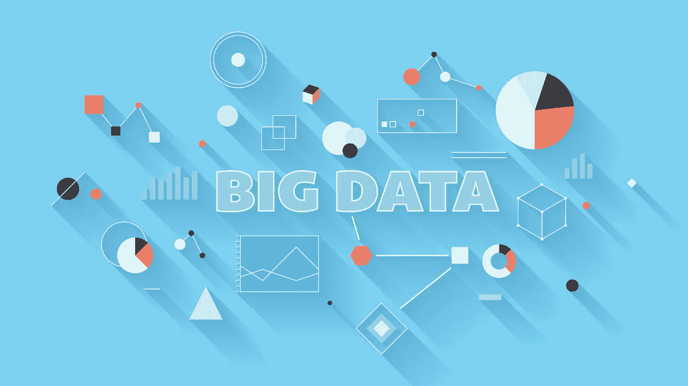

# 大数据分析:技术和工具

> 原文：<https://towardsdatascience.com/big-data-analytics-its-technologies-and-tools-e77f9bd0d37c?source=collection_archive---------1----------------------->

Big Data Analytics: It’s Technology and Tools

大数据主要由数据集的容量来定义。大数据集通常都很大——达到数十 TB——有时甚至超过数 Pb。术语“大数据”之前是使用数据库管理系统(DBMS)管理的超大型数据库(VLDBs)。如今，大数据分为三类数据集——结构化、非结构化和半结构化。

What is Big Data Analytics?

[**结构化数据**](https://www.marutitech.com/big-data-analysis-structured-unstructured-data/) **集合**包括可以以其原始形式用于导出结果的数据。例子包括关系数据，如雇员工资记录。大多数现代计算机和应用程序被编程为以预设格式生成结构化数据，以使其更易于处理。

[**非结构化数据**](https://www.marutitech.com/big-data-analysis-structured-unstructured-data/) **集合**则相反，没有适当的格式化和对齐。例子包括人类文本、谷歌搜索结果输出等。这些随机收集的数据集需要更多的处理能力和时间来转换成结构化数据集，以便它们可以帮助得出切实的结果。半结构化数据集是结构化和非结构化数据的组合。这些数据集可能具有适当的结构，但是缺少用于排序和处理的定义元素。例子包括 RFID 和 XML 数据。

**半结构化数据集**是结构化和非结构化数据的组合。这些数据集可能具有适当的结构，但是缺少用于排序和处理的定义元素。例子包括 RFID 和 XML 数据。

大数据处理需要特定的物理机和虚拟机设置才能得出结果。处理是同时进行的，以尽可能快地获得结果。如今大数据处理技术还包括[云计算](https://www.marutitech.com/5-reasons-why-cloud-can-transform-your-business/)和[人工智能](https://www.marutitech.com/artificial-intelligence-and-machine-learning/)。这些技术通过自动化许多流程和任务来帮助减少人工输入和监督。

大数据不断发展的本质使得人们很难给它一个普遍接受的定义。根据处理数据集所需的技术和工具，数据集被归类为大数据状态。

# 大数据分析—技术和工具

大数据分析是通过分析不同类型的大数据集来提取有用信息的过程。大数据分析用于发现隐藏的模式、市场趋势和消费者偏好，有利于组织决策。大数据分析涉及几个步骤和技术。

# 数据采集

数据采集有两个组成部分:识别和收集大数据。大数据的识别是通过分析数据的两种自然格式完成的，即天生的数字格式和天生的模拟格式。

## 原始数字数据

它是通过数字媒介获取的信息，例如计算机或智能手机应用程序等。由于系统不断从用户那里收集不同类型的信息，这类数据的范围不断扩大。天生的数字数据是可追踪的，可以提供个人和人口统计的业务洞察力。示例包括 Cookies、网络分析和 GPS 跟踪。

## 天生的模拟数据

当信息以图片、视频和其他与我们世界的物理元素相关的格式出现时，它被称为模拟数据。这些数据需要通过使用传感器(如照相机、录音、数字助理等)转换成数字格式。技术范围的不断扩大也提高了传统模拟数据通过数字媒体转换或获取的速度。

数据采集流程的第二步是收集和存储被识别为大数据的数据集。由于陈旧的 DBMS 技术不足以管理大数据，因此使用了一种新的方法来收集和存储大数据。这个过程被称为 MAD——有磁性、敏捷而深刻。由于管理大数据需要大量的处理和存储容量，因此对于大多数依赖大数据分析的实体来说，创建这样的系统是遥不可及的。因此，今天最常见的大数据处理解决方案基于两个原则——分布式存储和大规模并行处理，也称为 MPP。大多数高端 Hadoop 平台和专用设备在其系统中使用 MPP 配置。

## 非关系数据库

存储这些海量数据集的数据库在数据存储的方式和位置方面也发生了变化。JavaScript 对象符号或 JSON 是当今保存大数据的首选协议。使用 JSON，可以在应用层编写任务，并允许更好的跨平台功能。从而为 devs 实现可伸缩和灵活的数据解决方案的敏捷开发。许多公司用它来代替 XML，作为在服务器和 web 应用程序之间传输结构化数据的一种方式。

## 内存数据库系统

这些数据库存储系统旨在克服大数据处理过程中的一个主要障碍，即传统数据库访问和处理信息所需的时间。IMDB 系统将数据存储在大数据服务器的 RAM 中，因此大大减少了存储 I/O 差距。Apache Spark 是 IMDB 系统的一个例子。VoltDB、NuoDB 和 IBM solidDB 是更多相同的例子。

## 混合数据存储和处理系统— Apache Hadoop

Apache Hadoop 是一个混合数据存储和处理系统，以合理的成本为中小型企业提供可扩展性和速度。它使用 Hadoop 分布式文件系统(HDFS)来跨多个系统(称为集群节点)存储大文件。Hadoop 具有复制机制，即使在单个节点出现故障的情况下也能确保平稳运行。Hadoop 以 Google 的 MapReduce 并行编程为核心。该名称源于函数式编程语言在其大数据处理算法中的“映射”和“归约”。MapReduce 的工作前提是增加功能节点的数量，而不是增加单个节点的处理能力。此外，Hadoop 可以使用现成的硬件运行，这大大加快了它的开发和普及。

# 数据挖掘

Data Mining

这是一个最近的概念，它基于对大数据集的上下文分析来发现独立数据项之间的关系。目的是让不同的用户将一个数据集用于不同的目的。数据挖掘可用于降低成本和增加收入。

*在* [阅读完整和更新的故事什么是大数据分析，我的业务为什么需要它？](https://www.marutitech.com/big-data-analytics-need-business/) *，其中包括-* 【使用大数据分析的 10 大行业】
利用数据科学发展业务的 8 种方式
为什么我的业务需要数据科学？