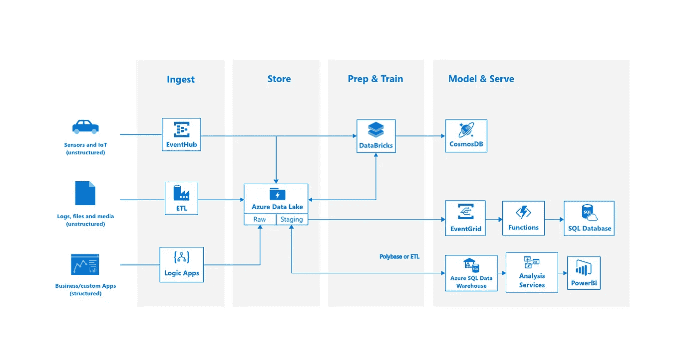

# 大数据——为什么、如何和什么——一个思维过程和架构

> 原文：<https://towardsdatascience.com/big-data-the-why-how-and-what-a-thought-process-and-architecture-76d1d3572714?source=collection_archive---------4----------------------->

我在与客户交谈时遇到的最常见的问题之一是，他们如何能够建立一个良好的大数据架构，让他们能够处理所有现有数据。的最终目标是在 it 基础上执行高级分析和人工智能，以获取洞察力，使他们能够在当今不断快速发展的世界中保持相关性。

为了解决这个问题，我总是首先询问他们对“大数据”的理解，因为一个客户与另一个客户不同。一个人可能认为大数据只是他们能够处理所有不同 excel 文件的方式，而另一个人可能认为大数据是他们所有项目和智慧的圣杯。在本文中，我想向您解释大数据对我的意义，并为您提供一个思考过程，帮助您为组织定义大数据战略。

什么是大数据？Gartner 通过不同的 V 来解释它:“量”、“多样性”、“速度”、“准确性”，其中如果您有前三个中的两个，那么您就在谈论大数据。用他们自己的话说:

> 大数据是高容量、高速度和/或高多样性的信息资产，需要经济高效、创新的信息处理形式来增强洞察力、决策制定和流程自动化。*—*

*然而，对我来说，大数据远不止这些。当你在使用时，能够谈论它并认识到它是一回事，但是以一种你的整个组织能够从中受益的方式来实现它是另一回事。*

*让我们来解决我在与客户打交道时看到的 3 个最常见的棘手问题:*

# *1.创建集中式数据湖*

*在与我的客户交谈时，每当我想开始利用大数据时，都会遇到同样的问题。“我们要把它存放在哪里”的问题。但是每次答案都很简单:“尽可能集中”。将您的数据存储在一个集中的地方将使您能够更好地控制它。通过这种方式，您将能够了解您的流入流程、处理流程以及流出流程，从而能够从所有这些数据中进行复杂的分析。*

*但是为什么人们会忽略这一点呢？因为在现实世界中，事情并不像听起来那么简单。许多企业都有几十年的历史，它们的流程和结构有时可以追溯到那个时代。只要想想那些仍然在垂直结构中工作的企业，团队在孤岛中工作，属于这些团队的数据不会跨越到不同的团队。导致数据支离破碎。*

*由于这个原因，在设置您的集中式数据存储库时，第一部分是在组织上执行变更管理。你能从一个垂直的结构转向一个更水平的结构吗？在这个结构中，团队互相合作，使用同一个数据仓库。在第三点中会有更多的介绍。*

*第二部分是，如何正确存储来自所有这些不同系统的不同格式和数据类型的数据。这是我们将在第二点中看到的。*

*如果你将这一思维过程形象化，你可能会得到如下结果:*

**

# *2.通过着陆区利用你的数据湖*

*因此，我们有所有这些数据进来，在所有不同的格式和数据类型。乍一看，这似乎是一件坏事；但实际上不是。数据湖就是为此而创建的，以任何格式存储数据，使其成为满足您所有历史需求的完美工具。*

*但是我们如何组织这些数据呢？好的，一个好的做法是把进来的数据存储在不同的“着陆区”。它们不仅用于存储来自 BI 系统、视频等的原始数据，还用于存储经过处理的数据——数据的处理方式是，每种格式和数据类型都按照您习惯的标准进行标准化。只需考虑将数据标准化，使其在任何地方都使用相同的日期格式。这些区域我们通常称为“原始”和“分段”区域。*

*将这两个区域链接在一起只是连接正确的 ETL 过程的问题，ETL 过程从“原始”区域提取数据，以您想要的方式修改它，然后将它放入您的“暂存”区域，准备供您的报告工具或数据仓库使用。*

*您现在可能会有一个有趣的问题:“但是，如果我们从原始的结构化数据源转向数据湖，然后再回到数据仓库，我们的性能会不会下降呢？”这确实是一个有趣的问题，我们只能通过回到数据湖的目的来回答。数据湖它的目标是拥有一个*集中式数据存储库*，在这里收集我们所有的数据，以便我们的*数据科学家*能够对最纯粹形式的源数据执行他们的工作。但是其次，我们的 *ETL 作业*正在运行，不断地将数据从已处理的“暂存”区域复制到目标系统。回顾这些不同的目的，我们可以说，即使我们可能会遇到一个小的性能问题，它也将是一个控制我们数据上发生的一切的简单系统，从而改进分析、报告甚至治理流程。*

# *3.正确的内部治理*

*如同在一切美好的事物中，凡事还是有一个硬的东西；这也不例外。创建集中式数据湖最困难的部分是治理。现在，您已经做好了从不同系统向数据湖提取数据的一切准备，并且您能够处理这些数据，使其可供使用。但是，在不同的团队中，你实际上是如何工作的呢？*

*不同的团队将处理数据湖中的数据，因此必须有正确的访问控制角色来定义哪些用户可以访问数据湖的哪个部分。想象一下不同的场景，比如一个 BI 专家不需要访问数据湖，但是需要访问我们提供给他们的聚合视图。或者您希望跨区域工作，允许您对数据提供行级安全性，以便不同区域的人只能看到对他们有意义的数据。这些都是您在创建大数据架构时必须考虑的事情。*

*我们经常会看到以下角色以及这些角色在这些组织中是如何配置的:*

*   ***数据工程师:**您的数据工程师负责设置 ETL 作业，以处理从一个着陆区到另一个着陆区的数据，需要完全访问数据湖。*
*   ***数据科学家:**这个角色可以通过“原始”登陆区以最纯粹的形式访问数据湖。通过提供对这些的访问，数据科学家将能够从你的数据中得出结论，并在这些基础上建立人工智能模型，这可能会大大有利于你的组织。*
*   ***BI 专家:**这些人通常不需要访问数据本身，而是需要查看视图。因此，提供对通过诸如 *Hive* 这样的系统创建的视图的访问可能是有益的，该系统允许您的专家在您的数据上运行简单的 SQL 查询，同时仍然提供行级安全性和您在安全性方面习惯的其他一切。(注意:行级安全性需要正确配置，这听起来很简单，但是在非结构化数据上正确配置需要一段时间)*

> **如果您希望额外的安全性并且没有人访问数据湖，您可以通过简单的 ETL 副本创建数据湖的一个子集，不同的角色可以在其中扮演角色并做他们想做的任何事情。这个子集每晚都被重新创建。**

# *示例架构*

*因此，我们定义了在设计大数据架构时需要考虑的 3 个主题，但现在实际情况如何呢？为此，我创建了两个架构，希望与大家分享。*

*第一个是标准的大数据架构，让您可以看到我们如何将数据从源系统接收到数据湖中，并开始为此提供服务。这种体系结构就是我所说的更“慢”的体系结构，因为您可能依赖于每“x”秒或每“x”分钟轮询一次以查看新数据是否可用的轮询系统。这将发生在从源系统获取数据的最左边部分，以及将数据推送到消费层的最右边部分。然而，对于大多数用例来说，这可能是好的，这完全取决于这个问题:“我希望我的消费层中的数据多快可用？”。*

**

*但是，如果您希望数据一放入系统就可以访问，那么您需要考虑更“事件驱动”类型的系统。这些将处理每次数据可用时触发的事件，而不是每隔几秒或几分钟轮询一次。*

**