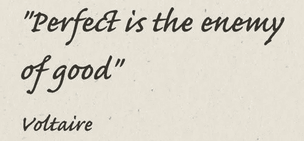
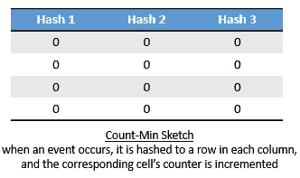
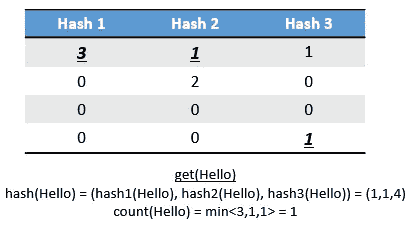
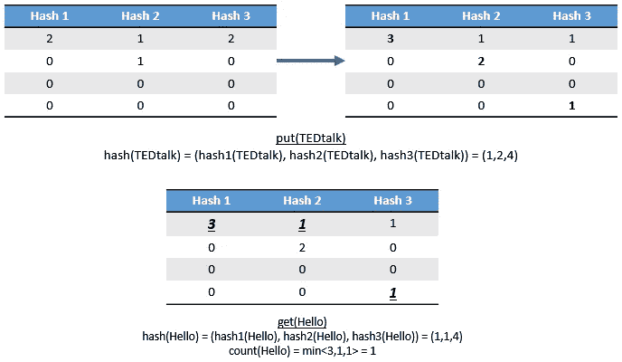

# 具有粗略结构的大数据，第 1 部分—计数-最小草图

> 原文：<https://towardsdatascience.com/big-data-with-sketchy-structures-part-1-the-count-min-sketch-b73fb3a33e2a?source=collection_archive---------2----------------------->

你是一家流媒体公司的开发人员。你的团队开发了一个视频内容平台，比如网飞和 YouTube。你的应用程序很受欢迎，用户基数大，内容丰富。

现在，您的团队希望开始加强数据分析，以提高用户参与度。你的团队做的第一件事就是分析平台上的视频流行度。您可能在某个地方有一个散列表，将每个视频的唯一 id 映射到一个观看次数。

a standard hash table

所以你开始分析这个视频观看计数数据，试图找到趋势和诸如此类的东西，但你很快就遇到了一个问题。哈希表的空间复杂度为 O(n)——消耗的空间量与存储的项目数量成正比。例如，如果您的平台有 40 亿个视频，并且每个视频都有一个 32 位的唯一 id(这是支持这种规模的集合的最低值)，那么您将需要 160 亿字节的数据，或 16 GB，仅仅是为了跟踪每个视频的 id！然后，您必须考虑视图计数——每个视图都可以存储在一个 32 位整数中。这又是 16 GB，意味着您的哈希表总共将消耗 32 GB！

大多数消费者笔记本电脑没有足够的内存来处理这么多数据。如果您想要将这些视图计数与元数据(如地区、语言、年份、长度和流派)进行交叉引用，以便进行高级分析？你做梦去吧。

在这一点上，很多人会认输，惊呼他们需要一个计算集群来运行分布式并行计算工具，如 Hadoop 和 Spark。也许这是正确的解决方案。但是，在我们投入大量资金并给我们的项目增加大量复杂性之前，让我们探索一些可能使我们的工作稍微容易一点的替代数据结构。

# 草图——它们是什么？

有一类数据结构被称为**草图**，它们有能力用次对数甚至恒定的空间复杂度来表示极大的集合。这意味着，当您从第一千个视频过渡到第一个一百万个视频，再到第一个十亿个视频时，您不需要扩展您的计算能力！

听起来好得难以置信？从某种意义上来说，的确如此。草图依靠各种技巧来压缩数据，通常，这些技巧会导致草图包含不准确的信息。初始化草图时，可以分配任意多的空间。但是如果你的集合变得太大，或者你没有分配足够的空间，那么草图很可能返回不精确的结果。这里有一个非常明显的权衡——尺寸与精度——作为一名工程师，这取决于您能否找到满足您需求的平衡点。

作为一个比喻，把原始场景想象成一幅美丽的画，而你的素描，嗯，就是那幅画的素描。就像你需要投入更多的精力来完美地复制这幅画一样，你也需要更多的空间来正确地复制一套。就像一幅错综复杂的画比一幅简单的画更难模仿一样，大型布景比小型布景需要更多的空间来绘制草图。如果你熟悉机器学习，你可以认为素描类似于降维。当您的应用程序正在处理大数据时，这是一种有效的技术，但它不需要完美的准确性。

Count-Min Sketches——人们大约看了多少次阿黛尔的《你好》?

回想一下，我们需要目录中每个视频的浏览量。本质上，这是一个事件发生问题；我们有一个事件流(视图),我们想计算每个事件发生了多少次。事件发生问题的一个流行解决方案是**计数分钟草图**。

Count-Min 草图的内部结构是一个表，类似于散列表。然而，虽然散列表使用单个散列函数，但 Count-Min 草图使用多个散列函数，每列一个。最初，Count-Min-Sketch 中的每个单元都被初始化为 0。当一个事件发生时，该事件的 id 在每一列上被散列。每个哈希函数输出一个行值，并且每个行-列组合的计数器都会递增。为了查询一个事件的计数，我们在所有散列函数中取该事件计数的最小值。

我们举个例子。假设我们有一个 3 列 4 行的最小计数草图。你平台上的第一个用户决定观看“日本历史”。当视频的 id 被这三个散列值散列后，我们得到 1、2 和 1，这表明我们应该在(1，1)、(2，2)和(1，3)处递增计数器。

现在假设另一个用户观看 Adele 的“Hello ”,它的哈希值为 1、1 和 4。接下来，又一个用户观看“日本历史”。

此时，我们决定检查用户观看“Hello”的次数。我们已经看到“Hello”散列为 1、1 和 4，所以我们应该检查单元格(1，1)、(1，2)和(4，3)的计数。这些计数分别为 3、1 和 1。

我们知道“你好”只被观看了一次，然而，在上面的计数-分钟草图中，一个计数器显示“你好”被观看了三次！这是因为“Hello”和“Japan”在第一个 hash 函数上发生碰撞，所以任何观看了两次的“Japan”的视图也将计入“Hello”中。从本质上讲，Count-Min 草图是双重的，允许多个事件共享同一个计数器以节省空间。表格中的单元格越多，我们在内存中存储的计数器就越多，因此重复出现的次数就越少，我们的计数器就越精确。

即使我们不知道观看历史，我们也可以很容易地断定“你好”被观看了不超过一次。如果它真的被观看了 3 次，那么*所有加粗的计数器将至少为 3。因为三个加粗的计数器中的最小值是 1，所以我们可以断定“Hello”被观看了不超过 1 次。*

现在让我们看一个 Count-Min 草图错误的例子。

即使“你好”在这个序列中从未被观看过，但每个视频都至少在一个哈希函数中与“你好”发生了冲突。结果，当我们查询 Adele 的“Hello”的观看次数时，我们被错误地告知它已经被观看了一次。如前所述，我们可以通过使用更大的表来降低错误的概率和大小。一个小错误并不意味着世界末日，特别是如果我们的目标是了解总体趋势而不是进行精确测量的话。

# 最小计数草图的属性

Count-Min Sketch 不寻常的结构的伟大之处在于，当我们向集合中添加新事件时，我们不需要分配新的内存。我们增加了一些计数器，但是我们分配的空间是不变的。即使我们添加了一百个、一千个或一百万个新事件，我们的程序也应该在同样多的时间内用同样多的内存运行。换句话说，Count-Min Sketch 在时间和空间上都是 O(1)。问题是，随着我们添加新的事件，会发生更多的冲突，我们的近似计数和真实计数之间的差距会越来越大。

尽管如此，计数分钟草图是非常有效的。一个 1000x8 的 Count-Min 草图(即 8 个散列函数，每个函数映射到一个 1000 长度的数组)需要存储 8000 个 32 位整数。总共是 32kb——比我们之前设想的 32 GB 的大型哈希表小几个数量级！

Count-Min 草图的另一个吸引人的特性是它是并行的。我们可以同时向表中添加多个事件，只要这些事件的散列不冲突。在“较高”的表中，冲突发生的频率较低，在这些表中，散列函数(列)的数量较少，而散列值(行)的范围较大。为并行应用设计的 Count-Min 草图应该记住这一点。

任何需要精确计数的任务——比如跟踪广告显示的次数——都不适合计数-分钟草图。计数-最小草图也不提供减少计数的功能，因此您不会使用它们来跟踪可能上下波动的值。

最后，计数-分钟草图有一个有趣的特性，他们从来不会低估——他们只会高估事件的数量。从统计学上来说，你可能会说计数分钟草图是**偏差**。如果你只是在比较两个值，这没问题——例如，如果你想弄清楚“你好”是否比“日本历史”更受欢迎。

然而，如果偏差是一个问题，那么您可以使用计数最小草图的**去偏差**版本，称为**计数平均最小草图**。当从 Count-Mean-Min 草图中获取事件 *e* 的计数时，每个 *e* 的单元格通过减去列平均值来消除偏差。然后，Count-Mean-Min 草图返回偏差校正计数的中值(与 Count-Min 草图不同，它返回高估计数的最小值)。

# 下次—超对数和布隆过滤器

在本文中，我们学习了一种很酷的、节省空间的方法来计算一个元素在流或大型集合中出现的次数，而不必将集合本身存储在内存中。在下一篇文章的[中，我们将学习两种新的用于处理大规模集合的草图数据结构——一种让您估算一个集合的大小，另一种让您检查一个集合中的成员。](https://medium.com/@shuklak13/big-data-with-sketchy-structures-part-2-hyperloglog-and-bloom-filters-73b1c4a2e6ad)