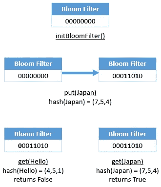
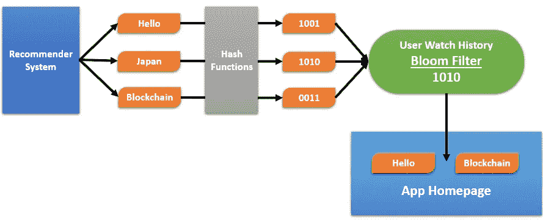

# 具有粗略结构的大数据，第 2 部分—超对数和布隆过滤器

> 原文：<https://towardsdatascience.com/big-data-with-sketchy-structures-part-2-hyperloglog-and-bloom-filters-73b1c4a2e6ad?source=collection_archive---------4----------------------->

本文是我之前的文章[“具有粗略结构的大数据，第 1 部分”](https://medium.com/@shuklak13/big-data-with-sketchy-structures-part-1-the-count-min-sketch-b73fb3a33e2a)的后续文章，在这篇文章中，我介绍了空间最优的粗略数据结构的概念。上一次，我们讨论了 Count-Min Sketch，这是一个用来计算一个元素在一个集合中出现的次数的结构。在本文中，我将介绍另外两种流行的草图结构。

# **有多少用户登录了？O(n)空间解**

我们已经建立了一种节省空间的方法来估算视频浏览量。这很好——有了这些数据，我们可以开始了解什么样的内容会吸引用户到我们的平台，并让他们保持参与。

假设您的团队想要开始跟踪其他相关的用户参与度指标。一个明显的例子是在任何给定的时间单位内活跃用户的数量。例如，您可以跟踪每月用户、每日用户甚至每小时用户的数量。你的产品在工作日更受欢迎，还是在周末？用户喜欢在白天访问，还是在晚上访问？

让我们从实现每日活跃用户计数器开始。我们可以使用一个**散列集合**，每当用户登录时就将他或她添加到集合中。如果用户每天多次登录，或者在不同的设备上登录，或者在不同的浏览器上登录，我们不会重复计算，因为他们的登录 id 将映射到相同的哈希值。每天结束时，我们可以将集合的大小(也称为它的**基数**)保存到某个每日计数表中。然后，我们重置设置，并开始为第二天计数。

如果我们每天有 10 亿用户，并且使用 32 位整数来存储用户 id，那么仅存储一组活动用户 id 就需要 4 GB。即使你使用一个**位图**——能够用一个比特表示一个用户——你仍然需要十亿字节的内存来表示十亿个用户。这些数字实际上相当不错。然而，仍然有改进的余地。哈希集和位图都具有 O(n)空间复杂度，这意味着它们消耗的空间与您跟踪的数据量成正比。

尽管您满足于今天跟踪活跃用户的数量，但是明天您可能想要跟踪每个国家的活跃用户的数量，或者每个年龄的活跃用户的数量。您决定监控的指标越多，就越需要投资存储。O(n)数据结构也使得对大数据进行实时分析变得更加困难，因为摄入的数据大小可能会超过您的分析管道的吞吐量。

如果您愿意接受不太精确的用户计数，您可以使用 **HyperLogLog** ，一种草图数据结构，以获得更好的空间效率。

# **超级日志-大约有多少用户登录？**

超对数(HyperLogLog)是一种具有亚对数 O(log(log(n))空间复杂度和常数 O(1)时间复杂度的草图数据结构。像 Count-Min 草图一样，HyperLogLog 关注的是**多重集**——每个唯一元素可能出现不止一次的集合。Count-Min 草图可以告诉你一个多重集中的每个元素大概出现了多少次。另一方面，HyperLogLog 可以告诉你一个多重集有多少独特的元素。这就是所谓的**基数估计问题**。

让我们看看如何使用 HyperLogLog。每当用户登录我们的应用程序时，HyperLogLog 算法会将用户的 id 散列成一个位串。假设均匀分布，我们可以得出结论，大约一半的位串以 0 开始，另一半以 1 开始。类似地，大约四分之一的位串以 00 开始，大约八分之一的位串以 000 开始。

你可以看到模式。一般来说，均匀分布的位串的每个 2^ *z* 中大约有 1 个将以序列*z*0 开始。

假设，在某个给定的时刻，我们对所有活动用户的 id 进行哈希运算，我们发现前导 0 的最长序列是 0000。这种情况发生在任何随机位串上的概率是 1/16。换句话说，我们平均需要 16 个随机的位串才能找到一个以 0000 开头的位串。所以我们可以猜测，在那一分钟内，我们的应用程序可能有大约 16 个访问者。

HyperLogLog 就是建立在这个想法上的，尽管数学有点复杂。在最初的论文中，位串被分成多个*段*，并且基数被计算为这些段中每一个的 *2^z* 的调和平均值。哈希冲突产生的偏差由乘法常数处理，线性计数用于为较小的集合提供更精确的计数。这种方法对于一篇中型文章(和我的大脑)来说有点太复杂了，所以如果你真的想深入了解它是如何工作的，我推荐你阅读菲利普·弗莱乔莱 2007 年的原始论文。

尽管是一个相对较新的算法，超对数已经在工业上相当成功。 [Redis Labs](https://redislabs.com/blog/how-to-use-redis-at-least-x1000-more-efficiently/) 使用 HyperLogLog 将一个 12 MB 的数据集压缩到只有 12 KB，同时仅出现 0.81%的错误。[谷歌](https://storage.googleapis.com/pub-tools-public-publication-data/pdf/40671.pdf)用它来统计他们每天的搜索查询次数。几个数据库，比如 [Elasticsearch](https://www.elastic.co/blog/count-elasticsearch) 和 [AWS 红移](https://docs.aws.amazon.com/redshift/latest/dg/r_COUNT.html)，都在幕后使用 HyperLogLog。像大多数草图数据结构一样，HyperLogLog 也是完全可并行化的，这使得它对于高吞吐量并行应用程序来说是高效的。要点:HyperLogLog 是一种非常好的节省空间的方法，可以估算出集合中唯一条目的数量。

# 推荐系统的缺陷

在这一点上，你的团队已经有了一些很好的用户参与度分析——由于 Count-Min Sketch，你可以知道每个视频大约被观看了多少次，由于 HyperLogLog，你可以知道过去一个月每天大约有多少活跃用户登录。您可以使用这些数据来制定业务决策，例如基于最受欢迎的视频制作新内容，或者对未来增长进行预测。

你可能考虑过创建一个推荐系统。人们喜欢基于个人喜好的定制体验。所以，你推出了一个推荐系统，起初，事情进展顺利。

但是过了一段时间，你会发现用户保持率开始下降。这是怎么回事？你做了一些研究，发现许多用户在使用了主页上的推荐后离开了网站。原来你的推荐引擎一直在一遍又一遍的推荐同一个视频，忽略了你的用户已经看过那些视频的事实。你的用户被引导相信他们已经用尽了你的有趣内容目录，所以他们开始离开。

我们如何解决这个问题？我们需要跟踪每个用户看过的视频，并确保这些视频不会再次推荐给那个用户。这是典型的**集合成员关系**问题的一个实例。给定一个项目(一个推荐的视频)，我们想确定这个项目是否属于一个特定的集合(用户的历史)。

我们已经讨论了散列集和位图如何具有线性空间复杂度。如果 10 亿用户每人观看 100 个视频，每个视频由位图上的一个比特表示，我们将需要 1000 亿比特，即 100 GB。让我们努力做得更好。

**Bloom Filters——用户大概看过哪些视频？**

**Bloom Filter** 是一种在 O(1)空间和时间上解决集合成员问题的数据结构。布隆过滤器的内部结构是一个 *m* 长的位串。最初，所有位都设置为 0。像 Count-Min 草图一样，Bloom Filter 使用了 *k* 个不同的哈希函数，每个函数返回 0 和 *m-1* 之间的一个位位置。Bloom Filters 支持两种操作——put(x ),它表示将元素 x 添加到集合中，get(x ),它告诉我们 x 是否是集合的成员。

当调用 put(x)时，每个 *k* 散列函数独立地将 *x* 散列到一个位位置，然后将 *k* 选择的位翻转为 1。类似地，get(x)调用相同的散列函数并检查得到的 *k* 位。如果每个位都是 1，get(x)告诉我们 *x* 很可能在集合中。如果至少有一位是 0，get(x)告诉我们 *x* 不能在集合中，因为集合(x)会将 *x* 的所有位设置为 1。

您可以在下面的操作中看到 initialize()、put()和 get()函数。

让我们看看如何将它应用到我们的推荐系统中。假设我们的推荐系统认为一些用户真的喜欢看“你好”、“日本历史”和“什么是区块链智能合约？”。不过这位用户已经看过《日本史》了，实在不想推荐。

在后台，这三个标题中的每一个都被散列，这些散列被对照用户的观看历史进行检查，被表示为 Bloom 过滤器集。我们看到“日本历史”包含在集合中，所以我们将其过滤掉。最后只有“你好”和“什么是区块链智能合约？”被发送到用户的主页。你的用户看到了新鲜的内容，你的广告商获得了更多的眼球，你的经理获得了更多的钱，你获得了积极的员工评价，所有人都很高兴。耶，布鲁姆过滤器！

# **布隆过滤器中的偏差**

像所有草图数据结构一样，布隆过滤器以准确性换取效率。布隆过滤器返回的错误类型被称为**假阳性**。当集成员资格查询 get(x)错误地返回“true”时，即使从未调用过 put(x)操作，也会发生这种情况。

怎么会这样？让我们看看下面的例子。用户只观看了“日本”和“区块链”，但这个特定视频组合的哈希值恰好与“你好”的哈希值重叠。因此，“Hello”将被错误地从该用户的推荐列表中省略。听起来很糟糕，对吧？

事实证明其实也没那么糟。只要程序的成功不受误报的影响，您就可以安全地利用节省空间的 Bloom Filters。在我们的推荐系统示例中，我们不会因为某个视频没有出现在他或她的推荐提要中而失去用户。如果一些用户错过了阿黛尔的最新歌曲，这并不是世界末日。只要你不断提供吸引用户兴趣的新鲜内容，你就能保持稳定的参与度，这才是对你的业务真正重要的。

布鲁姆过滤器中的误报实际上与计数-分钟草图中的过度计数错误非常相似。事实上，这两个都是**偏向**错误，它们都是由同一个现象导致的——哈希位冲突。为了最小化误报率，您需要最小化哈希冲突的概率。解决方法很简单——使用更大的位串。

布隆过滤器可能是当今最流行的草图数据结构。它们用于恶意 URL 检测、网页缓存、数据库查找，甚至拼写检查。布隆过滤器也是一个活跃的研究领域，近年来有许多变种，如计数和滑动布隆过滤器。

# **未来是概率性的**

在这两篇文章中，我们研究了三种概率数据结构——Count-Min Sketch、HyperLogLog 和 Bloom Filters——它们正被用于解决当今的大数据问题。解决问题的概率方法已经被人工智能社区所接受，现在，它们在软件工程师中也越来越受欢迎。软件是关于权衡的——时间与空间，读取与写入，清晰与简洁，一致性与可用性——现在，精度与效率。