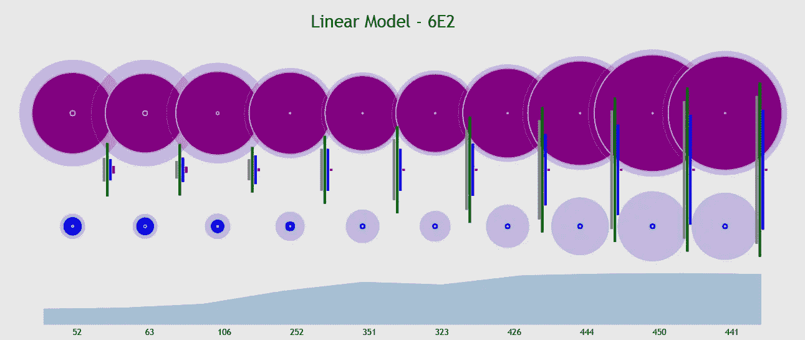
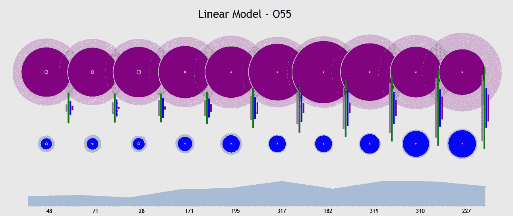
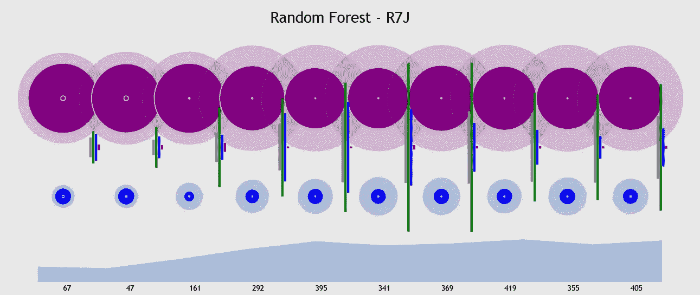

# 大峡谷:扮演上帝，用 Python

> 原文：<https://towardsdatascience.com/bigvalley-play-god-in-python-14563fb7728d?source=collection_archive---------3----------------------->

大峡谷是一个小小的模拟生态系统，有三种动物:草、兔子和狼。

bigValley in action.

草长在岩石上，然后被兔子吃掉。兔子反过来被狼吃掉。每过一年，每只动物都会做三件事情中的一件:1)繁殖，如果她有足够的能量 2)吃食物，如果食物在她旁边，增加她的能量 3)移动，如果她旁边没有食物，减少她的能量

你可以访问[这个页面](https://seth127.github.io/bigValley/)来观看这个世界的动态。动物的运动是可视化的，并且绘制了一些关于它们进化的统计数据(下面将更详细地讨论)。这个世界一直运转，直到狼或兔子灭绝，然后在一个新的时代再生。

# 学问

这项工作的真正目的是设计一个过程，通过这个过程，世界本身可以了解导致最稳定的生态系统的理想参数。这是一个通常被称为[的基于代理的建模](https://en.wikipedia.org/wiki/Agent-based_model)的例子。有几种语言和库是为做这种模拟和建模而设计的，特别是 [NetLogo](https://ccl.northwestern.edu/netlogo/) 和 [Arena](https://www.arenasimulation.com/support/entry/solving-agent-based-problems-with-arena) 。然而，为了在整个学习过程中最大限度地控制参数的设置和重置，bigValley 是用 Python 从头开始构建的。更多的技术细节，以及运行您自己的模拟的代码，可以在该项目的 [GitHub 自述文件](https://github.com/seth127/seth127.github.io/blob/master/bigValley/README.md)中找到。

测试了两种学习最佳参数的方法。第一种是更传统的[响应面方法](https://en.wikipedia.org/wiki/Response_surface_methodology)方法，拟合一次多项式线性模型，然后在相关系数的方向上以固定的学习速率调整每个参数。第二种利用随机森林模型，从一组随机生成的选项中选择一组最佳参数。下面是关于这两种方法和结果的更多信息。但首先，简单概述一下我们正在优化的参数。

# 因素

每一个新的生物都有一些小的随机正态变化，这些变化集中在该生物的硬编码起始参数上。当生物繁殖时，子代的变化以其父代的值为中心。随着世界年龄的增长，这创造了某种程度的“遗传”或“进化”。每个生物都有以下参数:

**能量**是那个生物的启动能量

**生殖**是动物繁殖所必须达到的能量阈值

**疲劳**是动物每转一圈所损失的能量(不吃东西)

*注意:*草和石头因为不动，所以没有有意义的疲劳值。他们每回合都会获得一点能量，直到他们繁殖或者被吃掉。每次迭代中石头的数量不会改变(即石头不会再生*或*被吃掉)。

总共有十个参数设置在每个时期的开始。前六位分别是狼和兔子的*能量*、*再现*、*疲劳*(以下简称*沃尔夫*、*沃尔夫*、*沃尔夫法*等。).另外四个是在那个时代开始时存在的狼、兔子、草和岩石的数量。

# 初始训练运行

在每个模拟的开始，世界的 25 个纪元以默认开始参数为中心运行。这些参数在每个时期都添加了随机正态噪声，从而生成了训练模拟的某种“正态分布”的表象。此外，每次每个生物的开始位置都是随机的，所以这给每次迭代增加了另一个随机因素。

一旦运行了 25 个时期，第一个*学习迭代*通过在这 25 个时期上训练机器学习模型(下面讨论)并相应地设置其参数而开始。

# 稳定阈值

每个纪元一直运行，直到兔子或狼灭绝，或者达到预设的“成功”阈值(运行 500 年没有灭绝，或者增长到 10，000 只动物)。在下面的示例中，在计算汇总统计数据之前，进行了 50–75 次学习运行。每个测试运行都用一个 3 字符的字母数字 ID 来标识，以便于在图之间进行比较。前缀 LM-表示使用线性模型进行学习的运行，而 RF-表示随机森林。

# 响应面线性模型

在最初的 25 个训练时期之后，用上面讨论的 10 个参数作为解释变量，用该迭代的第一次灭绝的年份作为响应，拟合 OLS 线性模型。因此，反应是有限的，下限为 1(第一年灭绝，可能性极小)，上限为 500(重启前允许的最大年限)。

然后，在每个相应参数的系数方向上调整下一个时期的起始参数。

这个过程在每个时期重复，因此模型适合所有 25 个训练迭代，*和所有先前的学习时期*。然后为下一个时期相应地调整起始参数。下面是两个线性模型模拟的可视化。

# 动物统计:线性模型

从左到右，随着算法的学习，你会看到生态系统的演变趋势。狼被描绘成紫色，兔子被描绘成蓝色。内部的大圆圈代表物种的起始*能量*，而它周围的大圆圈代表繁殖阈值 *Repro* ，小圆圈代表*疲劳*。中间的线条显示了每个时代开始时每个生物的相对数量。底部的面积图和数字显示了这些时代在灭绝前的成功程度。

尽管这些痕迹远非完全相同，但还是出现了一些模式。例如，在两个测试中，兔子和狼的*疲劳*立即向零移动，直到达到最小允许值。同样，随着学习的进行，两种模拟都会增加草地和岩石的起始计数。

然而，更有趣的是注意到狼和兔子的参数朝着相反的方向移动。汇聚了极少数容易繁殖的非常大的狼，以及大量繁殖前需要更多能量的小兔。另一方面，`O55`在大量中等体型、繁殖速度较慢的狼和数量适中、繁殖速度较快的大型兔子之间找到了平衡。

# 随机森林模型

随机森林模型采用了一种完全不同的方法。同样，每个测试运行从 25 次训练迭代开始。然后，在*每个学习迭代*中，随机森林回归器适合于训练数据(其再次包括初始的 25 个，以及*所有的*先前学习时期)。在这一点上，产生了 100 组参数，这些参数围绕每个参数的“中心值”随机正态变化。然后，新训练的回归器为这 100 个参数集的每一个预测第一次灭绝的年份，并选择预测结果最好的一个(即直到灭绝的大多数年份)。这个“最佳参数集”然后被用于运行当前时期。

*注意:*这些用于生成 100 个选项的“中心值”最初被设置为附录中的默认值，但是一旦算法开始学习，它们就被设置为前一个时期中预测的“最佳参数集”的值。与线性模型方法相比，这提供了探索更多特征空间的较慢的参数移动。

# 生物统计:随机森林

这两个与两个线性模型运行相比没有那么明显，尽管它们确实显示了另一组似是而非的解决方案。虽然两者都选择了少量繁殖相当缓慢的中等体型的狼，`OUP`实际上似乎正在向*甚至更小的*狼发展。尽管`R7J`有中等数量的中等大小的兔子，而`OUP`展示了少量的小兔子，但是这两个系列都趋向于繁殖速度不快的兔子。

# 结论和后续步骤

上面的图显示了优化一个稳定的生态系统的给定问题的四种不同的“解决方案”。更多模拟的类似总结可以在[这里](https://seth127.github.io/bigValley/bigValley-summaries.html)查看，还有更简洁的总结海报[这里](https://seth127.github.io/bigValley/bigValleyPoster.pdf)。

# 超越“最佳”

这种模拟在广泛的领域都有应用，从野生动物生物学到救护车路线到在线社区建模。与寻找单个“最佳”参数集相反，从基于代理的模型(如这种模型)中获得的主要收益是探索参数之间的相互作用的能力，以及探索给定问题的可能解决方案的很大空间的能力。

线性建模方法似乎比随机森林更快地收敛到其最佳设置。然而，考虑一个真实世界的情况，其中某些参数不能简单地“调高或调低”而没有一些巨大的成本。当然，如果 grassNum*更高可能会“更好”,但是想象一下，这代表了“红十字会在灾区投放的食物数量”。简单地将食物投放点的数量增加四倍可能是不切实际的。在这种情况下，随机森林和其他非参数模型带来了很多东西。*

# 后续步骤

这项研究可以有很多方向。一个明显的例子是引入全新的代理(例如“超级掠食者”吃狼；或者可能是一种大型的、繁殖速度较慢的食草动物与较小的、速度较快的兔子共存)。然而，如果要从这种建模中获得任何真实的收益，我们必须确保不要引入太多超出我们控制的变量。

另一个有趣的方法是建立不同的“大陆”这将需要同时模拟几个生态系统，但在网格上彼此相距*很远*。最终，种群会扩大到足以相互交流。观察不同进化种群在这些边界上的相互作用可能会令人着迷。通过访问上方的[图像，点击“大陆”单选按钮，可以看到测试版。](https://seth127.github.io/bigValley/)

每个纪元 500 年的限制也可以增加。这可能是最简单、信息量最大的扩展。该限制部分是为了控制异常值，但主要是为了控制计算时间。这里展示的例子花了几天时间在一个相当小的 AWS EC2 实例上进行模拟。有了更多的计算能力，这个限制可以大大放宽，并且可以观察到更多样和有趣的互动。此外，让模拟运行的时间远远超过我们在这里展示的 50–75 个学习周期将会非常有趣。它们最终会汇聚到不会导致灭绝的环境中吗？似乎有可能。

# 定制

对于那些喜欢冒险的灵魂，请随意打开 bvLife.py，创造一些属于自己的生物。每吃一种植物就能获得双倍能量的反刍动物？成群猎食的掠食者？一种以低能量觅食者为食的食肉植物？唯一的限制是你自己的想象力…

访问 [bigValley GitHub repo](https://github.com/seth127/seth127.github.io/tree/master/bigValley) 开始您的旅程。