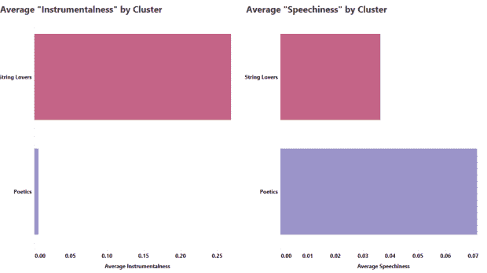
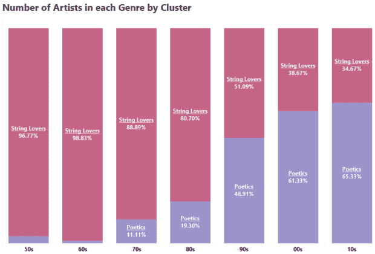
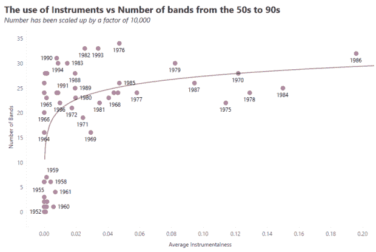
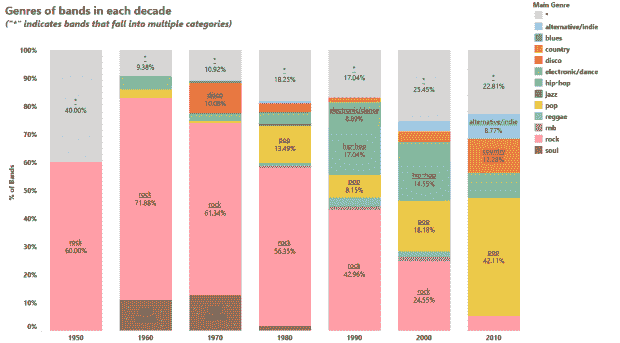
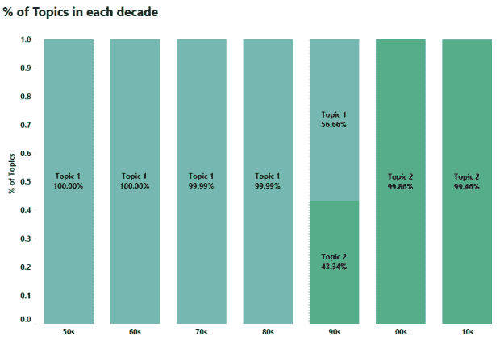
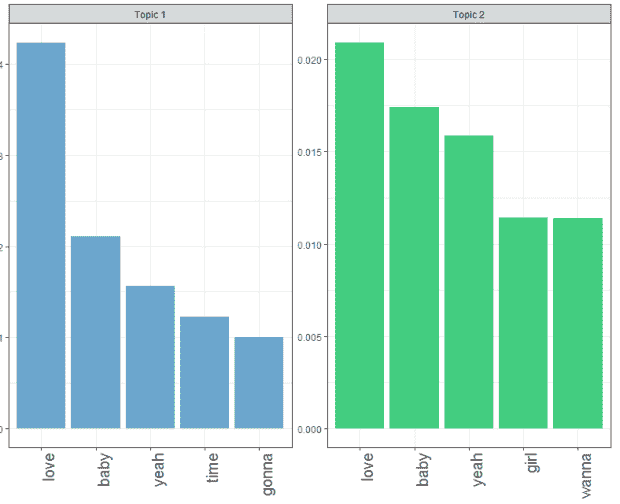
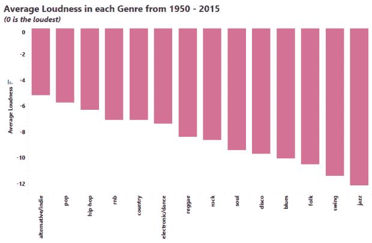
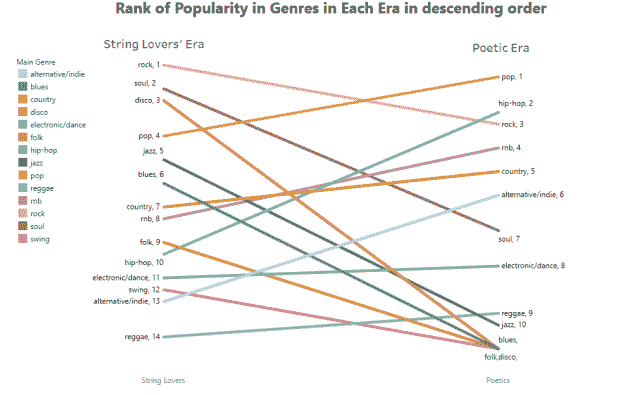
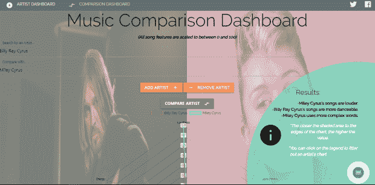

# 公告牌 100 大热门分析

> 原文：<https://towardsdatascience.com/billboard-hot-100-analytics-using-data-to-understand-the-shift-in-popular-music-in-the-last-60-ac3919d39b49?source=collection_archive---------2----------------------->

Photo by [Malte Wingen](https://unsplash.com/@maltewingen?utm_source=medium&utm_medium=referral) on [Unsplash](https://unsplash.com?utm_source=medium&utm_medium=referral)

关于流行的现代音乐，你从“年长”的人那里听到的最多的是什么？总的主题是:“你的音乐声音太大，缺乏内容”。他们用意味深长的歌曲、深情的艺术家、能让你感动落泪的低音吉他谈论“过去”的日子。当他们这么说的时候，他们是在比较:

*Downtown by Petula Clark, 1965*

对此:

*Stir Fry by Migos, 2018*

很明显，有明显的区别。然而，这将需要一个数据点来得出一个一般性的结论(这是人类非常擅长的)。作为一名千禧一代和数据科学家，我发现这是一个有趣的话题。让音乐“伟大”的因素真的改变了那么多吗？声音、歌词和“信息”都变了吗？如果他们改变了，他们到底是如何改变的？

使用 billboard 从 1950 年到 2015 年的热门 100 强排行榜和 Spotify 的 API，我们想仔细看看流行音乐在过去六十年里发生了多大的变化，并找出今天的音乐与其他音乐的真正区别。

# 我的方法

在这篇文章中，我将“伟大的音乐”定义为进入公告牌百强。我从一个慷慨的 GitHub 用户 Keven Schaich 那里得到了数据。该数据包含许多有趣的特征，如情绪、射击雾指数(估计第一次阅读理解文本所需的正规教育年数)、单词数、重复单词/短语数等。

此外，Spotify 还有一个有趣的 API 端点，叫做 [get_audio_features](https://developer.spotify.com/documentation/web-api/reference/tracks/get-audio-features/) 。端点允许你获得歌曲的特征，如响度、乐器性(使用了多少乐器)、能量、活跃度(现场观众的存在)、语速、歌曲持续时间等。这使得 1950 年至 2015 年间公告牌百强热门歌曲的歌曲总数达到约 30 首。

所有这些特性都在[这里](https://github.com/kevinschaich/billboard-top-100-lyrics)和[这里](https://developer.spotify.com/documentation/web-api/reference/tracks/get-audio-features/)进行了解释，我还会在以后的文章中解释一些。

最初，我开始在这个项目中使用 Python，我也这样做了。算是吧。我用 python 的 [pandas](https://pandas.pydata.org/) 和一个名为 [spotipy](http://spotipy.readthedocs.io/en/latest/) 的 Python 包完成了我的第一次数据收集迭代。

然而，在这个过程中，我回顾了我的方法，发现了一个更有趣的数据集。为此，我特意回到 R，因为 tidyr::gather()函数(在 pandas jeez 中旋转数据太烦人了)。

下面是 [R](https://github.com/RosebudAnwuri/TheArtandScienceofData/blob/master/The%20Making%20of%20Great%20Music/scripts/music_sentiment.R) 和 [Python](https://github.com/RosebudAnwuri/TheArtandScienceofData/blob/master/The%20Making%20of%20Great%20Music/scripts/music_sentiment.py) 中的代码，除了一个名为 *get_audio_features* 的函数之外，它们在大多数方面都是不同的。我的最终数据集可以在这里找到。

我花在数据收集上的时间与我的其他项目形成了鲜明的对比，因为与我的其他项目不同，有人花时间将现成的数据集放在一起。这是我分享我收集的所有数据的主要原因，希望有人不会花 6 周时间去收集数据。

我们开始吧！

# 1.在过去的六十年里，我们在音乐方面只有两次重大的变化

通过使用一种叫做[聚类](https://www.analyticsvidhya.com/blog/2016/11/an-introduction-to-clustering-and-different-methods-of-clustering/)的算法，我们可以使用他们的歌曲特征来发现艺术家和他们的音乐的相似性/聚类。

使用这种方法，我们有两个艺术家群体——**弦乐爱好者**和**诗学**。我们之所以选择这些怪异的名字，是因为歌曲的两个特征最能定义这些集群:**工具性和** *。*

乐器性在 0 到 1 的范围内预测音轨是否不包含人声。“哦”和“啊”的声音也被视为乐器。该值越接近 1，就越有可能没有有声内容(例如音轨)，越接近 0，就越有有声内容(例如说唱或口语)。

语音检测音轨中是否存在语音单词。

*   弦乐爱好者在器乐性方面得分较高，但在语音方面得分较低。这意味着这一时期的艺术家倾向于乐器而不是演讲。
*   诗学是完全相反的。他们在语言能力上得分很高，但在工具性上得分很低。

关于这些集群的另一个有趣的事情是当它们出现在广告牌 Hot 100 上时。

*   大多数弦乐爱好者出现在 90 年代以前的 Billboard 上。
*   90 年代以后大部分诗学出现在 Billboard 上。

*   90 年代本身似乎是音乐的一个关键时期，正如我们所看到的，弦乐爱好者和诗学之间各占一半。这意味着艺人们被分成了两派，要么继续这种新类型的音乐，要么坚持现有的声音。

# 2.乐器的使用减少了，主要是因为摇滚乐队变得不那么流行了

在 60 年代末和 21 世纪初之间，乐队非常受欢迎，以至于有和独唱艺人一样多的乐队。

在 2000 年代之前，一年中的乐队越多，该年的平均乐器演奏度越高。

然而，90 年代以后，乐队的数量对乐器的使用几乎没有影响。

除了两个异常值，波段的数量对仪器的使用几乎没有影响。这很有趣，因为正如我之前提到的，乐队在 21 世纪初仍然很受欢迎。

发生了什么事？

我相信你猜到了。乐队的类型变了。

90 年代以前，大约 60%的乐队是摇滚乐队——通常只有一名主唱和一群乐器演奏者。

然而，从 2000 年代至今，摇滚乐队的比例大幅下降，为一种新的乐队品牌让路，这种乐队通常由所有歌手组成:**流行乐队**。想想《命运之子》、《小野猫》、《第五和声》、《单向乐队》——你能想到的都有！

# 3.我们也可能把诗学的出现归功于嘻哈音乐的兴起

除了语速和用词的增加，诗学使用的复杂词汇是弦乐爱好者的两倍(例如，Jay-Z 说富裕而不是财富),并使用更多音节的词汇。当我们想到御词艺人时，每个人脑海中都会立即浮现出一个流派:**嘻哈**。

鉴于 Hip-Hop 在与单词相关的特征方面领先于所有其他流派，毫不奇怪的是 [Hip-Hop 在 90 年代获得了主流流行](https://en.wikipedia.org/wiki/Hip_hop_music#Mainstream_breakthrough)——与诗学的兴起相对应。

# 4.虽然随着时间的推移，音乐风格发生了很大变化，但过去 60 年的流行歌曲大多是关于爱女人的

为了达到这个目的，我使用了一种叫做[主题建模](https://www.analyticsvidhya.com/blog/2016/08/beginners-guide-to-topic-modeling-in-python/)的算法。顾名思义，该算法在给定的文本中搜索主题。

在我们的例子中，文本是公告牌歌曲的歌词。

让我们看看这些话题在几十年间是如何变化的:

这绝对是惊人的！

像歌曲的特点一样，歌词也明显分为两个类别，主题 1 捕捉到了 50 年代到 80 年代，主题 2 捕捉到了 90 年代之后的几十年，以及作为过渡期的 90 年代！

这意味着歌曲的声音和“信息”以几乎相同的速度变化。

那么，这些话题是什么呢？

题目几乎是一样的东西！在过去的六十年里，顶级歌曲不成比例地成为“耶，我爱我的宝贝”。

这里还发生了一些有趣的事情。这两个主题之间的一个主要区别是，在 90 年代之前，歌曲可能有一个更“直接”的方法——你可以看到一个主要主题是“将要”，例如“我会爱你”。而在 90 后，它似乎更间接一些，比如请求允许，因此用“想要”代替了“将要”。《Wanna》也可以描绘一种更具未来感、更富想象力的爱女人的方式。

# 5.更“安静”的体裁在诗歌时代不复存在

这在某种程度上证实了我们现在比以前更倾向于选择更响亮的音乐。

五种最“安静”的音乐类型是——爵士乐、摇摆乐、民谣、蓝调和迪斯科。

这些流派在诗歌时代也不再作为流行音乐存在，除了爵士乐似乎被一个艺术家(诺拉·琼斯)保存了下来。

# 这些都是什么意思？

总而言之:

*   90 年代是音乐史上极其重要的时期。
*   摇滚乐队的衰落和嘻哈音乐的兴起在引领音乐走向今天的道路上扮演了重要角色。
*   在过去的 60 年里，爱情一直是流行歌曲的主题，但不同时代的音乐对爱情的理解可能会有所不同。
*   是的，现代艺术家可能会更大声，但这是因为我们有内容:)。
*   额外收获:尽管迈克尔·杰克逊在 80 年代最受欢迎，但他是一个富有诗意的人！他超越了他的时代！

# 有趣的事情和需要记住的事情

*   我采用了一种不同的(也更有趣的)方法来展示这个项目的数据。我用 HTML，CSS，js 和 chart.js 搭建了一个仪表盘！这款应用还没有针对手机进行优化，所以最好在笔记本电脑上使用。

【http://bit.ly/music-dashboard】下面是链接:[T5](http://bit.ly/music-dashboard)

*   仪表板有两个选项卡。第一个是“艺术家仪表板”，显示每个艺术家的平均歌曲特征。

*   第二个标签“比较仪表板”允许你比较多达三个艺人的歌曲特征，看起来像下面的截图。

*   你可以使用右上角的图标在推特或脸书上分享结果。
*   万一你忘记了这些特性的意思，将鼠标悬停在标题上，你会得到一个解释它的小工具提示🙂
*   诗意的时代(我喜欢这样称呼它)是一个持续的时代，所以如果我们有 2016 年至 2018 年的数据(特别是随着陷阱音乐的兴起)，这些见解可能会发生变化。然而，我不认为效果会很大。
*   衡量一首歌的“政治意识”会很有趣。我可能会在推特上发布结果。
*   像往常一样，我受到慷慨的 GitHub 用户的数据收集方法、Spotify 的算法以及 Billboard 如何进入热门 100 名的限制。

希望你读这篇文章的时候和我写这篇文章的时候一样开心🙂

*原载于 2018 年 6 月 10 日*[*【theartandscienceofdata.wordpress.com】*](https://theartandscienceofdata.wordpress.com/2018/06/10/from-the-50s-to-today-what-makes-great-music/)*。*