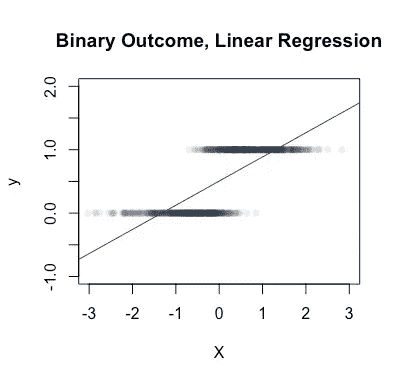
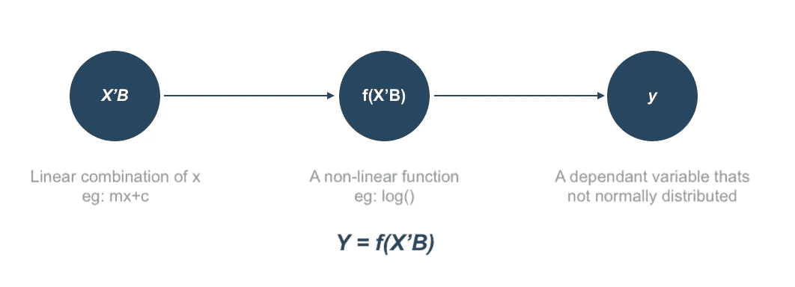

# 二元逻辑回归——理解可解释的人工智能

> 原文：<https://towardsdatascience.com/binary-logistic-regression-understanding-explainable-ai-c79208bb3ca9?source=collection_archive---------19----------------------->

可解释的人工智能或 XAI 是人工智能的一个子类，其中模型做出的决定可以由人类来解释，这与“黑盒”模型相反。随着人工智能从纠正我们的拼写和定向广告转向驾驶我们的汽车和诊断病人，验证和证明得出的结论的需求开始得到优先考虑。”

在我的上一篇关于可解释的人工智能(XAI)的故事明显受欢迎之后，是时候解决一个类似透明但有用的算法了，逻辑回归。逻辑回归属于“广义线性模型”的快乐家族，它给线性回归的直线增加了一层复杂性。

A Plain / Vanilla Linear Model

通过数据点拟合直线在许多情况下都很有效，其中 *x* 和 *y* 可以在合理的范围内取任何值，例如根据体重或教育收入预测身高。然而，在某些情况下，感兴趣的变量是二进制的，只取两个值。例如，预测某人是否会对他们的保险提出索赔，或者如果你的产品做了广告，客户是否会购买，这可能是有用的。在这种情况下， *y* 取值 0(事件不会发生)或 1(事件发生)。

当我们在这种类型的问题上使用线性回归时，我们会预测超出[0，1]范围的 *y* 的值，这使得对结果的解释令人困惑，甚至毫无意义。

一个更好的模型应该能够调整 y 的分布，并且只提供有意义的预测。这就是广义线性模型的目的。

函数 f()被恰当地命名为' *link* 函数，将 X'B 的线性规格与非线性变量 *y 联系起来。*这里明显的限制是假设 X 变量的一个*线性*组合足以解释 *y* 。

对于二元结果情况，我们将使用 Logit 函数，其结果如下:

Logistic regression with the same data as above

与简单的线性模型不同，逻辑回归中的参数 B 没有封闭解。相反，我们必须像在深度学习场景中拟合权重一样拟合它们——通过迭代改进。这需要两件事；衡量 B 有多“好”的标准，以及提高 B 的方法。

## B 有多好？

我们采用“可能性”方法来评估 B，估计我们的模型成为生成数据的“真实模型”的可能性或概率。从数学上讲，我们找到了观察我们拥有的数据的概率，给定了参数。对于 *y* 和 logit 函数 *S()* 的单次观察，该概率由下式给出:

当参数 B 对 y 给出更准确的预测时，概率会更高。这个等式的直觉给出如下:

dodgy truth table

通过假设每个观察是独立的，我们可以将整个数据集的概率计算为所有观察水平概率的乘积，我们称之为可能性， *L()* 。

显然，为了优化目的而寻找 L 的导数是不切实际的，因此通常的做法是取似然函数的对数来得到 L()。

The nicely simplified version

取对数是有效的，因为我们主要关心不同 B 规格的相对可能性水平，而不是值本身。由于 *log(x)* 在 *x* 中总是增加的，如果一个规格的可能性比另一个大，那么它的对数可能性也会大。这种形式允许我们分别定义 *l，l’*和*l”*的一阶和二阶导数，同时仍然给我们一个 was 来量化*一组参数在拟合数据方面有多“好”。*

## *如何让 B 变得更好*

*有许多算法可以找到最佳 B 值，其中大多数算法的目标是找到使对数似然函数 *l* 最大化的 B 值。这些算法是“爬山”，因为它们找到了函数的最大值，这与试图找到最小损失函数的深度学习技术相反。*

*一种这样的技术是牛顿-拉夫森方法，该方法寻找函数 F 的根(当函数等于零时)。通过应用以下规则，每次迭代我们都稍微接近 F 的根:*

**

*使用一些高中微积分，我们知道我们的对数似然函数在导数等于零的地方有最大值。用 l '代替 F，我们就剩下爬山算法了:*

**

*值得庆幸的是，所有这些公式，包括 l 的导数，都可以用矩阵形式表示，从而加快了计算速度。(这个项目的代码和包含的*乐趣* *线性代数*可以在这里[访问](https://github.com/Gholtes/Logistic-Regression/blob/master/mainBinaryModel.py)。)*

## *结果*

*逻辑模型的结果很容易解释，预测值 *y = S(X'B)* 是 *y* 取值为 1 的概率，因此是事件发生的概率。*