# 生物信息学工作流管理系统

> 原文：<https://towardsdatascience.com/bioinformatics-workflow-management-systems-cc3edd97be79?source=collection_archive---------6----------------------->

## 介绍 Unipro UGENE 来模拟生物信息学工作流

随着从生物获取数据的各种方法的发展，易于使用的生物数据激增。然而，如果没有适当的方法来执行一系列步骤，按照我们想要的那样处理数据，输出想要的结果，那么如此大量的数据将毫无用处。这就是**工作流管理系统**派上用场的地方。

在进一步深入之前，让我解释一下今天的大纲。我将带您浏览本文的以下部分。

1.  什么是工作流？
2.  什么是工作流管理系统？
3.  什么是生物信息学工作流管理系统？
4.  Unipro UGENE


Image Source: [PublicDomainPictures](https://pixabay.com/users/PublicDomainPictures-14/) on [pixabay](https://pixabay.com/illustrations/microbiology-cell-gene-dna-163470/) (CC0)

我不会深入讨论如何创建生物信息学工作流，但我会解释工作流管理系统，并向您介绍 *Taverna* ，一个被生物信息学家广泛使用的工作流管理系统。

# 什么是工作流？

一个**工作流**由一组活动组成，这些活动是由转换材料、提供服务或处理信息的资源的系统化组织实现的。它可以被描述为完成一个过程的一系列操作。


Example Workflow (Image Source: [YouTube](https://i.ytimg.com/vi/JVNDvhA0G50/maxresdefault.jpg))

# 什么是工作流管理系统？

一个**工作流管理系统** ( **WMS** )是一个软件，它提供了建立、执行和监控科学工作流的基础设施。

工作流管理系统的出现解决了如何在大量异构数据上执行和自动化复杂流程的问题。他们以**工作流程图**的形式可视化工作流程，描绘输入、输出、服务和数据流。它们还允许保存用于发布和共享的工作流。

# 什么是生物信息学工作流管理系统？

**生物信息学工作流管理系统**是工作流管理系统的一种特殊形式，专门设计用于组成和执行一系列与生物信息学相关的计算或数据操作步骤。

这种系统以有向图的形式显示了计算的抽象表示以及它是如何进行的。图中的每个节点代表一个要执行的任务，每个边代表不同任务之间的数据流或执行依赖关系。该系统提供了一个可视化的前端，允许用户在很少或没有编程专业知识的情况下建立和修改不同的工作流。

一些著名的生物信息学工作流管理系统包括，

*   [阿帕奇小酒馆](https://taverna.incubator.apache.org)
*   [银河](https://galaxyproject.org)
*   [Unipro UGENE](http://ugene.net)


Taverna Workbench (Image Source: [Apache Taverna](https://taverna.incubator.apache.org/introduction/))

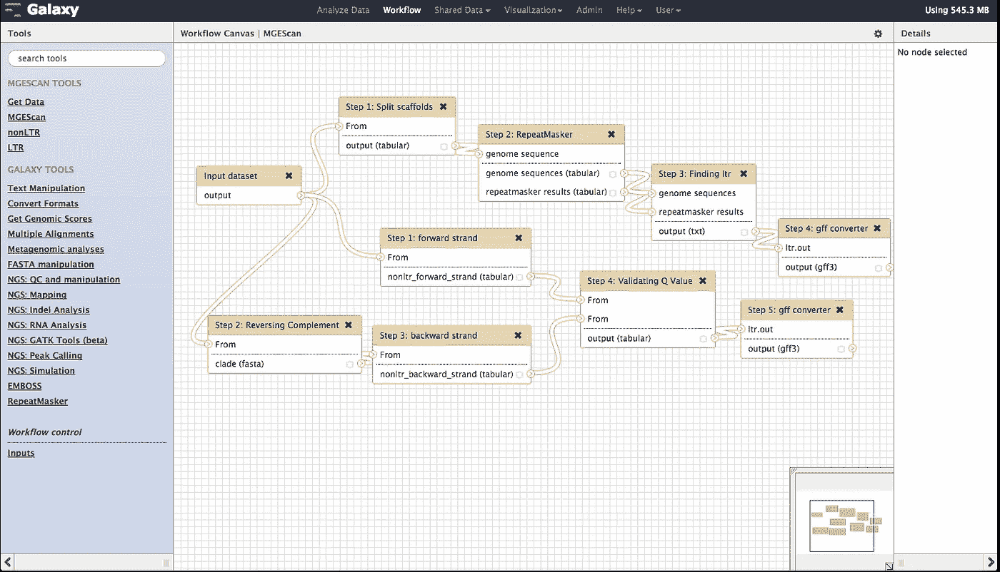

Galaxy (Image Source: [MGEscan](http://mgescan.readthedocs.io/en/latest/workflow.html))


A simple workflow I drew using Unipro UGENE

# Unipro UGENE

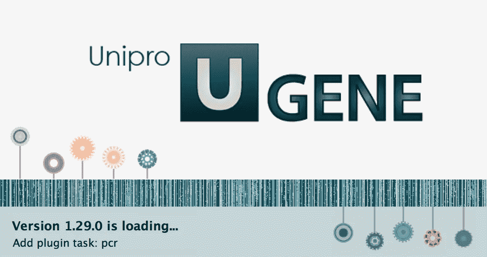

UGENE Loading Screen

**Unipro UGENE** 是一款免费开源的跨平台生物信息学软件。它允许您使用**工作流设计器**查看、编辑、注释和排列 DNA、RNA 和蛋白质序列，使用 3D 结构和表面算法工作，并模拟工作流。你可以从[这里](https://ugene.net/wiki/pages/viewpage.action?pageId=2523425)阅读更多关于 UGENE 的细节。

你可以从[这里](http://ugene.net/download.html)下载 Unipro UGENE。下载安装程序后，请在安装前遵循 readme.txt 中给出的步骤。确保复制下载中提供的示例文件夹，其中包含不同格式的示例文件。

一旦安装并打开应用程序，您将看到如图 1 所示的**起始页**。(我之前打开过一个文件，你可以在最近的文件下看到。如果你第一次打开 UGENE，你不会在这里看到任何文件。)

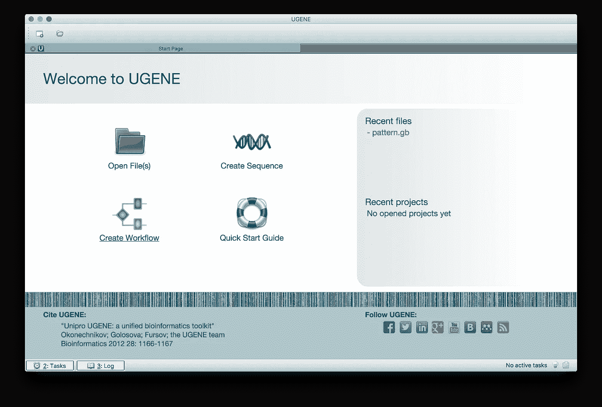

Figure 1

## 使用 UGENE **工作流设计器**构建简单的工作流

**UGENE 工作流设计器**允许创建和运行复杂的计算工作流，即使他或她不熟悉任何编程语言。

我们将从构建一个简单的工作流开始；在一个或多个序列中查找给定的模式，并将其保存为注释。

点击**起始页**中的**创建工作流**选项。你会看到如图 2 所示的工作流设计区域。

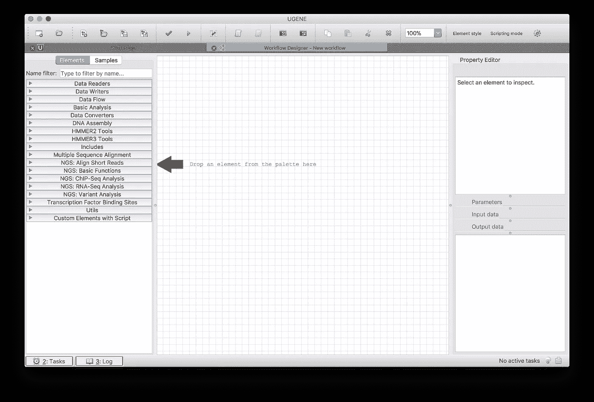

Figure 2

拖放**元素列表中的**基本分析**部分中的**元素，如图 3 所示。


Figure 3

现在将**数据读取器**部分的**读取序列**组件添加到元素列表中，如图 4 所示。

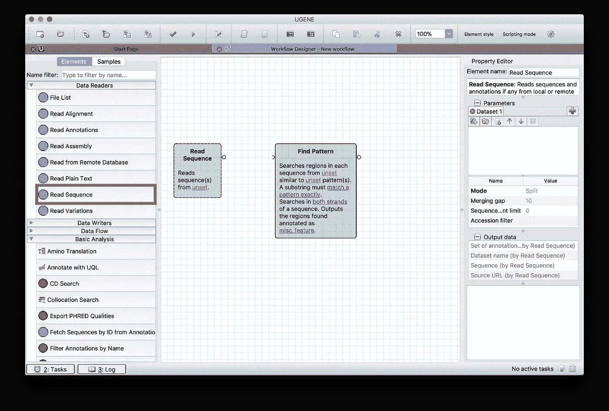

Figure 4

点击**读取序列**组件上的循环标记，将其拖动到**查找模式**元素上的半循环标记上，如图 5 所示进行连接。


Figure 5

现在类似地，从元素列表中的**数据写入器**部分添加**写入序列**组件，并将其连接到**查找模式**元素。最终的工作流应该如图 6 所示。

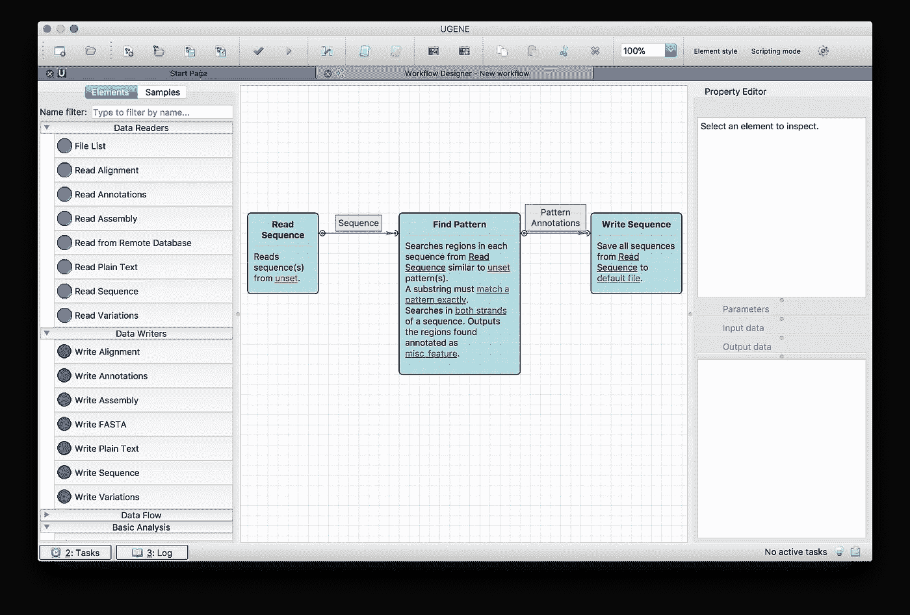

Figure 6

现在我们必须定义包含输入序列的文件。为此，点击**读取序列**组件中的单词**取消设置**，您将在屏幕右侧的**属性编辑器**中看到其详细信息。在**数据集 1** 下，点击**添加文件**图标。参见图 7。

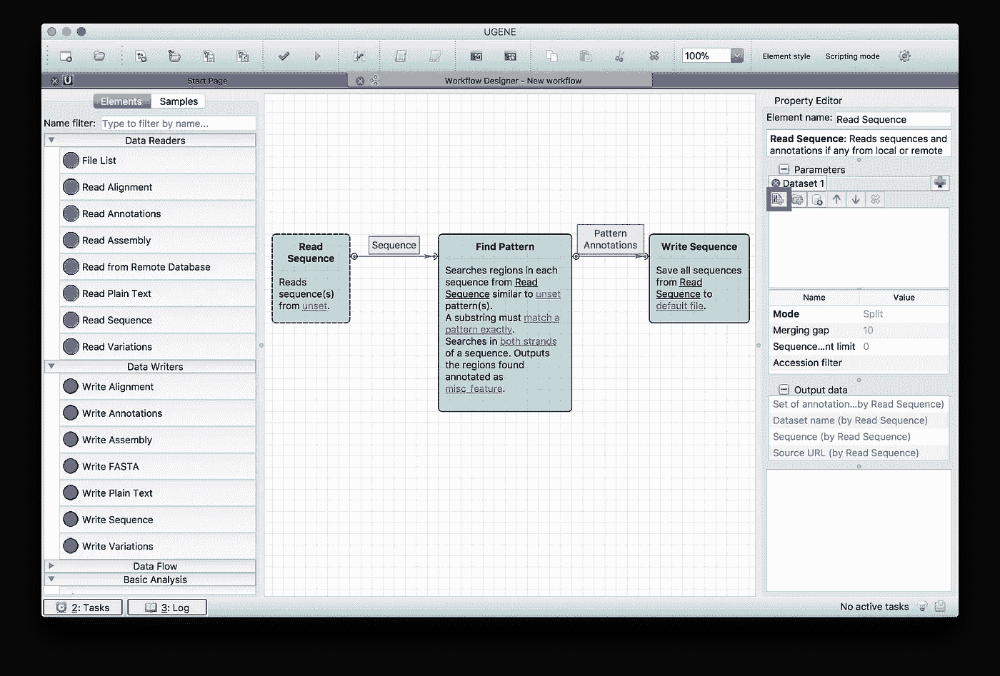

Figure 7

您将看到示例文件夹已打开。在本例中，我们将在给定的路径中选择以下文件。参见图 8。

```
samples → Genebank → murine.gb
```


Figure 8

现在我们必须定义我们想要找到的模式。点击**查找模式**组件中的单词**取消设置**，您将在屏幕右侧的**属性编辑器**中看到其详细信息。在**参数**下，输入您想要匹配的模式，作为**注释为**部分下**模式**的值。参见图 9。我使用了以下模式。

```
TTCCGAGGGACACTAGGCTGACTCCATC
```

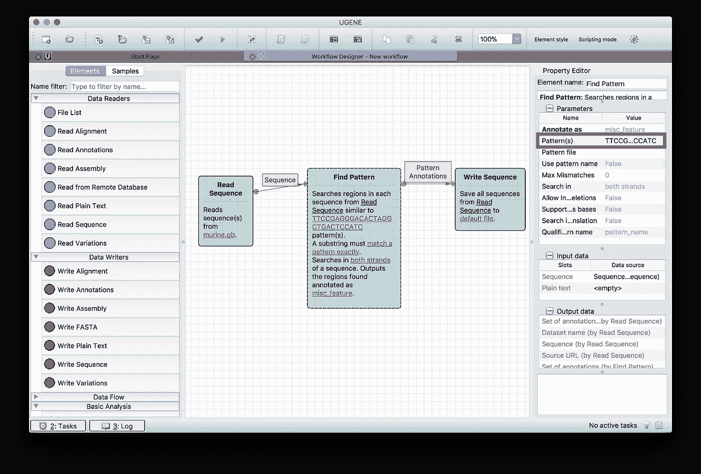

Figure 9

我们的最后一步是定义输出文件。点击**写序列**组件中的**默认文件**，您将在屏幕右侧的**属性编辑器**中看到其详细信息。在**参数**下，输入输出文件名为 ***pattern.gb* 至**输出文件**的值。将输出文件**的**文件格式更改为 **GeneBank** 。最终值应该如图 10 所示。**

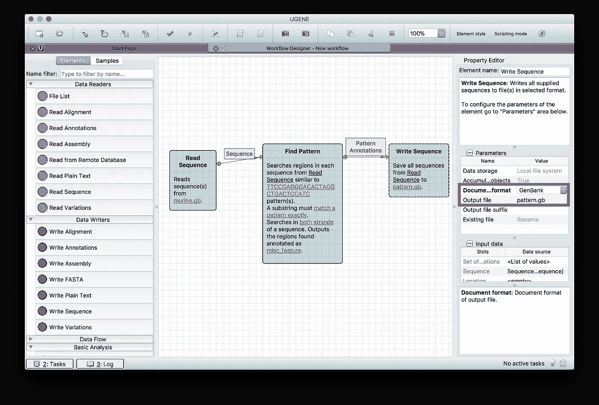

Figure 10

现在，您可以通过点击工具栏中的**运行工作流程**按钮来运行工作流程，如图 11 所示。

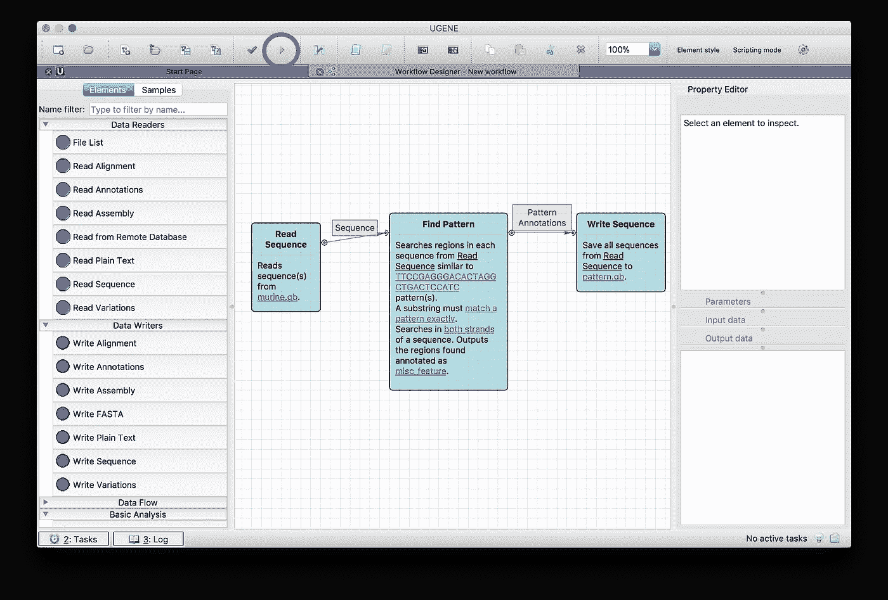

Figure 11

如图 12 和图 13 所示，将会显示一个包含所有工作流执行信息的报告。


Figure 12

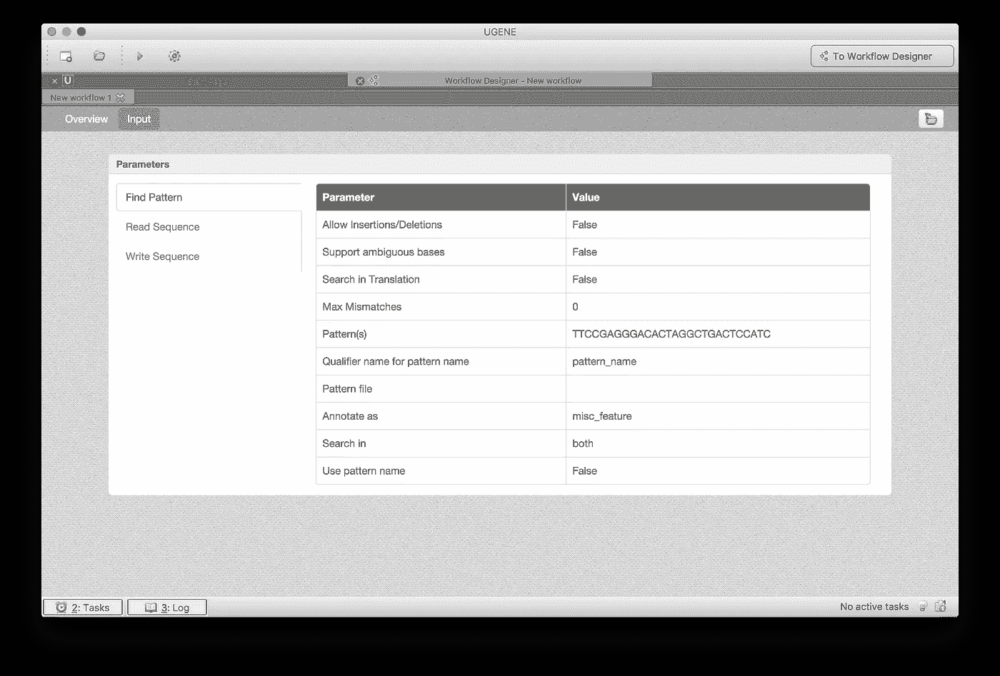

Figure 13

可以打开结果文件( ***pattern.gb*** )进行查看，如图 14 所示。


Figure 14

您可以使用该工具，查看其他可用的组件，创建工作流并运行它们。

希望你已经对生物信息学工作流管理软件有了一个基本的概念，可以开始实验了。

干杯！😊