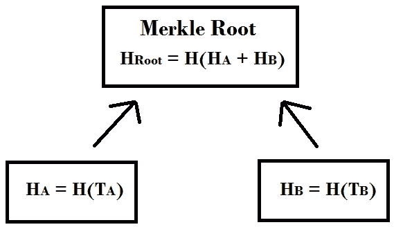

# 比特币:数学原理是什么？

> 原文：<https://towardsdatascience.com/bitcoin-whats-the-math-ebbae3be37a3?source=collection_archive---------5----------------------->

Bitcoin- will it replace fiat currency? How does the math work? And where can I get one of those physical coins?

大约 6 个月前，我偶然发现了比特币，这要感谢一位朋友，她自己开了一家使用区块链技术的公司。我以前听说过比特币——我的大致想法是“比特币是我哥哥在我高中时用来挖矿的虚拟货币。”像大多数人一样，除此之外我不知道太多。

真正引发我兴趣的是我意识到比特币和其他数字货币是密码学的一个伟大应用(因此得名“加密货币”)，这是一个我一直非常着迷的领域。对我来说，密码学是在现实世界中使用数学的完美方式。意识到这一点后，我决定研究比特币背后的数学原理。

尽管我读了无数的文章，包括最初的中本聪白皮书，我仍然努力寻找一个资源来回答这个基本问题:数学是什么？我能找到的最好的文章是讨论椭圆曲线加密和用于比特币的特定参数的文章。这并没有让我满意。

按照朋友的建议，我拿到了一本安德里亚斯·安东诺普洛斯的《 [*《掌握比特币:编程开放区块链*](https://www.amazon.com/Mastering-Bitcoin-Programming-Open-Blockchain/dp/1491954388) 》。这本书对我来说真的把所有的东西都集合在一起了。我强烈推荐！

我希望这篇博文能从数学的角度帮助你理解比特币协议和比特币区块链。我首先假设你熟悉比特币，其次假设你有数学知识。对于那些不太熟悉的人，我会在下面留下解释数学主题的链接。

## **区块链与挖掘** : SHA256，Merkle Trees

人们普遍认为采矿的目的是发行新的货币。实际上，挖掘就是对交易进行验证的过程。采矿允许对区块链的状态进行分散的全网络共识，这就是这项技术如此特殊的原因。发行新货币是诱因。

尽管货币发行是动机而不是目标，我们将从采矿和“创造”新 BTC(或 XBT)开始我们的讨论。从这里，我们将看看这种货币是如何“花费”的，以及其中涉及的数学。

假设爱丽丝有一个挖掘节点，它实际上只是一个计算机程序。挖掘器的目标是构造一个新的块，并解决一个计算量很大的密码难题，使得这个新的块可以被网络接受，并被合并到区块链中。在解决这个密码难题后，爱丽丝的矿工将“获胜”并获得一笔支付(截至本文撰写时，目前为 12.5 BTC)，支付到她的比特币地址。Alice 还将收取新开采区块中所有交易的费用。

Alice 采矿的第一步是验证区块链的最新区块。让我们把这个最近的块称为 A。在验证了 A 中的事务后，Alice 的挖掘程序将为链中潜在的下一个块构造一个标题。我们称这个块为 b，新块的头有 6 个字段:版本、*前一块哈希*、 *Merkle 根*、时间戳、*目标*和*无*。这里有大量斜体的数学内容需要解开。

## *前一个块哈希:double-SHA256*

如果 Alice 的 miner 想要查找区块链中的任何区块，有两种方法可以实现。第一种方法是参考块的高度。第二种方法是计算块 ID，其中块 ID = double-SHA256(块头)。块 ID 也是先前的块散列。例如，假设 A 的块 ID 是 A' = double-SHA256(blockIDA)。然后，对于扩展区块链的块 B，其字段“先前块散列”被设置为等于 A’。这将块链从块 A 扩展到块 B，块 B 是子块，而块 A 是父块。这也是爱丽丝的矿工如何使用其采矿权力来“投票”区块 A 作为链中最近的区块。

## *Merkle root:一个概念本身，和 double-SHA256*

Merkle 根是 Merkle 树中的最终散列。简而言之，Merkle 树是一棵二叉树，其中每个父节点都是其子节点的散列。这是在比特币中通过递归计算 double-SHA256 对节点构建的，直到树中只有一个哈希，这就是 Merkle 根。以比特币为例，每个子代都包含交易信息，因此 Merkle 根在一个块中汇总所有交易。

A simple figure of creating a Merkle Root. The hash function H is double-SHA256, with the transactions (T) as the inputs. Thanks Paint for helping me make this beautiful figure!

## *目标和随机数*

目标是所有挖掘节点共享的 256 位数字。挖掘的目标是找到一个 nonce(一个从 0 开始的一次性使用数)，使得头和 nonce 的散列(SHA256)一起小于或等于目标。目标每 2016 块更新一次。

继续我们的示例，Alice 的 miner 想要包括区块链中的新区块 B。目标是找到一个随机数，使得:

sha 256(B+nonce 的报头)< = target。

找到这个 nonce 的计算量非常大，但是由于这个 hash 函数的性质，很容易验证。找到这个随机数就证明了一个矿工完成了要求的工作量，也就是“工作量证明”一旦发现 nonce，Alice 的 miner 就会将 B 的信息传播到整个比特币网络。一旦足够多的矿工验证了包括在 B 中的交易是真实的，那么 B 是链中的下一个块，并且爱丽丝将把她的 12.5 BTC 的支付加上交易费收集到她的钱包中。网络中的所有矿工，包括 Alice 的矿工，然后将构造新的块 C，其中先前的块散列字段引用 b 的 ID。

关于工作证明的一个注意事项:重要的是密码难题(即找到一个小于目标值的散列值)必须是计算开销很大的。如果不是，那么一个拥有相当于 51%网络计算能力的不诚实的人可以重写交易以支付到他们自己的钱包，然后将这个块包括在链中。(然而，随着这一开支的增长，它就成了问题，这是另一篇文章的主题。有新的协议试图解决这个问题！)

现在我们在爱丽丝的钱包里有 12.5 BTC。接下来我们将看看她是如何花费的，这里涉及到数学。

## 总结这一部分，数学是:

*   Double-SHA256(块头)创建块 A 的 ID，它将位于新块 B 的前一个块哈希字段中，其中 B 是 A 的子块。
*   Merkle 树并递归地执行 double-SHA256 来创建汇总块中所有事务的 Merkle 根。
*   块头和 nonce 的 SHA256，以执行验证块中所有事务所需的工作证明，并找到小于或等于目标的散列。一旦发现该随机数，该块将被包括在区块链中。

## **交易和钱包** : ECDSA，RIPEMD160，SHA256

比特币使用公钥加密技术进行交易，特别是基于离散对数问题的椭圆曲线数字签名算法(ECDSA)。

## *钱包:像钥匙扣*

比特币钱包并不包含真正的比特币。相反，它包含指向公共分类账(区块链)上的交易输出的键。只有拥有相应私钥的人才能“消费”与接收者钱包地址相关的比特币。

## *交易:认证*

让我们继续我们的例子。假设爱丽丝想给她的朋友鲍勃发送 1 BTC。Alice 将使用她的钱包构建一个交易，将这 1 个 BTC 发送到 Bob 的公共钱包地址。这个交易就是信息。Alice 将使用她的签名(r，s)对消息进行签名，以提供真实性，并且这将被传播到网络。任何对等体都可以通过使用 Alice 的公钥来验证她的身份，该公钥与她的钱包地址相关联。换句话说，该过程如下:

设 D =爱丽丝的私钥，E =爱丽丝的公钥，M =事务。
1。Alice 的 wallet 构造了 M，它向 Bob 的公共地址发送了 1 个 BTC。
2。爱丽丝用符号 M 表示出 M' = D(M)。
3。任何对等体都可以通过执行 E(M') = M 来验证 Alice 的真实性。

现在鲍勃怎么花掉爱丽丝给的这 1 个比特币呢？当 Alice 构造 M 时，她实际上是在构造一条消息，该消息说“我将把 1 BTC 给拥有对应于这个公共地址(在本例中是 Bob 的地址)的私钥的任何人。”为了让 Bob 花掉这笔钱，他的钱包将构建一个新的交易，他将用他的签名(r’，s’)来签名，该签名是从只有他有权访问的私钥(根据椭圆曲线加密)中导出的，并且该过程继续。

比特币所做的是使用 ECDSA 来授予发送者真实性，这种认证是“花费”比特币所需要的。比特币交易不需要加密，因为每笔交易都传播到网络，并指定接收者的公共地址，这是匿名的。

## *创建比特币地址*

按照椭圆曲线加密法，公钥是从私钥生成的，而比特币地址是从这个公钥创建的。

私钥 k 在[1，n-1]的范围内，其中 n 是椭圆曲线的阶。比特币协议中使用的特定椭圆曲线是 secp256k1，它指定了椭圆曲线的系数以及生成器 g。创建比特币地址的步骤如下:

1.私钥 k 是随机生成的。
2。公钥 K = k * G，其中 G 是生成器。
3。钱包地址 A = RIPEMD160(SHA256(K))。
4。地址 A 是 Base58Check 编码的，以产生' =前缀|| A ||校验和，这是最终的钱包地址(“||”表示串联)。

Base58Check 是 Base58 和校验和的组合，Base58 是一组字符{大写，小写，数字} \ {0，O，I，l}。特定校验和是 double-SHA256 输出的前 4 个字节(前缀+ A)，在这种情况下前缀为 0。最终的 Base58Check 编码地址 A' =前缀|| A ||校验和。

The elliptic curve with the parameters of secp256k1, over the real numbers. Yay math!

## 总之，这部分的数学公式是:

*   ECDSA 来“花”比特币，签名为(r，s)。
*   椭圆曲线加密从私钥 K 生成公钥 K。
*   RIPEMD160 和 SHA256 一起被称为 HASH160，并使用 Base58Check 编码从公钥 k 中产生一个比特币钱包地址。

## **结论**

当我第一次开始钻研比特币的数学时，我只知道它在某些方面使用了椭圆曲线加密。我不知道如何使用 ECC 是在交易中，发行货币，还是什么？最后，我清楚地了解了数学是如何被用来让比特币和区块链成为如此强大的颠覆性技术的。

Math 用于验证交易(挖掘)、进行交易，以及创建向其发送交易的钱包地址。双 SHA256 用于识别区块并将交易汇总到 Merkle 根中，单 SHA256 用于证明采矿期间的工作。ECDSA 用于“签署”交易。RIPEMD160 和 SHA256 与 Base58Check 编码一起用于创建钱包地址。现在一切都说得通了！

## **资源**

对于那些想了解更多细节的人，无论是第一次，还是只想回忆一下:

维基百科和比特币维基:

公钥密码学:【https://en.wikipedia.org/wiki/Public-key_cryptography
椭圆曲线密码学:[https://en.wikipedia.org/wiki/Elliptic-curve_cryptography](https://en.wikipedia.org/wiki/Elliptic-curve_cryptography)
椭圆曲线数字签名算法:[https://en . Wikipedia . org/wiki/Elliptic _ Curve _ Digital _ Signature _ Algorithm](https://en.wikipedia.org/wiki/Elliptic_Curve_Digital_Signature_Algorithm)(在我看来比 bitcoinwiki 页面好多了)
secp 256k 1:[https://en.bitcoin.it/wiki/Secp256k1](https://en.bitcoin.it/wiki/Secp256k1) sha 256:[https://en.wikipedia.org/wiki/SHA-2](https://en.wikipedia.org/wiki/SHA-2)
ripe md160:[https://en.wikipedia.org/wiki/RIPEMD](https://en.wikipedia.org/wiki/RIPEMD)

书籍:

威廉·斯塔林斯的《密码学与网络安全》:一本非常棒的密码学书籍。我把它推荐给任何有兴趣钻研数学的人。它甚至提供了数论的介绍，所以如果你是第一次学习这类东西，这是很棒的。
[安德烈亚斯·安东诺普洛斯《掌握比特币》](https://www.amazon.com/Mastering-Bitcoin-Programming-Open-Blockchain/dp/1491954388):必读！

*最初发表在我的个人网站上，*[*Serena . MC donnell . ca .*](http://serena.mcdonnell.ca)