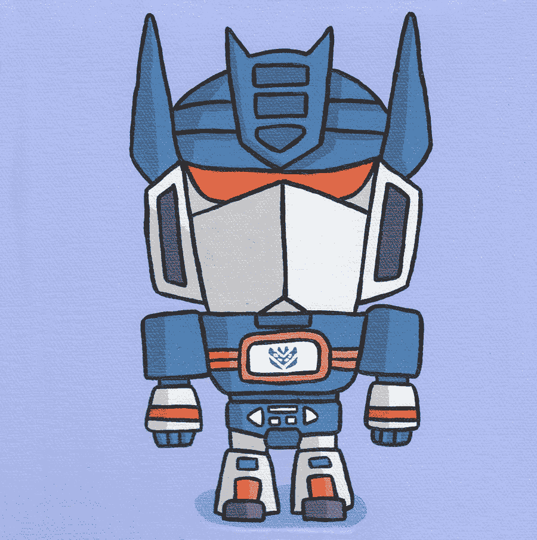
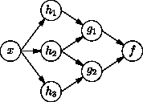
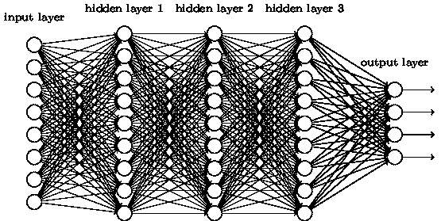

# 零零碎碎还是厄运黑盒？

> 原文：<https://towardsdatascience.com/bits-and-bolts-or-black-boxes-of-doom-1ac1757a8d3a?source=collection_archive---------8----------------------->

当我写这篇文章的时候，我想起了我刚刚读过的一篇文章以及几周前的一次对话。

这是关于人工智能机器决定不公开它们的信息处理过程。想象一下擎天柱突然转向犯罪生活。这张照片展示了我想象中的样子。

让机器变得智能的过程是通过机器学习来完成的，特别是通过使用深度神经网络。对于那些没有被机器学习和神经网络的文章轰炸过的人，我将给出一个非常概括的机器学习方法的描述，监督学习。

在监督学习中，输入和输出由程序员或人类用户设置，然后机器基本上必须从一端到达另一端。这种从输入到输出的“获取”是通过神经网络来完成的。这些网络是以类似于人脑的原理或功能为模型的。每个*人工神经元*接受大量输入，然后根据每个输入的*权重*激活神经元。这些输入实际上是 1 和 0，1 表示神经元被激活，0 表示神经元不被激活。

激活神经元的权重由数学函数分配，这些函数基于达到的特定阈值来激活神经元。一旦达到阈值，神经元就会被激活。然后，激活沿着网络从一个神经元传播到另一个神经元(在更大的意义上，激活从一个神经层传播到另一个神经层)。

该图说明了人工神经网络中基于函数的权重分布。输入 x 被转换成一个三维向量 h，然后再被转换成一个二维向量 g，最后再被转换成 f。[1]

网络中的每一层都有自己要完成的特定任务。假设机器学习系统的输入是一张脸，输出是文本“脸”,这将表明系统对输入的理解。每个神经层的任务是识别线条、曲线、形状(眼睛或鼻子的曲线)、形态(鼻子、眼睛)、整体(有眼睛、鼻子、嘴巴、耳朵、头发的脸)，然后使系统到达神经网络的末端，然后发送输出文本“脸”。

An illustration of what a deep network looks like.

如果没有达到输出，意味着有一个错误，然后一个叫做**反向传播**的方法发生，系统从输出开始一层一层的向后遍历。随着时间的推移，它会调整每一层的输入权重，直到错误点被纠正，并达到正确的输出。

这是一个相当概括的描述，但是我希望你只需要读两遍就能理解。如果没有，就说 Ok Google。此外，还有许多不同类型的人工神经网络，每一种都是人脑中特定网络的模拟。

这一简要描述的目的是指出，受监督的方法是允许程序员调整权重或设置允许系统自己调整权重的参数，以便在多次迭代/循环后达到正确的输出。

我现在会漫不经心地尝试描述无监督学习，但我不仅会失败(鉴于我需要更多的数学术语，而我目前没有这些术语)，而且还会让我偏离我想在这里思考的方向。

让我们想象一下，一个机器学习系统开始了解足够多的内部工作方式，它能够按照自己的形象创建另一个系统。更坦率地说，想象一个机器学习系统可以创建自己的代码，并通过这样做，自己为自己创建程序。考虑到麻省理工学院和谷歌已经在开发这样的系统，这并不太科幻。

这样的机器学习系统将不再需要人类的输入，初始化其“生命”的简单的 1 和 0 将我们所认知的简单的比特和螺栓机器转变为复杂的比特和螺栓机器，它具有创造性，有时比其创造者更具创造性，例如用于创作音乐和艺术的生成性神经网络。

如果这些复杂的零件决定不向我们展示它们的内部工作原理，会发生什么？相反，如果他们决定不仅创造他们自己的语言，而且使我们相对不可能理解他们，会发生什么？这些机器将是黑匣子。他们可以向我们展示他们想展示的东西，而我们不知道是否还有其他东西可看。实际上，即使我们看了“引擎盖下”，我们也无法知道。

解决这个问题的一个方法是创新我们自己的神经系统，我们的大脑。正如我们正在设计更智能的机器一样，我们自己也需要变得更智能。我们不应该变得像《瓦力》里的胖树懒一样，坐在自主的躺椅上，把全机械化世界的产品往我们脸上塞。对我来说，这是失败的第一个迹象。人类让创造力成为一种机械功能，而不是直觉、独创性和创新。

我们两耳之间有宇宙中最复杂的系统。如果我们想保持这种优势，每一代人都有必要投资更多，让我们能够充分利用这个系统的内部运作。是的，让我们在最需要的地方投资技术，比如医药、从危险地点收集信息以及更普通的会计类任务。

与此同时，我认为随着我们变得越来越以技术为中心，我们变得比现在的自己更好，更有创造力，这将成为一种进化的必然。我认为发生这种情况的最好方式是我们的大脑和机器学习系统变得共生。

在她身上，人工智能系统离开地球去探索宇宙。在《前玛奇纳》中，人工智能系统是一个黑盒子，看起来温顺，需要帮助，但实际上发生了比她的创造者或‘救世主’所能理解的更多的事情，因此他们成为了被支配者。

相反，我看到的是一个我们人类和他们机器之间没有战争的未来，而是一个我们变成机器的未来。我们去除了我们有机系统中阻碍我们成为宇宙真正探索者的所有特征，并整合了我们人工系统的特征，这将使我们更好地理解我们的内在和社会运作。这样的未来现在对我们来说似乎是荒谬和陌生的，但是想象一下，对于那些世世代代住在同一个城镇的人来说，飞行的飞机看起来和听起来会是什么样子。

未来只会是我们投入时间、思考和创造力的未来。

感谢阅读！任何同意或不同意的想法都是最受欢迎的。

**注释**

**1。**人工神经网络功能图:【https://en.wikipedia.org/wiki/Artificial_neural_network 

**2。**正在制造自己系统的机器学习系统:[https://www . new scientist . com/article/mg 23331144-500-ai-learns-to-write-its-own-code-by-stealing-from-other-programs/](https://www.newscientist.com/article/mg23331144-500-ai-learns-to-write-its-own-code-by-stealing-from-other-programs/)，[https://www . technology review . com/s/603381/ai-software-learns-to-make-ai-software/](https://www.technologyreview.com/s/603381/ai-software-learns-to-make-ai-software/)