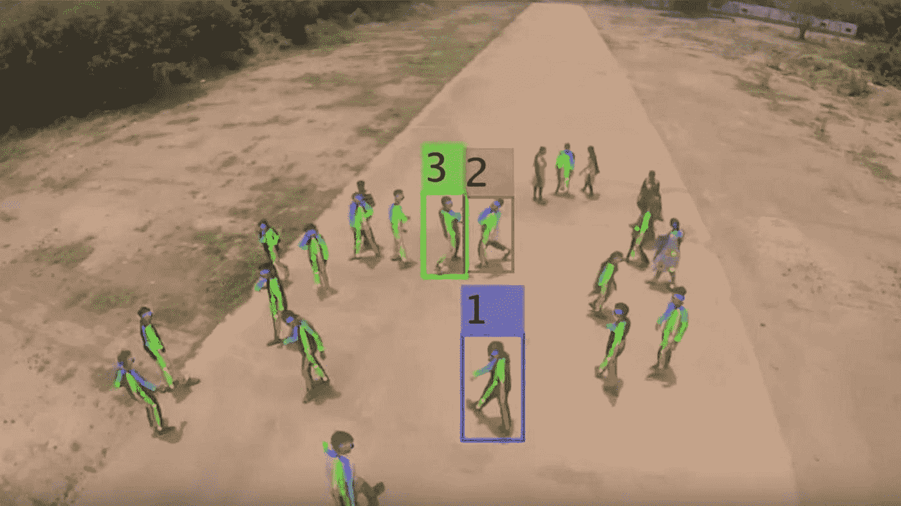

# 宝马机器学习周刊—第 12 周

> 原文：<https://towardsdatascience.com/bmw-machine-learning-weekly-week-12-9187154a777f?source=collection_archive---------8----------------------->

## 2018 年 6 月 7 日至 6 月 20 日

*关于机器学习(ML)、人工智能(AI)及相关研究领域的新闻。*

# 透过墙壁看人

麻省理工学院的计算机科学和人工智能实验室(CSAIL)开发了一种无线智能家居系统，可以通过墙壁感知人们。人工智能系统是利用无线电信号和人们走动的视频片段进行训练的。这使得使用神经网络生成简笔画来显示人们在墙后做什么成为可能。该系统还可以可靠地区分不同的人。该团队表示，项目“ [RF-Pose](http://openaccess.thecvf.com/content_cvpr_2018/CameraReady/2406.pdf) ”可用于监测帕金森氏症、多发性硬化症(MS)和肌肉萎缩症等疾病，从而更好地了解疾病的进展，并允许医生相应地调整药物治疗。它还可以帮助老年人更加独立地生活，同时为跌倒、受伤和活动模式的变化提供额外的安全监控。该团队目前正在与医生合作，探索 RF-Pose 在医疗保健方面的应用。

[继续阅读……](http://news.mit.edu/2018/artificial-intelligence-senses-people-through-walls-0612)

# 无人机发现人群中的暴力

“天空之眼”是剑桥大学和印度国家理工学院和科学研究所的一个研究项目，使用无人机来发现人群中的暴力。使用的无人机是一个标准的 Parrot AR 2.0，其摄像头提供了一个人工智能分散网络平台，提供了必要的现场镜头。ScatterNet 的深度学习网络从那里开始:它可以有效地估计每个检测到的人的姿势。一旦做到这一点，它就可以区分帧中潜在的暴力对象和人群中正常移动的对象。该项目仍处于早期阶段，因为据报道，每增加一个人群成员，检测的准确性都会受到很大影响。虽然该系统声称可以以超过 94%的准确率识别 10 人组中的暴力个人，但一旦人群中有两个这样的人，准确率就会下降到 90.6%，如果有五个，准确率就会下降到 84%。

[继续阅读……](http://www.thedrive.com/tech/21374/eye-in-the-sky-research-project-uses-drones-to-spot-violence-in-crowds)

# ML 能识别有趣的数学吗？

数学的奇妙特性之一是它的美。但是数学家所说的美到底是什么意思却很难捕捉到。也许最著名的例子是欧拉关系，eiπ + 1 = 0，它揭示了看似不相关的数学领域之间的深刻联系。其他迷人的整数序列还有[质数](http://oeis.org/A000040)，只能被自己和 1 整除的数；或者是[斐波那契数列](http://oeis.org/A000045)，其中每一项都是前两项之和。这也指出了数学美的另一个组成部分:数学模式一定在某些方面很有趣。识别这些有趣的模式一直是人类独有的能力。但是最近几年，机器已经成为非常强大的模式识别工具。事实上，它们已经开始在人脸识别、物体识别以及各种游戏角色方面超越人类。[这提出了一个有趣的可能性](https://arxiv.org/abs/1805.07431):机器学习算法能识别数学中有趣或优雅的模式吗？他们甚至可能是数学美的仲裁者吗？

[继续阅读……](https://www.technologyreview.com/s/611272/this-algorithm-can-tell-which-number-sequences-a-human-will-find-interesting/)

# 逆转狗的衰老

世界上最有影响力的合成生物学家，哈佛医学院的乔治·丘奇，是一家新公司的幕后策划者，该公司计划利用基因疗法使狗返老还童。如果成功，他计划在人身上尝试同样的方法，他可能是第一批志愿者之一。该公司已经对比格犬进行了初步测试，声称它将通过给动物的身体添加新的 DNA 指令来使它们变得“更年轻”。它的年龄逆转计划建立在简单生物如蠕虫和苍蝇的诱人线索上。调整他们的基因可以让他们的寿命延长一倍甚至更多。其他研究表明，给老老鼠输年轻老鼠的血可以使一些生物标志物恢复到年轻水平。“我们已经在老鼠身上做了一系列试验，我们也在狗身上做了一些，然后我们会转移到人类身上，”丘奇今年早些时候告诉播客 Rob Reid。该公司的其他创始人、首席执行官丹尼尔·奧利弗和科学带头人诺亚·戴维森(Noah Davidsohn)拒绝接受本文采访，他是丘奇庞大的波士顿实验室的博士后。

[继续阅读……](https://www.technologyreview.com/s/611018/a-stealthy-harvard-startup-wants-to-reverse-aging-in-dogs-and-humans-could-be-next/)

# 值得注意的

*   **解魔方**
    加州大学分校[研究人员的深度学习算法已经教会自己在没有任何人类帮助的情况下解魔方。与国际象棋不同，对魔方的改变很难评估，这就是深度学习机器无法独自解决这个难题的原因。直到现在。](https://arxiv.org/pdf/1805.07470.pdf)[阅读更多…](https://www.technologyreview.com/s/611281/a-machine-has-figured-out-rubiks-cube-all-by-itself/)
*   **预测世界杯冠军**
    德国多特蒙德工业大学的研究人员发表了一篇[论文](https://arxiv.org/abs/1806.03208)，在模拟整个足球比赛 10 万次后，预测了 2018 年世界杯的结果。[阅读更多…](https://www.technologyreview.com/s/611397/machine-learning-predicts-world-cup-winner/)
*   **谷歌的良心？**
    谷歌发布七大指导原则引领他们走向伦理人工智能。他们认识到它的开发和使用“将在未来许多年对社会产生重大影响”。作为人工智能领域的领导者，谷歌深感有责任做好这件事。”[在此阅读 7 项原则…](https://www.blog.google/topics/ai/ai-principles/)
*   **超级计算机**
    IBM 和美国能源部橡树岭国家实验室亮相[峰会](https://www.olcf.ornl.gov/olcf-resources/compute-systems/summit/)。IBM 声称，Summit 是目前世界上“最强大、最智能的科学超级计算机”，能够进行 200 petaflops——每秒 2 亿次计算。根据《麻省理工科技评论》,这相当于如果地球上的每个人都必须在 305 天内每天每秒都进行一次计算，来计算新机器在眨眼之间能做什么。[阅读更多…](https://techcrunch.com/2018/06/08/ibms-new-summit-supercomputer-for-the-doe-delivers-200-petaflops/)